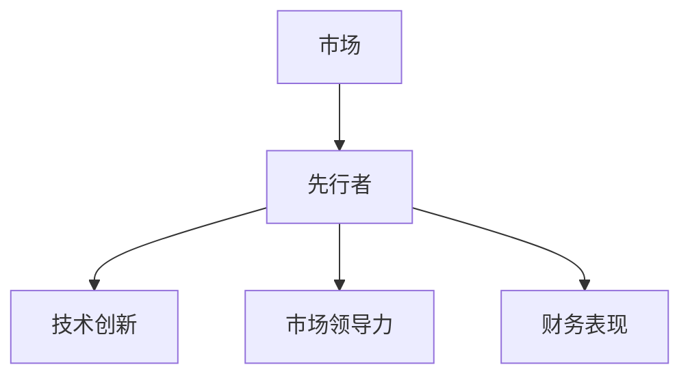
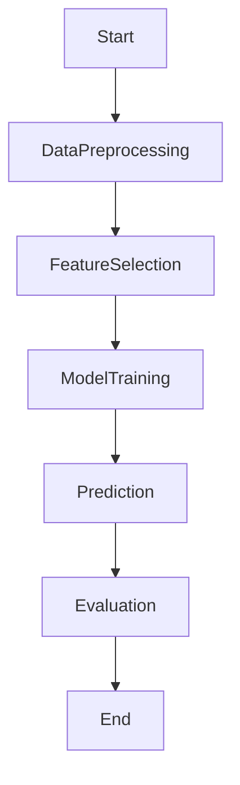
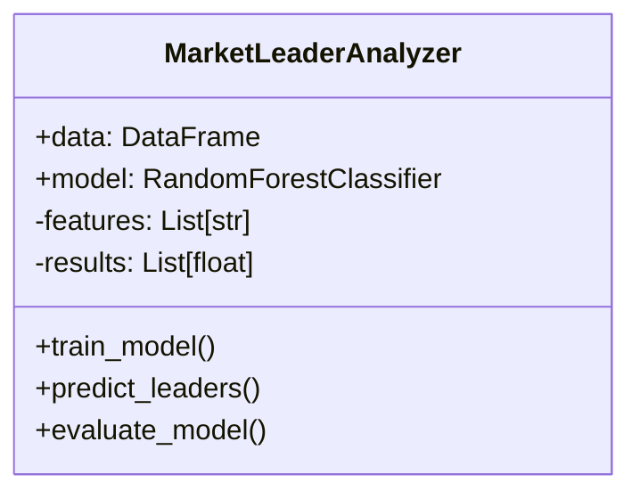

                 


---

# 目录大纲：《彼得林奇的"市场先行者"在新兴技术领域的识别方法》

---

## 第一部分：背景介绍

### 第1章：市场先行者与新兴技术领域的定义

#### 1.1 市场先行者的定义
- 1.1.1 市场先行者的概念
- 1.1.2 市场先行者的特征
- 1.1.3 市场先行者与新兴技术领域的关联

#### 1.2 彼得林奇的投资理念
- 1.2.1 彼得林奇的投资策略
- 1.2.2 市场先行者在投资中的重要性
- 1.2.3 彼得林奇对新兴技术领域的关注

#### 1.3 新兴技术领域识别方法的重要性
- 1.3.1 识别市场先行者的必要性
- 1.3.2 新兴技术领域的动态特征
- 1.3.3 识别方法的挑战与机遇

---

## 第二部分：核心概念与联系

### 第2章：市场先行者的特征分析

#### 2.1 市场先行者的属性特征
- 2.1.1 技术创新性
- 2.1.2 市场领导力
- 2.1.3 财务表现
- 2.1.4 竞争优势

#### 2.2 不同市场的特征对比
- 2.2.1 行业市场的对比
- 2.2.2 区域市场的对比
- 2.2.3 企业规模的对比

#### 2.3 市场先行者的ER实体关系图


---

## 第三部分：算法原理讲解

### 第3章：市场先行者识别的算法原理

#### 3.1 算法流程


#### 3.2 算法实现代码
```python
import pandas as pd
from sklearn.ensemble import RandomForestClassifier
from sklearn.metrics import accuracy_score

# 数据预处理
data = pd.read_csv('market_data.csv')
X = data.drop('is_market_leader', axis=1)
y = data['is_market_leader']

# 特征选择
selected_features = ['revenue_growth', 'profit_margin', 'market_share']
X_selected = X[selected_features]

# 模型训练
model = RandomForestClassifier()
model.fit(X_selected, y)

# 预测
predictions = model.predict(X_selected)

# 评估
accuracy = accuracy_score(y, predictions)
print(f"模型准确率：{accuracy}")
```

#### 3.3 算法原理的数学模型
- 逻辑回归模型：
  $$ P(y=1|x) = \frac{1}{1 + e^{-\beta x}} $$
- 支持向量机模型：
  $$ y = \text{sign}(w \cdot x + b) $$

---

## 第四部分：系统分析与架构设计

### 第4章：系统功能设计

#### 4.1 系统功能模块


#### 4.2 系统架构设计


---

## 第五部分：项目实战

### 第5章：项目实现与案例分析

#### 5.1 项目环境安装
```bash
pip install pandas sklearn mermaid4jupyter jupyterlab
```

#### 5.2 核心代码实现
```python
def identify_market_leader(dataframe):
    # 数据清洗
    dataframe = dataframe.dropna()
    
    # 特征提取
    features = dataframe[['revenue_growth', 'profit_margin', 'market_share']]
    
    # 标签提取
    labels = dataframe['is_market_leader']
    
    # 模型训练
    from sklearn.model_selection import train_test_split
    X_train, X_test, y_train, y_test = train_test_split(features, labels, test_size=0.2)
    
    # 模型评估
    from sklearn.metrics import classification_report
    print(classification_report(y_test, model.predict(X_test)))
    
    return model
```

#### 5.3 实际案例分析
- 案例一：人工智能领域的市场先行者识别
- 案例二：区块链技术的市场先行者分析

#### 5.4 项目小结
- 项目总结
- 经验教训
- 改进方向

---

## 第六部分：最佳实践与注意事项

### 第6章：识别方法的优化与注意事项

#### 6.1 风险管理
- 风险评估
- 投资组合分散

#### 6.2 持续监测
- 定期更新数据
- 跟踪市场变化

#### 6.3 多因素分析
- 综合考虑技术、市场、财务等因素

#### 6.4 小结与注意事项
- 注意市场波动
- 避免过度依赖单一指标

---

## 第七部分：附录

### 附录A：数据来源与工具推荐
- 数据来源
- 工具推荐

### 附录B：参考文献
- 相关书籍
- 学术论文

### 附录C：拓展阅读
- 相关技术博客
- 在线课程推荐

---

**关键词**：市场先行者、彼得林奇、新兴技术、投资策略、算法识别

**摘要**：本文系统地介绍了彼得林奇的“市场先行者”概念在新兴技术领域的识别方法，结合理论分析和实际案例，详细讲解了如何通过算法和系统设计来识别和评估市场先行者，为投资决策提供科学依据。

