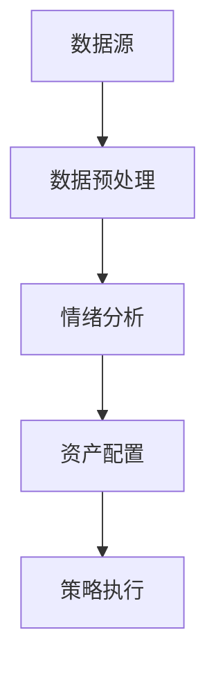
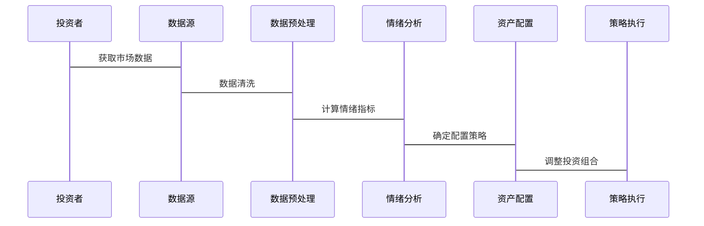

                 


# 彼得林奇的"市场情绪"在资产配置中的运用

> 关键词：彼得林奇，市场情绪，资产配置，投资策略，风险管理

> 摘要：本文深入探讨了彼得林奇的市场情绪理论在资产配置中的应用。通过分析市场情绪的核心概念、量化指标、数学模型以及实际案例，详细阐述了如何基于市场情绪进行动态资产配置，构建高效的投资策略。

---

## 第一章：市场情绪的基本概念

### 1.1 市场情绪的定义与特征

#### 1.1.1 市场情绪的定义
市场情绪（Market Sentiment）是指投资者对市场未来走势的心理预期和态度。它反映了市场参与者的乐观或悲观情绪，通常通过市场行为数据（如成交量、价格波动等）进行衡量。

#### 1.1.2 市场情绪的核心特征
- **波动性**：市场情绪受新闻、经济数据等因素影响，具有明显的波动性。
- **传染性**：市场情绪往往会在投资者之间传播，形成群体行为。
- **非理性**：市场情绪经常偏离理性分析，导致市场泡沫或恐慌。

#### 1.1.3 市场情绪的分类与表现
市场情绪可分为乐观、中性和悲观三种状态。乐观情绪通常表现为股价上涨、成交量放大；悲观情绪则表现为股价下跌、成交量萎缩。

### 1.2 彼得林奇的市场情绪理论

#### 1.2.1 彼得林奇的市场情绪观点
彼得林奇认为，市场情绪是投资决策的重要参考因素。他强调，投资者应关注市场的非理性情绪，并在市场恐慌时寻找低估资产。

#### 1.2.2 市场情绪与投资决策的关系
市场情绪影响投资者的决策，但过度情绪化可能导致错误判断。因此，投资者需结合基本面分析，避免被市场情绪左右。

#### 1.2.3 市场情绪在资产配置中的应用
彼得林奇建议，在市场情绪高涨时降低风险资产配置，在市场情绪低落时增加配置，以利用市场的非理性波动。

---

## 第二章：资产配置的基本原理

### 2.1 资产配置的定义与作用

#### 2.1.1 资产配置的定义
资产配置是指将资金分配到不同资产类别（如股票、债券、现金等）以实现投资目标的过程。

#### 2.1.2 资产配置的作用与意义
资产配置通过分散投资降低风险，同时优化收益。它是投资组合管理的核心步骤。

#### 2.1.3 资产配置的分类与策略
资产配置可分为战略性配置和战术性配置。战略性配置基于长期目标，战术性配置则根据市场环境动态调整。

### 2.2 彼得林奇的资产配置理念

#### 2.2.1 长期投资与价值投资
彼得林奇强调长期投资，寻找基本面良好的公司，避免短期市场波动的干扰。

#### 2.2.2 市场情绪与资产配置的结合
他建议投资者根据市场情绪调整资产配置，尤其在市场恐慌时增加优质资产的配置。

#### 2.2.3 资产配置中的风险控制
彼得林奇主张通过分散投资和定期再平衡来控制风险，避免因市场情绪过度波动导致的损失。

---

## 第三章：市场情绪指标与投资者行为分析

### 3.1 市场情绪指标的构建

#### 3.1.1 市场情绪指标的定义与分类
市场情绪指标是量化市场参与者情绪的工具，常见的有恐慌指数（VIX）、市场广度指标等。

#### 3.1.2 常见市场情绪指标
- **恐慌指数（VIX）**：反映市场波动性和投资者恐慌程度的指标。
- **市场广度指标**：通过分析上涨和下跌股票数量来衡量市场情绪。

#### 3.1.3 情绪指标的计算方法
以恐慌指数为例，VIX通过股票期权的波动率计算得出，公式为：
$$ VIX = \sqrt{\frac{1}{T} \sum_{t=1}^{T} (\text{ln}(S_t) - \text{ln}(\text{S}_{t-1}))^2} $$

### 3.2 投资者行为与市场情绪的关系

#### 3.2.1 投资者行为的特征
投资者行为受市场情绪影响，表现出从众心理和羊群效应。

#### 3.2.2 市场情绪对投资者行为的影响
乐观情绪导致过度买入，悲观情绪引发恐慌性抛售。

#### 3.2.3 投资者行为对市场情绪的反馈作用
投资者行为进一步强化或弱化市场情绪，形成市场循环。

---

## 第四章：市场情绪与资产配置的数学模型

### 4.1 市场情绪量化模型

#### 4.1.1 市场情绪的量化方法
将市场情绪指标转化为数值，建立情绪强度模型。

#### 4.1.2 市场情绪与资产收益的关系
市场情绪通过影响资产价格波动间接影响收益。

#### 4.1.3 市场情绪的动态变化模型
利用时间序列分析（如ARIMA模型）预测市场情绪的变化。

### 4.2 资产配置的数学模型

#### 4.2.1 均值-方差优化模型
通过优化风险和收益，构建最优资产配置组合。

#### 4.2.2 基于市场情绪的资产配置模型
结合市场情绪指标，动态调整资产权重。

#### 4.2.3 市场情绪与风险收益的数学公式
资产配置权重与市场情绪呈负相关关系：
$$ w_i = \frac{1}{1 + \alpha \cdot S_i} $$
其中，$S_i$为市场情绪指标，$\alpha$为情绪敏感系数。

---

## 第五章：基于市场情绪的资产配置算法

### 5.1 市场情绪驱动的资产配置策略

#### 5.1.1 市场情绪对资产配置的影响路径
市场情绪 → 影响资产价格 → 动态调整配置。

#### 5.1.2 市场情绪的周期性与资产配置策略
根据市场情绪周期（乐观 → 恐慌）调整资产配置。

#### 5.1.3 市场情绪与资产类别表现的关系
不同资产类别对市场情绪的敏感性不同，股票类资产最敏感。

### 5.2 基于市场情绪的动态资产配置算法

#### 5.2.1 算法原理概述
通过实时监测市场情绪，动态调整资产配置权重。

#### 5.2.2 市场情绪指标的实时监测与分析
使用技术指标（如RSI、MACD）和市场情绪数据进行综合分析。

#### 5.2.3 动态资产配置的实现步骤
1. 收集市场情绪数据。
2. 计算情绪强度。
3. 根据情绪强度调整资产权重。
4. 定期再平衡投资组合。

---

## 第六章：市场情绪与资产配置的系统架构设计

### 6.1 系统功能设计

#### 6.1.1 数据采集模块
收集市场数据和情绪指标。

#### 6.1.2 情绪分析模块
计算市场情绪强度。

#### 6.1.3 资产配置模块
根据情绪指标调整配置策略。

#### 6.1.4 策略执行模块
动态调整投资组合。

### 6.2 系统架构设计

#### 6.2.1 系统架构图


#### 6.2.2 系统交互流程


---

## 第七章：项目实战

### 7.1 环境安装与配置

#### 7.1.1 Python环境安装
安装Python和必要的库（如Pandas、NumPy、Matplotlib）。

#### 7.1.2 数据获取工具
使用Yahoo Finance API获取市场数据。

### 7.2 核心实现代码

#### 7.2.1 情绪指标计算
```python
import pandas as pd
import numpy as np

# 获取市场数据
data = pd.read_csv('market_data.csv')
data['Return'] = data['Close'].pct_change()

# 计算恐慌指数（简化）
def calculate_vix(data):
    log_returns = np.log(data['Close'].pct_change().dropna())
    vix = np.sqrt(log_returns.var())
    return vix

vix = calculate_vix(data)
print(f"VIX Index: {vix}")
```

#### 7.2.2 资产配置策略实现
```python
def dynamic_asset_allocation(vix):
    if vix > 30:
        return {'Stock': 40, 'Bond': 60}
    elif vix < 20:
        return {'Stock': 70, 'Bond': 30}
    else:
        return {'Stock': 50, 'Bond': 50}

config = dynamic_asset_allocation(vix)
print(config)
```

### 7.3 实际案例分析

#### 7.3.1 案例背景
假设市场情绪高涨，VIX指数低于20。

#### 7.3.2 策略执行
根据策略，调整股票和债券比例为70:30。

#### 7.3.3 结果分析
通过定期再平衡，优化了风险收益比。

---

## 第八章：最佳实践与总结

### 8.1 投资经验总结

#### 8.1.1 市场情绪的局限性
市场情绪指标并非完美，需结合基本面分析。

#### 8.1.2 动态调整的重要性
根据市场变化及时调整资产配置。

#### 8.1.3 风险控制的关键性
通过分散投资和定期再平衡降低风险。

### 8.2 小结与展望

#### 8.2.1 本文小结
本文系统探讨了市场情绪在资产配置中的应用，提出了基于情绪的动态配置策略。

#### 8.2.2 展望
未来研究可结合机器学习，进一步优化市场情绪的量化与应用。

### 8.3 注意事项

#### 8.3.1 投资者需注意的风险
- 市场情绪的短期波动可能影响决策。
- 情绪指标的滞后性可能导致误判。

#### 8.3.2 实际操作中的建议
- 定期回顾和调整配置策略。
- 结合多种指标进行综合判断。

### 8.4 拓展阅读

#### 8.4.1 推荐书籍
- 彼得林奇的《战胜市场的人》。
- 布朗着《投资学》。

#### 8.4.2 推荐博客与资源
- 金融科技博客：quantdoctors.com。
- 数据分析工具：pandas.pydata.org。

---

通过以上结构化的内容，我们可以系统地理解和应用彼得林奇的市场情绪理论，结合实际操作，优化资产配置策略，实现长期稳定的收益。

