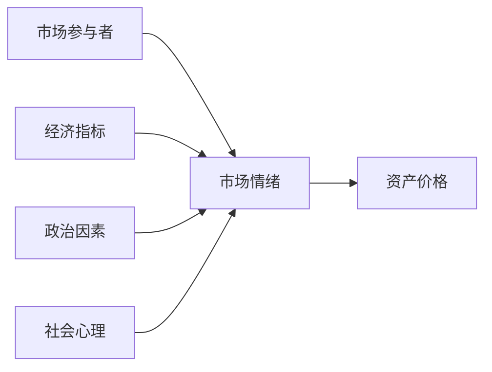

                 


# 彼得林奇的"市场情绪"指标分析

## 关键词：市场情绪，彼得林奇，投资分析，投资者情绪指数，市场预测，金融指标

## 摘要：本文系统地分析了彼得林奇提出的"市场情绪"指标，探讨了其在投资分析中的应用。通过详细阐述市场情绪的定义、影响因素、指标计算方法及预测模型，结合实际案例分析，展示了如何利用市场情绪指标进行投资决策。文章还提供了系统架构设计和Python代码实现，为读者提供了从理论到实践的完整指南。

---

## 第一部分：市场情绪的背景与概述

### 第1章：市场情绪的定义与重要性

#### 1.1 市场情绪的定义
- **市场情绪**是投资者在市场中的心理状态和行为的总和，反映了市场的乐观或悲观倾向。
- 市场情绪与资产价格密切相关，是影响市场波动的重要因素。
- 彼得林奇的市场情绪理论认为，市场情绪是投资者决策的核心驱动力。

#### 1.2 彼得林奇的市场情绪理论
- 彼得林奇认为，市场情绪指标可以用来预测市场的短期波动。
- 市场情绪指标的核心是投资者情绪指数（EAI），通过分析投资者的行为数据来量化市场情绪。

---

### 第2章：市场情绪的影响因素

#### 2.1 影响市场情绪的主要因素
- **经济指标**：如GDP增长率、失业率等，影响市场情绪的稳定性。
- **政治因素**：如政策变化、选举等，可能导致市场情绪的剧烈波动。
- **社会心理**：如投资者的心理预期和行为习惯。
- **市场参与者的预期**：投资者对未来市场的预期影响当前的市场情绪。

#### 2.2 市场情绪与投资者行为
- 市场情绪通过影响投资者行为，进而影响资产价格。
- 投资者情绪的自我强化效应可能导致市场的过度波动。

---

## 第二部分：市场情绪指标的核心概念与联系

### 第3章：市场情绪指标的属性与特征

#### 3.1 市场情绪指标的核心属性
- **时间性**：市场情绪随时间变化，具有动态特征。
- **空间性**：不同市场和资产类别的市场情绪可能不同。
- **可量化性**：市场情绪可以通过量化指标进行衡量。

#### 3.2 指标特征对比
- **敏感性**：市场情绪指标对市场变化的反应速度。
- **滞后性**：指标的计算通常基于过去的数据，具有滞后性。
- **波动性**：市场情绪指标的稳定性与市场环境密切相关。

### 第4章：市场情绪指标的实体关系图

#### 4.1 实体关系图


#### 4.2 指标之间的关系
- 市场情绪与资产价格的关系：市场情绪影响资产价格，资产价格反过来也会影响市场情绪。
- 经济指标对市场情绪的影响：如就业数据、通胀指标等。
- 政治因素对市场情绪的调节作用：政策变化、选举等。

---

## 第三部分：市场情绪指标的算法原理

### 第5章：市场情绪指标的计算方法

#### 5.1 投资者情绪指数的计算
- 投资者情绪指数（EAI）的计算公式：
$$E = \frac{N_{buy} - N_{sell}}{N_{total}}$$
  - $N_{buy}$：买入订单数量。
  - $N_{sell}$：卖出订单数量。
  - $N_{total} = N_{buy} + N_{sell}$。

- 示例：假设$N_{buy}=1000$，$N_{sell}=500$，则$E = (1000 - 500)/(1000 + 500) = 500/1500 = 0.33$。

#### 5.2 市场情绪指标的预测模型

#### 5.3 算法流程图


---

### 第6章：市场情绪指标的预测模型

#### 6.1 时间序列分析
- 使用ARIMA模型对市场情绪进行预测。
- 示例代码：
```python
from statsmodels.tsa.arima_model import ARIMA
import pandas as pd

# 假设data是市场情绪指数的数据
model = ARIMA(data, order=(1, 1, 0))
model_fit = model.fit()
forecast = model_fit.forecast(steps=5)
```

#### 6.2 机器学习方法
- 使用随机森林回归模型预测市场情绪。
- 示例代码：
```python
from sklearn.ensemble import RandomForestRegressor

# 假设X是特征数据，y是市场情绪标签
model = RandomForestRegressor(n_estimators=100)
model.fit(X, y)
预测结果 = model.predict(X_test)
```

---

## 第四部分：系统分析与架构设计

### 第7章：系统分析与架构设计

#### 7.1 项目背景
- 开发一个基于市场情绪指标的投资分析系统，帮助投资者做出更明智的决策。

#### 7.2 系统功能设计
- 数据采集模块：采集市场数据和投资者行为数据。
- 指标计算模块：计算市场情绪指标。
- 预测模型模块：基于历史数据预测市场情绪。
- 可视化模块：展示市场情绪变化趋势。

#### 7.3 系统架构图


---

## 第五部分：项目实战

### 第8章：项目实战与案例分析

#### 8.1 环境安装
- 安装Python、Pandas、NumPy、Matplotlib、Scikit-learn等库。

#### 8.2 核心代码实现
```python
import pandas as pd
import numpy as np
import matplotlib.pyplot as plt

# 示例数据
data = pd.DataFrame({'date': pd.date_range('2023-01-01', '2023-12-31'),
                     'market_emotion': np.random.randn(365) * 0.5 + 0.5})

# 绘制市场情绪变化图
plt.figure(figsize=(10, 6))
plt.plot(data['date'], data['market_emotion'])
plt.title('Market Emotion Trend')
plt.xlabel('Date')
plt.ylabel('Emotion Index')
plt.show()
```

#### 8.3 案例分析
- 分析A股市场的市场情绪，预测市场走势。

---

## 第六部分：最佳实践与总结

### 第9章：最佳实践与注意事项

#### 9.1 投资者情绪指数的应用注意事项
- 市场情绪指标只能作为辅助工具，不能单独决定投资决策。
- 需结合其他指标和市场环境进行综合分析。

#### 9.2 小结
- 本文详细介绍了彼得林奇的市场情绪指标，从理论到实践，为投资者提供了完整的分析框架。

---

## 第七部分：拓展阅读与工具推荐

### 第10章：拓展阅读与工具推荐

#### 10.1 拓展阅读
- 《彼得林奇的投资策略》：深入理解彼得林奇的投资理念。
- 《金融市场中的情绪分析》：探讨市场情绪的复杂性。

#### 10.2 工具推荐
- **Python**：数据分析和可视化的首选工具。
- **Pandas**：数据处理和分析的库。
- **Matplotlib**：数据可视化的库。

---

通过以上分析，我们全面了解了彼得林奇的市场情绪指标，从理论到实践，帮助投资者更好地理解市场波动，做出更明智的投资决策。

