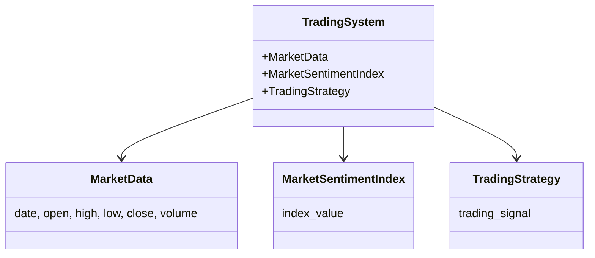
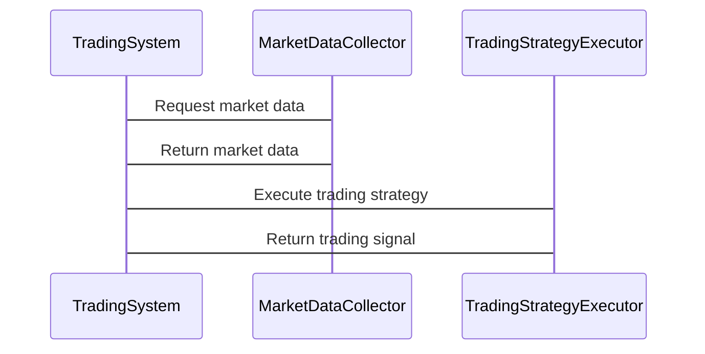

                 


# 彼得林奇的"市场情绪"指标在交易决策中的应用

## 关键词：市场情绪，彼得·林奇，交易决策，投资策略，技术分析

## 摘要：本文深入探讨了彼得·林奇提出的“市场情绪”指标在交易决策中的应用。通过分析市场情绪的基本概念、构建方法及其在交易策略中的实际应用，结合数学模型和系统架构设计，帮助读者理解如何利用市场情绪指标优化投资决策。文章内容涵盖市场情绪的理论基础、指标构建、交易策略设计、系统实现以及实战案例分析，为读者提供了从理论到实践的全面指导。

---

# 第一部分: 市场情绪与交易决策基础

## 第1章: 市场情绪的基本概念

### 1.1 市场情绪的定义与背景

#### 1.1.1 什么是市场情绪
市场情绪是指市场参与者（投资者、交易员等）在特定市场环境下的整体情绪状态，通常反映在他们的交易行为和决策中。市场情绪可以分为理性和非理性两部分，理性情绪基于逻辑和分析，而非理性情绪则受心理因素影响更大。

#### 1.1.2 市场情绪的重要性
市场情绪是影响市场价格波动的重要因素之一。当市场情绪过于乐观时，价格可能被高估；当市场情绪过于悲观时，价格可能被低估。理解市场情绪有助于交易者更好地把握市场的短期走势。

#### 1.1.3 市场情绪与投资者心理的关系
投资者心理是市场情绪的核心驱动力。个体投资者的心理波动会通过交易行为影响市场情绪，而市场情绪反过来又会影响投资者的决策。

---

### 1.2 投资者情绪的分类

#### 1.2.1 理性情绪与非理性情绪
- 理性情绪：基于基本面分析和逻辑推理的情绪，通常表现为冷静和理性。
- 非理性情绪：受市场波动、媒体报道和个人偏见影响的情绪，通常表现为恐慌或过度乐观。

#### 1.2.2 市场情绪周期
市场情绪通常呈现出周期性变化，包括以下几个阶段：
1. **乐观阶段**：投资者情绪高涨，交易活跃，价格上升。
2. **狂热阶段**：投资者情绪达到顶点，出现过度交易和价格泡沫。
3. **恐慌阶段**：市场情绪突然下跌，投资者恐慌性抛售，价格大幅波动。
4. **底部阶段**：市场情绪低落，投资者信心不足，价格稳定或小幅波动。

#### 1.2.3 不同市场参与者的情绪特点
- 机构投资者：情绪相对稳定，决策基于长期策略。
- 小散户：情绪波动较大，容易受到市场波动影响。

---

### 1.3 市场情绪对交易决策的影响

#### 1.3.1 市场情绪与价格波动的关系
市场情绪是价格波动的重要驱动因素。例如，当市场情绪从乐观转向悲观时，价格可能从上涨转为下跌。

#### 1.3.2 市场情绪与市场周期的关系
市场周期（牛市、熊市）与市场情绪密切相关。牛市通常伴随着乐观的市场情绪，熊市则伴随着悲观的市场情绪。

#### 1.3.3 市场情绪与风险偏好
市场情绪越高，投资者的风险偏好越强，愿意承担更高的风险以追求更高的收益。

---

## 1.4 本章小结
本章介绍了市场情绪的基本概念、分类及其对交易决策的影响。理解市场情绪是投资者在交易决策中不可忽视的重要因素。

---

## 第2章: 彼得·林奇市场情绪指标的理论基础

### 2.1 彼得·林奇的投资理念

#### 2.1.1 林奇的投资风格
彼得·林奇是美国著名基金经理，以其成功的投资策略和对市场情绪的深刻理解而闻名。他认为，市场情绪是影响市场走势的重要因素。

#### 2.1.2 林奇对市场情绪的重视
林奇认为，市场情绪可以通过投资者的行为和市场数据来衡量。他强调，市场情绪指标可以帮助投资者更好地把握市场的短期波动。

#### 2.1.3 林奇的投资策略
林奇的投资策略以长期价值投资为主，但在实际操作中，他也非常关注市场情绪的变化，以优化投资决策。

---

### 2.2 市场情绪指标的核心要素

#### 2.2.1 市场情绪指标的定义
市场情绪指标是通过量化市场参与者的交易行为和市场数据，来衡量市场情绪的指标。

#### 2.2.2 市场情绪指标的分类
- **情绪指标**：如恐慌指数（VIX指数）。
- **交易指标**：如成交量、换手率等。
- **价格指标**：如相对强弱指数（RSI）。

#### 2.2.3 市场情绪指标的计算方法
市场情绪指标的计算通常基于历史数据和统计方法。例如，恐慌指数（VIX）是通过标普500指数的波动率计算得出的。

---

### 2.3 市场情绪指标与交易决策的关系

#### 2.3.1 市场情绪指标如何影响交易决策
市场情绪指标可以帮助交易者判断市场的短期走势，从而优化交易策略。例如，当市场情绪过高时，交易者可能会选择卖出，以规避风险。

#### 2.3.2 市场情绪指标的局限性
市场情绪指标只能反映市场的短期情绪，无法预测市场的长期走势。此外，市场情绪指标可能受到数据质量和计算方法的影响。

#### 2.3.3 市场情绪指标的适用场景
市场情绪指标适用于短期交易策略，尤其是在市场波动较大的情况下。

---

## 2.4 本章小结
本章介绍了彼得·林奇的投资理念以及市场情绪指标的核心要素和计算方法。市场情绪指标是交易者优化交易决策的重要工具。

---

## 第3章: 市场情绪指标的数学模型与算法原理

### 3.1 市场情绪指标的数学模型

#### 3.1.1 市场情绪指数的构建
市场情绪指数的构建通常基于以下步骤：
1. 数据收集：收集相关市场数据，如价格、成交量等。
2. 数据预处理：清洗数据，去除异常值。
3. 指标计算：基于预处理后的数据，计算市场情绪指标。

#### 3.1.2 市场情绪指标的计算公式
以下是一个简单的市场情绪指标计算公式：

$$
\text{市场情绪指标} = \frac{\text{成交量}}{\text{价格波动率}}
$$

#### 3.1.3 市场情绪指标的标准化方法
为了方便比较，通常会对市场情绪指标进行标准化处理，例如将指标值归一化到0-1区间。

---

### 3.2 市场情绪指标的算法实现

#### 3.2.1 数据获取与预处理
假设我们使用Python的pandas库获取历史数据，并进行数据清洗。

```python
import pandas as pd

# 获取数据
data = pd.read_csv('market_data.csv')

# 数据预处理
data.dropna(inplace=True)
data['date'] = pd.to_datetime(data['date'])
data.set_index('date', inplace=True)
```

#### 3.2.2 市场情绪指标的计算步骤
以下是一个简单的市场情绪指标计算步骤：

```python
# 计算成交量
volume = data['volume']

# 计算价格波动率
price = data['close']
price_diff = price.diff().fillna(0)
price_volatility = price_diff.rolling(20).std()

# 计算市场情绪指标
market_sentiment = volume / price_volatility
market_sentiment = market_sentiment.rolling(20).mean()
```

#### 3.2.3 市场情绪指标的可视化方法
使用matplotlib库对市场情绪指标进行可视化。

```python
import matplotlib.pyplot as plt

plt.figure(figsize=(10, 6))
plt.plot(market_sentiment, label='Market Sentiment Index')
plt.title('Market Sentiment Index Over Time')
plt.xlabel('Date')
plt.ylabel('Market Sentiment Index')
plt.legend()
plt.show()
```

---

### 3.3 市场情绪指标的验证与优化

#### 3.3.1 市场情绪指标的验证方法
通过回测和统计分析验证市场情绪指标的有效性。例如，计算指标与市场价格的相关性。

#### 3.3.2 市场情绪指标的优化策略
根据回测结果，优化指标的计算方法和参数设置。例如，调整滚动窗口的大小。

#### 3.3.3 市场情绪指标的鲁棒性分析
分析指标在不同市场环境下的表现，确保其在不同场景下的有效性。

---

## 3.4 本章小结
本章介绍了市场情绪指标的数学模型和算法实现，帮助读者理解如何通过数据和算法构建市场情绪指标。

---

## 第4章: 市场情绪指标在交易策略中的应用

### 4.1 基于市场情绪指标的交易策略设计

#### 4.1.1 策略目标的设定
策略目标通常包括以下几种：
- 利用市场情绪指标捕捉短期价格波动。
- 在市场情绪过高的时候卖出，避免价格回调。

#### 4.1.2 策略的输入与输出
- 输入：市场情绪指标、价格数据。
- 输出：交易信号（买入、卖出、持有）。

#### 4.1.3 策略的实现步骤
1. 数据获取与预处理。
2. 计算市场情绪指标。
3. 根据市场情绪指标生成交易信号。
4. 回测策略并优化参数。

---

### 4.2 市场情绪指标与技术分析的结合

#### 4.2.1 市场情绪指标与技术指标的结合
例如，结合相对强弱指数（RSI）和市场情绪指标，制定更稳健的交易策略。

#### 4.2.2 市场情绪指标与趋势分析的结合
通过市场情绪指标判断市场的趋势方向，辅助技术分析。

#### 4.2.3 市场情绪指标与风险控制的结合
利用市场情绪指标动态调整仓位和风险敞口。

---

### 4.3 本章小结
本章介绍了如何将市场情绪指标应用于交易策略设计，并结合技术分析和风险控制，优化交易决策。

---

## 第5章: 基于市场情绪指标的交易系统设计

### 5.1 问题场景介绍
假设我们是一名交易员，希望通过市场情绪指标优化交易策略，提高交易效率和收益。

### 5.2 系统功能设计

#### 5.2.1 领域模型设计
使用Mermaid类图描述交易系统的功能模块。



---

#### 5.2.2 系统架构设计
使用Mermaid架构图描述交易系统的架构。

```mermaid
container MarketData {
    MarketDataCollector
    MarketDataStorage
}
container MarketSentimentIndex {
    SentimentIndexCalculator
    SentimentIndexStorage
}
container TradingStrategy {
    TradingStrategyExecutor
    TradingSignalGenerator
}
```

---

#### 5.2.3 系统接口设计
系统接口包括数据接口、计算接口和交易接口。

#### 5.2.4 系统交互设计
使用Mermaid序列图描述系统交互流程。



---

## 5.3 本章小结
本章通过系统设计的方法，详细描述了如何基于市场情绪指标构建一个完整的交易系统。

---

## 第6章: 市场情绪指标的实战应用与案例分析

### 6.1 环境安装与配置

#### 6.1.1 环境搭建
使用Python和相关库（如pandas、numpy、matplotlib）搭建交易系统环境。

#### 6.1.2 数据获取
使用Yahoo Finance获取市场数据。

```python
import pandas_datareader as pdr
import matplotlib.pyplot as plt

# 获取数据
data = pdr.get_data_yahoo('AAPL', start='2020-01-01', end='2023-12-31')
```

---

### 6.2 代码实现与解读

#### 6.2.1 市场情绪指标的计算
```python
import pandas as pd
import numpy as np

# 计算价格波动率
price = data['Adj Close']
price_diff = price.diff().fillna(0)
price_volatility = price_diff.rolling(20).std()

# 计算成交量
volume = data['Volume']

# 计算市场情绪指标
market_sentiment = volume / price_volatility
market_sentiment = market_sentiment.rolling(20).mean()
```

---

#### 6.2.2 交易信号生成
```python
# 定义交易信号生成函数
def generate_signal(market_sentiment, threshold=0.5):
    if market_sentiment > threshold:
        return 'Buy'
    elif market_sentiment < threshold:
        return 'Sell'
    else:
        return 'Hold'

# 生成交易信号
signals = market_sentiment.apply(generate_signal)
```

---

#### 6.2.3 回测与优化
通过回测验证策略的有效性，并优化参数（如滚动窗口大小、阈值等）。

---

### 6.3 案例分析

#### 6.3.1 案例背景
假设我们选择苹果公司（AAPL）作为标的资产，使用2020年1月1日至2023年12月31日的数据进行回测。

#### 6.3.2 回测结果
通过回测发现，基于市场情绪指标的交易策略在某些时间段表现优异，但在市场剧烈波动时可能失效。

---

### 6.4 本章小结
本章通过实战案例，展示了如何基于市场情绪指标构建交易系统，并通过回测验证其有效性。

---

## 第7章: 总结与展望

### 7.1 总结
本文深入探讨了彼得·林奇提出的市场情绪指标在交易决策中的应用，结合理论分析和实战案例，帮助读者理解如何利用市场情绪指标优化交易策略。

### 7.2 展望
未来的研究方向可以包括：
1. 结合机器学习算法优化市场情绪指标。
2. 探索市场情绪指标在不同资产类别中的应用。
3. 研究市场情绪指标与其他市场因素的交互作用。

---

## 附录: 常用市场情绪指标列表

1. **恐慌指数（VIX）**
2. **成交量**
3. **换手率**
4. **相对强弱指数（RSI）**
5. **买卖比（ADR）**

---

通过本文的分析和实践，读者可以更好地理解市场情绪指标在交易决策中的应用，并将其应用于实际投资中。

