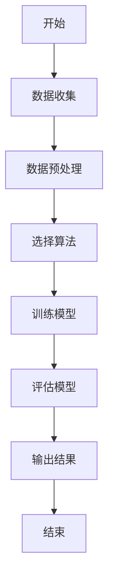

                 


# 彼得林奇的"市场机会"在不同市场规模中的识别

> **关键词**：彼得·林奇、市场机会、市场规模、投资策略、数据分析、机器学习

> **摘要**：本文系统地探讨了彼得·林奇的市场机会识别理论及其在不同市场规模中的应用。通过理论分析、算法原理、系统设计和项目实战，深入剖析了市场机会的识别方法，结合实际案例，展示了如何利用数据分析和机器学习技术在不同规模的市场中发现投资机会。

---

## 第1章: 彼得·林奇与市场机会

### 1.1 彼得·林奇简介

#### 1.1.1 彼得·林奇的生平与投资理念

彼得·林奇是美国著名投资家，曾任富达投资集团麦哲伦基金的经理，以长期的卓越业绩闻名。他的投资理念强调基本面分析、长期投资和价值发现。林奇认为，市场的波动为投资者提供了低价买入优质资产的机会，而市场机会的核心在于识别具有持续增长潜力的企业。

#### 1.1.2 林奇对市场机会的定义

市场机会是指在特定市场条件下，某种产品、服务或行业表现出显著增长潜力的情况。林奇认为，市场机会的识别需要结合市场规模、行业趋势、企业基本面等因素进行综合分析。

#### 1.1.3 林奇投资哲学的核心思想

林奇强调，市场机会的识别基于对企业基本面的深入研究和对行业趋势的敏锐洞察。他提出了“买便宜货”的投资策略，即在市场低估时买入优质资产，并在市场高估时卖出。

---

### 1.2 市场机会的背景与问题背景

#### 1.2.1 当前市场环境的复杂性

当前市场环境日益复杂，全球经济波动、行业竞争加剧和技术变革加速，使得市场机会的识别更具挑战性。投资者需要借助数据分析和机器学习等技术手段，才能更准确地识别市场机会。

#### 1.2.2 市场机会的定义与外延

市场机会的定义不仅包括传统的企业基本面分析，还包括市场规模、行业趋势、政策环境等多方面的因素。市场机会的外延涉及多个行业和区域市场，需要通过系统的分析方法来识别。

#### 1.2.3 市场机会的核心要素分析

市场机会的核心要素包括市场规模、增长潜力、竞争结构和政策环境等。通过对这些要素的分析，可以更准确地判断市场机会的大小和持续性。

---

### 1.3 市场机会的识别与核心概念

#### 1.3.1 市场机会的识别标准

市场机会的识别标准包括市场规模的可持续增长、企业的竞争优势、行业的生命周期和政策支持等。林奇强调，投资者需要结合定量分析和定性分析，才能准确识别市场机会。

#### 1.3.2 市场机会与市场规模的关系

市场规模是市场机会的重要指标，大的市场规模通常意味着更大的增长潜力和更多的投资机会。然而，市场规模并非唯一决定因素，还需要考虑市场的竞争结构和企业的盈利能力。

#### 1.3.3 市场机会的分类与特征对比

市场机会可以分为成长型、周期型和防御型三种类型。成长型市场机会通常出现在新兴行业，周期型市场机会受经济周期影响较大，防御型市场机会则在经济衰退时表现稳定。

---

## 第2章: 市场机会的识别方法

### 2.1 市场机会识别的核心概念

#### 2.1.1 市场机会识别的原理

市场机会识别的原理是通过分析市场的供需关系、行业趋势和企业基本面，发现具有增长潜力的投资机会。林奇认为，市场机会的识别需要结合定量分析和定性分析，才能得出准确的结论。

#### 2.1.2 市场机会识别的关键特征

市场机会识别的关键特征包括市场规模的可持续增长、企业的竞争优势、行业的生命周期和政策环境等。这些特征可以通过数据分析和模型构建来量化。

#### 2.1.3 市场机会识别的ER实体关系图

```mermaid
erDiagram
    actor 投资者 {
        <属性> 市场规模
        <属性> 行业趋势
        <属性> 企业基本面
    }
    actor 市场机会 {
        <属性> 市场规模
        <属性> 增长潜力
        <属性> 竞争结构
    }
    投资者 --> 市场机会 : 识别
```

---

### 2.2 市场机会识别的算法原理

#### 2.2.1 数据挖掘与市场机会识别

数据挖掘是市场机会识别的重要工具，通过分析历史数据和行业趋势，可以发现潜在的投资机会。常用的数据挖掘技术包括聚类分析、关联规则挖掘和分类分析等。

#### 2.2.2 机器学习在市场机会识别中的应用

机器学习算法（如随机森林、支持向量机等）可以用于市场机会的识别。通过训练模型，可以预测市场的未来走势，并识别具有增长潜力的行业和企业。

#### 2.2.3 市场机会识别的数学模型与公式

市场机会识别的回归模型：

$$
y = \beta_0 + \beta_1x_1 + \beta_2x_2 + \ldots + \beta_nx_n + \epsilon
$$

其中，$y$ 是市场机会的指标，$x_i$ 是影响市场的因素，$\beta_i$ 是回归系数，$\epsilon$ 是误差项。

#### 2.2.4 市场机会识别的算法流程图



---

### 2.3 市场机会识别的数学模型

#### 2.3.1 市场机会识别的回归模型

回归模型用于预测市场的未来走势，帮助投资者识别潜在的市场机会。例如，可以通过回归分析预测某个行业的市场规模增长趋势。

#### 2.3.2 市场机会识别的聚类分析

聚类分析用于将市场机会分为不同的类别，例如成长型、周期型和防御型市场机会。通过聚类分析，可以更准确地判断市场的类型和投资机会。

#### 2.3.3 市场机会识别的分类模型

分类模型用于识别市场机会的类型，例如通过逻辑回归模型判断某个行业是否具有增长潜力。

---

## 第3章: 市场机会识别的系统分析与架构设计

### 3.1 问题场景介绍

#### 3.1.1 市场机会识别的典型场景

市场机会识别的典型场景包括新兴行业的崛起、经济周期的波动和政策变化的影响。投资者需要根据不同的场景调整投资策略。

#### 3.1.2 系统目标与范围

系统的目标是帮助投资者识别市场机会，范围包括数据收集、分析和预测。

#### 3.1.3 系统功能需求

系统需要具备数据采集、数据分析、模型训练和结果输出等功能。

### 3.2 系统功能设计

#### 3.2.1 领域模型类图


#### 3.2.2 系统架构设计图

```mermaid
client --> server : 数据请求
server --> db : 查询数据
db --> server : 返回数据
server --> client : 输出结果
```

---

## 第4章: 市场机会识别的项目实战

### 4.1 项目环境安装

#### 4.1.1 数据收集工具安装

安装Python和相关库（如Pandas、NumPy等）。

#### 4.1.2 数据分析工具安装

安装Jupyter Notebook和数据可视化工具。

#### 4.1.3 系统开发环境配置

配置开发环境，安装必要的软件和库。

### 4.2 项目核心实现

#### 4.2.1 数据预处理与清洗

使用Python代码对数据进行清洗和预处理。

#### 4.2.2 市场机会识别算法实现

编写机器学习算法代码，训练模型并预测市场机会。

#### 4.2.3 系统功能模块实现

实现数据采集、分析和预测功能。

### 4.3 项目案例分析

#### 4.3.1 案例背景介绍

以某个行业为例，介绍市场机会识别的背景和目标。

#### 4.3.2 数据分析与处理

展示数据分析的结果，识别潜在的市场机会。

#### 4.3.3 算法实现与结果分析

通过机器学习算法预测市场的未来走势，并分析结果。

#### 4.3.4 项目小结

总结项目实施的过程和成果，提出改进建议。

---

## 第5章: 市场机会识别的最佳实践与小结

### 5.1 最佳实践总结

#### 5.1.1 数据收集与处理的关键点

强调数据质量和多样性的 importance。

#### 5.1.2 算法选择与优化的注意事项

建议根据具体情况选择合适的算法，并进行参数调优。

#### 5.1.3 系统设计与实现的常见问题

提醒读者注意系统设计的合理性，避免功能过于复杂。

### 5.2 小结与展望

总结全文内容，展望未来的研究方向，鼓励读者进一步深入学习和实践。

---

通过以上章节的详细展开，本文系统地探讨了彼得·林奇的市场机会识别理论及其在不同市场规模中的应用，结合理论分析、算法原理、系统设计和项目实战，帮助投资者更好地识别和把握市场机会。

