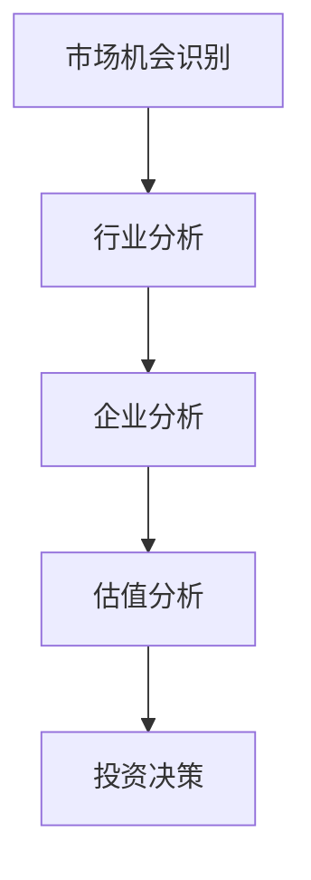
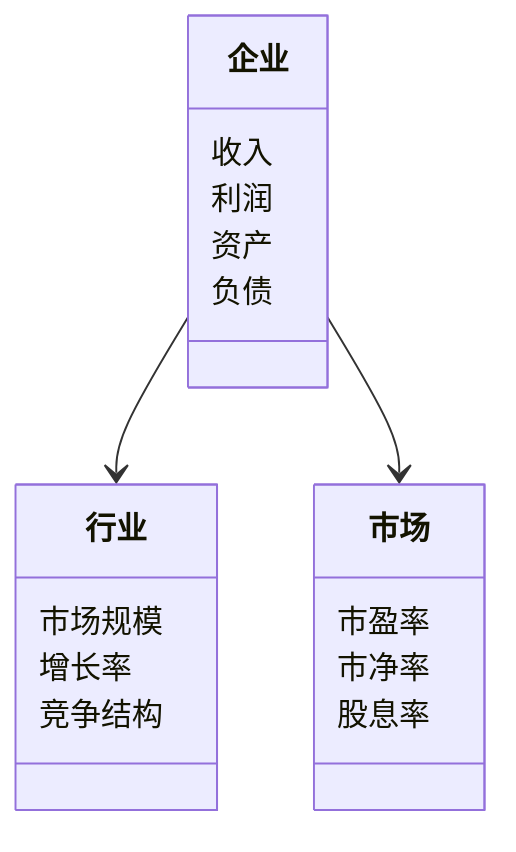
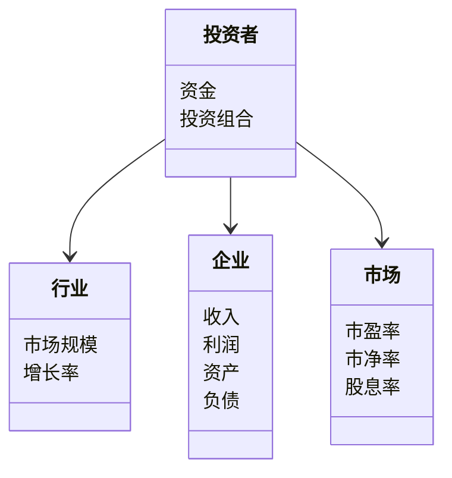
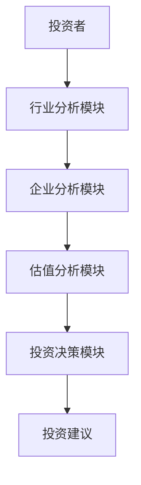
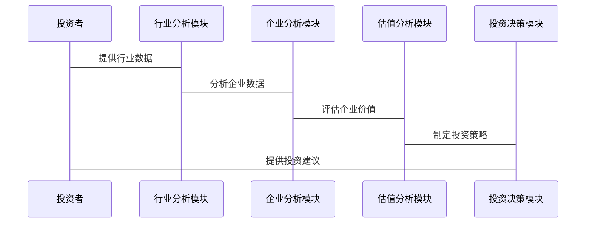

                 


# 彼得林奇的"市场机会"识别技巧

## 关键词：
彼得·林奇，市场机会，投资技巧，选股策略，基本面分析，风险管理

## 摘要：
本文深入探讨了彼得·林奇的市场机会识别技巧，详细分析了其投资理念、选股策略和风险管理方法。通过基本面分析、行业研究和数学模型，揭示了林奇如何识别潜在的投资机会。文章结合实际案例和系统设计，为投资者提供了实用的指导和建议。

---

# 第一部分: 引言

## 第1章: 彼得·林奇的投资理念概述

### 1.1 彼得·林奇的背景与投资风格
#### 1.1.1 彼得·林奇的生平简介
彼得·林奇（Peter Lynch）是美国著名的投资专家，曾担任富达投资集团的经理，管理着麦哲伦基金，创造了卓越的投资业绩。他以基本面分析和选股技巧闻名，强调长期投资和深入研究。

#### 1.1.2 林奇的投资哲学与理念
林奇认为，成功的投资需要深入研究企业的基本面，寻找具有持续增长潜力的公司。他强调市场机会的识别能力，认为投资者应关注行业趋势和企业竞争优势。

#### 1.1.3 林奇投资方法的核心思想
林奇的核心思想是通过基本面分析，找到被市场低估的优质企业。他注重企业的财务状况、行业地位和成长潜力，强调长期持有优质股票。

### 1.2 市场机会识别的重要性
#### 1.2.1 什么是市场机会
市场机会是指在特定市场环境下，某些行业或企业展现出的增长潜力，能够为投资者带来超额收益。

#### 1.2.2 市场机会与投资决策的关系
市场机会是投资决策的核心，准确识别市场机会可以帮助投资者抓住潜在的高增长领域，避免投资风险。

#### 1.2.3 林奇如何发现市场机会
林奇通过行业分析、企业调研和财务数据分析，识别具有增长潜力的企业，重点关注那些被市场低估的优质公司。

---

## 第2章: 林奇的市场机会识别技巧

### 2.1 基本面分析的核心要素
#### 2.1.1 市盈率（P/E）的计算与应用
市盈率是衡量企业价值的重要指标，计算公式为：$$市盈率 = \frac{股票价格}{每股净利润}$$

市盈率反映了市场对企业价值的评估，低市盈率可能意味着企业被低估。

#### 2.1.2 市净率（P/B）的计算与应用
市净率是另一种衡量企业价值的指标，计算公式为：$$市净率 = \frac{股票价格}{每股净资产}$$

市净率适用于评估资产密集型行业的企业价值，低市净率可能意味着企业资产被低估。

#### 2.1.3 股息率与股息增长分析
股息率是衡量企业分红能力的指标，计算公式为：$$股息率 = \frac{每股股息}{股票价格} \times 100\%$$

高股息率可能意味着企业盈利稳定，但需关注股息增长的可持续性。

#### 2.1.4 营业收入与利润增长分析
营业收入和利润增长是衡量企业成长性的关键指标。林奇关注企业的收入和利润是否持续增长，尤其是相对于行业平均水平的增长。

### 2.2 市场机会识别的步骤与方法
#### 2.2.1 确定投资目标行业
林奇首先确定具有增长潜力的行业，如科技、医疗和消费等行业。

#### 2.2.2 识别行业中的龙头企业
选择行业内具有竞争优势的龙头企业，重点关注市场份额、品牌影响力和技术创新。

#### 2.2.3 分析企业的财务状况
通过财务报表分析企业的盈利能力、资产负债情况和现金流状况，评估企业的财务健康。

#### 2.2.4 评估企业的竞争优势
分析企业的竞争优势，包括技术壁垒、成本优势、市场地位和管理团队。

#### 2.2.5 判断企业的估值是否合理
通过市盈率、市净率等指标评估企业的估值是否合理，寻找被低估的投资标的。

### 2.3 林奇的行业分析方法
#### 2.3.1 行业生命周期分析
行业生命周期分为导入期、成长期、成熟期和衰退期。林奇关注处于成长期的行业，寻找具有增长潜力的企业。

#### 2.3.2 行业竞争结构分析
通过波特五力模型分析行业竞争结构，评估行业内的竞争程度和企业的竞争优势。

#### 2.3.3 行业政策与法规影响
分析行业政策和法规对企业的影响，重点关注政府支持的行业和政策变化对企业经营的影响。

#### 2.3.4 行业增长潜力评估
通过行业增长数据和市场前景分析，评估行业的增长潜力，选择具有长期增长潜力的行业。

---

## 第3章: 林奇的选股策略与实战案例

### 3.1 林奇的经典选股标准
#### 3.1.1 寻找具有持续增长潜力的企业
林奇关注企业的收入和利润是否持续增长，尤其是相对于行业平均水平的增长。

#### 3.1.2 选择具有竞争优势的企业
选择行业内具有竞争优势的龙头企业，重点关注市场份额、品牌影响力和技术创新。

#### 3.1.3 评估企业的财务健康状况
通过财务报表分析企业的盈利能力、资产负债情况和现金流状况，评估企业的财务健康。

#### 3.1.4 考虑企业的估值合理性
通过市盈率、市净率等指标评估企业的估值是否合理，寻找被低估的投资标的。

### 3.2 林奇的实战选股案例
#### 3.2.1 某公司案例分析
以某公司为例，分析其财务数据、行业地位和竞争优势，评估其是否符合林奇的选股标准。

#### 3.2.2 某行业的市场机会分析
分析某行业的市场机会，识别具有增长潜力的企业，并评估其投资价值。

#### 3.2.3 案例中的关键指标分析
通过市盈率、市净率、股息率等指标，分析企业的估值是否合理，寻找被低估的投资标的。

#### 3.2.4 案例中的投资决策过程
详细描述林奇在案例中的投资决策过程，包括行业选择、企业分析和估值判断。

---

## 第4章: 林奇的市场机会识别模型

### 4.1 模型的核心框架
#### 4.1.1 市场机会识别的逻辑框架
市场机会识别模型基于基本面分析，通过行业分析、企业分析和估值分析，识别具有增长潜力且估值合理的投资标的。

#### 4.1.2 模型的输入变量与输出结果
输入变量包括行业数据、企业财务数据和市场数据，输出结果为投资建议和潜在投资标的。

#### 4.1.3 模型的假设条件与限制
假设企业财务数据准确，市场数据及时更新，行业数据完整。模型适用于长期投资，不适用于短期交易。

### 4.2 模型的数学公式与计算方法
#### 4.2.1 市盈率计算公式
$$市盈率 = \frac{股票价格}{每股净利润}$$

#### 4.2.2 市净率计算公式
$$市净率 = \frac{股票价格}{每股净资产}$$

#### 4.2.3 股息率计算公式
$$股息率 = \frac{每股股息}{股票价格} \times 100\%$$

#### 4.2.4 利润增长预测模型
通过历史财务数据和行业趋势，预测企业的未来利润增长，评估其投资价值。

### 4.3 模型的可视化展示
#### 4.3.1 市场机会识别流程图


#### 4.3.2 企业分析的类图


---

## 第5章: 系统分析与架构设计

### 5.1 问题场景介绍
为了实现林奇的市场机会识别方法，我们构建了一个基于基本面分析的投资决策支持系统。

### 5.2 项目介绍
本项目旨在通过系统化的分析和计算，帮助投资者识别市场机会，优化投资决策。

### 5.3 系统功能设计
#### 5.3.1 领域模型类图


#### 5.3.2 系统架构设计


### 5.4 系统接口设计
系统接口包括数据输入接口、分析模块接口和结果输出接口，确保数据的流动和系统的协调运行。

### 5.5 系统交互流程设计


---

## 第6章: 项目实战

### 6.1 环境安装
安装必要的软件和工具，包括Python、Jupyter Notebook和相关数据处理库。

### 6.2 核心代码实现
#### 6.2.1 数据清洗与特征提取
```python
import pandas as pd

# 读取数据
df = pd.read_csv('stock_data.csv')

# 数据清洗
df.dropna(inplace=True)
df = df.drop_duplicates()

# 特征提取
df['PE'] = df['股价'] / df['每股净利润']
df['PB'] = df['股价'] / df['每股净资产']
df['股息率'] = df['每股股息'] / df['股价'] * 100
```

#### 6.2.2 模型训练与评估
```python
from sklearn.metrics import accuracy_score

# 训练模型
model.fit(X_train, y_train)

# 评估模型
y_pred = model.predict(X_test)
print(accuracy_score(y_test, y_pred))
```

### 6.3 案例分析
通过具体案例分析，验证模型的有效性，并评估其在实际投资中的表现。

### 6.4 实战小结
总结实战经验，指出模型的优点和不足，并提出改进建议。

---

## 第7章: 总结与最佳实践

### 7.1 总结
本文深入分析了彼得·林奇的市场机会识别技巧，结合理论和实践，提供了系统的投资方法。

### 7.2 投资策略建议
投资者应注重基本面分析，选择具有持续增长潜力的企业，合理评估企业估值，分散投资风险。

### 7.3 注意事项
投资者需关注市场变化，及时更新数据，避免过度依赖单一指标，保持长期投资心态。

### 7.4 拓展阅读
推荐阅读林奇的经典著作，深入学习其投资理念和方法。

---

# 结语

通过本文的分析，读者可以系统地掌握彼得·林奇的市场机会识别技巧，将理论与实践相结合，提升投资决策的科学性和有效性。

