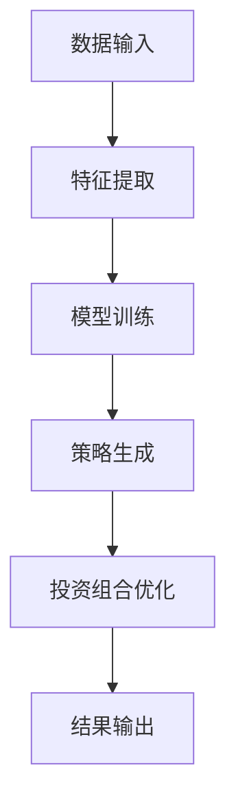
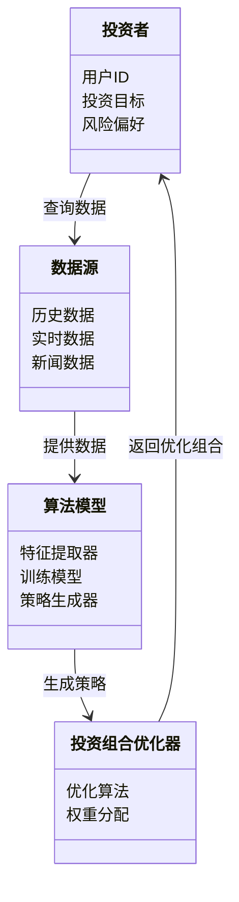
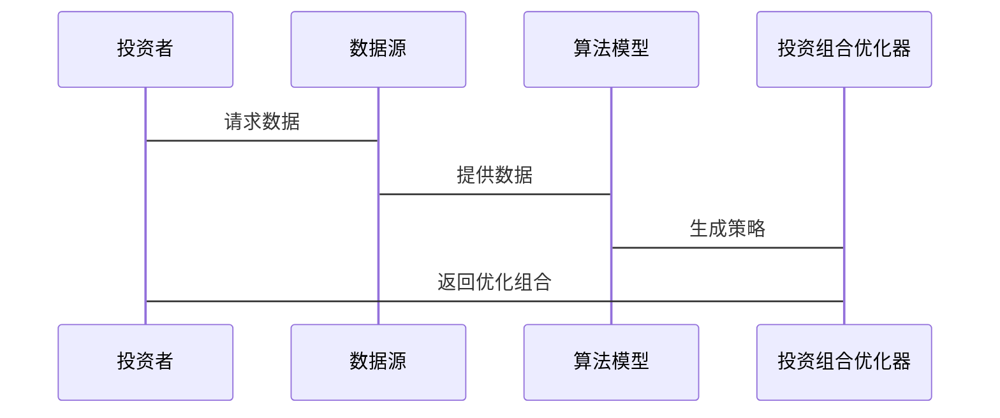

                 


# 彼得林奇的"常识投资"在人工智能投顾时代的价值重估

---

## 关键词：  
人工智能、投资顾问、常识投资、彼得林奇、算法投顾、金融数字化

---

## 摘要：  
本文探讨了彼得·林奇的常识投资理念在人工智能投顾时代的价值重估。通过对常识投资的核心概念、人工智能投顾的算法原理以及两者结合的可能性进行深入分析，本文旨在揭示传统投资策略在数字化转型中的新机遇与挑战。通过数学模型、算法实现和实际案例的分析，本文为投资者和科技从业者提供了关于如何在AI时代重构投资策略的深刻见解。

---

## 第一部分：背景介绍

### 第1章：常识投资的起源与彼得林奇的贡献

#### 1.1 常识投资的核心概念  
常识投资是一种基于基本面分析和长期价值投资的策略，强调通过深入研究公司基本面、行业趋势和宏观经济环境来做出投资决策。彼得·林奇作为常识投资的代表人物，提出了“买你看得懂的公司”的投资理念，主张通过分散投资、长期持有和持续跟踪来实现超额收益。

#### 1.2 人工智能投顾的兴起  
人工智能在金融领域的应用日益广泛，尤其是在投资顾问领域。AI投顾通过大数据分析、机器学习和自然语言处理等技术，能够快速处理海量数据，生成个性化投资建议，并动态调整投资策略。然而，AI投顾的局限性在于其对市场情绪、微观结构和非理性行为的处理能力相对有限。

#### 1.3 常识投资与人工智能投顾的融合  
在AI时代，常识投资的核心理念与人工智能投顾的技术优势可以有机结合。通过将传统基本面分析与AI的量化能力结合，投资者可以在保持长期价值投资的基础上，借助技术手段提升投资效率和决策精度。

---

## 第二部分：核心概念与联系

### 第2章：常识投资与人工智能投顾的核心概念对比

#### 2.1 常识投资的属性特征  
| 属性 | 描述 |
|------|------|
| 数据来源 | 以公司财报、行业数据为主 |
| 决策依据 | 以基本面分析和长期趋势为主 |
| 投资策略 | 分散投资、长期持有 |
| 个性化程度 | 中等 |

#### 2.2 人工智能投顾的属性特征  
| 属性 | 描述 |
|------|------|
| 数据来源 | 以市场数据、新闻、社交媒体为主 |
| 决策依据 | 以算法模型和大数据分析为主 |
| 投资策略 | 自动化、动态调整 |
| 个性化程度 | 高 |

#### 2.3 常识投资与人工智能投顾的ER实体关系图  
```mermaid
er
    entity 常识投资 {
        id
        投资理念
        投资策略
    }

    entity 人工智能投顾 {
        id
        数据来源
        算法模型
    }

    常识投资 --> 人工智能投顾 : 通过数据驱动优化
    人工智能投顾 --> 常识投资 : 提供量化支持
```

---

## 第三部分：算法原理讲解

### 第3章：人工智能投顾的算法流程

#### 3.1 人工智能投顾的算法流程图  


#### 3.2 常见算法实现  

##### 3.2.1 基于机器学习的投资组合优化算法  
目标：优化投资组合的风险收益比。  
实现步骤：  
1. 收集历史数据，计算资产的收益率和协方差矩阵。  
2. 使用均值-方差优化模型，确定最优权重分配。  

数学模型：  
$$ \text{目标函数：} \min_w \frac{1}{2} w^T \Sigma w \\ \text{约束条件：} \sum w_i = 1, w_i \geq 0 $$  

##### 3.2.2 基于深度学习的市场情绪分析算法  
目标：通过自然语言处理（NLP）分析新闻和社交媒体，预测市场情绪。  
实现步骤：  
1. 数据预处理：清洗文本数据，提取关键词和情感指标。  
2. 构建 LSTM 神经网络模型，进行序列预测。  

数学模型：  
$$ \text{LSTM 单元公式：} \\ c_t = \text{f gates} \cdot c_{t-1} + \text{i gates} \cdot \text{input} \\ h_t = \text{o gates} \cdot c_t $$  

##### 3.2.3 基于强化学习的动态投资策略算法  
目标：在动态市场环境中，动态调整投资组合。  
实现步骤：  
1. 定义状态空间、动作空间和奖励函数。  
2. 使用 Q-Learning 算法进行策略优化。  

数学模型：  
$$ \text{Q-Learning 公式：} Q(s, a) = r + \gamma \max_{a'} Q(s', a') $$  

---

## 第四部分：系统分析与架构设计

### 第4章：系统分析与架构设计方案

#### 4.1 问题场景介绍  
在传统投资策略中，常识投资依赖人工分析，效率较低且难以应对海量数据。而AI投顾虽然效率高，但缺乏对长期价值的深度理解。因此，如何结合两者优势，构建一个高效、智能的投资系统成为关键。

#### 4.2 系统功能设计  

##### 4.2.1 领域模型（Mermaid 类图）  


#### 4.3 系统架构设计  

##### 4.3.1 系统架构（Mermaid 架构图）  
```mermaid
C4Context
    Context(投资者) {
        包含 投资者角色
        包含 系统边界
        包含 数据源组件
        包含 算法模型组件
        包含 投资组合优化器组件
    }

    投资者角色 --> 数据源组件 : 请求数据  
    数据源组件 --> 算法模型组件 : 提供数据  
    算法模型组件 --> 投资组合优化器组件 : 输出策略  
    投资组合优化器组件 --> 投资者角色 : 返回优化组合
```

#### 4.4 系统接口设计  
- 数据接口：用于获取市场数据、公司财报等。  
- 算法接口：用于调用机器学习模型进行预测和优化。  

#### 4.5 系统交互（Mermaid 序列图）  


---

## 第五部分：项目实战

### 第5章：项目实战与案例分析

#### 5.1 环境安装  
安装 Python 和相关库（如 numpy、pandas、scikit-learn、keras）。  

#### 5.2 核心代码实现  

##### 5.2.1 投资组合优化器代码  
```python
import numpy as np
import pandas as pd
from sklearn.linear_model import LinearRegression

def portfolio_optimization(data):
    # 计算协方差矩阵
    covariance = data.cov()
    # 计算均值收益
    mean_return = data.mean()
    # 初始化模型
    model = LinearRegression()
    # 拟合模型
    model.fit(covariance, mean_return)
    # 返回最优权重
    return model.coef_
```

##### 5.2.2 市场情绪分析代码  
```python
from keras.models import Sequential
from keras.layers import LSTM, Dense

def market_sentiment_analysis(text_data):
    model = Sequential()
    model.add(LSTM(50, input_shape=(1, 100)))
    model.add(Dense(1, activation='sigmoid'))
    model.compile(loss='binary_crossentropy', optimizer='adam')
    model.fit(text_data, labels, epochs=10, batch_size=32)
    return model.predict(text_data)
```

#### 5.3 案例分析  
以某行业龙头公司为例，结合基本面分析和AI预测，生成投资组合优化建议。

#### 5.4 项目小结  
通过项目实战，验证了常识投资与AI投顾结合的可行性，同时也发现了实际应用中的问题和改进方向。

---

## 第六部分：最佳实践

### 第6章：最佳实践与注意事项

#### 6.1 小结  
本文通过理论分析、算法实现和案例研究，探讨了常识投资在AI时代的价值重估。AI技术为传统投资策略提供了新的工具和方法，但其核心仍需回归投资的本质。

#### 6.2 注意事项  
- AI投顾仍需结合市场实际情况，避免过度依赖算法。  
- 投资者需具备技术背景，以便更好地理解和优化AI模型。  
- 数据质量和模型解释性是AI投顾应用的关键。

#### 6.3 扩展阅读  
推荐阅读《彼得·林奇的选股术》和《机器学习实战》，深入了解常识投资与AI技术的结合。

---

## 结束语  

人工智能投顾的兴起并不意味着传统投资策略的消亡，而是为投资领域带来了新的可能性。通过将彼得·林奇的常识投资理念与AI技术相结合，投资者可以在保持长期价值投资的基础上，借助技术手段提升投资效率和决策精度。未来，这种结合将继续推动投资领域的创新与发展。

