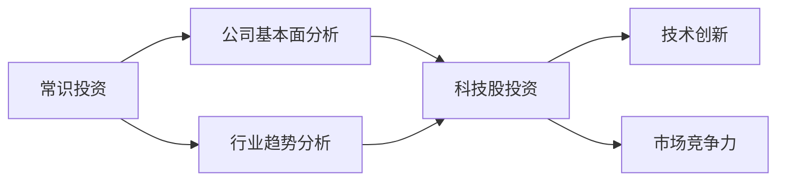

                 


# 彼得林奇的"常识投资"在科技股中的应用

---

## 关键词：
- 彼得林奇
- 常识投资
- 科技股
- 股票投资
- 价值投资

---

## 摘要：
彼得林奇是全球著名的投资专家，其提出的“常识投资”理念强调对公司基本面和行业趋势的深入分析。本文将探讨如何将这一投资理念应用于科技股投资中，分析科技股的特点、投资策略、风险管理以及实际案例。通过结合理论与实践，本文旨在为投资者提供一套系统化的科技股投资方法。

---

## 正文：

### 第一部分：常识投资与科技股的背景介绍

#### 1.1 常识投资的核心概念
常识投资是一种基于对公司基本面和行业趋势的深入分析的投资策略，强调对公司的财务状况、行业地位、管理团队和市场前景的全面了解。其核心在于通过常识和逻辑推理，识别出具有长期增长潜力的公司。

#### 1.2 科技股的特点与投资难点
科技股具有高成长性和高波动性的特点。科技行业的快速变化和技术更新使得科技股的投资具有较高的风险和不确定性。投资者需要具备行业知识和对技术趋势的敏锐洞察力。

#### 1.3 投资背景与问题分析
近年来，科技行业迅速发展，科技股在股市中占据了重要地位。然而，科技股的投资门槛较高，需要投资者具备专业能力。本文将探讨如何运用常识投资理念，解决科技股投资中的问题。

---

### 第二部分：常识投资与科技股的核心联系

#### 2.1 两者的核心要素对比
| **要素**       | **常识投资**                     | **科技股投资**                   |
|------------------|-----------------------------------|------------------------------------|
| 投资目标         | 寻找具有长期增长潜力的公司       | 寻找技术创新、市场领先的科技公司 |
| 分析方法         | 基于基本面分析和行业趋势         | 基于技术分析、财务分析和市场趋势 |
| 投资策略         | 长期持有优质公司                | 灵活调整投资组合，捕捉成长机会   |

#### 2.2 用mermaid展示核心概念之间的关系



---

### 第三部分：科技股投资的算法与系统分析

#### 3.1 科技股投资的算法流程


#### 3.2 系统架构设计


#### 3.3 算法的数学模型与公式
- **市盈率（P/E）计算公式**：
  $$ P/E = \frac{\text{股价}}{\text{每股收益}} $$
- **市净率（P/B）计算公式**：
  $$ P/B = \frac{\text{股价}}{\text{每股净资产}} $$
- **ROE（净资产收益率）计算公式**：
  $$ ROE = \frac{\text{净利润}}{\text{股东权益}} $$

---

### 第四部分：科技股投资的项目实战

#### 4.1 项目环境与目标
以某科技公司为例，分析其投资价值。目标是通过常识投资方法，评估该公司是否具备长期增长潜力。

#### 4.2 项目核心实现步骤
1. **行业分析**：分析行业发展趋势和竞争格局。
2. **公司基本面分析**：评估公司的财务状况、管理团队和市场地位。
3. **财务分析**：计算市盈率、市净率和ROE等指标。
4. **投资决策**：基于分析结果做出投资决策。

#### 4.3 代码实现与解读
```python
import pandas as pd
import yfinance as yf

# 下载某科技公司的财务数据
data = yf.Ticker("AAPL")
balance_sheet = data.balance_sheet
income_statement = data.income_statement

# 计算ROE
def calculate_roe(net_income, equity):
    return net_income / equity

net_income = float(income_statement.loc['Net Income'])
equity = float(balance_sheet.loc['Total Equity'])
roe = calculate_roe(net_income, equity)
print(f"ROE: {roe}")
```

---

### 第五部分：最佳实践与小结

#### 5.1 投资策略的注意事项
- **分散投资**：避免过度集中于单一科技公司。
- **持续学习**：关注行业动态和技术趋势。
- **风险管理**：设定止损点，控制投资风险。

#### 5.2 小结与未来展望
通过将彼得林奇的常识投资理念应用于科技股投资，投资者可以更好地识别具有长期增长潜力的公司。未来，随着科技行业的进一步发展，这一方法将更具价值。

---

## 结语：
彼得林奇的常识投资理念为科技股投资提供了重要的指导。通过结合科技行业的特点和常识投资的方法，投资者可以在复杂的市场环境中找到优质的投资标的。希望本文能够为投资者提供实用的指导和启示。

--- 

**注意**：本文内容为示例，不构成实际投资建议。投资有风险，需谨慎决策。

