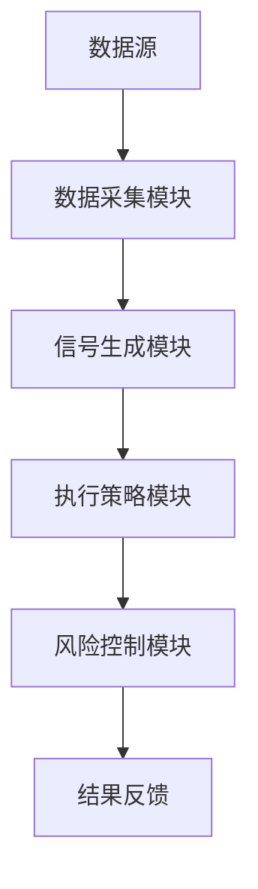

                 


# 第三部分: "慢牛"投资在算法交易中的应用与优化

## 第8章: "慢牛"投资理念与算法交易的结合

### 8.1 "慢牛"投资与算法交易的结合点

#### 8.1.1 长期投资与短期交易的结合

- 长期投资的稳定性与短期交易的灵活性
- 通过算法优化投资组合的构成
- 算法辅助下的长期投资策略

#### 8.1.2 价值投资与技术分析的结合

- 价值投资的长期性与技术分析的短期性
- 利用算法优化技术分析指标
- 价值投资与技术分析的协同效应

#### 8.1.3 算法优化下的投资组合管理

- 投资组合的动态优化
- 算法在风险控制中的应用
- 投资组合的实时监控与调整

### 8.2 算法交易中的"慢牛"投资策略

#### 8.2.1 长期趋势的算法识别

- 利用时间序列分析识别长期趋势
- 算法在长期趋势预测中的应用
- 算法对长期趋势的实时跟踪

#### 8.2.2 价值投资的算法优化

- 利用算法筛选优质股票
- 算法在投资组合优化中的应用
- 算法在风险控制中的应用

#### 8.2.3 算法交易中的风险管理

- 算法在风险预警中的应用
- 算法在风险控制中的策略
- 算法在风险分散中的应用

## 第9章: "慢牛"投资在算法交易中的优化策略

### 9.1 基于算法的"慢牛"投资优化

#### 9.1.1 算法优化下的投资策略

- 利用算法优化投资策略的执行效率
- 算法在投资策略中的动态调整
- 算法在投资策略中的风险控制

#### 9.1.2 算法优化下的投资组合管理

- 利用算法优化投资组合的构成
- 算法在投资组合优化中的动态调整
- 算法在投资组合优化中的风险控制

### 9.2 算法交易中的"慢牛"投资风险管理

#### 9.2.1 算法在风险预警中的应用

- 利用算法实时监控市场风险
- 算法在风险预警中的指标选择
- 算法在风险预警中的策略优化

#### 9.2.2 算法在风险控制中的应用

- 利用算法进行风险对冲
- 算法在风险控制中的动态调整
- 算法在风险控制中的策略优化

## 第10章: "慢牛"投资与算法交易的未来展望

### 10.1 算法交易技术的发展趋势

- 人工智能在算法交易中的应用
- 大数据分析在算法交易中的应用
- 区块链技术在算法交易中的应用

### 10.2 "慢牛"投资在算法交易中的未来发展

- 长期投资与算法交易的深度融合
- 算法优化下的投资策略创新
- 算法交易中的风险管理优化

### 10.3 投资者在算法交易时代的角色转变

- 投资者从主动决策向算法辅助决策的转变
- 算法交易时代下投资者能力的提升
- 算法交易时代下投资者的未来挑战

# 第四部分: 算法交易系统的实现与优化

## 第11章: 算法交易系统的实现

### 11.1 系统设计概述

#### 11.1.1 系统功能模块划分

- 数据采集模块
- 信号生成模块
- 执行策略模块
- 风险控制模块

#### 11.1.2 系统功能流程

- 数据采集→信号生成→执行策略→风险控制→结果反馈

#### 11.1.3 系统架构设计

- 单体架构
- 微服务架构
- 分布式架构

### 11.2 系统实现的技术选型

#### 11.2.1 程序语言的选择

- Python
- Java
- C++

#### 11.2.2 开发框架的选择

- Flask
- Django
- Spring

#### 11.2.3 数据库的选择

- MySQL
- MongoDB
- Redis

### 11.3 系统实现的代码示例

#### 11.3.1 数据采集模块的实现

```python
import pandas as pd
import yfinance as yf

# 下载数据
data = yf.download('AAPL', start='2020-01-01', end='2023-01-01')
# 数据预处理
data = data[['Close', 'Volume']]
data = data.dropna()
print(data.head())
```

#### 11.3.2 信号生成模块的实现

```python
import numpy as np
import pandas as pd

# 均值回归策略
def generate_signal(data, window=20):
    data['SMA'] = data['Close'].rolling(window).mean()
    data['Signal'] = np.where(data['Close'] > data['SMA'], 1, -1)
    return data
```

#### 11.3.3 执行策略模块的实现

```python
import pandas as pd
import numpy as np

# 简单的执行策略
def execute_strategy(data, signal):
    positions = []
    for i in range(len(signal)):
        if i == 0:
            positions.append(signal[i])
        else:
            if signal[i] != positions[-1]:
                positions.append(signal[i])
            else:
                positions.append(positions[-1])
    return positions
```

### 11.4 系统实现的流程图



## 第12章: 算法交易系统的优化

### 12.1 系统优化的目标

#### 12.1.1 提高交易效率

- 优化数据采集模块
- 优化信号生成模块
- 优化执行策略模块

#### 12.1.2 提高交易准确性

- 数据采集的准确性
- 信号生成的准确性
- 执行策略的准确性

#### 12.1.3 降低交易成本

- 数据采集的成本
- 信号生成的成本
- 执行策略的成本

### 12.2 系统优化的策略

#### 12.2.1 数据采集模块的优化

- 数据源的优化
- 数据预处理的优化
- 数据存储的优化

#### 12.2.2 信号生成模块的优化

- 算法模型的优化
- 参数优化
- 集成学习的优化

#### 12.2.3 执行策略模块的优化

- 执行策略的优化
- 参数优化
- 集成学习的优化

### 12.3 系统优化的案例分析

#### 12.3.1 数据采集模块的优化案例

```python
import yfinance as yf
import pandas as pd

# 原始代码
data = yf.download('AAPL', start='2020-01-01', end='2023-01-01')

# 优化代码
def fetch_data(ticker, start, end):
    df = yf.download(ticker, start=start, end=end)
    df = df[['Close', 'Volume']]
    df = df.dropna()
    return df

data = fetch_data('AAPL', '2020-01-01', '2023-01-01')
print(data.head())
```

#### 12.3.2 信号生成模块的优化案例

```python
import numpy as np
import pandas as pd

# 原始代码
def generate_signal(data, window=20):
    data['SMA'] = data['Close'].rolling(window).mean()
    data['Signal'] = np.where(data['Close'] > data['SMA'], 1, -1)
    return data

# 优化代码
def generate_signal_optimized(data, window=20):
    data = data.copy()
    data['SMA'] = data['Close'].rolling(window).mean()
    data['Signal'] = np.where(data['Close'] > data['SMA'], 1, -1)
    return data

data = generate_signal_optimized(data, 20)
print(data.head())
```

### 12.4 系统优化的监控与维护

#### 12.4.1 系统监控

- 实时监控系统运行状态
- 监控交易数据
- 监控系统性能

#### 12.4.2 系统维护

- 数据库维护
- 系统升级
- 系统故障处理

#### 12.4.3 系统优化的持续改进

- 不断优化系统性能
- 不断改进算法模型
- 不断完善系统功能

# 第五部分: 案例分析与经验分享

## 第13章: 案例分析

### 13.1 案例背景介绍

#### 13.1.1 案例选择标准

- 交易品种
- 时间跨度
- 市场环境

#### 13.1.2 案例基本假设

- 市场有效性假设
- 理论假设
- 数据假设

### 13.2 案例分析过程

#### 13.2.1 数据采集与处理

```python
import pandas as pd
import yfinance as yf

# 数据采集
data = yf.download('AAPL', start='2020-01-01', end='2023-01-01')
# 数据处理
data = data[['Close', 'Volume']]
data = data.dropna()
print(data.head())
```

#### 13.2.2 信号生成与执行

```python
import numpy as np
import pandas as pd

# 信号生成
def generate_signal(data, window=20):
    data['SMA'] = data['Close'].rolling(window).mean()
    data['Signal'] = np.where(data['Close'] > data['SMA'], 1, -1)
    return data

data = generate_signal(data, 20)
print(data.head())
```

#### 13.2.3 结果分析

```python
import matplotlib.pyplot as plt

# 画图
plt.figure(figsize=(10, 6))
plt.plot(data['Close'], label='Close Price')
plt.plot(data['SMA'], label='SMA')
plt.scatter(data.index, data['Close'], c=data['Signal'], cmap='viridis', label='Signal')
plt.legend()
plt.show()
```

### 13.3 案例分析结果与解读

#### 13.3.1 信号生成的准确性分析

- 正确信号的数量与比例
- 错误信号的数量与比例
- 信号生成的稳定性分析

#### 13.3.2 交易策略的收益与风险分析

- 收益率分析
- 风险分析
- 收益与风险的对比分析

#### 13.3.3 系统优化的效果分析

- 交易效率的提升
- 交易准确性的提升
- 交易成本的降低

## 第14章: 经验分享与注意事项

### 14.1 经验分享

#### 14.1.1 算法交易中的经验总结

- 算法交易的优势
- 算法交易的劣势
- 算法交易的注意事项

#### 14.1.2 "慢牛"投资中的经验总结

- 长期投资的稳定性
- 价值投资的长期性
- 风险控制的重要性

### 14.2 注意事项

#### 14.2.1 算法交易中的风险提示

- 市场波动风险
- 算法错误风险
- 系统故障风险

#### 14.2.2 "慢牛"投资中的风险提示

- 长期市场波动风险
- 经济周期风险
- 政策风险

#### 14.2.3 算法交易与"慢牛"投资的结合风险

- 短期与长期的冲突
- 算法与人性的冲突
- 技术与市场的冲突

## 第15章: 总结与展望

### 15.1 总结

#### 15.1.1 全文总结

- "慢牛"投资的核心理念
- 算法交易的核心技术
- 两者结合的必要性与重要性

#### 15.1.2 个人总结

- 理论学习的重要性
- 实践操作的重要性
- 不断学习与优化的重要性

### 15.2 展望

#### 15.2.1 未来研究方向

- 算法交易技术的深入研究
- "慢牛"投资的创新应用
- 两者的结合优化

#### 15.2.2 未来挑战

- 技术挑战
- 市场挑战
- 理论挑战

#### 15.2.3 未来机会

- 技术进步带来的机会
- 市场变化带来的机会
- 理论创新带来的机会

### 15.3 个人寄语

- 对投资者的建议
- 对研究者的建议
- 对技术开发者的建议

# 结语

"慢牛"投资在算法交易时代的重要性不可忽视，两者结合不仅能够提高投资效率，还能够优化投资结果。通过本文的分析，我们看到了"慢牛"投资与算法交易的结合不仅是可能的，而且是必要的。未来，随着算法交易技术的不断发展，"慢牛"投资将与算法交易更加紧密地结合，为投资者带来更多的机会与挑战。

