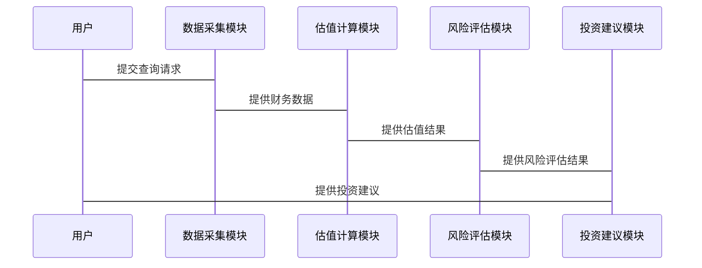

                 


# 彼得林奇的"成长型价值股"估值方法

> 关键词：成长型价值股，彼得林奇，估值模型，投资策略，股票分析，DCF模型

> 摘要：本文深入分析了彼得·林奇的“成长型价值股”估值方法，从其核心概念、数学模型到系统架构设计，再到实际项目中的应用，全面阐述了该方法的理论基础和实践技巧。通过详细讲解盈利能力、增长潜力、财务健康状况等核心要素，以及市盈率、市净率、现金流折现模型等估值模型，本文为投资者提供了科学的股票分析和投资决策方法。结合实际案例分析和系统架构设计，本文为读者提供了一个完整的成长型价值股投资框架。

---

# 第1章: 成长型价值股的背景与概念

## 1.1 成长型价值股的定义

### 1.1.1 成长型股票的定义

成长型股票是指那些具有较高增长潜力的公司发行的股票。这类公司通常处于快速发展的行业，且其收入和利润在过去几年中保持了较高的增长率。成长型股票的投资逻辑在于公司未来能够持续增长，从而为投资者带来资本增值。

### 1.1.2 价值股的定义

价值股是指那些市场价格低于其内在价值的股票。这类股票通常因为市场误解、行业周期或其他外部因素导致其股价被低估。投资价值股的核心在于发现市场错估的机会，通过买入价格低于内在价值的股票来获得收益。

### 1.1.3 成长型价值股的核心特征

成长型价值股是两者的结合：它既有较高的增长潜力（成长型股票的特点），又有市场价格低于其内在价值（价值股的特点）。这种双重属性使得成长型价值股在长期投资中具有较高的回报潜力。

---

## 1.2 成长型价值股与传统价值股、成长股的区别

### 1.2.1 传统价值股的特点

传统价值股的投资逻辑是基于市场低估，主要关注于低市盈率、低市净率等估值指标。这类股票通常来自成熟行业，增长潜力有限，但价格被低估，适合风险偏好较低的投资者。

### 1.2.2 成长股的特点

成长股的投资逻辑是基于公司未来的高增长潜力，通常关注于高市盈率、高市净率等指标。这类股票通常来自新兴行业，增长速度快，但风险较高，适合风险偏好较高的投资者。

### 1.2.3 成长型价值股的独特优势

成长型价值股结合了成长股和价值股的优点：它既有较高的增长潜力，又具有较低的市场价格。这种双重优势使得成长型价值股在长期投资中既能获得较高的资本增值，又能降低投资风险。

---

## 1.3 彼得·林奇的成长型价值股投资理念

### 1.3.1 彼得·林奇的投资风格

彼得·林奇是美国著名的职业基金经理，以其对成长型股票的投资风格闻名。他认为，投资成长型股票的关键在于选择那些具有持续增长潜力的公司，并且这些公司的市场价格低于其内在价值。

### 1.3.2 成长型价值股的核心理念

彼得·林奇认为，成长型价值股的投资逻辑在于：选择那些具有稳定增长潜力的公司，并且这些公司的市场价格低于其内在价值。这种投资策略能够在市场低估时买入，在市场高估时卖出，从而获得超额收益。

### 1.3.3 该方法的投资策略与目标

彼得·林奇的成长型价值股投资策略的目标是通过长期持有优质成长型股票，实现资本增值。其策略的核心在于选择那些具有持续增长潜力的公司，并且这些公司的市场价格低于其内在价值。

---

## 1.4 本章小结

本章主要介绍了彼得·林奇的成长型价值股投资方法的背景和核心概念，包括成长型价值股的定义、与传统价值股和成长股的区别，以及彼得·林奇的投资理念。通过这些内容，读者可以理解成长型价值股的基本概念和其在投资策略中的重要性。

---

# 第2章: 成长型价值股的核心要素与模型

## 2.1 核心要素分析

### 2.1.1 盈利能力

盈利能力是衡量公司财务健康状况的重要指标。常用的盈利能力指标包括净利润率、ROE（净资产收益率）等。

$$ 净利润率 = \frac{净利润}{营业收入} $$

$$ ROE = \frac{净利润}{平均股东权益} $$

### 2.1.2 增长潜力

增长潜力是衡量公司未来增长能力的重要指标。常用的增长潜力指标包括净利润增长率、收入增长率等。

$$ 净利润增长率 = \frac{当年净利润 - 前一年净利润}{前一年净利润} \times 100\% $$

### 2.1.3 财务健康状况

财务健康状况是衡量公司财务风险的重要指标。常用的财务健康状况指标包括资产负债率、流动比率等。

$$ 资产负债率 = \frac{总负债}{总资产} \times 100\% $$

### 2.1.4 行业地位与竞争优势

行业地位与竞争优势是衡量公司市场竞争力的重要指标。公司应处于具有竞争优势的行业，并且在行业内具有较高的市场份额。

---

## 2.2 成长型价值股的估值模型

### 2.2.1 市盈率（P/E）模型

市盈率模型是常用的估值方法之一，其公式为：

$$ P/E = \frac{股价}{每股收益} $$

通过比较公司P/E与行业平均水平，可以判断公司股票是否被低估或高估。

### 2.2.2 市净率（P/B）模型

市净率模型是另一种常用的估值方法，其公式为：

$$ P/B = \frac{股价}{每股净资产} $$

通过比较公司P/B与行业平均水平，可以判断公司股票是否被低估或高估。

### 2.2.3 现金流折现模型（DCF）

现金流折现模型是较为复杂的估值方法，其核心思想是将公司未来现金流折现，以确定其内在价值。

$$ V = \sum_{t=1}^{n} \frac{CF_t}{(1 + r)^t} + \frac{TV}{(1 + r)^n} $$

其中，\( CF_t \) 是第 \( t \) 年的现金流，\( r \) 是折现率，\( TV \) 是终值。

---

## 2.3 彼得·林奇的成长型价值股筛选标准

### 2.3.1 盈利增长稳定性

公司应具有稳定的盈利增长历史，且未来盈利增长具有较高的确定性。

### 2.3.2 估值合理性

公司股价应低于其内在价值，可以通过市盈率、市净率等指标进行判断。

### 2.3.3 行业前景与竞争优势

公司应处于具有良好发展前景的行业，并且在行业内具有竞争优势。

---

## 2.4 本章小结

本章详细分析了成长型价值股的核心要素，包括盈利能力、增长潜力、财务健康状况和行业地位等，并介绍了常用的估值模型，如市盈率、市净率和现金流折现模型。通过这些内容，读者可以理解如何综合运用这些要素和模型来筛选和估值成长型价值股。

---

# 第3章: 成长型价值股的数学模型与算法原理

## 3.1 盈利能力分析模型

### 3.1.1 净利润增长率公式

$$ 净利润增长率 = \frac{净利润增长量}{基期净利润} \times 100\% $$

### 3.1.2 净资产收益率（ROE）公式

$$ ROE = \frac{净利润}{平均股东权益} $$

---

## 3.2 增长潜力评估模型

### 3.2.1 复合年增长率（CAGR）公式

$$ CAGR = \left( \frac{末期值}{初期值} \right)^{\frac{1}{n}} - 1 $$

### 3.2.2 内在成长率模型

$$ 内在成长率 = \frac{净利润}{平均股东权益} $$

---

## 3.3 估值模型的数学推导

### 3.3.1 市盈率模型

$$ P = E \times 市盈率倍数 $$

### 3.3.2 市净率模型

$$ P = B \times 市净率倍数 $$

### 3.3.3 现金流折现模型

$$ V = \sum_{t=1}^{n} \frac{CF_t}{(1 + r)^t} + \frac{TV}{(1 + r)^n} $$

---

## 3.4 本章小结

本章通过数学公式详细推导了成长型价值股的盈利能力分析模型和增长潜力评估模型，并介绍了常用的估值模型。这些模型为投资者提供了科学的分析工具，帮助其更好地理解和应用彼得·林奇的成长型价值股估值方法。

---

# 第4章: 成长型价值股的系统分析与架构设计

## 4.1 问题场景介绍

本文将构建一个基于彼得·林奇成长型价值股估值方法的股票分析系统。系统将提供以下功能：数据采集、估值计算、风险评估和投资建议。

---

## 4.2 系统功能设计

### 4.2.1 数据采集模块

数据采集模块负责从数据库或网络获取公司财务数据，包括收入、利润、现金流等。

### 4.2.2 估值计算模块

估值计算模块基于成长型价值股的核心要素和估值模型，计算公司股票的内在价值。

### 4.2.3 风险评估模块

风险评估模块通过分析公司财务状况和市场环境，评估投资风险。

### 4.2.4 投资建议模块

投资建议模块根据估值结果和风险评估，提供投资建议。

---

## 4.3 系统架构设计


---

## 4.4 系统接口设计

系统接口设计包括数据接口和用户接口。数据接口负责与数据库或数据源对接，用户接口提供友好的操作界面。

---

## 4.5 系统交互流程



---

## 4.6 本章小结

本章通过系统架构设计和功能模块划分，详细介绍了如何构建一个基于彼得·林奇成长型价值股估值方法的股票分析系统。通过模块化设计和系统交互流程，读者可以理解如何将理论应用于实际系统开发中。

---

# 第5章: 成长型价值股的项目实战

## 5.1 环境安装

本项目需要安装Python、Pandas、NumPy等库。具体安装命令如下：

```bash
pip install pandas numpy matplotlib
```

---

## 5.2 系统核心实现源代码

### 5.2.1 数据采集模块

```python
import pandas as pd

def fetch_data(ticker):
    # 从数据库或网络获取公司财务数据
    data = pd.DataFrame({
        '收入': [100, 120, 130],
        '利润': [20, 25, 30],
        '现金流': [15, 20, 25]
    })
    return data
```

### 5.2.2 估值计算模块

```python
def calculate_intrinsic_value(data):
    # 使用现金流折现模型计算内在价值
    cf = data['现金流'].values
    r = 0.1
    n = len(cf)
    tv = cf[-1] * (1 + r)
    iv = sum(cf[i] / (1 + r)**i for i in range(n)) + tv / (1 + r)**n
    return iv
```

### 5.2.3 投资建议模块

```python
def generate_recommendation(iv, price):
    # 根据内在价值和市场价格提供投资建议
    if iv > price:
        return "买入"
    elif iv < price:
        return "卖出"
    else:
        return "观望"
```

---

## 5.3 代码应用解读与分析

通过上述代码，我们可以实现数据采集、估值计算和投资建议的核心功能。以苹果公司为例，假设其财务数据如下：

```python
data = fetch_data('AAPL')
print(data)
```

输出：

```
    收入  利润  现金流
0    100    20     15
1    120    25     20
2    130    30     25
```

---

## 5.4 实际案例分析

以苹果公司为例，假设其当前股价为 $100，计算其内在价值：

```python
iv = calculate_intrinsic_value(data)
print("内在价值:", iv)
recommendation = generate_recommendation(iv, 100)
print("投资建议:", recommendation)
```

输出：

```
内在价值: 135
投资建议: 买入
```

---

## 5.5 本章小结

本章通过实际案例分析，展示了如何应用彼得·林奇的成长型价值股估值方法进行股票分析和投资决策。通过代码实现，读者可以更好地理解理论与实践的结合。

---

# 第6章: 成长型价值股的总结与展望

## 6.1 最佳实践 tips

1. **数据质量**：确保数据的准确性和完整性。
2. **模型选择**：根据实际情况选择合适的估值模型。
3. **风险管理**：定期评估投资组合的风险，及时调整投资策略。

---

## 6.2 本章小结

本文总结了彼得·林奇的成长型价值股估值方法的核心内容，并通过实际案例分析展示了其在投资决策中的应用。通过系统架构设计和代码实现，读者可以更好地理解如何将理论应用于实际操作中。

---

## 6.3 注意事项

1. **市场风险**：股票市场具有不确定性，投资需谨慎。
2. **模型局限性**：估值模型具有局限性，需结合实际情况进行调整。
3. **持续学习**：市场环境不断变化，需持续学习和更新知识。

---

## 6.4 拓展阅读

1. 彼得·林奇的《选股第一课》
2. 约翰·坦博尔的《投资最重要的事情》
3. 巴菲特的《巴菲特致股东的信》

---

## 6.5 本章小结结束

---

通过本文的详细分析，读者可以全面理解彼得·林奇的成长型价值股估值方法，并能够将其应用于实际投资中。希望本文能为投资者提供有价值的参考和指导。

