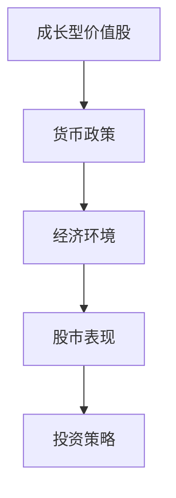
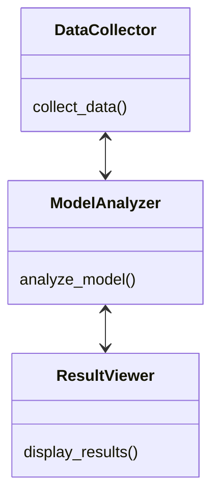
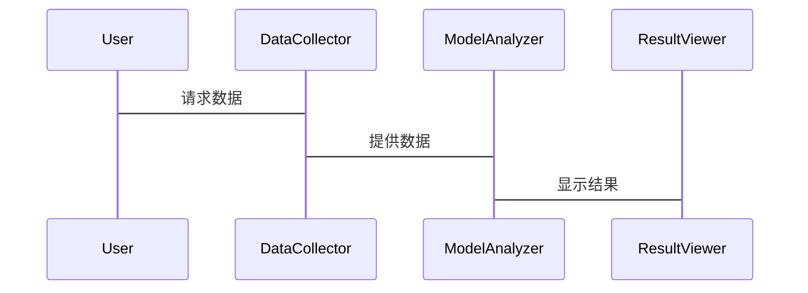

                 


# 彼得林奇的"成长型价值股"在不同货币政策下的表现

## 关键词：
- 彼得林奇
- 成长型价值股
- 货币政策
- 投资策略
- 股市分析
- 经济影响
- 投资组合优化

## 摘要：
本文深入分析了彼得·林奇的成长型价值股投资理念，并探讨了不同货币政策环境下这些股票的表现。通过建立数学模型，量化分析货币政策对股市的影响，结合实际案例，为投资者提供策略建议，优化投资组合。文章结构清晰，内容详实，适合对投资和货币政策感兴趣的专业人士阅读。

---

## 第一部分：背景介绍与核心概念

### 第1章：彼得林奇的成长型价值股投资理念

#### 1.1 成长型价值股的定义与特点
- **成长型股票**：高成长性，未来收益预期高于当前收益。
- **价值股**：估值低于市场平均水平，通常表现为低市盈率、低市净率。
- **成长型价值股**：兼具成长性和估值优势，具备长期增长潜力。

#### 1.2 彼得林奇的成长型价值股投资策略
- **投资理念**：寻找基本面良好、估值合理、具有持续成长潜力的企业。
- **筛选标准**：高ROE、稳定的收益增长、合理的估值。
- **投资组合管理**：分散投资、定期调整、长期持有。

### 第2章：货币政策对股市的影响

#### 2.1 货币政策的基本概念
- **货币政策**：中央银行通过调节货币供应量和利率，影响经济活动的政策。
- **主要工具**：公开市场操作、调整基准利率、存款准备金率。
- **影响路径**：通过改变资金成本和流动性，影响企业融资成本和投资行为。

#### 2.2 货币政策与股市的关系
- **直接影响**：利率下降，降低企业融资成本，提升股票估值。
- **间接影响**：通过影响经济环境（如GDP增长、企业盈利）间接影响股市。
- **周期性表现**：宽松货币政策下，股市上涨；紧缩政策下，股市可能下跌。

### 第3章：成长型价值股与货币政策的关联

#### 3.1 成长型价值股在不同货币政策下的表现特征
- **宽松货币政策**：资金充裕，成长股估值上升，收益增长。
- **紧缩货币政策**：资金紧张，成长股估值可能下降，收益受压。
- **中性货币政策**：市场平稳，成长股表现稳定。

#### 3.2 货币政策对投资策略的影响
- **策略调整**：根据货币政策周期调整投资组合。
- **估值影响**：货币政策影响市场估值，需调整选股标准。
- **风险控制**：货币政策变化可能导致市场波动，需注意风险。

---

## 第二部分：核心概念与联系

### 第4章：成长型价值股与货币政策的实体关系分析

#### 4.1 实体关系图


#### 4.2 核心概念对比分析
| 概念       | 定义与特点                              |
|------------|---------------------------------------|
| 成长型价值股 | 兼具成长性和估值优势的股票            |
| 货币政策     | 影响经济和股市的政策工具              |
| 股市表现     | 股票价格的涨跌情况                    |
| 投资策略     | 投资者根据市场情况制定的投资计划      |

---

## 第三部分：算法原理与系统分析

### 第5章：货币政策影响下的股票收益模型

#### 5.1 模型构建
- **目标**：量化分析货币政策对成长型价值股收益的影响。
- **变量**：货币政策指标（如利率、货币供应量）、股票收益、宏观经济指标。

#### 5.2 数学模型
$$收益 = \beta \times 货币政策变量 + \epsilon$$

其中，$\beta$ 表示货币政策对收益的影响程度，$\epsilon$ 为误差项。

#### 5.3 实证分析
- 数据来源：历史股票数据与货币政策数据。
- 分析工具：回归分析，Python代码示例：
```python
import pandas as pd
import numpy as np
from statsmodels import regression

data = pd.read_csv('data.csv')
X = data[['interest_rate']]
y = data['stock_return']
model = regression.linear_model.OLS(y, X).fit()
print(model.summary())
```

---

## 第四部分：系统分析与架构设计

### 第6章：系统架构设计

#### 6.1 功能模块
- 数据收集：爬取股票数据和货币政策数据。
- 模型分析：构建并训练收益预测模型。
- 结果展示：可视化分析结果。

#### 6.2 类图设计


#### 6.3 序列图


---

## 第五部分：项目实战

### 第7章：实战分析与代码实现

#### 7.1 环境安装
- Python 3.8+
- 库：pandas, numpy, statsmodels

#### 7.2 核心代码
```python
import pandas as pd
import numpy as np
from statsmodels import regression

# 数据加载
data = pd.read_csv('data.csv')

# 模型构建
X = data[['interest_rate']]
y = data['stock_return']
model = regression.linear_model.OLS(y, X).fit()

# 结果展示
print(model.summary())
```

#### 7.3 实例分析
- **案例**：美联储加息周期下，成长型价值股的表现。
- **分析**：加息可能导致市场流动性下降，成长股估值承压。

---

## 第六部分：最佳实践与小结

### 第8章：投资策略与注意事项

#### 8.1 最佳实践
- 定期评估投资组合，根据货币政策调整。
- 保持分散投资，降低风险。
- 关注宏观经济指标，预判政策变化。

#### 8.2 小结
本文通过分析彼得林奇的成长型价值股投资策略，探讨了不同货币政策下的表现，为投资者提供了优化投资组合的策略建议。

---

## 参考文献与扩展阅读
1. 彼得·林奇著述
2. 货币政策相关文献
3. 股市分析工具书籍
4. 投资策略经典案例研究

---

**注**：本文内容仅为目录结构，实际文章将包含每个部分的详细内容与代码解释。

