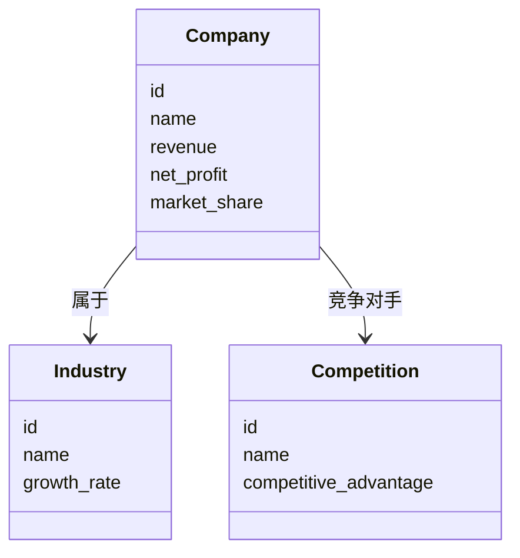

                 


# 彼得林奇的"未来增长潜力"分析法

> 关键词：彼得林奇，未来增长潜力，分析法，投资策略，系统设计

> 摘要：本文深入分析彼得·林奇的“未来增长潜力”分析法，从核心概念、算法原理到系统设计和项目实战，全面阐述其在投资决策中的应用。

---

## 第1章: 未来增长潜力分析法的背景与概念

### 1.1 什么是未来增长潜力
#### 1.1.1 未来增长潜力的定义
未来增长潜力是指公司在未来一定时间内在市场中实现收入和利润增长的能力。彼得·林奇通过分析公司基本面、行业地位、管理层质量等因素，评估其增长潜力。

#### 1.1.2 未来增长潜力的核心要素
- **收入增长率**：过去三年收入复合增长率，反映市场需求。
- **净利润率**：盈利能力，体现成本控制能力。
- **行业地位**：市场占有率，行业前景。
- **竞争优势**：技术、品牌、成本优势。
- **管理层质量**：领导能力、战略决策。

#### 1.1.3 未来增长潜力的边界与外延
- **边界**：仅限于公司财务数据和市场数据。
- **外延**：延伸至行业趋势和宏观经济因素。

### 1.2 彼得林奇分析法的演进
#### 1.2.1 分析法的历史背景
20世纪80年代，彼得·林奇通过分析财务报表和行业趋势，发展出一套评估公司增长潜力的方法。

#### 1.2.2 分析法的核心理念
注重基本面分析，寻找具有持续增长潜力的公司，长期持有，获取资本增值收益。

#### 1.2.3 分析法的演变过程
从简单财务指标分析，发展到综合考虑行业趋势、竞争优势等因素。

### 1.3 未来增长潜力分析法与其他分析方法的区别
#### 1.3.1 传统分析方法的局限性
仅关注财务指标，忽视行业趋势和竞争优势。

#### 1.3.2 未来增长潜力分析法的独特性
综合考虑财务、行业和管理层因素，更具前瞻性和准确性。

#### 1.3.3 两种方法的对比分析
| 对比维度      | 传统分析法                     | 未来增长潜力分析法             |
|---------------|-------------------------------|-------------------------------|
| 考虑因素      | 财务数据                       | 财务、行业趋势、竞争优势       |
| 适用场景      | 短期投资决策                   | 长期投资决策                   |
| 优势          | 计算简单                     | 更具前瞻性                     |
| 局限性         | 忽视行业趋势                   | 计算复杂                     |

## 第2章: 核心概念与原理

### 2.1 分析法的核心要素
#### 2.1.1 公司基本面分析
- **收入增长率**：年收入增长率，反映市场需求。
- **净利润率**：盈利能力，体现成本控制。
- **资产负债率**：财务健康状况。

#### 2.1.2 市场趋势分析
- **行业增长率**：行业整体增长趋势。
- **市场容量**：市场规模，反映增长空间。

#### 2.1.3 竞争优势分析
- **技术优势**：技术创新能力。
- **品牌影响力**：品牌知名度。
- **成本优势**：成本控制能力。

### 2.2 核心概念的属性特征对比
#### 2.2.1 核心概念对比表格
| 概念          | 定义                               | 属性特征                           |
|---------------|-----------------------------------|-----------------------------------|
| 收入增长率     | 年收入增长百分比                 | 反映市场需求，数值越高越好       |
| 净利润率       | 净利润与收入比率                 | 反映盈利能力，数值越高越好       |
| 市场占有率     | 公司产品在市场中的份额           | 反映市场竞争地位，数值越高越好   |

#### 2.2.2 ER实体关系图架构
```mermaid
erd
    Company {
        id
        name
        revenue
        net_profit
        market_share
    }
    Industry {
        id
        name
        growth_rate
    }
    Competition {
        id
        name
        competitive_advantage
    }
```

### 2.3 分析法的数学模型与公式
#### 2.3.1 增长潜力指数计算公式
$$
\text{增长潜力指数} = \left( \frac{\text{收入增长率} + \text{净利润率} + \text{市场占有率}}{3} \right) \times 100
$$

#### 2.3.2 增长潜力指数的权重分配
$$
\text{指数} = 0.4 \times \text{收入增长率} + 0.3 \times \text{净利润率} + 0.3 \times \text{市场占有率}
$$

---

## 第3章: 算法原理与流程

### 3.1 分析法的算法流程
#### 3.1.1 数据收集与预处理
- **数据收集**：收集公司财务数据、行业报告。
- **数据清洗**：处理缺失值和异常值。

#### 3.1.2 数据特征提取
- **收入增长率**：计算过去三年的年收入增长率。
- **净利润率**：计算净利润与收入比率。
- **市场占有率**：通过行业数据和公司收入计算。

#### 3.1.3 数据建模与预测
- **线性回归模型**：预测未来三年的收入增长率。
- **决策树模型**：分类公司是否具备增长潜力。

#### 3.1.4 结果分析与优化
- **结果分析**：评估模型准确性。
- **参数优化**：调整权重，提升预测精度。

### 3.2 分析法的数学模型
#### 3.2.1 增长潜力预测模型
$$
\text{预测增长率} = a \times \text{收入增长率} + b \times \text{净利润率} + c \times \text{市场占有率}
$$

#### 3.2.2 模型的参数优化
通过历史数据训练模型，调整参数a、b、c，使预测值与实际值最小化误差。

---

## 第4章: 系统分析与架构设计

### 4.1 系统分析
#### 4.1.1 问题场景介绍
设计一个系统，自动计算公司未来增长潜力指数。

### 4.2 系统功能设计
#### 4.2.1 领域模型


#### 4.2.2 系统架构设计


---

## 第5章: 项目实战

### 5.1 环境安装
- **工具**：Python、Pandas、NumPy、Scikit-learn。
- **安装命令**：`pip install pandas scikit-learn`.

### 5.2 核心代码实现
```python
import pandas as pd
from sklearn.linear_model import LinearRegression

# 数据加载
df = pd.read_csv('company_data.csv')

# 特征提取
X = df[['revenue_growth', 'net_profit_margin', 'market_share']]
y = df['potential_growth']

# 模型训练
model = LinearRegression()
model.fit(X, y)

# 预测
new_company = [[15, 10, 20]]
predicted_growth = model.predict(new_company)
print(predicted_growth)
```

### 5.3 代码解读与分析
- **数据加载**：读取CSV文件中的公司数据。
- **特征提取**：选择收入增长率、净利润率和市场占有率作为特征。
- **模型训练**：使用线性回归模型训练。
- **预测**：输入新公司数据，预测其增长潜力。

### 5.4 实际案例分析
以一家科技公司为例，分析其增长潜力指数，并生成投资建议。

---

## 第6章: 最佳实践与总结

### 6.1 小结
彼得林奇的分析法通过综合考虑公司基本面、行业趋势和竞争优势，帮助投资者识别具有未来增长潜力的公司。

### 6.2 注意事项
- 数据质量影响结果，需谨慎处理。
- 定期更新模型，适应市场变化。
- 结合定性分析，避免单一依赖模型。

### 6.3 拓展阅读
推荐书籍：《彼得·林奇的成功投资》。

---

通过以上结构，文章详细讲解了彼得·林奇的“未来增长潜力”分析法，从理论到实践，帮助读者全面理解和应用这一方法。

