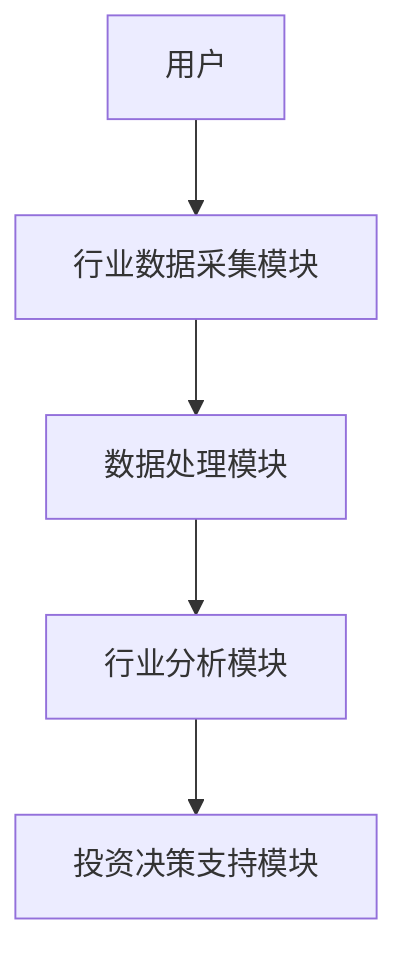
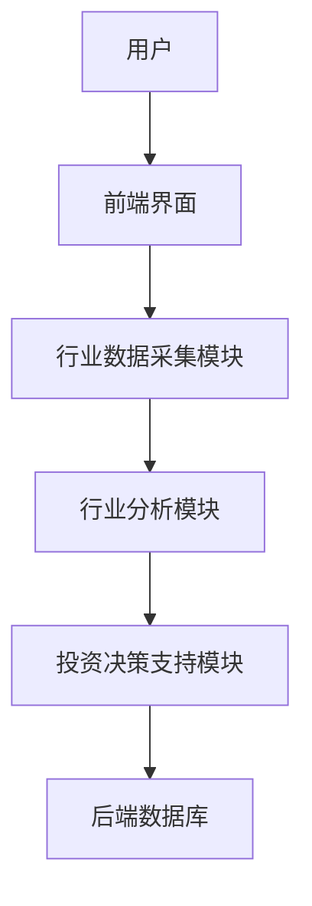

                 


# 彼得林奇的"行业分析"框架

## 关键词：行业分析，投资策略，彼得·林奇，金融分析，投资框架

## 摘要：彼得·林奇的行业分析框架是一种系统化的方法，用于评估行业的增长潜力、盈利能力以及风险。本文详细解析了该框架的核心概念、数学模型、系统架构设计，以及如何应用于实际投资决策中，帮助投资者做出明智的投资选择。

---

# 第一部分: 彼得林奇的行业分析框架概述

## 第1章: 彼得林奇的行业分析框架概述

### 1.1 彼得林奇的投资理念与方法

#### 1.1.1 彼得林奇的投资哲学
彼得·林奇是全球知名的投资专家，他强调长期投资和价值发现。他认为，成功的投资不仅依赖于市场走势，更取决于对行业和企业的深入了解。他的投资哲学包括以下几个关键点：
- **长期投资**：避免频繁交易，专注于寻找具有长期增长潜力的行业和企业。
- **基本面分析**：通过分析企业的财务状况、行业地位和市场前景来评估其投资价值。
- **分散投资**：通过投资于不同行业和企业来降低风险。

#### 1.1.2 构建行业分析框架的核心要素
行业分析是彼得·林奇投资策略的重要组成部分。他提出的行业分析框架包括以下几个核心要素：
- **行业生命周期**：分析行业的成长阶段，判断其是否处于上升期或成熟期。
- **行业竞争结构**：评估行业内主要企业的竞争态势，分析市场进入壁垒和竞争程度。
- **行业财务指标**：通过关键财务指标（如增长率、利润率、债务水平等）评估行业的健康状况和盈利能力。

#### 1.1.3 行业分析在投资决策中的作用
行业分析在投资决策中起着至关重要的作用。通过深入分析行业，投资者可以：
- 识别高增长行业的投资机会。
- 评估行业的风险和潜在回报。
- 判断行业内的龙头企业是否具备长期竞争优势。

### 1.2 行业分析框架的背景与意义

#### 1.2.1 行业分析的定义与范围
行业分析是对特定行业进行系统性研究，以了解其市场结构、竞争态势、增长潜力和财务状况。它不仅帮助投资者评估行业的投资价值，还能为企业的战略决策提供支持。

#### 1.2.2 行业分析在投资决策中的作用
在投资决策中，行业分析可以帮助投资者：
- 选择具有增长潜力的行业。
- 识别行业内的优势企业。
- 避免投资于风险过高的行业。

#### 1.2.3 构建行业分析框架的必要性
为了系统化地分析行业，彼得·林奇提出了一个结构化的行业分析框架。该框架包括以下几个部分：
- **行业数据收集**：收集行业相关的财务数据、市场数据和竞争数据。
- **行业指标分析**：通过关键指标评估行业的健康状况和增长潜力。
- **行业趋势分析**：分析行业的长期趋势，判断其未来的增长方向。

### 1.3 本章小结
本章介绍了彼得·林奇的投资理念和行业分析框架的核心要素，强调了行业分析在投资决策中的重要性。通过系统化的行业分析，投资者可以更好地识别投资机会，降低投资风险。

---

# 第二部分: 行业分析的核心概念与方法

## 第2章: 行业分析的核心概念

### 2.1 行业分析的核心概念

#### 2.1.1 行业的定义与分类
行业是指一组提供相似产品或服务的企业。根据规模和性质，行业可以分为多个类别，如制造业、服务业、科技行业等。

#### 2.1.2 行业生命周期理论
行业生命周期理论将行业的演变分为以下几个阶段：
1. **导入期**：行业刚刚进入市场，产品尚未成熟。
2. **增长期**：行业快速增长，市场需求激增。
3. **成熟期**：行业增长放缓，市场趋于饱和。
4. **衰退期**：行业需求下降，企业盈利能力减弱。

#### 2.1.3 行业竞争结构分析
行业竞争结构分析是行业分析的重要组成部分。通过分析行业内的主要企业、市场进入壁垒和竞争程度，可以评估行业的竞争态势。

### 2.2 行业分析的关键指标

#### 2.2.1 行业增长潜力指标
行业增长潜力指标用于评估行业的未来增长潜力。常用的指标包括：
- **行业年增长率**：衡量行业在过去几年的增长速度。
- **行业市场规模**：评估行业的市场规模和未来增长空间。

#### 2.2.2 行业盈利能力指标
行业盈利能力指标用于评估行业的盈利能力和财务健康状况。常用的指标包括：
- **净利润率**：衡量行业的盈利能力。
- **ROE（净资产收益率）**：评估行业的资产使用效率。

#### 2.2.3 行业风险评估指标
行业风险评估指标用于评估行业的风险和不确定性。常用的指标包括：
- **行业波动率**：衡量行业股价的波动程度。
- **行业债务水平**：评估行业企业的财务杠杆和风险。

### 2.3 行业分析的核心要素对比

#### 2.3.1 行业生命周期与竞争结构对比
通过对比行业生命周期和竞争结构，可以更好地理解行业的未来发展趋势和投资机会。

#### 2.3.2 行业增长潜力与盈利能力对比
分析行业增长潜力和盈利能力的对比，可以帮助投资者判断行业的投资价值和风险。

#### 2.3.3 行业风险与投资回报对比
通过对比行业风险和投资回报，投资者可以更好地评估行业的投资可行性。

### 2.4 本章小结
本章详细介绍了行业分析的核心概念和关键指标，包括行业生命周期、竞争结构、增长潜力、盈利能力以及风险评估。通过这些分析，投资者可以更好地理解行业的整体状况和投资机会。

---

# 第三部分: 行业分析的算法与数学模型

## 第3章: 行业分析的数学模型

### 3.1 行业增长潜力模型

#### 3.1.1 行业增长潜力的计算公式
$$ \text{行业增长潜力} = \frac{\text{行业年增长率}}{\text{行业平均增长率}} $$

#### 3.1.2 行业增长潜力的评估方法
通过计算行业的年增长率与行业平均增长率的比值，可以评估行业的增长潜力。如果比值大于1，说明行业增长潜力高于行业平均水平；反之，则低于行业平均水平。

### 3.2 行业盈利能力模型

#### 3.2.1 净利润增长率计算公式
$$ \text{净利润增长率} = \frac{\text{净利润增长量}}{\text{净利润基数}} \times 100\% $$

#### 3.2.2 行业盈利能力的综合评估
通过计算净利润增长率，可以评估行业的盈利能力。增长率越高，行业的盈利能力越强。

### 3.3 行业风险评估模型

#### 3.3.1 行业风险系数计算公式
$$ \text{行业风险系数} = \frac{\text{行业平均风险}}{\text{行业标准差}} $$

#### 3.3.2 行业风险与投资回报的关系
行业风险系数越大，行业的投资风险越高。投资者需要根据自身的风险承受能力，选择合适风险级别的行业进行投资。

### 3.4 本章小结
本章详细介绍了行业分析的数学模型，包括行业增长潜力模型、行业盈利能力模型和行业风险评估模型。通过这些模型，投资者可以量化评估行业的增长潜力、盈利能力以及风险水平。

---

# 第四部分: 行业分析框架的系统架构设计

## 第4章: 行业分析框架的系统架构

### 4.1 系统功能设计

#### 4.1.1 行业数据采集模块
行业数据采集模块负责收集行业相关的数据，包括行业市场规模、行业增长率、行业竞争结构等。

#### 4.1.2 行业分析模块
行业分析模块通过对收集到的数据进行分析，生成行业分析报告，包括行业增长潜力、盈利能力以及风险评估。

#### 4.1.3 投资决策支持模块
投资决策支持模块根据行业分析结果，为投资者提供投资建议，包括行业选择、企业选择以及投资组合优化。

### 4.2 系统架构设计

#### 4.2.1 系统功能模块设计


#### 4.2.2 系统架构设计


### 4.3 系统接口设计

#### 4.3.1 数据接口设计
行业数据接口设计包括数据采集、数据处理和数据分析接口。

#### 4.3.2 系统交互设计
系统交互设计包括用户输入、数据处理和结果输出。

### 4.4 系统交互设计

#### 4.4.1 用户与系统交互流程
用户通过前端界面输入行业名称或相关参数，系统通过行业数据采集模块获取数据，经过数据处理模块处理后，行业分析模块生成分析报告，最后投资决策支持模块提供投资建议。

### 4.5 本章小结
本章详细介绍了行业分析框架的系统架构设计，包括功能模块设计、系统架构设计、系统接口设计和系统交互设计。通过系统化的架构设计，可以提高行业分析的效率和准确性。

---

# 第五部分: 项目实战

## 第5章: 项目实战

### 5.1 环境安装

#### 5.1.1 系统环境要求
- 操作系统：Windows/Mac/Linux
- 开发工具：Python、Jupyter Notebook
- 数据库：MySQL

#### 5.1.2 依赖库安装
- 数据处理库：pandas、numpy
- 数据可视化库：matplotlib、seaborn
- 行业数据分析库：yfinance

### 5.2 系统核心实现源代码

#### 5.2.1 行业数据采集模块
```python
import yfinance as yf
import pandas as pd

def get_industry_data(industry):
    # 获取行业指数
    index = yf.IndexModel(industry).get_data()
    return index
```

#### 5.2.2 行业分析模块
```python
def analyze_industry(industry_data):
    # 计算行业增长潜力
    growth_potential = industry_data['增长率'].mean()
    # 计算行业盈利能力
    profitability = industry_data['净利润率'].mean()
    # 计算行业风险
    risk = industry_data['波动率'].mean()
    return {'增长潜力': growth_potential, '盈利能力': profitability, '风险': risk}
```

#### 5.2.3 投资决策支持模块
```python
def investment_recommendation(growth_potential, profitability, risk):
    if growth_potential > 5% and profitability > 10% and risk < 2:
        return "强烈推荐"
    elif growth_potential > 3% and profitability > 5% and risk < 3:
        return "推荐"
    else:
        return "不推荐"
```

### 5.3 代码应用解读与分析
通过上述代码，我们可以实现行业数据的采集、分析和投资决策支持。首先，使用`yfinance`库获取行业指数数据，然后通过行业分析模块计算行业的增长潜力、盈利能力以及风险，最后根据分析结果提供投资建议。

### 5.4 实际案例分析和详细讲解剖析
以科技行业为例，假设科技行业的平均增长率为5%，平均净利润率为12%，平均风险为1.5。根据投资推荐规则，科技行业的投资评级为“强烈推荐”。

### 5.5 本章小结
本章通过实际案例展示了如何应用彼得·林奇的行业分析框架进行投资分析。通过代码实现和案例分析，读者可以更好地理解行业分析的实践应用。

---

# 第六部分: 最佳实践与小结

## 第6章: 最佳实践与小结

### 6.1 最佳实践 tips
- **持续学习**：行业分析需要不断更新知识和数据，保持对行业趋势的敏感性。
- **数据验证**：在进行行业分析时，需要对数据进行验证，确保数据的准确性和可靠性。
- **风险控制**：在进行行业投资时，需要注重风险控制，避免过度集中在单一行业或企业。

### 6.2 小结
彼得·林奇的行业分析框架是一种系统化的方法，通过深入分析行业的增长潜力、盈利能力以及风险，帮助投资者做出明智的投资决策。本文详细介绍了该框架的核心概念、数学模型和系统架构设计，并通过实际案例展示了其在投资分析中的应用。

### 6.3 注意事项
- 行业分析需要结合实际情况，不能单纯依赖模型和数据。
- 投资者需要根据自身的风险承受能力和投资目标，选择合适的投资策略。
- 行业分析框架只是一个工具，投资者需要不断学习和调整，以适应市场的变化。

### 6.4 拓展阅读
- 彼得·林奇的《彼得·林奇的 investing》
- 投资分析相关的书籍和论文

---

# 结语
通过本文的介绍，读者可以系统地了解彼得·林奇的行业分析框架，并将其应用于实际投资分析中。希望本文能够为投资者提供有价值的参考和启发。

