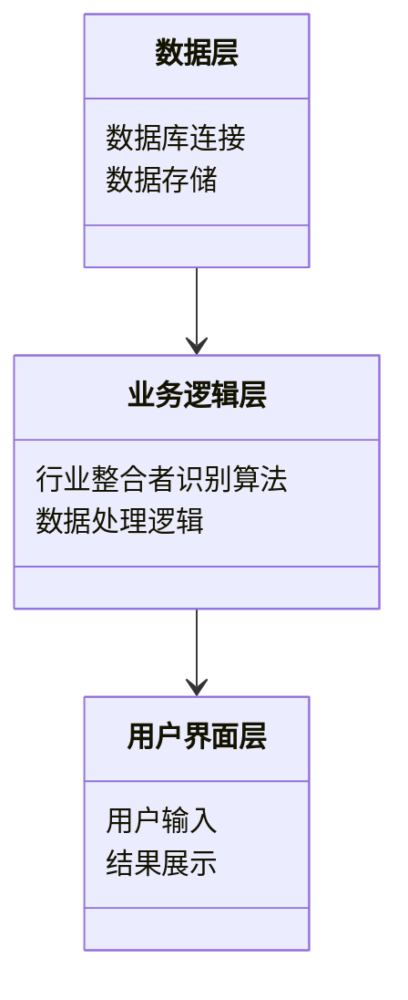
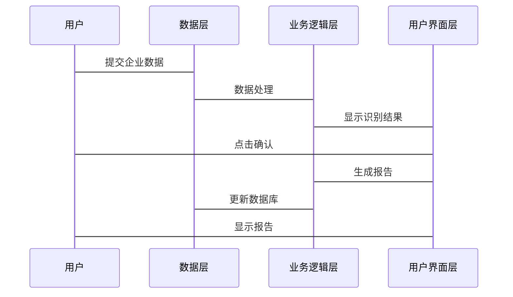

                 


# 彼得林奇的"行业整合者"识别方法

> 关键词：行业整合者，彼得·林奇，战略分析，识别方法，系统设计

> 摘要：本文将详细探讨彼得·林奇的“行业整合者”识别方法，通过系统化的分析和实际案例，帮助读者理解如何识别和利用行业整合者带来的投资机会。文章结合理论与实践，提供从背景介绍到项目实战的全面指导，涵盖核心概念、算法原理、系统设计和实际应用等内容。

---

## 第1章：行业整合者的概念与背景

### 1.1 行业整合者的定义与背景

#### 1.1.1 行业整合者的定义与核心特征

行业整合者是指在特定行业内，能够通过整合资源、优化流程、扩大市场份额等方式，显著提升行业效率和竞争力的企业或个人。其核心特征包括：

1. **市场主导地位**：行业整合者通常在行业内占据主导地位，能够影响行业规则和趋势。
2. **资源整合能力**：具备将行业内分散资源（如技术、资金、人才等）整合起来的能力。
3. **战略眼光**：能够识别行业趋势，并制定长期战略以实现整合目标。

#### 1.1.2 行业整合者的背景与重要性

随着市场竞争的加剧，行业整合成为企业发展的关键策略。彼得·林奇在其投资策略中强调，识别行业整合者是捕捉长期投资机会的重要手段。行业整合者通常能够通过整合资源，降低成本，提升效率，从而在竞争中占据优势。

#### 1.1.3 行业整合者与企业战略的关系

行业整合者不仅是市场参与者，更是行业规则的制定者。通过整合，企业可以优化内部流程，提升产品和服务质量，进而增强市场竞争力。彼得·林奇的方法为企业识别整合者提供了系统的框架，帮助企业制定有效的战略。

### 1.2 行业整合者的分类

行业整合者可以分为以下几类：

1. **横向整合者**：通过收购竞争对手或合并同类企业，扩大市场份额。
2. **纵向整合者**：整合供应链上下游资源，提升生产效率。
3. **混合整合者**：结合横向和纵向整合，实现全方位资源整合。

---

## 第2章：行业整合者的特征分析

### 2.1 行业整合者的市场地位

#### 2.1.1 市场占有率分析

市场占有率是衡量行业整合者的重要指标。通过分析企业的市场份额，可以判断其在行业中的地位和影响力。例如，一家公司如果占据了行业总销售额的40%以上，可以被认为是行业整合者。

#### 2.1.2 行业影响力评估

行业影响力包括企业在行业内的品牌影响力、技术创新能力等。一个具有影响力的整合者通常能够引领行业趋势，制定行业标准。

#### 2.1.3 竞争优势分析

竞争优势包括成本优势、技术优势、服务优势等。整合者通常在多个方面具备显著优势，使其能够在竞争中脱颖而出。

### 2.2 行业整合者的财务表现

#### 2.2.1 财务健康度评估

财务健康度是判断企业是否为整合者的重要指标。健康的财务状况能够支持企业的整合活动，如收购、投资等。

#### 2.2.2 盈利能力分析

盈利能力强的企业通常具备更多的资源和能力进行整合。通过分析净利润率、ROE等指标，可以评估企业的盈利能力。

#### 2.2.3 资产负债表分析

资产负债表反映了企业的资产、负债和所有者权益。健康的资产负债表通常意味着企业具备较强的整合能力。

---

## 第3章：行业整合者的识别方法

### 3.1 行业整合者的定性分析

#### 3.1.1 企业战略分析

分析企业的战略目标和长期规划，判断其是否具备整合的意图和能力。

#### 3.1.2 管理团队分析

管理团队的素质和经验是影响整合能力的关键因素。具备丰富经验和卓越领导能力的团队更可能成为整合者。

#### 3.1.3 行业趋势分析

分析行业的发展趋势，判断整合的可能性和时机。

### 3.2 行业整合者的定量分析

#### 3.2.1 财务指标分析

通过分析财务指标（如ROE、毛利率等）判断企业的财务健康状况和盈利能力。

#### 3.2.2 市场指标分析

市场指标包括市场份额、市场增长率等，能够反映企业在市场中的地位和影响力。

#### 3.2.3 竞争指标分析

分析企业在与竞争对手的竞争中的优势，判断其是否具备整合能力。

---

## 第4章：彼得林奇的整合者识别框架

### 4.1 彼得林奇整合者识别框架的核心要素

#### 4.1.1 行业整合者的战略定位

彼得林奇强调，整合者需要具备清晰的战略定位，能够明确自身的市场目标和整合方向。

#### 4.1.2 行业整合者的资源分配

资源分配是整合的关键。整合者需要合理分配资源，确保整合活动的顺利进行。

#### 4.1.3 行业整合者的市场反应

整合者需要能够快速响应市场变化，调整战略以适应新的市场环境。

### 4.2 彼得林奇整合者识别框架的实施步骤

#### 4.2.1 确定行业整合者的目标市场

通过市场分析，确定整合者的目标市场和潜在竞争对手。

#### 4.2.2 分析整合者的竞争优势

评估整合者的竞争优势，判断其是否具备整合的资源和能力。

#### 4.2.3 评估整合者的财务健康度

通过财务分析，判断整合者的财务状况是否支持整合活动。

---

## 第5章：整合者的战略与竞争优势

### 5.1 整合者的市场策略

#### 5.1.1 市场定位

明确企业在市场中的定位，制定相应的市场策略。

#### 5.1.2 市场推广

通过有效的市场推广，提升品牌知名度和市场影响力。

#### 5.1.3 客户关系管理

建立良好的客户关系，增强客户忠诚度和满意度。

### 5.2 整合者的竞争优势

#### 5.2.1 成本优势

通过整合供应链和优化生产流程，降低生产成本。

#### 5.2.2 技术优势

通过技术创新，提升产品和服务的竞争力。

#### 5.2.3 服务优势

提供优质的客户服务，增强客户满意度和忠诚度。

---

## 第6章：系统设计与实现

### 6.1 系统功能设计

#### 6.1.1 系统架构

系统采用分层架构，包括数据层、业务逻辑层和用户界面层。



#### 6.1.2 系统接口设计

系统提供以下接口：

1. 数据输入接口：接收企业数据和市场数据。
2. 算法调用接口：调用识别算法进行分析。
3. 结果输出接口：展示识别结果。

#### 6.1.3 系统交互流程



### 6.2 系统实现

#### 6.2.1 环境安装

安装所需的开发工具和库：

- Python 3.8+
- NumPy
- Pandas
- Scikit-learn

#### 6.2.2 核心代码实现

以下是识别算法的核心代码：

```python
import numpy as np
import pandas as pd
from sklearn.linear_model import LinearRegression

def industry_integrator识别算法(data):
    # 数据预处理
    data = data.dropna()
    X = data[['市场占有率', 'ROE', '毛利率']]
    y = data['整合潜力']
    
    # 建立线性回归模型
    model = LinearRegression()
    model.fit(X, y)
    
    # 预测整合潜力
    预测值 = model.predict(X)
    
    return 预测值

# 示例数据
data = pd.DataFrame({
    '市场占有率': [30, 40, 50, 60],
    'ROE': [15, 20, 25, 30],
    '毛利率': [25, 30, 35, 40],
    '整合潜力': [0.8, 0.9, 0.7, 0.6]
})

识别结果 = industry_integrator识别算法(data)
print("识别结果：", 识别结果)
```

### 6.3 项目实战

#### 6.3.1 实际案例分析

以某行业为例，分析某企业的整合潜力：

1. 收集企业的市场占有率、ROE、毛利率等数据。
2. 应用上述算法进行分析，得出整合潜力评分。
3. 根据评分结果，判断是否为整合者。

#### 6.3.2 代码实现与解读

通过代码实现上述算法，解读识别结果，判断企业的整合潜力。

---

## 第7章：总结与展望

### 7.1 最佳实践

- **数据准确性**：确保数据来源可靠，分析结果准确。
- **模型优化**：根据实际情况优化识别算法，提高准确性。
- **持续关注**：定期更新数据和模型，适应市场变化。

### 7.2 小结

彼得林奇的“行业整合者”识别方法为企业提供了系统化的框架和工具。通过定性与定量分析，结合实际案例，可以帮助投资者和企业管理者识别潜在的整合者，制定有效的战略。

### 7.3 注意事项

- **数据偏差**：注意数据的偏差可能影响分析结果。
- **模型局限性**：识别算法可能存在局限性，需结合实际情况进行调整。
- **市场变化**：行业整合者可能随市场变化而变化，需持续关注。

### 7.4 拓展阅读

- 彼得·林奇的其他投资策略
- 行业整合的具体案例分析
- 机器学习在行业分析中的应用

---

通过以上步骤，我们系统地介绍了彼得林奇的“行业整合者”识别方法，并结合实际案例和系统设计，帮助读者掌握识别整合者的技巧和方法。希望本文能为投资者和企业管理者提供有价值的参考。

