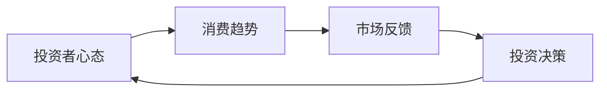
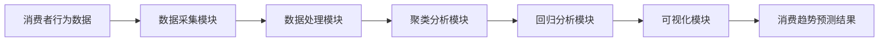
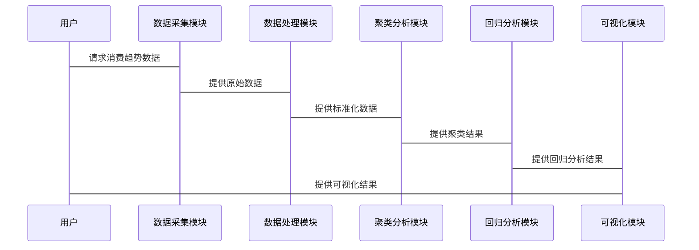

                 


# 彼得林奇的"街头智慧"在消费趋势识别中的应用

> 关键词：彼得林奇，消费趋势识别，投资策略，数据挖掘，算法模型

> 摘要：本文探讨了彼得林奇的"街头智慧"投资理念在消费趋势识别中的应用，通过分析其核心概念、算法原理、系统架构及实际案例，展示了如何将传统投资策略与现代数据分析技术结合，以实现对消费趋势的精准预测和优化决策。

---

# 第一部分: 彼得林奇的"街头智慧"概述

## 第1章: 彼得林奇的"街头智慧"概述

### 1.1 彼得林奇的"街头智慧"核心理念

#### 1.1.1 彼得林奇的投资者心态

彼得·林奇是美国著名的投资专家，以其独特的"街头智慧"投资理念闻名。他的核心思想是：**投资不是一门精确的科学，而是一门艺术，需要结合市场环境、企业基本面和投资者心态进行综合判断**。

- **逆向思维**：在市场低迷时寻找机会，在市场繁荣时保持警惕。
- **长期视角**：关注企业的长期增长潜力，而非短期波动。
- **价值投资**：寻找被市场低估的企业，长期持有，分享其成长。

#### 1.1.2 "街头智慧"的核心原则

彼得林奇的"街头智慧"主要体现在以下几个方面：

1. **关注基本面**：通过对企业财务数据的分析，判断其盈利能力、成长性和抗风险能力。
2. **关注市场情绪**：通过观察市场参与者的心理变化，捕捉市场的非理性行为。
3. **关注行业趋势**：通过分析行业的周期性变化，判断企业的成长空间。

#### 1.1.3 "街头智慧"在投资中的应用

彼得林奇的投资策略强调**"买好"而不是"好买"**。他通过对企业基本面的深入分析，结合市场情绪的判断，选择具有长期增长潜力的企业进行投资。

---

### 1.2 消费趋势识别的基本概念

#### 1.2.1 消费趋势的定义

消费趋势是指消费者在一定时期内对某种产品或服务的需求变化方向。消费趋势的识别是企业制定市场策略的重要依据，能够帮助企业预测市场需求、优化产品设计、调整营销策略。

#### 1.2.2 消费趋势的分类

消费趋势可以分为以下几类：

1. **短期趋势**：受季节性、节日性等因素影响的需求变化。
2. **中期趋势**：受经济周期、政策变化等因素影响的需求变化。
3. **长期趋势**：受技术进步、社会变迁等因素影响的需求变化。

#### 1.2.3 消费趋势识别的重要性

消费趋势识别对企业决策具有重要意义：

- **帮助企业抓住市场机会**：通过识别消费趋势，企业可以提前布局，抢占市场先机。
- **帮助企业规避市场风险**：通过识别消费趋势，企业可以避免盲目投资，降低经营风险。
- **帮助企业优化资源配置**：通过识别消费趋势，企业可以更好地配置资源，提高经营效率。

---

### 1.3 彼得林奇"街头智慧"与消费趋势识别的结合

彼得林奇的"街头智慧"投资理念与消费趋势识别有很强的关联性。两者都关注市场的变化、企业的基本面和消费者的需求，能够为企业提供全面的市场洞察。

---

## 第2章: 彼得林奇"街头智慧"与消费趋势识别的结合

### 2.1 彼得林奇"街头智慧"在消费趋势识别中的应用背景

消费趋势识别的核心在于对消费者需求的预测和分析。彼得林奇的"街头智慧"理念强调对市场环境、企业基本面和消费者心理的综合分析，这与消费趋势识别的核心方法不谋而合。

---

### 2.2 消费趋势识别的核心要素

消费趋势识别的核心要素包括：

1. **消费者行为分析**：通过数据分析，了解消费者的购买习惯、偏好和需求变化。
2. **市场环境分析**：通过对企业所处环境的分析，判断企业的成长空间和市场机会。
3. **企业基本面分析**：通过对企业财务数据的分析，判断企业的盈利能力、成长性和抗风险能力。

---

### 2.3 彼得林奇"街头智慧"与消费趋势识别的关联性

彼得林奇的"街头智慧"理念与消费趋势识别的关联性主要体现在以下几个方面：

1. **关注市场环境**：彼得林奇的"街头智慧"强调对市场环境的分析，这与消费趋势识别的核心方法一致。
2. **关注企业基本面**：彼得林奇的"街头智慧"强调对企业基本面的分析，这与消费趋势识别的核心方法一致。
3. **关注消费者心理**：彼得林奇的"街头智慧"强调对消费者心理的分析，这与消费趋势识别的核心方法一致。

---

## 第3章: 彼得林奇"街头智慧"的核心原理

### 3.1 彼得林奇投资理念的数学模型

彼得林奇的"街头智慧"投资理念可以通过以下数学模型进行描述：

$$
\text{投资价值} = \frac{\text{企业基本面}}{\text{市场情绪}}
$$

其中，企业基本面包括企业的盈利能力、成长性和抗风险能力，市场情绪包括市场的波动性、投资者的心理预期等。

---

### 3.2 消费趋势识别的算法原理

消费趋势识别的核心算法包括：

1. **聚类分析**：通过聚类算法，将消费者行为数据进行分类，识别出不同的消费群体。
2. **回归分析**：通过回归算法，分析消费者需求与市场环境之间的关系。
3. **时间序列分析**：通过时间序列算法，预测未来消费趋势的变化。

---

### 3.3 两者的结合与协同作用

彼得林奇的"街头智慧"理念与消费趋势识别算法的结合，能够实现对市场的全面分析和精准预测。通过对企业基本面、市场环境和消费者心理的综合分析，能够帮助企业更好地把握市场机会，优化资源配置，提高经营效率。

---

## 第4章: 核心概念对比与联系

### 4.1 彼得林奇"街头智慧"与消费趋势识别的对比分析

| 对比维度       | 彼得林奇"街头智慧"                     | 消费趋势识别                     |
|----------------|--------------------------------------|----------------------------------|
| 核心目标       | 投资决策                               | 市场需求预测                     |
| 分析对象       | 企业基本面、市场环境、消费者心理       | 消费者行为、市场环境、企业基本面 |
| 分析方法       | 逆向思维、长期视角、价值投资           | 数据挖掘、聚类分析、回归分析     |
| 应用场景       | 投资决策                               | 市场营销、产品设计、战略规划     |

---

### 4.2 实体关系图（ER图）与流程图（Mermaid）

#### 4.2.1 实体关系图

```mermaid
erd
    顾客
    产品
    市场
    企业
    消费趋势

    顾客 -- 购买 --> 产品
    产品 -- 归属 --> 企业
    企业 -- 受影响 --> 市场
    顾客 -- 影响 --> 消费趋势
    市场 -- 影响 --> 消费趋势
```

#### 4.2.2 流程图



---

## 第5章: 数据分析与预测算法

### 5.1 数据预处理

消费趋势识别的第一步是数据预处理，包括数据清洗、数据标准化和数据特征提取。

#### 数据清洗

- 删除重复数据
- 处理缺失值
- 删除异常值

#### 数据标准化

- 标准化处理：将数据转换为统一的尺度
- 编码处理：将分类变量转换为数值变量

#### 数据特征提取

- 通过主成分分析（PCA）提取数据的主要特征

---

### 5.2 特征提取

特征提取是消费趋势识别的关键步骤。通过特征提取，可以将复杂的数据简化为几个核心特征，便于后续分析。

---

### 5.3 聚类分析

聚类分析是一种常用的数据挖掘技术，通过将数据点分成若干个簇，识别出不同的消费群体。

#### 聚类算法实现步骤

1. 数据预处理：清洗数据、标准化数据
2. 特征提取：提取核心特征
3. 聚类算法选择：选择合适的聚类算法（如K-means）
4. 聚类结果分析：分析各簇的特征，识别出不同的消费群体

---

### 5.4 回归分析

回归分析是一种常用的统计方法，通过建立因变量和自变量之间的回归模型，分析变量之间的关系。

#### 回归分析实现步骤

1. 数据预处理：清洗数据、标准化数据
2. 特征提取：提取核心特征
3. 回归模型选择：选择合适的回归模型（如线性回归）
4. 模型训练：训练回归模型
5. 模型验证：验证模型的准确性

---

## 第6章: 算法实现与应用

### 6.1 算法实现步骤

1. 数据预处理：清洗数据、标准化数据
2. 特征提取：提取核心特征
3. 聚类算法选择：选择合适的聚类算法（如K-means）
4. 聚类结果分析：分析各簇的特征，识别出不同的消费群体
5. 回归模型选择：选择合适的回归模型（如线性回归）
6. 模型训练：训练回归模型
7. 模型验证：验证模型的准确性

---

### 6.2 代码实现

以下是一个简单的消费趋势识别代码示例：

```python
import pandas as pd
from sklearn.preprocessing import StandardScaler
from sklearn.cluster import KMeans

# 数据加载
data = pd.read_csv('consumption_trend.csv')

# 数据预处理
# 删除重复数据
data.drop_duplicates(inplace=True)
# 处理缺失值
data.dropna(inplace=True)
# 删除异常值
data = data[data['sales'] < data['sales'].quantile(0.99)]

# 数据标准化
scaler = StandardScaler()
data_scaled = scaler.fit_transform(data[['price', 'income', 'age']])

# 特征提取
from sklearn.decomposition import PCA
pca = PCA(n_components=2)
data_pca = pca.fit_transform(data_scaled)

# 聚类分析
kmeans = KMeans(n_clusters=3, random_state=42)
labels = kmeans.fit_predict(data_pca)

# 可视化
import matplotlib.pyplot as plt
plt.scatter(data_pca[:,0], data_pca[:,1], c=labels, cmap='viridis')
plt.xlabel('PC1')
plt.ylabel('PC2')
plt.title('Consumption Trend Clustering')
plt.show()
```

---

## 第7章: 系统设计与架构

### 7.1 系统功能设计

消费趋势识别系统的主要功能包括：

1. 数据采集：从数据库中采集消费者行为数据
2. 数据处理：清洗数据、标准化数据、特征提取
3. 聚类分析：识别出不同的消费群体
4. 回归分析：预测消费趋势的变化
5. 可视化分析：将分析结果可视化

---

### 7.2 系统架构设计



---

### 7.3 系统接口设计

系统接口设计包括以下几个方面：

1. 数据采集接口：从数据库中获取消费者行为数据
2. 数据处理接口：清洗数据、标准化数据、特征提取
3. 聚类分析接口：识别出不同的消费群体
4. 回归分析接口：预测消费趋势的变化
5. 可视化分析接口：将分析结果可视化

---

### 7.4 系统交互设计



---

## 第8章: 项目实战

### 8.1 环境配置

1. 安装Python
2. 安装所需的Python库（如pandas、scikit-learn、mermaid）

---

### 8.2 系统核心实现源代码

```python
import pandas as pd
from sklearn.preprocessing import StandardScaler
from sklearn.cluster import KMeans

# 数据加载
data = pd.read_csv('consumption_trend.csv')

# 数据预处理
# 删除重复数据
data.drop_duplicates(inplace=True)
# 处理缺失值
data.dropna(inplace=True)
# 删除异常值
data = data[data['sales'] < data['sales'].quantile(0.99)]

# 数据标准化
scaler = StandardScaler()
data_scaled = scaler.fit_transform(data[['price', 'income', 'age']])

# 特征提取
from sklearn.decomposition import PCA
pca = PCA(n_components=2)
data_pca = pca.fit_transform(data_scaled)

# 聚类分析
kmeans = KMeans(n_clusters=3, random_state=42)
labels = kmeans.fit_predict(data_pca)

# 可视化
import matplotlib.pyplot as plt
plt.scatter(data_pca[:,0], data_pca[:,1], c=labels, cmap='viridis')
plt.xlabel('PC1')
plt.ylabel('PC2')
plt.title('Consumption Trend Clustering')
plt.show()
```

---

### 8.3 代码应用解读与分析

上述代码实现了一个简单的消费趋势识别系统，通过聚类分析识别出不同的消费群体。代码的主要步骤包括：

1. 数据加载：从CSV文件中加载消费趋势数据
2. 数据预处理：删除重复数据、处理缺失值、删除异常值
3. 数据标准化：将数据标准化为统一尺度
4. 特征提取：通过主成分分析（PCA）提取数据的主要特征
5. 聚类分析：使用K-means算法识别出不同的消费群体
6. 可视化分析：将聚类结果可视化

---

### 8.4 实际案例分析和详细讲解剖析

以某电商平台的消费数据为例，通过聚类分析识别出不同的消费群体：

1. **价格敏感型**：消费者对价格敏感，倾向于购买低价商品
2. **收入敏感型**：消费者对收入敏感，倾向于购买高收入商品
3. **年龄敏感型**：消费者对年龄敏感，倾向于购买特定年龄段的商品

通过识别出不同的消费群体，企业可以制定针对性的营销策略，提高销售效率。

---

## 第9章: 最佳实践、小结与展望

### 9.1 最佳实践

1. **数据质量**：数据预处理是消费趋势识别的关键步骤，确保数据质量能够提高分析结果的准确性。
2. **模型选择**：选择合适的算法和模型能够提高分析结果的准确性。
3. **可视化分析**：通过可视化分析能够更好地理解数据和分析结果。

---

### 9.2 小结

本文探讨了彼得林奇的"街头智慧"投资理念在消费趋势识别中的应用，通过分析其核心概念、算法原理、系统架构及实际案例，展示了如何将传统投资策略与现代数据分析技术结合，以实现对消费趋势的精准预测和优化决策。

---

### 9.3 注意事项

1. **数据隐私**：在数据采集和处理过程中，需要注意数据隐私问题，确保数据安全。
2. **模型解释性**：在模型选择和应用过程中，需要注意模型的解释性，确保分析结果的可解释性。
3. **持续优化**：在实际应用中，需要根据市场变化和消费者需求的变化，持续优化分析模型和策略。

---

### 9.4 拓展阅读

1. 彼得·林奇的书籍《彼得·林奇的投资哲学》
2. 数据挖掘与机器学习相关的书籍和资料
3. 消费趋势识别相关的学术论文和研究报告

---

以上就是《彼得林奇的"街头智慧"在消费趋势识别中的应用》的完整目录和内容大纲。通过本文的分析，我们可以看到，彼得林奇的"街头智慧"理念与消费趋势识别技术的结合，能够为企业提供全面的市场洞察和精准的决策支持。

