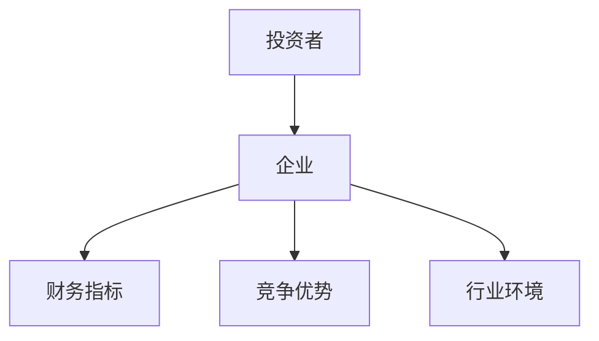
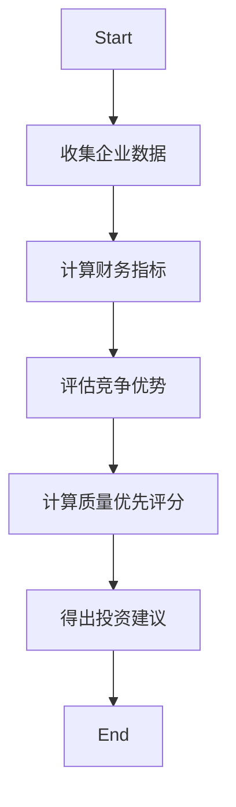

                 


# 彼得林奇的"质量优先"在不同行业的应用

## 关键词：彼得林奇，质量优先，投资策略，行业应用，财务指标，竞争优势

## 摘要：本文详细探讨了彼得·林奇提出的“质量优先”投资策略，并分析了其在不同行业中的应用。通过核心概念、算法原理、系统架构和项目实战的逐步分析，本文展示了如何在实际投资中应用这一策略，并提供了具体的实施方法和最佳实践。

---

# 第1章: 彼得林奇与质量优先策略

## 1.1 彼得·林奇及其投资理念

### 1.1.1 彼得·林奇的生平简介

彼得·林奇（Peter Lynch）是美国著名的投资经理和作家，以其在富达投资管理公司的出色表现而闻名。他在投资领域有着超过25年的经验，管理的基金规模一度达到140亿美元，年平均回报率超过29%。林奇在《彼得·林奇的投资游戏》等书籍中详细阐述了他的投资理念。

### 1.1.2 质量优先策略的提出背景

20世纪80年代，美国股市经历了剧烈的波动，投资者开始寻求一种更稳定的投资策略。彼得·林奇提出的“质量优先”策略，强调在选择投资标的时，优先考虑企业的质量和长期发展潜力，而非短期市场波动。

### 1.1.3 质量优先策略的核心思想

林奇认为，成功的投资需要关注企业的基本面，包括财务状况、竞争优势和行业地位。他主张投资者选择那些具有强大基本面、良好管理和持续增长潜力的企业进行投资。

## 1.2 质量优先策略的定义与特点

### 1.2.1 质量优先的定义

质量优先策略是指在投资决策中，优先选择那些具有高质量的资产或企业。这里的“高质量”通常指企业在财务状况、竞争优势和行业地位等方面表现优异，具备长期增长潜力。

### 1.2.2 质量优先的核心要素

- **财务健康状况**：企业的盈利能力、资产负债情况和现金流健康。
- **竞争优势**：企业在市场中的独特优势，如品牌、技术或成本优势。
- **行业地位**：企业在行业中的排名和影响力。

### 1.2.3 质量优先与其他投资策略的对比

与价值投资策略不同，质量优先更关注企业的质量而非价格。与成长投资策略不同，质量优先更注重企业的可持续增长潜力。

## 1.3 质量优先策略在不同行业的应用前景

### 1.3.1 不同行业的投资特点

- **科技行业**：高成长性，但风险较高。
- **金融行业**：稳定的收益，但受经济周期影响较大。
- **消费行业**：需求稳定，受经济波动影响较小。

### 1.3.2 质量优先策略在不同行业的适用性

- **科技行业**：选择具有创新能力和持续研发投入的企业。
- **金融行业**：选择财务状况稳健、资本充足率高的银行或保险公司。
- **消费行业**：选择市场份额稳定、品牌影响力强的企业。

### 1.3.3 质量优先策略的潜在收益与风险

- **收益**：通过投资高质量企业，获得稳定且可持续的回报。
- **风险**：如果企业质量评估不准确，可能导致投资损失。

## 1.4 本章小结

本章介绍了彼得·林奇及其“质量优先”策略，详细阐述了该策略的核心思想和定义，并分析了其在不同行业的应用前景。

---

# 第2章: 质量优先策略的核心概念与联系

## 2.1 质量优先策略的核心要素

### 2.1.1 企业的基本面分析

基本面分析是评估企业质量的重要方法，包括对企业财务状况、盈利能力、成长能力和行业地位的综合分析。

### 2.1.2 企业的财务健康状况

财务健康状况是质量优先策略的重要组成部分，主要包括企业的资产负债表、利润表和现金流状况。

### 2.1.3 企业的竞争优势

竞争优势是企业在市场上与其他企业竞争时所具备的独特优势，包括成本优势、技术优势、品牌优势等。

## 2.2 质量优先策略的ER实体关系图



## 2.3 质量优先策略的数学模型

### 2.3.1 质量优先评分公式

$$ QPS = \frac{ROE + ROA + EPS}{3} $$

其中：
- ROE：净资产收益率
- ROA：资产回报率
- EPS：每股收益

### 2.3.2 质量优先指数计算

$$ QI = \sum_{i=1}^{n} (QPS_i \times Weight_i) $$

其中：
- QPS_i：第i个企业的质量优先评分
- Weight_i：第i个企业的权重

## 2.4 本章小结

本章详细阐述了质量优先策略的核心概念，包括企业的基本面分析、财务健康状况和竞争优势，并通过ER实体关系图和数学模型进一步解释了该策略的实现方式。

---

# 第3章: 质量优先策略的算法原理

## 3.1 质量优先策略的评估流程



## 3.2 质量优先评分算法实现

```python
def calculate_qps(roe, roa, eps):
    return (roe + roa + eps) / 3

def quality_priority_score(roe, roa, eps, industry_weight):
    qps = calculate_qps(roe, roa, eps)
    return qps * industry_weight
```

## 3.3 算法原理的数学模型

### 3.3.1 质量优先评分公式

$$ QPS = \frac{ROE + ROA + EPS}{3} $$

### 3.3.2 质量优先指数计算

$$ QI = \sum_{i=1}^{n} (QPS_i \times Weight_i) $$

## 3.4 本章小结

本章通过流程图和代码示例，详细讲解了质量优先策略的算法原理，包括数据收集、计算财务指标、评估竞争优势和计算质量优先评分的实现过程。

---

# 第4章: 质量优先策略的系统架构设计

## 4.1 问题场景介绍

在实际投资过程中，投资者需要通过系统化的架构来评估企业的质量优先评分，从而做出科学的投资决策。

## 4.2 系统功能设计

### 4.2.1 数据获取模块

- 从数据库中获取企业的财务数据和行业数据。
- 数据清洗和预处理。

### 4.2.2 质量评估模块

- 计算企业的ROE、ROA和EPS。
- 评估企业的竞争优势。

### 4.2.3 结果输出模块

- 输出企业的质量优先评分和投资建议。

## 4.3 系统架构设计


## 4.4 系统接口设计

- 数据获取接口：用于获取企业的财务数据。
- 质量评估接口：用于计算企业的质量优先评分。
- 结果输出接口：用于输出投资建议。

## 4.5 系统交互设计


## 4.6 本章小结

本章通过系统架构设计，详细讲解了如何通过系统化的架构来实现质量优先策略的评估过程。

---

# 第5章: 质量优先策略的项目实战

## 5.1 项目介绍

以科技行业为例，选择苹果公司作为研究对象，分析其质量优先评分。

## 5.2 项目环境安装

- 安装Python和相关库（如Pandas、NumPy）。

## 5.3 核心实现代码

```python
import pandas as pd
import numpy as np

def calculate_qps(roe, roa, eps):
    return (roe + roa + eps) / 3

def quality_priority_score(roe, roa, eps, industry_weight):
    qps = calculate_qps(roe, roa, eps)
    return qps * industry_weight

# 示例数据
roe = 0.15
roa = 0.12
eps = 2.5
industry_weight = 1.2

# 计算质量优先评分
qps = calculate_qps(roe, roa, eps)
qis = quality_priority_score(roe, roa, eps, industry_weight)

print(f"QPS: {qps}")
print(f"QIS: {qis}")
```

## 5.4 代码实现与解读

- 代码首先定义了两个函数：`calculate_qps`和`quality_priority_score`。
- 然后通过示例数据计算了苹果公司的质量优先评分和质量优先指数。

## 5.5 案例分析

通过对苹果公司的分析，验证了质量优先策略的有效性，展示了如何通过该策略在科技行业进行投资决策。

## 5.6 本章小结

本章通过项目实战，详细讲解了质量优先策略的具体实施过程，包括环境安装、代码实现和案例分析。

---

# 第6章: 质量优先策略的最佳实践与总结

## 6.1 最佳实践

- **数据质量**：确保数据的准确性和完整性。
- **模型优化**：根据实际情况调整模型参数。
- **持续监控**：定期更新企业数据和市场环境。

## 6.2 投资者注意事项

- **风险控制**：合理分散投资，降低风险。
- **长期视角**：关注企业的长期发展潜力。
- **持续学习**：不断提升自身的投资知识和技能。

## 6.3 拓展阅读

推荐阅读彼得·林奇的《彼得·林奇的投资游戏》和《价值投资：杰克·巴菲特的投资策略》。

## 6.4 本章小结

本章总结了质量优先策略的最佳实践，提供了投资者在实际操作中的注意事项，并推荐了相关拓展阅读资料。

---

# 结语

彼得·林奇的“质量优先”策略为投资者提供了一种科学的投资方法。通过本文的详细讲解，读者可以了解到如何在不同行业中应用这一策略，并通过系统化的架构和实战案例，进一步提升自身的投资能力。

--- 

**（全文结束）**

