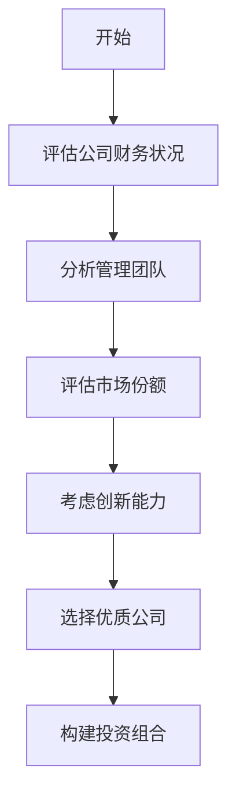
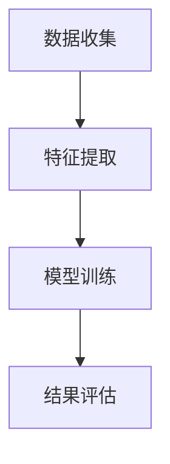

                 


# 彼得林奇的"质量优先"在周期性行业的应用

> 关键词：彼得林奇，质量优先，周期性行业，投资策略，风险管理

> 摘要：本文探讨了彼得·林奇的“质量优先”投资策略在周期性行业中的应用，分析了周期性行业的特点，提出了如何通过质量优先策略选择优质公司，并通过数学模型和实际案例展示了策略的具体实施方法。

---

## 第1章: 引言

### 1.1 周期性行业的特点与投资挑战
周期性行业是指需求受经济波动影响较大的行业，如能源、材料、汽车制造等。这些行业的特点是收入和利润随经济周期波动较大，投资这类行业需要考虑宏观经济环境的变化。投资周期性行业的主要挑战在于预测经济周期的波动，并选择能够在波动中保持稳定表现的公司。

### 1.2 彼得·林奇的“质量优先”策略
彼得·林奇是著名投资专家，他的“质量优先”策略强调投资于具有强大基本面和管理团队的公司。这种策略注重公司的财务状况、盈利能力、管理团队稳定性等因素，旨在选择能够在长期为投资者带来稳定回报的公司。

### 1.3 质量优先策略在周期性行业的应用
本文探讨如何将“质量优先”策略应用于周期性行业，通过分析公司的财务状况、管理团队、市场份额等因素，选择能够在经济波动中保持稳健的公司，从而为投资者带来稳定回报。

---

## 第2章: 周期性行业的分析框架

### 2.1 周期性行业的核心指标
周期性行业公司的核心指标包括市盈率（P/E）、市净率（P/B）、股东权益回报率（ROE）等。这些指标可以帮助投资者评估公司的估值和盈利能力。

#### 对比表格：周期性行业与非周期性行业的核心指标对比
| 指标       | 周期性行业 | 非周期性行业 |
|------------|------------|--------------|
| 市盈率（P/E）| 高波动性    | 较低波动性   |
| 市净率（P/B）| 受行业影响   | 较稳定       |
| ROE         | 波动性较大   | 较稳定       |

### 2.2 质量优先策略的核心要素
质量优先策略的核心要素包括公司财务状况、管理团队、市场份额、创新能力等。这些要素在周期性行业中尤为重要，因为它们决定了公司在经济波动中的抗压能力。

#### ER实体关系图：质量优先策略的核心要素
```mermaid
er
  company
  has_company_info(company_id, name, industry)
  company_manager(company_id, manager_name, experience)
  company_financial(company_id, revenue, profit, debt)
  company_market_share(company_id, market_share, growth_rate)
  company_innovation(company_id, innovation_score, patent_count)
```

### 2.3 周期性行业的波动模型
周期性行业的波动可以用数学模型来描述。通过分析历史数据，可以预测未来经济周期对公司的影响。

#### 数学模型：周期性行业的波动预测
$$
\text{波动幅度} = \frac{\text{历史波动标准差} \times \text{宏观经济指数}}{1 + \text{行业风险系数}}
$$

---

## 第3章: 质量优先策略的实施步骤

### 3.1 确定投资目标
投资目标包括投资期限、风险承受能力、收益目标等。在周期性行业中，需要考虑宏观经济环境的变化对投资目标的影响。

### 3.2 筛选优质公司
根据质量优先策略的核心要素，筛选具有强大财务状况、管理团队和市场份额的公司。

#### 筛选步骤：
1. 评估公司的财务状况，包括收入、利润、债务等。
2. 分析管理团队的经验和稳定性。
3. 评估公司的市场份额和增长潜力。
4. 考虑公司的创新能力。

### 3.3 构建投资组合
根据筛选出的优质公司，构建投资组合，分散风险。

#### 投资组合构建流程图：


### 3.4 动态调整投资组合
根据经济周期的变化和公司情况，动态调整投资组合，优化收益和风险。

---

## 第4章: 数学模型与算法原理

### 4.1 质量优先策略的数学模型
质量优先策略的核心是选择具有强大基本面的公司。可以通过以下公式评估公司的质量：
$$
\text{质量评分} = \frac{\text{收入增长率} + \text{利润增长率} + \text{ROE}}{3}
$$

### 4.2 算法原理
质量优先策略的算法包括数据收集、特征提取、模型训练和结果评估。

#### 算法流程图：


---

## 第5章: 案例分析

### 5.1 案例背景
假设当前经济处于衰退期，选择投资能源行业。目标是选择一家在经济衰退期间表现稳定的能源公司。

### 5.2 公司筛选
通过质量优先策略筛选出两家公司：A公司和B公司。

#### 对比表格：
| 指标       | A公司    | B公司    |
|------------|----------|----------|
| 市盈率（P/E）| 15       | 30       |
| 市净率（P/B）| 2        | 3        |
| ROE         | 10%      | 5%       |
| 管理团队     | 经验丰富  | 经验一般  |
| 市场份额     | 20%      | 15%      |
| 创新能力    | 高       | 中       |

### 5.3 投资决策
根据质量优先策略，选择A公司进行投资，因为其财务状况、管理团队和市场份额均优于B公司。

### 5.4 投资结果
在经济衰退期间，A公司表现稳定，股价保持平稳，而B公司由于管理团队不稳定，股价下跌。

---

## 第6章: 风险管理与投资组合优化

### 6.1 风险管理策略
在周期性行业中，风险管理尤为重要。可以通过分散投资、设置止损点、定期评估投资组合等方式降低风险。

### 6.2 投资组合优化
根据市场变化和公司情况，动态调整投资组合，优化收益和风险。

#### 优化步骤：
1. 定期评估投资组合的收益和风险。
2. 根据宏观经济环境调整投资比例。
3. 考虑市场的波动性和公司的基本面变化。

---

## 第7章: 总结与展望

### 7.1 总结
本文探讨了彼得·林奇的“质量优先”策略在周期性行业中的应用，分析了周期性行业的特点和投资挑战，提出了实施质量优先策略的步骤和方法。

### 7.2 展望
未来，随着经济全球化和科技的发展，周期性行业的投资策略也将不断创新。质量优先策略将更加注重公司的可持续发展能力和创新能力，为投资者提供更稳定的回报。

---

## 第8章: 最佳实践与注意事项

### 8.1 最佳实践
1. 在选择周期性行业公司时，注重公司的财务状况、管理团队和市场份额。
2. 定期评估投资组合，根据市场变化进行调整。
3. 分散投资，降低风险。

### 8.2 注意事项
1. 周期性行业的波动较大，投资者需具备一定的风险承受能力。
2. 在选择公司时，需结合宏观经济环境和行业趋势进行综合分析。

---

## 参考文献
1. 彼得·林奇著. 《彼得林奇的投资艺术》
2. 哈佛商学院. 《周期性行业的投资策略》
3. 美国投资协会. 《质量优先策略的实施指南》

