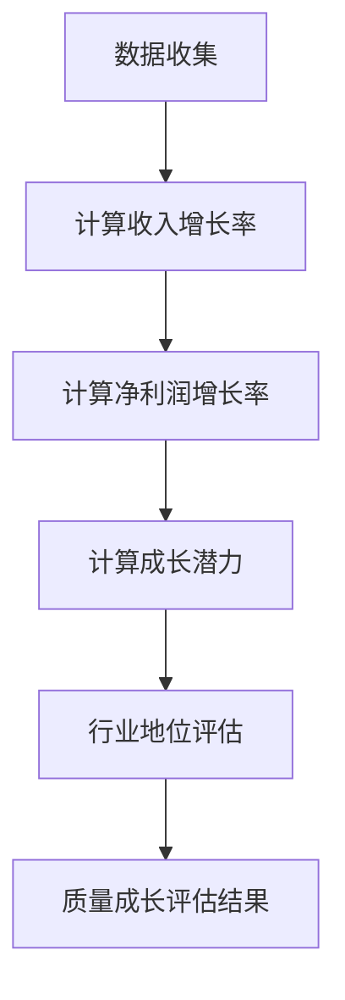
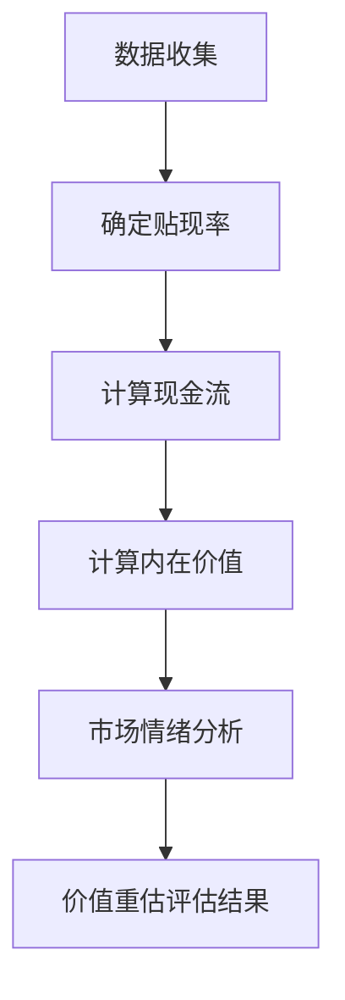
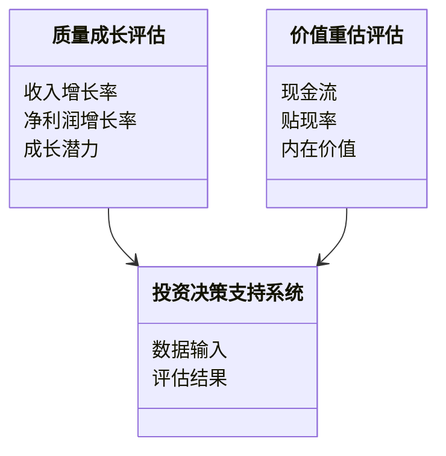
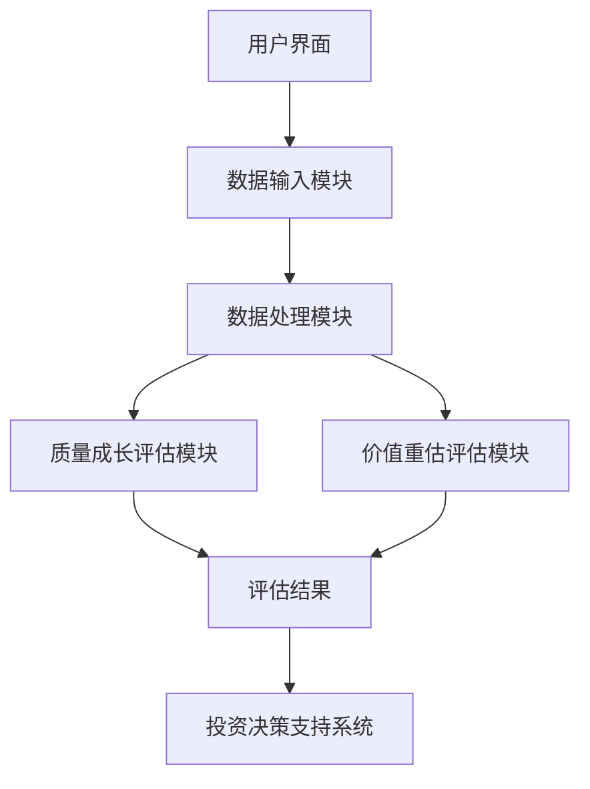

                 


# 彼得林奇的"质量成长"vs"价值重估"在不同行业的应用

## 关键词：彼得林奇、质量成长、价值重估、投资策略、行业分析、应用案例

## 摘要：  
本文探讨了彼得·林奇提出的“质量成长”和“价值重估”两种投资策略在不同行业中的应用。通过分析这两种策略的核心概念、数学模型和实际案例，本文揭示了它们在科技、医疗、金融等行业的适用性，并通过Python代码示例和系统架构图展示了如何将这些策略应用于实际投资决策中。

---

# 第一部分: 彼得林奇投资理念的背景与核心概念

## 第1章: 彼得林奇投资理念概述

### 1.1 彼得林奇的投资理念

彼得·林奇是全球著名投资经理，以其在富达基金的卓越表现闻名。他的投资理念基于两个核心策略：**质量成长**和**价值重估**。

#### 1.1.1 质量成长的定义与核心思想

质量成长策略关注那些具备持续增长潜力、强大护城河和良好财务健康状况的公司。这种策略强调企业的内在质量和成长能力，而非仅仅依赖市场波动获利。

#### 1.1.2 价值重估的定义与核心思想

价值重估策略则寻找市场价格低于其内在价值的企业，通常出现在市场情绪低落或企业短期困境时。这种策略依赖于对企业内在价值的准确评估和对市场偏差的识别。

#### 1.1.3 两种策略的对比

| **策略**       | **关注点**                     | **适用场景**                     |
|----------------|-------------------------------|---------------------------------|
| 质量成长       | 长期增长潜力、财务健康、行业地位 | 市场稳步增长、行业龙头公司       |
| 价值重估       | 内在价值低估、市场情绪偏差     | 市场低迷、企业短期困境           |

### 1.2 质量成长与价值重估的核心要素

#### 1.2.1 质量成长的核心要素

- **企业核心竞争力**：收入和利润的持续增长。
- **行业地位**：市场占有率高，竞争壁垒强。
- **财务健康状况**：低负债率，高ROE（净资产收益率）。

#### 1.2.2 价值重估的核心要素

- **内在价值评估**：通过DCF（现金流折现法）等方法计算企业的真实价值。
- **市场情绪与估值偏差**：识别市场过度悲观或乐观的情况。
- **企业困境与转机**：寻找困境中的企业并判断其能否扭亏为盈。

---

# 第二部分: 质量成长与价值重估的数学模型与算法原理

## 第2章: 质量成长的数学模型

### 2.1 质量成长的评估公式

质量成长的评估公式综合考虑了企业的收入增长率、净利润增长率和行业地位。

$$ 成长潜力 = \frac{收入增长率 + 净利润增长率}{2} $$

其中，收入增长率和净利润增长率可以通过企业的财务报表获取。

### 2.2 质量成长的算法步骤

1. 数据收集：收集目标企业的财务数据（收入、利润）。
2. 计算增长率：计算收入增长率和净利润增长率。
3. 计算成长潜力：使用上述公式计算。
4. 行业地位评估：分析企业在行业中的排名和市场份额。



---

## 第3章: 价值重估的数学模型

### 3.1 价值重估的评估公式

价值重估的核心是通过DCF模型计算企业的内在价值。公式如下：

$$ 内在价值 = \frac{现金流}{贴现率} $$

其中，贴现率通常基于企业的风险水平和市场利率确定。

### 3.2 价值重估的算法步骤

1. 数据收集：收集目标企业的现金流数据。
2. 确定贴现率：根据企业风险和市场利率确定贴现率。
3. 计算内在价值：使用DCF模型计算企业的内在价值。
4. 市场情绪分析：判断市场是否低估了企业价值。



---

# 第三部分: 不同行业的应用案例分析

## 第4章: 科技行业的应用

### 4.1 质量成长策略在科技行业的应用

以苹果（AAPL）为例，苹果具备强大的核心竞争力和高市场份额，适合质量成长策略。

$$ 成长潜力 = \frac{15\% + 20\%}{2} = 17.5\% $$

### 4.2 价值重估策略在科技行业的应用

以东芝为例，当市场低估其存储业务的价值时，价值重估策略可以识别其潜在价值。

---

## 第5章: 医疗行业的应用

### 5.1 质量成长策略在医疗行业的应用

以强生（JNJ）为例，强生具备稳定的收入和利润增长，适合质量成长策略。

$$ 成长潜力 = \frac{8\% + 10\%}{2} = 9\% $$

### 5.2 价值重估策略在医疗行业的应用

以辉瑞（PFE）为例，当市场因行业低迷而低估其股价时，价值重估策略可以识别其潜在价值。

---

## 第6章: 金融行业的应用

### 6.1 质量成长策略在金融行业的应用

以摩根大通（JPM）为例，摩根大通具备强大的行业地位和财务健康状况，适合质量成长策略。

$$ 成长潜力 = \frac{6\% + 8\%}{2} = 7\% $$

### 6.2 价值重估策略在金融行业的应用

以花旗集团（C）为例，当市场因金融危机而低估其股价时，价值重估策略可以识别其潜在价值。

---

# 第四部分: 投资决策支持系统的系统分析

## 第7章: 系统功能设计

### 7.1 领域模型设计



### 7.2 系统架构设计



### 7.3 系统接口设计

- 数据输入接口：接收企业的财务数据和市场数据。
- 评估结果接口：输出质量成长和价值重估的评估结果。

---

# 第五部分: 项目实战与代码实现

## 第8章: 项目实战

### 8.1 项目背景

本文将通过一个实际案例，展示如何使用质量成长和价值重估策略进行投资决策。

### 8.2 核心代码实现

```python
# 质量成长评估代码
def calculate_growth_potential(revenue_growth, net_profit_growth):
    return (revenue_growth + net_profit_growth) / 2

# 价值重估评估代码
def calculate_intrinsic_value(cash_flow, discount_rate):
    return cash_flow / discount_rate
```

### 8.3 案例分析

以苹果和强生为例，计算质量成长潜力；以东芝和花旗为例，计算价值重估的内在价值。

---

# 第六部分: 总结与展望

## 第9章: 总结

### 9.1 最佳实践

- **质量成长策略**适合长期增长稳定的行业龙头公司。
- **价值重估策略**适合市场低估的困境企业。

### 9.2 小结

质量成长和价值重估是两种互补的投资策略，分别适用于不同市场环境和行业特点。投资者可以根据市场情况和企业特点选择合适的策略。

### 9.3 注意事项

- 投资者需要具备行业分析能力和财务分析能力。
- 需要结合市场环境和企业基本面进行综合判断。

### 9.4 拓展阅读

建议读者进一步阅读彼得·林奇的《彼得·林奇的投资哲学》和《股票投资策略》等书籍，深入理解这两种策略的应用。

---

通过本文的分析，读者可以更好地理解彼得·林奇的“质量成长”和“价值重估”策略在不同行业中的应用，并在实际投资中灵活运用这些策略。

