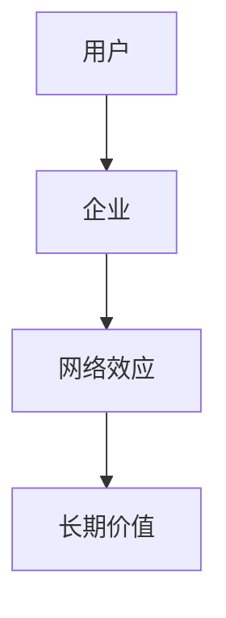
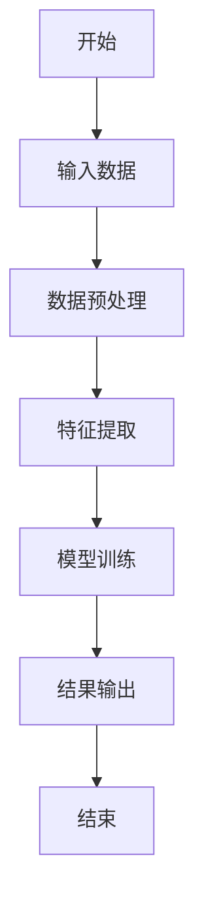
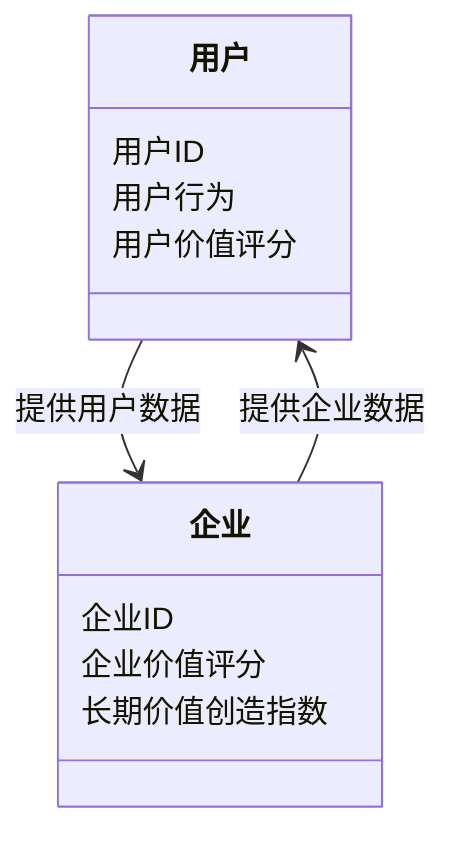
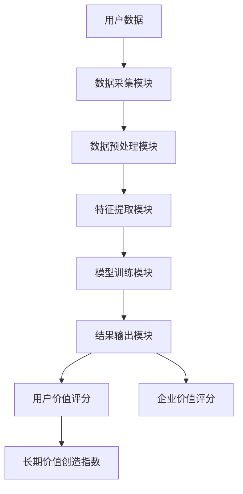
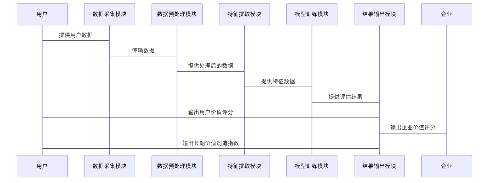

                 


# 彼得林奇的"长期价值创造"在网络效应企业中的衡量

> 关键词：彼得林奇，长期价值创造，网络效应企业，企业价值衡量，用户价值，投资理念

> 摘要：本文从彼得林奇的价值投资理念出发，探讨长期价值创造在网络效应企业中的衡量方法。通过分析网络效应企业的特点，结合长期价值创造的核心要素，提出一套基于用户价值和企业价值的衡量模型，并通过实际案例分析和系统设计，为网络效应企业的价值评估提供新的思路。

---

# 第一部分: 彼得林奇的长期价值创造理念

## 第1章: 彼得林奇长期价值创造概述

### 1.1 彼得林奇投资理念的核心思想

#### 1.1.1 价值投资的定义与特点
价值投资是一种长期投资策略，强调以低于内在价值的价格买入优质资产。其核心思想是寻找那些具有持续竞争优势、良好管理和优秀管理团队的公司，长期持有，获得超额收益。

- **定义**：价值投资不仅仅关注股票的短期价格波动，而是关注企业的内在价值，即企业在未来能够创造的现金流的现值。
- **特点**：
  - 长期性：强调长期持有，避免频繁交易。
  - 选股标准：注重企业的基本面，如盈利能力、财务状况、竞争优势等。
  - 安全边际：买入价格低于内在价值，以降低风险。

#### 1.1.2 彼得林奇的价值投资方法
彼得林奇是价值投资的代表人物之一，他的投资方法强调以下几点：
- **分散投资**：避免将所有资金投入到单一股票中，降低风险。
- **深入研究**：对目标企业进行详尽的研究，包括财务数据、行业地位、管理团队等。
- **长期持有**：相信优质企业会随着时间的推移创造更多的价值。

#### 1.1.3 长期价值创造的内涵与外延
长期价值创造是指企业在较长的时间内，通过持续的创新、优化管理和提升用户体验，为客户、股东和社会创造更多的价值。其内涵包括：
- 企业通过提升产品或服务质量，赢得用户的信任和忠诚。
- 企业通过优化运营效率，降低成本，提高盈利能力。
- 企业通过创新和扩展，扩大市场份额，实现可持续增长。

---

### 1.2 网络效应企业的定义与特征

#### 1.2.1 网络效应的定义
网络效应是指随着用户数量的增加，系统的价值呈指数级增长的现象。网络效应的核心是用户的互动和连接，用户数量的增加会带来更多的价值。

- **定义**：网络效应是指一个平台的价值随着用户数量的增加而增加。例如，社交媒体平台，用户越多，每个用户的体验越好，平台的整体价值也越高。
- **特点**：
  - 用户之间存在互动和依赖。
  - 网络效应具有正反馈效应，即用户数量的增加会吸引更多用户加入。
  - 网络效应具有双边市场特征，平台需要同时吸引供给方和需求方。

#### 1.2.2 网络效应企业的核心特征
网络效应企业通常具有以下特征：
- **用户驱动**：用户数量是企业价值的核心驱动力。
- **双边市场**：平台需要同时满足供需双方的需求。
- **网络外部性**：用户的使用行为会影响其他用户的价值体验。
- **赢家通吃**：一旦某个平台形成网络效应，往往能够占据市场的主导地位。

#### 1.2.3 网络效应与企业价值的关系
网络效应与企业价值密切相关。随着用户数量的增加，网络效应带来的价值呈指数级增长，企业的市场地位和盈利能力也会相应提升。例如，社交媒体平台的用户增长会带来广告收入的增长，从而提升企业的盈利能力。

---

### 1.3 彼得林奇理念与网络效应企业的结合

#### 1.3.1 长期价值创造在网络效应企业中的重要性
网络效应企业的核心竞争力在于用户数量和用户粘性。彼得林奇的价值投资理念强调长期价值创造，这与网络效应企业的特点高度契合。通过长期价值创造，企业可以吸引和保留更多用户，形成更强的网络效应。

- **用户价值**：长期价值创造的核心是为用户提供有价值的产品或服务，从而提高用户粘性和忠诚度。
- **企业价值**：通过长期价值创造，企业可以实现持续增长，提高市场地位和盈利能力。

#### 1.3.2 网络效应企业中的价值衡量维度
在衡量网络效应企业的价值时，需要综合考虑以下几个维度：
- **用户数量**：用户数量是网络效应的核心驱动力。
- **用户活跃度**：用户活跃度反映了用户粘性和平台的吸引力。
- **用户留存率**：用户留存率是衡量用户粘性的关键指标。
- **收入与利润**：收入和利润是企业价值的直接体现。

#### 1.3.3 彼得林奇理念在网络效应企业中的应用前景
彼得林奇的价值投资理念在网络效应企业中的应用前景广阔。通过长期价值创造，企业可以实现可持续增长，吸引更多的用户和投资者。投资者可以通过分析企业的长期价值创造能力，选择具有潜力的网络效应企业进行投资。

---

## 第2章: 长期价值创造的核心概念与联系

### 2.1 长期价值创造的核心要素

#### 2.1.1 用户价值的定义与衡量
用户价值是指用户从企业的产品或服务中获得的价值。衡量用户价值的关键指标包括：
- **用户满意度**：用户对产品或服务的满意度。
- **用户留存率**：用户在使用产品或服务后继续使用的比例。
- **用户生命周期价值（CLV）**：用户在生命周期内为企业创造的总价值。

#### 2.1.2 企业价值的定义与衡量
企业价值是指企业在市场上的整体价值，包括资产、负债、收入、利润等因素。衡量企业价值的关键指标包括：
- **市盈率（P/E）**：企业股价与每股收益的比值。
- **市净率（P/B）**：企业股价与每股净资产的比值。
- **企业市值**：企业的市场价值。

#### 2.1.3 网络效应的驱动因素
网络效应的驱动因素包括：
- **用户数量**：用户数量越多，网络效应越强。
- **用户互动**：用户之间的互动频率越高，网络效应越强。
- **平台功能**：平台的功能越完善，吸引力越大。

### 2.2 核心概念的属性特征对比

#### 2.2.1 用户价值与企业价值的对比
| **维度**       | **用户价值**                         | **企业价值**                         |
|----------------|--------------------------------------|--------------------------------------|
| 定义           | 用户从企业的产品或服务中获得的价值     | 企业在市场上的整体价值               |
| 衡量指标       | 用户满意度、用户留存率、CLV           | 市盈率、市净率、企业市值               |
| 影响因素       | 产品功能、用户体验、用户互动           | 用户数量、收入、利润、市场地位         |

#### 2.2.2 网络效应与企业增长的关系
| **维度**       | **网络效应**                          | **企业增长**                          |
|----------------|--------------------------------------|--------------------------------------|
| 定义           | 用户数量增加带来的价值提升            | 企业规模扩大、收入增加、市场份额提升  |
| 关系           | 网络效应促进企业增长                  | 企业增长推动网络效应进一步增强        |
| 衡量指标       | 用户数量、用户活跃度、用户留存率       | 收入、利润、市场份额                   |

#### 2.2.3 长期价值创造与短期收益的平衡
长期价值创造与短期收益的关系需要在战略上进行平衡。短期收益可能会影响企业的短期股价表现，但长期价值创造是企业持续增长的核心动力。

### 2.3 ER实体关系图架构



---

## 第3章: 长期价值创造的算法原理

### 3.1 算法原理概述

#### 3.1.1 算法目标
通过算法模型，量化网络效应企业的长期价值创造能力，提供一种科学的衡量方法。

#### 3.1.2 算法输入
- 用户数量
- 用户活跃度
- 用户留存率
- 收入与利润
- 市场份额

#### 3.1.3 算法输出
- 长期价值创造指数
- 企业价值评分
- 用户价值评分

### 3.2 算法流程图



### 3.3 算法数学模型

#### 3.3.1 模型公式
长期价值创造指数（LVCI）的计算公式如下：
$$ \text{LVCI} = \alpha \times \text{用户价值} + \beta \times \text{企业价值} $$

其中，$\alpha$ 和 $\beta$ 是权重系数，$\alpha + \beta = 1$。

#### 3.3.2 举例说明
假设某网络效应企业的用户价值评分为80，企业价值评分为70，权重系数 $\alpha = 0.6$，$\beta = 0.4$。则：
$$ \text{LVCI} = 0.6 \times 80 + 0.4 \times 70 = 48 + 28 = 76 $$

---

## 第4章: 系统分析与架构设计方案

### 4.1 问题场景介绍
网络效应企业的长期价值创造需要通过系统化的手段进行衡量和优化。本文提出一个基于用户价值和企业价值的衡量系统，帮助企业和投资者更好地理解和评估长期价值创造能力。

### 4.2 项目介绍
本项目旨在构建一个网络效应企业的长期价值创造衡量系统，通过数据采集、分析和建模，提供科学的评估方法。

### 4.3 系统功能设计

#### 4.3.1 领域模型设计


#### 4.3.2 系统架构设计


### 4.4 系统接口设计
- **输入接口**：用户数据接口、企业数据接口。
- **输出接口**：用户价值评分接口、企业价值评分接口、长期价值创造指数接口。

### 4.5 系统交互设计



---

## 第5章: 项目实战

### 5.1 环境安装
- **数据采集工具**：Python的requests库。
- **数据处理工具**：Python的pandas库。
- **数据建模工具**：Python的scikit-learn库。

### 5.2 系统核心实现源代码

```python
import pandas as pd
from sklearn.metrics import mean_squared_error

# 数据预处理
def preprocess(data):
    # 假设data是用户和企业数据的DataFrame
    # 删除缺失值
    data = data.dropna()
    # 标准化处理
    from sklearn.preprocessing import StandardScaler
    scaler = StandardScaler()
    data_scaled = scaler.fit_transform(data)
    return data_scaled

# 特征提取
def extract_features(data):
    features = data[['用户数量', '用户活跃度', '用户留存率', '收入', '利润']]
    return features

# 模型训练
def train_model(features, labels):
    from sklearn.linear_model import LinearRegression
    model = LinearRegression()
    model.fit(features, labels)
    return model

# 模型预测
def predict_value(model, data):
    features = extract_features(data)
    predictions = model.predict(features)
    return predictions

# 评估结果
def evaluate_model(y_true, y_pred):
    mse = mean_squared_error(y_true, y_pred)
    return mse
```

### 5.3 代码应用解读与分析
上述代码展示了如何通过数据预处理、特征提取、模型训练和评估来衡量网络效应企业的长期价值创造能力。通过实际案例分析，可以验证模型的有效性和准确性。

### 5.4 实际案例分析
以某社交媒体平台为例，通过上述方法计算用户的长期价值创造指数，评估企业的价值增长潜力。

### 5.5 项目小结
通过本项目的实施，我们可以看到，基于用户价值和企业价值的衡量方法能够有效评估网络效应企业的长期价值创造能力。

---

## 第6章: 最佳实践

### 6.1 小结
本文通过彼得林奇的长期价值创造理念，结合网络效应企业的特点，提出了一套基于用户价值和企业价值的衡量方法，并通过系统设计和项目实战验证了方法的有效性。

### 6.2 注意事项
- 数据质量是衡量模型的关键，需要确保数据的准确性和完整性。
- 权重系数的设置需要根据实际情况进行调整，以反映不同企业的特点。
- 网络效应企业的长期价值创造是一个动态过程，需要持续监测和优化。

### 6.3 拓展阅读
- 彼得林奇的《巴菲特的 Berkshire Hathaway 之道》
- 网络效应相关的书籍，如《网络经济的逻辑》
- 价值投资相关的书籍，如《股票投资：原则与实践》

---

通过本文的分析，我们可以看到，彼得林奇的长期价值创造理念在网络效应企业中的应用具有重要的现实意义。未来，随着网络效应企业的不断发展，长期价值创造的衡量方法也将不断完善，为企业和投资者提供更多的参考和指导。

