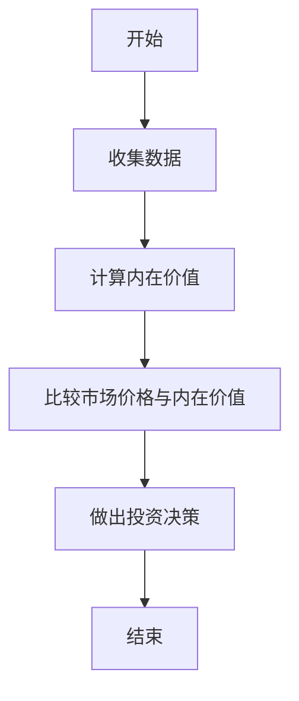
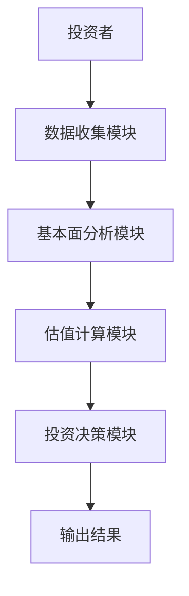

                 


# 彼得林奇的"长期价值创造"投资理念

## 关键词：彼得林奇，长期价值创造，投资理念，价值投资，系统架构，算法原理

## 摘要：本文深入探讨了彼得林奇的“长期价值创造”投资理念，分析了其核心概念、算法原理、系统架构以及实际应用。通过详细讲解投资理念的背景、核心要素、数学模型和系统设计，结合实际案例，为读者提供全面的理解和实践指导。

---

## 第一部分：背景介绍

### 第1章：彼得林奇与长期价值创造概述

#### 1.1 彼得林奇的生平与投资理念的形成
- **1.1.1 彼得林奇的早期经历**
  彼得·林奇（Peter Lynch）于1942年9月16日出生于美国波士顿，曾就读于波士顿学院和波士顿大学。他的父亲也是一位投资专家，这使他对投资产生了浓厚的兴趣。林奇在大学期间积极参与投资活动，并在毕业后加入富达投资（Fidelity Investments），开始了他的投资生涯。

- **1.1.2 彼得林奇的投资哲学**
  林奇的投资理念以价值投资为核心，强调长期持有优质股票，避免短期市场波动的干扰。他认为，成功的投资不仅仅是选择好的股票，更是选择一个好的公司，并在市场低估时买入，高估时卖出。

- **1.1.3 彼得林奇在投资领域的影响力**
  林奇是麦哲伦基金（Fidelity Magellan Fund）的经理，该基金在他的管理下取得了卓越的业绩，年平均回报率达到29%，远超市场平均水平。他的投资理念被广泛认可，并写有多本书籍，如《彼得林奇的成功投资》和《选股的艺术》。

#### 1.2 长期价值创造的定义与核心要素
- **1.2.1 价值投资的定义**
  价值投资是一种以低于内在价值的价格买入优质股票的投资策略。林奇认为，内在价值是公司未来现金流的现值，只有在市场低估时买入，才能实现长期的价值增长。

- **1.2.2 长期价值创造的核心要素**
  - **公司基本面**：包括收入、利润、资产负债表等财务指标。
  - **行业地位**：公司是否是行业领导者，是否有竞争优势。
  - **管理团队**：管理团队的能力和战略规划。
  - **估值**：股价是否低于内在价值。
  - **长期增长潜力**：公司未来是否具备持续增长的能力。

- **1.2.3 长期价值创造的边界与外延**
  长期价值创造不仅仅局限于股票投资，还包括对公司整体价值的评估和优化。林奇认为，投资者应关注公司的长期发展，而非短期收益。

#### 1.3 彼得林奇投资理念的背景与问题背景
- **1.3.1 投资领域的主要问题**
  短期市场波动、信息不对称、投资者情绪波动等都可能导致投资决策的失误。

- **1.3.2 传统投资理念的局限性**
  传统投资理念往往关注短期收益和市场波动，忽视了公司的长期价值。这可能导致投资者在市场波动中做出错误决策。

- **1.3.3 长期价值创造理念的提出与解决**
  林奇提出的长期价值创造理念旨在帮助投资者关注公司的内在价值，避免短期市场波动的干扰，从而实现长期的财富增长。

---

## 第二部分：核心概念与联系

### 第2章：长期价值创造的核心概念与联系

#### 2.1 核心概念原理
- **2.1.1 价值投资的核心原理**
  价值投资的核心在于识别市场低估的股票，买入并长期持有，直到股价回归其内在价值。林奇认为，市场波动为投资者提供了以合理价格买入优质股票的机会。

- **2.1.2 长期价值创造的内在逻辑**
  长期价值创造的内在逻辑是通过持续优化公司价值，实现资产的长期增值。这需要投资者对公司基本面有深入的理解，并在市场低估时进行投资。

- **2.1.3 彼得林奇投资理念的数学模型**
  林奇的投资理念可以用以下数学模型来描述：
  $$ V = \frac{CF}{r - g} $$
  其中，V为股票的内在价值，CF为公司未来现金流，r为折现率，g为现金流增长率。这个模型表明，股票的价值取决于公司的未来现金流和折现率。

#### 2.2 核心概念属性特征对比表格
以下表格对比了价值投资与其他投资策略的核心属性：

| 投资策略   | 核心目标 | 时间框架 | 风险承受 | 决策依据 |
|------------|----------|----------|----------|----------|
| 价值投资   | 长期价值增长 | 长期 | 较低 | 公司基本面 |
| 短期投机   | 短期收益 | 短期 | 较高 | 市场波动 |
| 股利投资   | 稳定收益 | 中长期 | 中等 | 股利收益率 |

#### 2.3 ER实体关系图架构
以下是一个简单的ER实体关系图，展示了长期价值创造中的关键实体及其关系：

```mermaid
erDiagram
    customer[投资者] {
        <属性>
        - 投资金额 : 数值
        - 投资期限 : 时间
        - 风险偏好 : 类型
    }
    stock[股票] {
        <属性>
        - 股票代码 : 字符串
        - 市场价值 : 数值
        - 内在价值 : 数值
    }
    company[公司] {
        <属性>
        - 公司名称 : 字符串
        - 收入 : 数值
        - 利润 : 数值
    }
    relation(投资者-股票) {
        关系：持有
        外键：投资者ID, 股票ID
    }
    relation(股票-公司) {
        关系：属于
        外键：股票ID, 公司ID
    }
```

---

## 第三部分：算法原理讲解

### 第3章：彼得林奇投资理念的算法原理

#### 3.1 算法原理概述
- **3.1.1 价值投资的基本算法**
  价值投资的核心算法是通过分析公司的基本面，评估其内在价值，并与市场价格进行比较。如果市场价格低于内在价值，则买入；否则，等待市场低估时再买入。

- **3.1.2 长期价值创造的算法流程**
  1. 数据收集：收集目标公司的财务数据和市场数据。
  2. 基本面分析：计算公司的内在价值。
  3. 估值比较：比较市场价格与内在价值。
  4. 投资决策：根据比较结果做出买入、卖出或持有决策。

#### 3.2 算法流程图
以下是价值投资的算法流程图：



#### 3.3 算法实现代码
以下是一个简单的Python代码示例，用于计算公司的内在价值：

```python
def calculate_intrinsic_value(company):
    cash_flow = company.cash_flow
    discount_rate = company.discount_rate
    growth_rate = company.growth_rate
    intrinsic_value = cash_flow / (discount_rate - growth_rate)
    return intrinsic_value

# 示例公司数据
class Company:
    def __init__(self, cash_flow, discount_rate, growth_rate):
        self.cash_flow = cash_flow
        self.discount_rate = discount_rate
        self.growth_rate = growth_rate

company = Company(100, 0.1, 0.05)
intrinsic_value = calculate_intrinsic_value(company)
print(f"内在价值为：{intrinsic_value}")
```

#### 3.4 算法原理的数学模型与公式
- **3.4.1 价值评估公式**
  $$ V = \frac{CF}{r - g} $$
  其中，V为股票的内在价值，CF为公司未来现金流，r为折现率，g为现金流增长率。

- **3.4.2 风险评估公式**
  $$ \text{风险系数} = \frac{\text{标准差}}{\text{平均回报率}} $$

---

## 第四部分：系统分析与架构设计方案

### 第4章：长期价值创造的系统分析与架构

#### 4.1 问题场景介绍
投资者希望构建一个基于彼得林奇长期价值创造理念的投资系统，实现对公司基本面的分析、估值计算和投资决策。

#### 4.2 系统功能设计
- **领域模型**：包括投资者、股票、公司等实体。
- **功能模块**：数据收集、基本面分析、估值计算、投资决策。

#### 4.3 系统架构设计
以下是系统的架构图：



#### 4.4 系统接口设计
- **输入接口**：接收投资者的投资金额和风险偏好。
- **输出接口**：输出投资决策结果。

#### 4.5 系统交互流程图
以下是系统交互流程图：


---

## 第五部分：项目实战

### 第5章：基于长期价值创造理念的系统实现

#### 5.1 环境安装
- 安装Python和相关库（如Pandas、NumPy）。

#### 5.2 系统核心实现源代码
以下是一个简单的Python代码示例，用于实现基本面分析：

```python
import pandas as pd
import numpy as np

def calculate_intrinsic_value(financial_data):
    cash_flow = financial_data['cash_flow'].mean()
    discount_rate = financial_data['discount_rate'].mean()
    growth_rate = financial_data['growth_rate'].mean()
    intrinsic_value = cash_flow / (discount_rate - growth_rate)
    return intrinsic_value

# 示例数据
data = {
    'cash_flow': [100, 120, 110],
    'discount_rate': [0.1, 0.1, 0.1],
    'growth_rate': [0.05, 0.05, 0.05]
}
financial_data = pd.DataFrame(data)
intrinsic_value = calculate_intrinsic_value(financial_data)
print(f"内在价值为：{intrinsic_value}")
```

#### 5.3 代码应用解读与分析
上述代码通过计算公司的内在价值，帮助投资者做出投资决策。投资者可以根据计算结果，判断是否买入、卖出或持有股票。

#### 5.4 实际案例分析
以一家公司为例，假设其过去三年的现金流分别为100、120、110，折现率为10%，增长率为5%。计算其内在价值：

$$ V = \frac{110}{0.1 - 0.05} = 2200 $$

如果当前股价低于2200，则买入；否则，等待市场低估时再买入。

#### 5.5 项目小结
通过本项目，我们可以看到，彼得林奇的长期价值创造理念可以通过系统化的分析和算法实现，帮助投资者做出科学的投资决策。

---

## 第六部分：最佳实践

### 第6章：长期价值创造理念的最佳实践

#### 6.1 关键点总结
- **长期视角**：关注公司的长期价值，避免短期市场波动的干扰。
- **基本面分析**：深入分析公司的财务数据和行业地位。
- **估值比较**：根据市场价格与内在价值的比较，做出投资决策。

#### 6.2 小结
彼得林奇的长期价值创造理念为投资者提供了科学的投资方法，帮助他们在复杂多变的市场中实现长期的财富增长。

#### 6.3 注意事项
- **风险管理**：投资者应合理控制风险，避免过度集中投资。
- **持续学习**：市场环境不断变化，投资者需要持续学习和调整投资策略。

#### 6.4 拓展阅读
- 《彼得林奇的成功投资》
- 《选股的艺术》
- 《投资学原理》

---

## 第七部分：摘要

本文深入探讨了彼得林奇的“长期价值创造”投资理念，分析了其核心概念、算法原理、系统架构以及实际应用。通过详细讲解投资理念的背景、核心要素、数学模型和系统设计，结合实际案例，为读者提供全面的理解和实践指导。无论是对投资新手还是资深投资者，本文都提供了宝贵的知识和实践方法。

