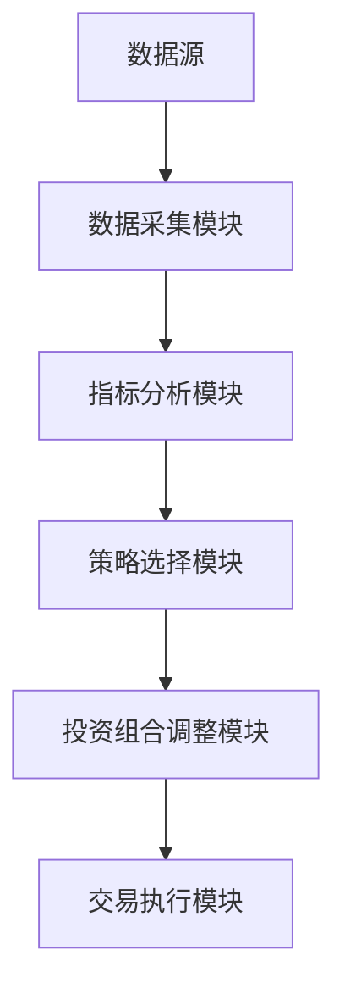
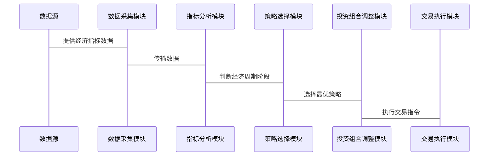

                 


# 彼得林奇的"长期持有"vs"动态调整"在不同经济周期的选择

> 关键词：彼得林奇，长期持有，动态调整，经济周期，投资策略，资产配置

> 摘要：本文深入探讨了彼得林奇的两种投资策略——"长期持有"和"动态调整"在不同经济周期中的表现和选择。通过分析经济周期的特点，比较两种策略的优缺点，并结合实际案例和系统设计，提出了一种基于经济指标的动态投资策略选择系统，帮助投资者在不同经济环境下做出明智的投资决策。

---

## 第1章: 投资策略的核心概念与背景

### 1.1 投资策略的基本概念

#### 1.1.1 长期持有策略的定义

长期持有策略是指投资者在选定优质资产后，长期持有而不频繁交易的投资方式。该策略强调价值投资，注重企业基本面，追求长期稳定的收益。

#### 1.1.2 动态调整策略的定义

动态调整策略是指投资者根据市场变化和经济环境，频繁调整投资组合以适应不同阶段的投资机会和风险。该策略强调灵活性和对市场趋势的敏感性。

#### 1.1.3 两种策略的核心区别对比

| 对比维度       | 长期持有策略                     | 动态调整策略                     |
|----------------|---------------------------------|---------------------------------|
| 投资期限       | 长期                           | 短期到中期                      |
| 交易频率       | 低                             | 高                             |
| 风险承受能力   | 较高                            | 较低                            |
| 适用场景       | 稳定的经济环境，市场波动小       | 不稳定的经济环境，市场波动大    |

---

### 1.2 彼得林奇投资理念的背景

#### 1.2.1 彼得林奇的生平简介

彼得·林奇（Peter Lynch）是美国著名投资经理，曾任富达麦哲伦基金的经理，创造了年均29%的复合回报率。他以独特的投资理念和实战经验闻名。

#### 1.2.2 彼得林奇投资理念的形成

林奇的投资理念深受本杰明·格雷厄姆和菲利普·费雪的影响，但他更注重企业的基本面和管理层质量，强调长期持有优质资产。

#### 1.2.3 "长期持有"与"动态调整"的提出

林奇在职业生涯中灵活运用两种策略，根据市场环境和企业状况进行调整，提出了"长期持有优质股，动态调整组合"的投资理念。

---

## 第2章: 经济周期对投资策略的影响

### 2.1 经济周期的基本概念

#### 2.1.1 经济周期的定义与阶段划分

经济周期分为复苏、繁荣、衰退和萧条四个阶段，每个阶段的特点和投资机会不同。

#### 2.1.2 不同经济周期的特点

- **复苏期**：经济增长缓慢回升，企业利润逐步恢复。
- **繁荣期**：经济增长快，市场活跃，企业盈利高。
- **衰退期**：经济增长放缓，企业盈利下降。
- **萧条期**：经济增长停滞，企业盈利严重下降。

#### 2.1.3 经济周期对投资的影响

经济周期的变化直接影响资产价格波动和企业盈利能力，从而影响投资策略的选择。

---

### 2.2 经济周期与投资策略的关系

#### 2.2.1 经济周期对"长期持有"策略的影响

- **繁荣期**：适合长期持有优质资产，享受高增长。
- **衰退期**：长期持有风险较高，需谨慎选择资产。

#### 2.2.2 经济周期对"动态调整"策略的影响

- **繁荣期**：动态调整可以抓住市场波动带来的机会。
- **衰退期**：动态调整可以及时止损，降低风险。

#### 2.2.3 不同经济周期下策略选择的逻辑

在繁荣期，长期持有策略可能表现更优；而在衰退期，动态调整策略可能更合适。

---

## 第3章: "长期持有"与"动态调整"策略的比较

### 3.1 策略优缺点分析

#### 3.1.1 长期持有策略的优势

- **稳定性**：长期持有策略避免了频繁交易带来的成本和风险。
- **复利效应**：长期持有可以享受复利效应，实现财富的长期增长。

#### 3.1.2 长期持有策略的劣势

- **灵活性差**：在市场剧烈波动时，长期持有可能面临较大损失。
- **错失机会**：在某些情况下，长期持有可能无法及时调整以抓住新的投资机会。

#### 3.1.3 动态调整策略的优势

- **灵活性高**：可以根据市场变化及时调整投资组合，规避风险。
- **捕捉机会**：在市场波动中，动态调整可以抓住短期投资机会。

#### 3.1.4 动态调整策略的劣势

- **交易成本高**：频繁交易可能导致较高的佣金和税费。
- **决策风险**：动态调整需要准确判断市场趋势，存在决策失误的风险。

---

### 3.2 策略适用场景对比

| 经济周期阶段       | 长期持有策略适用性 | 动态调整策略适用性 |
|--------------------|-------------------|-------------------|
| 复苏期             | 适用              | 较适用            |
| 繁荣期             | 适用              | 较适用            |
| 衰退期             | 较不适用          | 适用              |
| 萧条期             | 不适用            | 适用              |

---

## 第4章: 经济周期指标与投资策略选择

### 4.1 经济周期指标的分类

#### 4.1.1 宏观经济指标

- **GDP增长率**：衡量经济整体表现的重要指标。
- **失业率**：反映经济健康状况的重要指标。
- **通货膨胀率**：影响货币政策和投资决策的关键指标。

#### 4.1.2 市场情绪指标

- **市场估值**：如市盈率、市净率等，反映市场整体估值水平。
- **投资者情绪指数**：通过市场参与度和资金流动来衡量市场情绪。

#### 4.1.3 行业景气度指标

- **行业利润增长率**：反映行业整体盈利能力。
- **行业订单增长率**：反映行业需求变化。

---

### 4.2 投资策略选择的指标体系

#### 4.2.1 指标权重的确定

根据历史数据和经验，确定各经济指标对投资策略选择的影响权重。

#### 4.2.2 指标信号的解读

通过分析指标的变化趋势，判断经济周期所处阶段，并据此调整投资策略。

#### 4.2.3 策略调整的触发条件

当某些关键指标达到预设阈值时，触发策略调整。

---

## 第5章: 彼得林奇投资策略的案例分析

### 5.1 "长期持有"策略的经典案例

#### 5.1.1 案例背景

在繁荣期，林奇选择长期持有优质股票，如可口可乐和迪士尼，取得了显著收益。

#### 5.1.2 投资决策过程

林奇通过基本面分析，选择具有持续增长潜力的企业长期持有。

#### 5.1.3 投资结果与反思

长期持有的策略在繁荣期表现优异，但在衰退期可能面临较大回撤。

---

### 5.2 "动态调整"策略的经典案例

#### 5.2.1 案例背景

在互联网泡沫时期，林奇及时动态调整投资组合，避免了重大损失。

#### 5.2.2 投资决策过程

林奇根据市场变化和经济指标，动态调整投资组合，降低风险敞口。

#### 5.2.3 投资结果与反思

动态调整策略在衰退期表现优异，但在繁荣期可能错失部分收益。

---

## 第6章: 投资策略的系统分析与架构设计

### 6.1 系统功能设计

#### 6.1.1 系统目标

设计一个基于经济指标的动态投资策略选择系统，帮助投资者在不同经济周期下做出最优投资决策。

#### 6.1.2 系统功能模块

- 数据采集模块：采集宏观经济指标、市场情绪指标等。
- 指标分析模块：分析指标变化趋势，判断经济周期阶段。
- 策略选择模块：根据经济周期阶段，选择最优投资策略。
- 投资组合调整模块：动态调整投资组合，执行交易指令。

#### 6.1.3 系统交互流程

1. 数据采集模块获取实时经济指标数据。
2. 指标分析模块分析数据，判断经济周期阶段。
3. 策略选择模块根据经济周期阶段，选择最优投资策略。
4. 投资组合调整模块根据选择的策略，动态调整投资组合。

---

### 6.2 系统架构设计

#### 6.2.1 系统架构图



#### 6.2.2 系统接口设计

- 数据接口：与宏观经济数据源对接，获取实时数据。
- 策略接口：与投资策略库对接，获取策略选择结果。
- 交易接口：与交易系统对接，执行投资组合调整。

#### 6.2.3 系统交互流程图



---

## 第7章: 项目实战

### 7.1 环境安装

#### 7.1.1 Python环境安装

安装Python和必要的库，如Pandas、NumPy、Matplotlib、Scikit-learn。

#### 7.1.2 数据源获取

获取宏观经济指标数据，如GDP增长率、失业率、通货膨胀率等。

---

### 7.2 系统核心实现源代码

```python
import pandas as pd
import numpy as np
import matplotlib.pyplot as plt
from sklearn.metrics import classification_report

# 数据获取与预处理
data = pd.read_csv('economic_indicators.csv')
data['economic_stage'] = data['GDP增长率'].apply(lambda x: '复苏期' if x < 2 else ('繁荣期' if 2 <= x < 4 else ('衰退期' if 1 <= x < 2 else '萧条期')))

# 经济周期判断
def determine_stage(gdp_growth, unemployment_rate, inflation_rate):
    if gdp_growth < 0:
        return '萧条期'
    elif 0 <= gdp_growth < 1:
        return '衰退期'
    elif 1 <= gdp_growth < 3:
        return '复苏期'
    else:
        return '繁荣期'

# 策略选择
def choose_strategy(stage):
    if stage in ['复苏期', '繁荣期']:
        return '长期持有'
    else:
        return '动态调整'

# 策略效果分析
def evaluate_strategy(strategy_choice, actual_stage):
    if strategy_choice == '长期持有':
        return 1 if actual_stage in ['复苏期', '繁荣期'] else 0
    else:
        return 1 if actual_stage in ['衰退期', '萧条期'] else 0

# 模型训练与评估
from sklearn.model_selection import train_test_split
X = data[['GDP增长率', '失业率', '通货膨胀率']]
y = data['economic_stage'].apply(lambda x: 0 if x == '复苏期' else (1 if x == '繁荣期' else (2 if x == '衰退期' else 3)))
X_train, X_test, y_train, y_test = train_test_split(X, y, test_size=0.2)

# 简单的决策树模型（示例）
def simple_model(X):
    stages = []
    for x in X.values:
        stage = determine_stage(x[0], x[1], x[2])
        stages.append(stage)
    return stages

y_pred = simple_model(X_test)
print(classification_report(y_test, y_pred))
```

---

### 7.3 代码应用解读与分析

通过上述代码，我们可以根据宏观经济指标判断经济周期阶段，并选择相应的投资策略。模型可以根据历史数据进行训练和评估，以提高策略选择的准确性。

---

### 7.4 实际案例分析

以2008年金融危机为例，分析林奇如何根据经济周期选择投资策略。在危机前的繁荣期，林奇选择长期持有优质资产；而在危机发生后，及时动态调整，减少损失。

---

## 第8章: 总结与展望

### 8.1 总结

彼得林奇的"长期持有"和"动态调整"策略在不同经济周期下各有优劣。投资者需要根据经济环境和市场趋势，灵活选择适合的策略。

### 8.2 投资建议

- 在繁荣期和复苏期，适当选择长期持有策略，享受复利效应。
- 在衰退期和萧条期，及时动态调整，规避风险。
- 结合宏观经济指标和市场情绪，制定科学的投资策略。

### 8.3 注意事项

- 投资者需具备一定的经济知识和市场敏感性。
- 动态调整需谨慎，避免过度交易和决策失误。
- 长期持有需选择优质资产，注重企业基本面。

### 8.4 拓展阅读

- 《彼得林奇的投资哲学》
- 《投资学基础》
- 《经济学原理》

---

通过本文的分析，读者可以更好地理解彼得林奇的两种投资策略，并在实际投资中灵活运用，做出更明智的投资决策。

