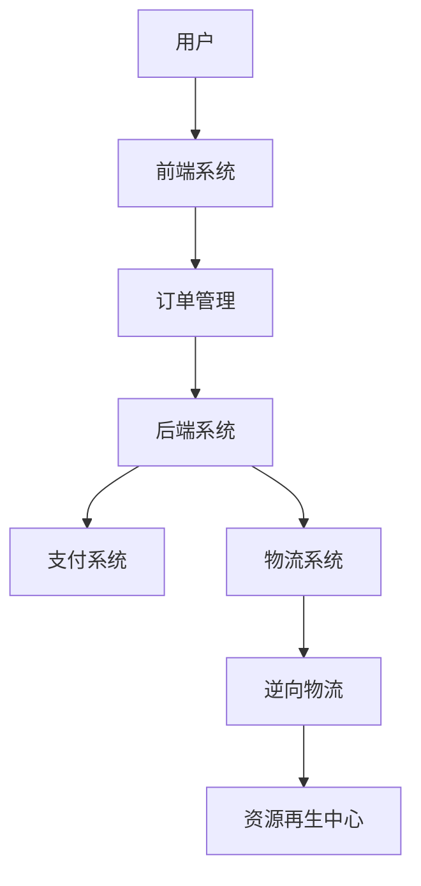

                 


# 循环经济商业模式的可扩展性与投资机会

## 关键词：循环经济、商业模式、可扩展性、投资机会、可持续发展

## 摘要：  
循环经济是一种以资源高效利用和循环再生为核心理念的经济模式，旨在减少资源消耗和环境污染，推动可持续发展。本文从技术与商业的双重角度，分析循环经济商业模式的可扩展性及其投资机会，探讨其在不同行业的应用潜力，为企业和社会提供创新的可持续发展思路。

---

# 第一部分：循环经济商业模式的背景与核心概念

## 第1章：循环经济的基本概念与背景

### 1.1 循环经济的定义与特点  
循环经济是一种以资源高效利用和循环再生为核心理念的经济模式。其特点包括：  
- **闭环性**：强调资源在生产、消费和回收过程中的循环利用。  
- **零浪费**：通过设计和技术创新，减少废弃物的产生。  
- **可持续性**：注重环境保护和社会价值的结合，推动经济与生态的平衡发展。  

### 1.2 循环经济的背景与重要性  
随着全球资源枯竭和环境问题的加剧，传统线性经济模式的局限性日益显现。循环经济的出现为解决这些问题提供了新的思路：  
- **资源节约**：减少对自然资源的依赖，缓解资源短缺问题。  
- **环境保护**：降低污染排放，减少环境负担。  
- **经济转型**：推动企业向绿色、高效方向发展，创造新的经济增长点。  

### 1.3 循环经济的核心要素与边界  
循环经济的核心要素包括：  
1. **产品生命周期管理**：从设计、生产到回收的全过程管理。  
2. **逆向物流系统**：建立废弃物回收和资源再利用的通道。  
3. **资源循环利用机制**：通过技术创新实现资源的高效再生。  

循环经济的边界在于：  
- 不超出资源承载能力。  
- 不违背社会公平与正义。  
- 符合法律法规和市场规则。  

---

## 第2章：循环经济商业模式的核心概念与联系

### 2.1 循环经济商业模式的构成  
循环经济商业模式的构成包括以下几个关键部分：  
1. **产品服务化**：通过提供服务而非出售产品，延长资源使用周期。  
2. **共享经济**：通过共享资源实现资源的高效利用。  
3. **逆向供应链**：建立废弃物回收和资源再生的闭环供应链。  

### 2.2 循环经济商业模式的属性特征对比  
以下是循环经济与传统经济模式的对比分析：  

| 对比维度 | 循环经济 | 传统经济 |  
|----------|----------|----------|  
| 资源利用 | 循环利用 | 一次利用 |  
| 废弃物处理 | 再生利用 | 排放或填埋 |  
| 成本结构 | 高初始成本，低运营成本 | 低初始成本，高运营成本 |  

### 2.3 循环经济商业模式的ER实体关系图  
以下是循环经济商业模式的ER实体关系图：  

```mermaid
erDiagram
    actor 用户
    actor 企业
    actor 政府
    actor 第三方平台
    boundary 循环经济系统
    boundary 产品生命周期管理
    boundary 逆向物流系统
    用户 --> 循环经济系统 : 参与循环
    企业 --> 循环经济系统 : 提供产品
    政府 --> 循环经济系统 : 支持政策
    第三方平台 --> 循环经济系统 : 提供服务
```

---

## 第3章：循环经济商业模式的可扩展性分析

### 3.1 循环经济商业模式的可扩展性特点  
循环经济的可扩展性体现在以下几个方面：  
- **模块化设计**：通过模块化设计，实现不同行业的兼容与扩展。  
- **数据驱动**：利用大数据技术优化资源配置，提高效率。  
- **技术创新**：通过技术进步降低成本，提高资源利用率。  

### 3.2 循环经济商业模式的扩展路径  
1. **行业扩展**：从单一行业扩展到多个行业，例如从电子产品扩展到纺织品。  
2. **区域扩展**：从局部地区扩展到全国或全球范围。  
3. **技术扩展**：通过技术创新，实现更高效的资源循环利用。  

### 3.3 循环经济商业模式的扩展挑战  
- **技术瓶颈**：部分行业缺乏成熟的循环经济技术。  
- **成本问题**：初期投入较高，可能影响企业的积极性。  
- **政策支持**：需要政府的政策支持和法规保障。  

---

## 第4章：循环经济商业模式的投资机会与系统设计

### 4.1 投资机会分析  
1. **技术领域**：投资于循环经济相关技术的研发，如废弃物再生技术。  
2. **服务领域**：发展循环经济服务，如产品生命周期管理服务。  
3. **平台领域**：建立循环经济平台，连接供需双方，促进资源流动。  

### 4.2 投资回报模型  
以下是循环经济投资回报模型的简要分析：  

投资回报率（ROI）= （收益 - 成本） / 成本  

其中，收益包括资源节约带来的成本降低和新业务收入，成本包括技术改造和运营成本。  

### 4.3 系统架构设计  
以下是循环经济系统的架构设计：  



---

## 第5章：循环经济商业模式的项目实战与最佳实践

### 5.1 项目背景与需求分析  
以某电子产品制造商为例，希望通过循环经济模式减少生产成本和环境影响。  

### 5.2 系统设计与实现  
1. **产品生命周期管理**：设计产品以延长使用寿命，减少废弃物产生。  
2. **逆向物流系统**：建立回收渠道，回收旧产品进行资源再生。  

### 5.3 项目实施与测试  
- **实施阶段**：部署新的管理系统和物流网络。  
- **测试阶段**：通过试点测试，收集数据并优化系统。  

### 5.4 项目总结与经验分享  
- **成功经验**：通过循环经济模式，企业实现了成本降低和资源利用率提升。  
- **失败教训**：初期投入较高，需要政府和企业的长期支持。  

---

## 第6章：结论与展望

### 6.1 研究结论  
循环经济商业模式具有广阔的可扩展性和投资潜力，是推动可持续发展的重要途径。  

### 6.2 未来展望  
随着技术进步和政策支持，循环经济将在更多行业得到应用，成为未来经济发展的重要方向。  

---

以上是《循环经济商业模式的可扩展性与投资机会》的详细目录和内容概要。接下来将根据目录撰写具体的正文内容。

