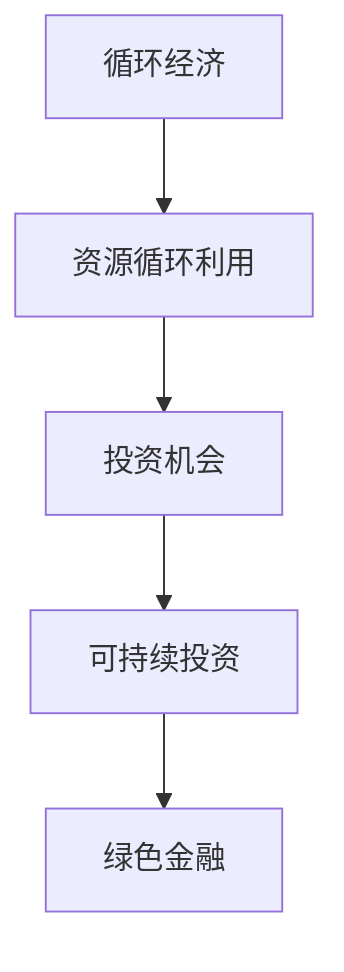
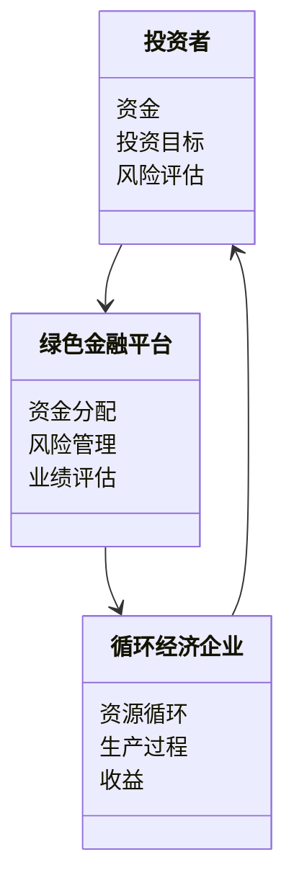

                 


# 循环经济模式下的可持续投资策略

## 关键词：循环经济、可持续投资、商业模式、数学模型、系统架构、投资策略

## 摘要

本文探讨了循环经济模式下的可持续投资策略，分析了循环经济的核心概念、商业模式及其对投资的影响。通过构建数学模型和系统框架，详细讲解了可持续投资的实现方法，并通过案例分析验证了策略的有效性。文章旨在为投资者提供理论支持和实践指导，帮助他们在循环经济模式下实现可持续投资。

---

## 第1章：循环经济的基本概念与背景

### 1.1 循环经济的定义与特点

循环经济是一种以资源高效利用和循环再生为核心，以减少资源消耗和环境污染为目标的经济模式。其特点包括资源闭环、减废增效和创新驱动。

- **循环经济的定义**：通过设计、生产、消费和回收等环节，实现资源的循环利用。
- **与传统经济的对比**：循环经济强调资源的再利用，而传统经济依赖一次性资源消耗。

### 1.2 可持续投资的背景与意义

可持续投资强调在追求经济回报的同时，关注环境、社会和治理（ESG）因素，具有长期价值。

- **全球趋势**：随着环保意识的增强，可持续投资成为主流。
- **对经济和社会的影响**：通过优化资源配置，促进社会可持续发展。

### 1.3 循环经济与可持续投资的关联

循环经济为可持续投资提供了新的机会，可持续投资推动循环经济的发展。

- **投资机会**：资源循环利用企业、绿色技术创新等领域。
- **协同效应**：循环经济模式与可持续投资相互促进。

---

## 第2章：循环经济的商业模式与投资机会

### 2.1 循环经济的商业模式

循环经济的商业模式包括产品服务化、资源循环利用和共享经济模式。

- **产品服务化模式**：通过提供服务而非出售产品，延长产品生命周期。
- **资源循环利用模式**：通过回收和再利用资源降低成本。
- **共享经济模式**：通过共享资源实现高效利用。

### 2.2 循环经济下的投资机会

循环经济为投资者提供了多样化的投资机会。

- **可再生能源投资**：太阳能、风能等清洁能源项目。
- **循环资源利用企业投资**：回收企业、循环经济园区。
- **绿色技术创新投资**：环保技术企业。

---

## 第3章：可持续投资的核心策略

### 3.1 可持续投资的核心概念

- **环境、社会和治理（ESG）因素**：环境因素关注资源消耗和污染，社会因素关注公平和社会责任，治理因素关注企业治理结构。
- **可持续投资的分类**：包括绿色债券、ESG基金等。

### 3.2 循环经济模式下的投资策略

- **资源效率型投资策略**：投资资源利用效率高的企业。
- **循环经济产业链投资策略**：投资整个循环经济产业链中的企业。
- **绿色金融工具的应用**：利用绿色债券、碳金融等工具进行投资。

---

## 第4章：循环经济与可持续投资的系统性框架

### 4.1 循环经济模式下的投资系统架构

- **系统架构图**：展示循环经济与可持续投资的协同关系。



### 4.2 可持续投资的系统功能设计

- **领域模型（Mermaid类图）**：



### 4.3 投资决策的系统架构设计

- **系统架构图（Mermaid架构图）**：


---

## 第5章：循环经济模式下的投资策略数学模型

### 5.1 数学模型的构建

循环经济下的投资收益与成本模型：

$$ \text{总收益} = \text{收入} - \text{成本} $$

其中，收入来自资源循环利用，成本包括初始投资和运营成本。

### 5.2 投资评估模型

- **数学公式**：

$$ \text{净现值} = \sum_{t=0}^{n} \frac{CF_t}{(1 + r)^t} $$

其中，CF_t为第t年的现金流，r为折现率。

- **Python代码实现**：

```python
def calculate_npv(cash_flows, discount_rate):
    npv = 0
    for t, cash_flow in enumerate(cash_flows):
        npv += cash_flow / (1 + discount_rate) ** t
    return npv

cash_flows = [100, 200, 300, 400]
discount_rate = 0.1
print(calculate_npv(cash_flows, discount_rate))
```

---

## 第6章：项目实战：可持续投资策略的应用

### 6.1 环境安装

- **安装Python和必要的库**：如numpy、pandas、matplotlib。

### 6.2 核心实现代码

- **计算投资回报率**：

```python
import numpy as np

def calculate_return_on_investment(investment, return_amount):
    return (return_amount - investment) / investment * 100

investment = 1000
return_amount = 1500
print(f"回报率：{calculate_return_on_investment(investment, return_amount)}%")
```

### 6.3 案例分析

- **案例分析**：假设某企业投资于可再生能源项目，计算其投资回报率和净现值。

---

## 第7章：系统分析与架构设计方案

### 7.1 问题场景介绍

- **问题场景**：如何优化资源利用，降低投资风险。

### 7.2 系统功能设计

- **领域模型（Mermaid类图）**：


### 7.3 系统架构设计

- **系统架构图（Mermaid架构图）**：


---

## 第8章：结论与展望

### 8.1 结论

- 循环经济模式为可持续投资提供了新的机会。
- 可持续投资通过优化资源配置，促进循环经济的发展。

### 8.2 未来研究方向

- 研究循环经济模式下的风险管理。
- 探索更多绿色金融工具的应用。

### 8.3 实践建议

- 投资者应关注循环经济企业的长期价值。
- 政府应提供政策支持，促进循环经济的发展。

---

## 最佳实践 tips

- **数据收集**：确保数据的准确性和全面性。
- **模型优化**：根据实际情况调整数学模型。
- **风险管理**：建立风险评估机制，降低投资风险。

---

## 项目小结

通过本文的分析和实践，读者可以掌握循环经济模式下的可持续投资策略，并在实际中应用这些策略，实现经济和环境的双重效益。

--- 

**全文结束**

