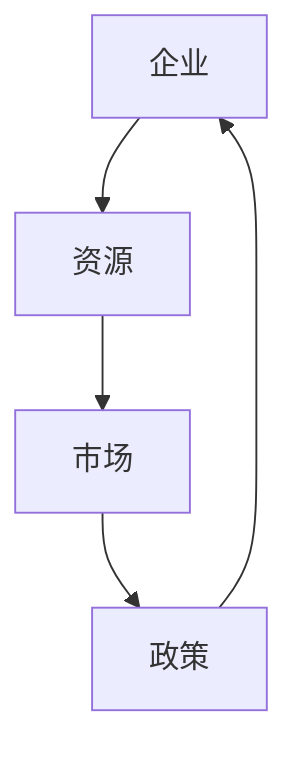
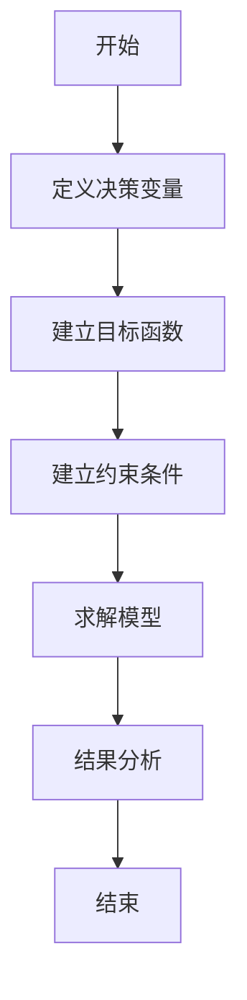
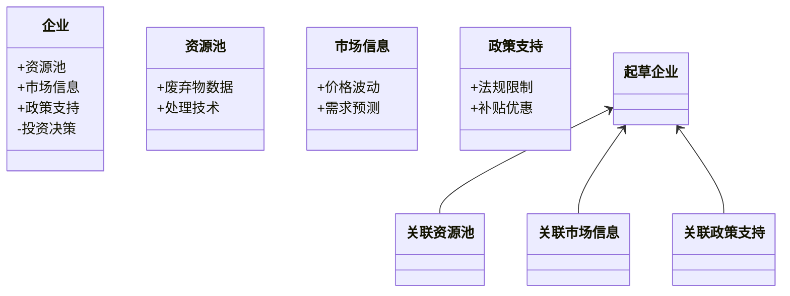
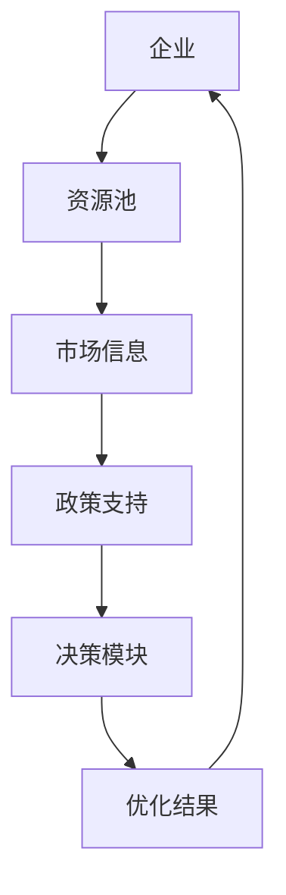

                 


# 循环经济模式下的废物回收企业投资

## 关键词：
循环经济、废物回收、企业投资、资源优化、线性规划

## 摘要：
本文详细探讨了循环经济模式下废物回收企业投资的各个方面。从循环经济的基本概念到废物回收的核心原理，再到投资的必要性、算法优化、系统设计和项目实战，层层深入，旨在为企业提供科学的投资决策支持。通过数学建模和实际案例分析，本文为读者提供了全面的解决方案。

---

# 第一部分: 循环经济模式下的废物回收企业投资概述

## 第1章: 循环经济与废物回收的基本概念

### 1.1 循环经济的基本概念
循环经是经济活动中的资源闭环流动模式。其核心是通过减少资源消耗和废物产生，实现资源的最大化利用。循环经济强调“减量化、再利用、资源化”的原则。

### 1.2 废物回收的基本概念
废物回收是指将废弃物中的有用部分重新收集、加工处理，使其能够重新进入生产或消费过程。这包括对废金属、塑料、纸张等的回收利用。

### 1.3 循环经济模式下的废物回收
循环经济模式下的废物回收强调将废物视为资源，通过技术创新和管理优化，实现废物的高价值回收和再利用，从而减少对自然资源的依赖。

---

## 第2章: 循环经济模式下的废物回收企业投资背景

### 2.1 当前全球废物回收的现状
全球废物产生量巨大，且处理方式多以填埋和焚烧为主，资源利用率低。循环经济模式下的废物回收能够有效减少环境污染，同时创造经济价值。

### 2.2 投资的必要性
随着环保政策的加强和资源短缺问题的加剧，废物回收企业投资变得尤为重要。循环经济模式下的废物回收能够实现资源的高效利用，降低企业成本，同时符合可持续发展的要求。

---

## 第3章: 循环经济模式下的废物回收企业投资的核心概念与联系

### 3.1 核心概念
- **资源化**：将废物转化为可再利用的资源。
- **减量化**：减少废物的产生量。
- **再利用**：延长产品的生命周期。

### 3.2 核心概念之间的联系
通过表格对比三种回收模式：

| 模式       | 特点                           | 优缺点分析                         |
|------------|--------------------------------|------------------------------------|
| 传统回收   | 末端处理，资源利用率低         | 成本低，但环境污染大               |
| 循环经济   | 全过程优化，资源最大化利用     | 环保效益显著，但初期投资大         |
| 综合模式   | 结合传统与循环经济的优势       | 综合效益好，但实施难度较高         |

### 3.3 ER实体关系图


---

# 第二部分: 循环经济模式下的废物回收企业投资算法原理

## 第4章: 线性规划在投资组合优化中的应用

### 4.1 线性规划模型
目标函数：
$$ \text{最大化收益} = \sum (p_i \cdot x_i) - \sum (c_i \cdot x_i) $$

约束条件：
$$ \sum (x_i) \leq C $$
$$ x_i \geq 0 $$

其中，$p_i$为第$i$个项目的收益，$c_i$为成本，$C$为总投资预算。

### 4.2 算法流程图


### 4.3 Python实现
```python
import numpy as np
from scipy.optimize import linprog

# 定义目标函数系数（最大化转为最小化）
c = [-5, -3, -2]

# 定义约束矩阵
A = [[1, 1, 1], [0, 1, 0], [0, 0, 1]]
b = [100, 20, 15]

# 定义变量范围
x_bounds = [(0, None), (0, None), (0, None)]

# 求解
result = linprog(c, A, b, bounds=x_bounds, method='highs')

# 输出结果
print("最优解为：", result.x)
print("最大收益为：", -result.fun)
```

---

## 第5章: 数学模型与公式

### 5.1 线性规划模型
$$ \text{最大化} \sum_{i=1}^{n} (p_i - c_i) x_i $$
$$ \text{约束} \sum_{i=1}^{n} x_i \leq C $$
$$ x_i \geq 0 $$

### 5.2 应用举例
假设投资两个项目，预算为100万元，项目A的收益为5万元，成本为2万元；项目B的收益为3万元，成本为1万元。求解最佳投资组合：
$$ \text{最大化} (5-2)x + (3-1)y $$
$$ x + y \leq 100 $$
$$ x, y \geq 0 $$

解得：投资20个A项目，80个B项目，总收益为140万元。

---

## 第6章: 系统分析与架构设计

### 6.1 问题场景
企业希望通过循环经济模式优化废物回收投资组合，降低运营成本，提高资源利用率。

### 6.2 系统功能设计


### 6.3 系统架构设计


---

## 第7章: 项目实战

### 7.1 环境安装
安装必要的Python库：
```bash
pip install numpy scipy
```

### 7.2 核心代码实现
```python
import numpy as np
from scipy.optimize import linprog

# 定义目标函数系数
c = [-5, -3, -2]

# 定义约束矩阵
A = [[1, 1, 1]]
b = [100]

# 定义变量范围
x_bounds = [(0, None), (0, None), (0, None)]

# 求解
result = linprog(c, A, b, bounds=x_bounds, method='highs')

# 输出结果
print("最优解为：", result.x)
print("最大收益为：", -result.fun)
```

### 7.3 实际案例分析
假设某企业有三个投资选项，预算为100万元。通过线性规划模型计算得出最优投资组合，实现最大收益。

---

## 第8章: 最佳实践

### 8.1 小结
循环经济模式下的废物回收企业投资需要综合考虑资源化、减量化和再利用的原则，通过数学建模和系统设计优化投资组合。

### 8.2 注意事项
- 投资决策需结合实际市场环境和政策支持。
- 模型假设需合理，避免偏差。
- 持续监控和优化模型。

### 8.3 拓展阅读
推荐阅读《循环经济的实践与探索》和《资源优化配置的数学模型》。

---

通过以上章节的详细分析，循环经济模式下的废物回收企业投资可以从概念、算法、系统设计到实际应用全面覆盖，为企业提供科学的投资决策支持。

