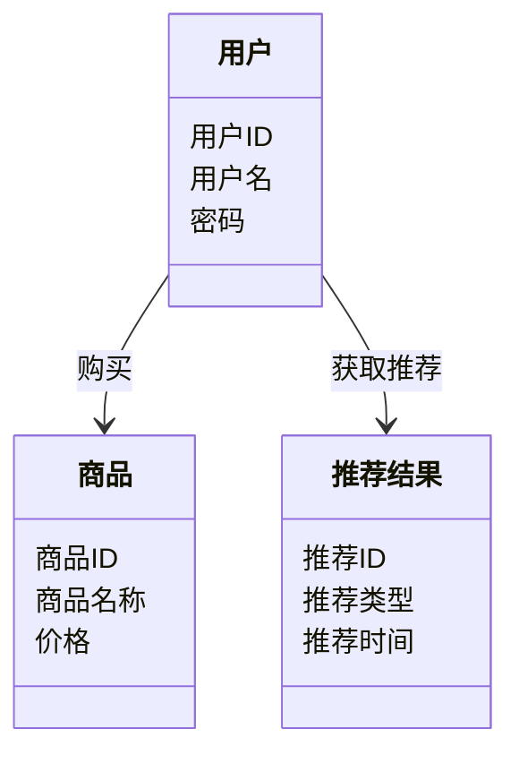
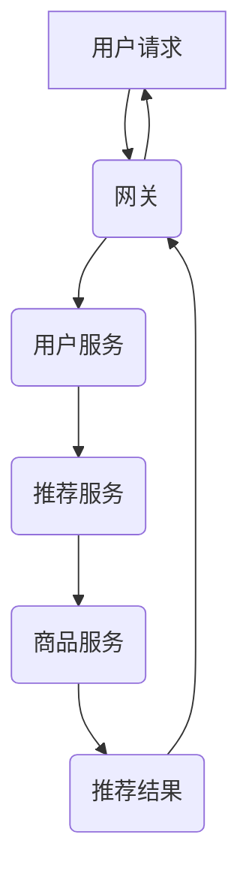

                 


好的，我明白了。您需要我以《微服务架构：构建模块化的AI Agent系统》为主题，撰写一篇专业的技术博客文章，按照您提供的目录大纲结构来组织内容。我将按照您的要求，逐步分析和撰写这篇文章。

---

# 微服务架构：构建模块化的AI Agent系统

> **关键词**：微服务架构、AI Agent、模块化设计、服务通信、系统架构  
> **摘要**：本文将探讨如何通过微服务架构构建模块化的AI Agent系统，从基本概念到系统架构设计，再到实际项目实现，全面解析微服务架构在AI Agent中的应用，帮助读者掌握模块化设计的核心思想和实现方法。

---

## 第1章: 微服务架构与AI Agent概述

### 1.1 微服务架构的基本概念

#### 1.1.1 微服务架构的定义
微服务架构是一种将应用程序分解为多个小型、独立服务的架构风格。每个服务都是一个独立的进程，专注于完成特定的业务功能。

#### 1.1.2 微服务架构的核心特点
- **模块化**：每个服务独立开发、部署和扩展。
- **松耦合**：服务之间通过接口通信，降低耦合度。
- **可扩展性**：每个服务可以根据需求独立扩展。

#### 1.1.3 微服务架构与传统单体架构的区别
- **单体架构**：所有功能集中在一个程序中，扩展性差，维护复杂。
- **微服务架构**：功能模块化，独立开发和部署，灵活性高。

### 1.2 AI Agent的基本概念

#### 1.2.1 AI Agent的定义
AI Agent（人工智能代理）是一种能够感知环境、做出决策并执行动作的智能实体。它可以独立或协作完成特定任务。

#### 1.2.2 AI Agent的核心功能
- **感知**：通过传感器或接口获取环境信息。
- **决策**：基于感知信息，通过算法做出决策。
- **执行**：根据决策执行具体动作。

#### 1.2.3 AI Agent与传统软件的区别
- **智能性**：AI Agent具备学习和适应能力。
- **自主性**：AI Agent能够自主完成任务，无需人工干预。

### 1.3 微服务架构与AI Agent的结合

#### 1.3.1 微服务架构在AI Agent中的应用
- **模块化设计**：AI Agent的不同功能模块可以分解为独立的服务。
- **服务通信**：AI Agent通过服务通信机制与其他服务或外部系统交互。

#### 1.3.2 AI Agent在微服务架构中的优势
- **灵活性**：AI Agent的功能模块可以独立扩展和优化。
- **可维护性**：每个服务独立开发和维护，降低整体复杂性。

#### 1.3.3 微服务架构与AI Agent结合的场景
- **智能推荐系统**：AI Agent负责数据分析和推荐算法，微服务架构提供数据存储和接口服务。
- **自动化控制系统**：AI Agent负责决策和执行，微服务架构提供设备控制和数据采集服务。

### 1.4 本章小结
本章介绍了微服务架构和AI Agent的基本概念，以及它们结合的应用场景。微服务架构的模块化设计为AI Agent提供了灵活的实现方式，而AI Agent的智能性则为微服务系统增添了强大的决策能力。

---

## 第2章: 微服务架构的设计原则

### 2.1 模块化设计

#### 2.1.1 模块化的定义
模块化设计将系统分解为多个独立的模块，每个模块负责特定的功能。

#### 2.1.2 模块化设计的实现方法
- **功能划分**：根据业务需求将功能模块化。
- **接口定义**：定义模块之间的接口，确保模块之间的通信。

#### 2.1.3 模块化设计的优缺点
- **优点**：灵活性高，易于扩展和维护。
- **缺点**：设计复杂，需要考虑模块之间的依赖关系。

### 2.2 服务通信机制

#### 2.2.1 服务通信的定义
服务通信机制是指服务之间通过接口进行数据交换的方式。

#### 2.2.2 服务通信的实现方式
- **RESTful API**：基于HTTP协议的REST风格接口。
- **RPC（远程过程调用）**：通过 RPC 服务进行通信。

#### 2.2.3 服务通信的优化策略
- **服务发现**：通过服务注册与发现机制，动态获取服务地址。
- **负载均衡**：通过负载均衡算法，均衡服务请求。

### 2.3 服务发现与负载均衡

#### 2.3.1 服务发现的定义
服务发现是指通过服务注册中心，动态获取服务的地址和状态。

#### 2.3.2 服务发现的实现方法
- **注册中心**：服务启动时向注册中心注册，提供服务地址和端口号。
- **服务查询**：客户端通过注册中心查询服务地址，建立连接。

#### 2.3.3 负载均衡的实现策略
- **轮询**：按顺序轮询服务实例，分配请求。
- **随机**：随机选择服务实例，分配请求。
- **加权轮询**：根据服务实例的权重，按比例分配请求。

### 2.4 本章小结
本章介绍了微服务架构中的模块化设计和服务通信机制，重点讲解了服务发现和负载均衡的实现方法和优化策略。模块化设计和服务通信是构建微服务架构的基础，为后续的AI Agent实现奠定了基础。

---

## 第3章: AI Agent的核心原理

### 3.1 AI Agent的感知机制

#### 3.1.1 感知的定义
感知是指AI Agent通过传感器或接口获取环境信息的能力。

#### 3.1.2 感知的实现方法
- **数据采集**：通过传感器或其他数据源获取数据。
- **数据预处理**：对获取的数据进行清洗和转换。

#### 3.1.3 感知的优化策略
- **数据过滤**：去除无效或噪声数据。
- **特征提取**：提取数据中的关键特征，提高感知精度。

### 3.2 AI Agent的决策机制

#### 3.2.1 决策的定义
决策是指AI Agent基于感知信息做出选择的过程。

#### 3.2.2 决策的实现方法
- **规则引擎**：基于预定义的规则进行决策。
- **机器学习模型**：通过训练模型进行预测和决策。

#### 3.2.3 决策的优化策略
- **模型优化**：通过调整模型参数，提高决策准确率。
- **在线学习**：实时更新模型，适应环境变化。

### 3.3 AI Agent的执行机制

#### 3.3.1 执行的定义
执行是指AI Agent根据决策结果采取具体动作的过程。

#### 3.3.2 执行的实现方法
- **动作执行**：通过API或其他接口调用外部服务或设备。
- **任务管理**：监控任务执行状态，处理异常情况。

#### 3.3.3 执行的优化策略
- **任务调度**：通过任务队列和调度算法，优化任务执行顺序。
- **错误处理**：通过日志和异常处理机制，快速定位和解决问题。

### 3.4 本章小结
本章详细讲解了AI Agent的核心原理，包括感知、决策和执行机制。AI Agent的实现需要结合微服务架构，利用模块化设计和服务通信机制，实现高效、可靠的系统架构。

---

## 第4章: 微服务架构下AI Agent的实现

### 4.1 微服务架构下的服务发现

#### 4.1.1 服务发现的实现方法
- **注册中心**：使用Consul或Eureka等工具实现服务注册和发现。
- **服务查询**：客户端通过注册中心查询可用服务实例。

#### 4.1.2 服务发现的优化策略
- **心跳机制**：定期心跳检测，确保服务实例存活。
- **负载均衡**：结合负载均衡算法，优化服务请求分配。

#### 4.1.3 服务发现的实现案例
- **Consul**：通过Consul注册中心实现服务注册和发现。
- **Eureka**：通过Eureka实现服务注册和发现。

### 4.2 微服务架构下的动态配置

#### 4.2.1 动态配置的定义
动态配置是指在运行时动态修改配置参数的能力。

#### 4.2.2 动态配置的实现方法
- **配置中心**：通过配置中心实现动态配置管理。
- **配置推送**：通过消息队列或WebSocket等技术实现配置动态推送。

#### 4.2.3 动态配置的优化策略
- **版本控制**：通过版本号管理配置变更，避免配置冲突。
- **灰度发布**：通过灰度发布策略，逐步 rollout 配置变更。

### 4.3 微服务架构下的服务通信

#### 4.3.1 服务通信的实现方法
- **RESTful API**：通过HTTP协议实现服务间通信。
- **RPC**：通过 RPC 框架实现服务间通信。

#### 4.3.2 服务通信的优化策略
- **协议优化**：通过压缩和序列化优化，减少数据传输开销。
- **断路器**：通过断路器模式，防止服务调用链路故障。

### 4.4 本章小结
本章详细讲解了微服务架构下AI Agent的实现，重点介绍了服务发现、动态配置和服务通信的实现方法和优化策略。通过这些实现，可以构建高效、可靠的AI Agent系统。

---

## 第5章: 模块化AI Agent系统架构设计

### 5.1 项目介绍
- **项目背景**：构建一个模块化的AI Agent系统，实现智能推荐功能。
- **项目目标**：通过微服务架构，实现AI Agent的模块化设计和功能扩展。

### 5.2 系统功能设计

#### 5.2.1 领域模型设计
- **用户模型**：用户信息表，包含用户ID、用户名、密码等信息。
- **商品模型**：商品信息表，包含商品ID、商品名称、价格等信息。
- **推荐模型**：推荐结果表，包含推荐ID、推荐类型、推荐时间等信息。

#### 5.2.2 领域模型图


### 5.3 系统架构设计

#### 5.3.1 系统架构图


#### 5.3.2 系统接口设计
- **用户服务接口**：提供用户信息查询和更新接口。
- **商品服务接口**：提供商品信息查询和更新接口。
- **推荐服务接口**：提供推荐算法接口，根据用户行为生成推荐结果。

### 5.4 本章小结
本章通过项目介绍和系统架构设计，展示了如何通过微服务架构构建模块化的AI Agent系统。系统架构设计包括领域模型设计和系统架构图，明确了各服务的功能和交互方式。

---

## 第6章: 项目实战

### 6.1 环境安装

#### 6.1.1 JDK安装
- **下载JDK**：从Oracle官网下载JDK 8或更高版本。
- **安装JDK**：按照安装向导完成JDK安装。
- **环境变量配置**：配置JDK的bin目录到PATH环境变量。

#### 6.1.2 Spring Boot安装
- **下载Spring Boot**：从Spring官网下载Spring Boot Starter Kit。
- **安装Spring Boot**：解压下载的文件，完成安装。

#### 6.1.3 其他依赖安装
- **Consul**：用于服务发现和注册。
- **Eureka**：用于服务发现和注册。
- **Feign**：用于声明式服务调用。

### 6.2 系统核心实现

#### 6.2.1 用户服务实现
```java
@SpringBootApplication
@EnableAutoConfiguration
public class UserServiceApplication {
    public static void main(String[] args) {
        SpringApplication.run(UserServiceApplication.class, args);
    }
}
```

#### 6.2.2 商品服务实现
```java
@SpringBootApplication
@EnableAutoConfiguration
public class ProductServiceApplication {
    public static void main(String[] args) {
        SpringApplication.run(ProductServiceApplication.class, args);
    }
}
```

#### 6.2.3 推荐服务实现
```java
@SpringBootApplication
@EnableAutoConfiguration
public class RecommendServiceApplication {
    public static void main(String[] args) {
        SpringApplication.run(RecommendServiceApplication.class, args);
    }
}
```

### 6.3 代码应用解读与分析

#### 6.3.1 用户服务解读
- **用户信息查询**：通过RestTemplate调用用户服务接口，获取用户信息。
- **用户信息更新**：通过RestTemplate调用用户服务接口，更新用户信息。

#### 6.3.2 商品服务解读
- **商品信息查询**：通过RestTemplate调用商品服务接口，获取商品信息。
- **商品信息更新**：通过RestTemplate调用商品服务接口，更新商品信息。

#### 6.3.3 推荐服务解读
- **推荐算法实现**：基于协同过滤算法，根据用户行为生成推荐结果。
- **推荐结果返回**：通过RestTemplate调用网关，将推荐结果返回给用户。

### 6.4 实际案例分析
- **案例背景**：用户访问推荐系统，获取个性化推荐结果。
- **案例实现**：通过网关调用推荐服务，获取推荐结果并返回给用户。
- **案例分析**：分析推荐系统的性能和准确性，优化推荐算法。

### 6.5 本章小结
本章通过项目实战，详细讲解了如何通过微服务架构构建模块化的AI Agent系统。从环境安装到代码实现，再到案例分析，展示了整个系统的实现过程。

---

## 第7章: 高级主题与未来发展

### 7.1 模块化设计的扩展性

#### 7.1.1 动态扩展
- **服务动态注册**：通过注册中心实现服务的动态注册和发现。
- **模块热插拔**：通过模块化设计，实现模块的动态加载和卸载。

#### 7.1.2 扩展性优化
- **服务分片**：通过分片技术，实现服务的水平扩展。
- **容器化部署**：通过容器化技术，实现服务的快速部署和弹性伸缩。

### 7.2 AI Agent的安全性

#### 7.2.1 数据安全
- **数据加密**：通过加密算法，保护数据的安全性。
- **访问控制**：通过权限控制，限制对敏感数据的访问。

#### 7.2.2 服务安全
- **认证授权**：通过OAuth 2.0等协议，实现服务的认证和授权。
- **加密通信**：通过SSL/TLS协议，实现服务间通信的加密。

### 7.3 未来发展

#### 7.3.1 AI Agent的智能化
- **强化学习**：通过强化学习算法，提升AI Agent的智能决策能力。
- **自适应系统**：通过自适应算法，实现系统的动态调整和优化。

#### 7.3.2 微服务架构的演进
- **边缘计算**：通过边缘计算技术，实现AI Agent的本地化部署和计算。
- **无服务器架构**：通过无服务器架构，实现AI Agent的按需部署和扩展。

### 7.4 本章小结
本章探讨了模块化设计的扩展性、AI Agent的安全性，以及未来的智能化和微服务架构的演进方向。随着技术的发展，AI Agent和微服务架构将更加智能化和高效化。

---

## 附录: 参考文献与拓展阅读

### 附录A: 参考文献
1. [1]《微服务设计原则》
2. [2]《人工智能代理技术》
3. [3]《Spring Boot 实战开发》

### 附录B: 拓展阅读
1. [1]《微服务架构下的服务发现与负载均衡》
2. [2]《AI Agent的智能化决策算法》
3. [3]《模块化设计在软件架构中的应用》

---

## 结束语

通过本文的系统讲解和实战分析，读者可以全面掌握微服务架构下AI Agent的模块化设计和实现方法。希望本文能为读者提供有价值的参考和启发，帮助他们在实际项目中更好地应用微服务架构和AI Agent技术。

