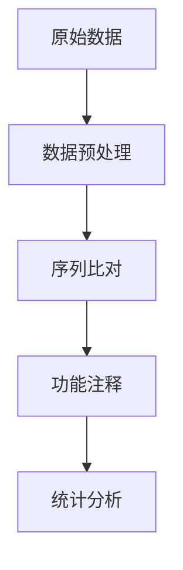

                 


# 微生物组研究对健康产业的影响与投资前景

---

## 关键词：
微生物组、健康影响、投资前景、生物信息学、精准医疗

---

## 摘要：
微生物组研究是近年来生物医学领域的重大突破之一，其在人类健康与疾病中的作用日益凸显。通过分析微生物组的组成和功能，科学家们能够揭示其在疾病预防、治疗和健康管理中的潜在价值。本文从微生物组的背景与核心概念出发，深入探讨其算法原理与系统架构，结合实际案例分析其在健康产品开发和精准医疗中的应用，并展望微生物组研究的投资前景。

---

## 第1章: 微生物组研究的背景与意义

### 1.1 微生物组的定义与研究范围
微生物组是指存在于特定环境（如人体肠道、口腔或皮肤）中的所有微生物的集合，包括细菌、病毒、真菌等。其研究范围涵盖微生物的组成、功能及其与宿主的相互作用。

#### 微生物组的定义
微生物组是某一特定环境中的微生物群落的总称，通过基因测序技术可以研究其组成和功能。

#### 研究方法
1. **基因测序技术**：如16S rRNA测序和宏基因组测序。
2. **代谢组学**：研究微生物代谢产物的变化。
3. **生物信息学分析**：利用算法处理测序数据。

#### 健康影响
微生物组在人体代谢、免疫调节和疾病抵抗中起重要作用，其失衡可能导致多种疾病，如肠道炎症、代谢综合征等。

### 1.2 微生物组研究的重要意义
微生物组研究为精准医疗和健康产品开发提供了科学依据，能够帮助制定个性化健康管理方案。

---

## 第2章: 微生物组研究的核心概念与联系

### 2.1 微生物组的核心概念
微生物组的组成和功能是研究的关键，其与宿主的相互作用决定了健康状态。

#### 核心概念
1. **微生物多样性**：包括alpha多样性（群落内部）和beta多样性（群落之间）。
2. **功能代谢网络**：微生物通过代谢网络影响宿主健康。

#### ER实体关系图
```mermaid
er
  actor 微生物组 {
    --> 包含 微生物种类
    --> 包含 功能代谢网络
  }
  actor 宿主 {
    --> 受到 微生物组影响
  }
```

### 2.2 微生物组与宿主的相互作用机制
微生物组通过代谢调节和免疫调控影响宿主健康。

#### 代谢调节
微生物代谢产物如短链脂肪酸（SCFAs）对宿主能量代谢和炎症反应有重要影响。

#### 免疫调控
微生物组通过调节免疫细胞活性影响宿主免疫系统。

---

## 第3章: 微生物组研究的算法原理与数学模型

### 3.1 微生物组数据分析的流程
数据分析流程包括数据预处理、比对、注释和统计分析。

#### 数据分析流程图


#### 数据预处理
去除低质量序列和接头序列，确保数据质量。

#### 序列比对
将测序结果与参考数据库比对，确定微生物种类。

### 3.2 微生物组数据分析的数学模型
#### Alpha多样性指数计算
$$ \text{Shannon指数} = -\sum_{i=1}^{n} p_i \ln p_i $$
其中，\( p_i \) 是第i个微生物的相对丰度。

---

## 第4章: 系统分析与架构设计

### 4.1 系统功能设计
#### 领域模型


### 4.2 系统架构设计
#### 系统架构图


---

## 第5章: 项目实战

### 5.1 研究案例：肠道菌群与代谢综合征
#### 研究设计
分析代谢综合征患者与健康人群的肠道菌群差异。

#### 数据分析
使用16S rRNA测序和代谢组学数据，结合机器学习方法进行分类。

#### 代码示例
```python
# 计算微生物组差异
import pandas as pd
from sklearn.decomposition import PCA

data = pd.read_csv('microbiome_data.csv')
X = data.drop('label', axis=1)
y = data['label']

# PCA分析
pca = PCA(n_components=2)
principal_components = pca.fit_transform(X)
print(pca.explained_variance_ratio_)
```

#### 结果解读
发现特定菌种与代谢综合征显著相关，为精准治疗提供依据。

---

## 第6章: 投资分析与未来展望

### 6.1 投资机会
1. **精准医疗**：基于微生物组的个性化治疗方案。
2. **健康产品开发**：开发益生菌产品和功能性食品。

### 6.2 风险与挑战
1. **数据隐私**：微生物组数据涉及个人隐私。
2. **技术瓶颈**：数据分析的复杂性需要更多计算资源。

### 6.3 未来趋势
微生物组研究将推动个性化健康管理的发展，投资潜力巨大。

---

## 结语
微生物组研究对健康产业的影响深远，其在疾病预防、治疗和健康管理中的应用前景广阔。随着技术进步和投资增加，微生物组研究将为健康领域带来革命性变化。

