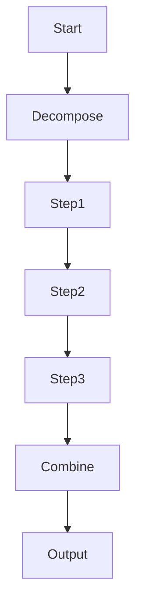
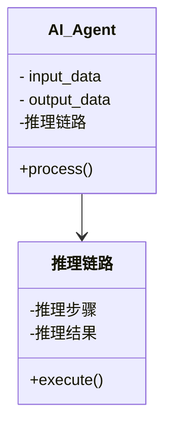
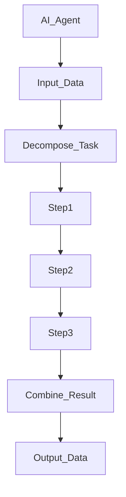

                 


# 思维链：提升AI Agent的推理能力

## 关键词：AI Agent，推理能力，思维链，算法原理，系统架构，项目实战

## 摘要：  
在AI Agent的推理能力中，思维链是一种重要的方法，通过构建逻辑推理链路来提升AI Agent的理解和决策能力。本文从背景介绍、核心概念、算法原理、系统架构到项目实战，详细探讨了思维链在提升AI Agent推理能力中的应用和实现。

---

# 第一部分：思维链与AI Agent的背景介绍

## 第1章：问题背景与问题描述

### 1.1 问题背景  
AI Agent（人工智能代理）是一种能够感知环境并采取行动以实现目标的智能体。然而，当前AI Agent的推理能力存在一定的局限性，主要体现在：  
1. **推理深度不足**：AI Agent难以处理复杂的逻辑推理问题，尤其是需要多步推理的任务。  
2. **上下文理解有限**：AI Agent在处理复杂场景时，缺乏对上下文的深度理解，导致推理结果的不准确。  
3. **动态环境适应性差**：AI Agent在动态环境中难以灵活调整推理策略，导致推理能力受限。  

### 1.2 问题描述  
为了提升AI Agent的推理能力，我们需要一种能够增强逻辑推理能力的方法。思维链作为一种基于逻辑推理的方法，通过构建推理链路，能够有效提升AI Agent的推理深度和准确性。

---

# 第二部分：思维链的核心概念与联系

## 第2章：思维链的核心概念  

### 2.1 思维链的基本原理  
思维链是一种基于逻辑推理的方法，通过构建一系列推理步骤来解决复杂问题。其核心思想是将问题分解为多个小问题，并通过逻辑推理逐步解决这些小问题。  

#### 2.1.1 思维链的逻辑结构  
思维链的逻辑结构可以分为以下几个步骤：  
1. **问题分解**：将复杂问题分解为多个小问题。  
2. **推理步骤**：对每个小问题进行逻辑推理。  
3. **结果整合**：将推理结果整合为最终答案。  

#### 2.1.2 思维链与传统推理方法的对比  
传统推理方法通常基于规则或模型进行推理，而思维链则通过构建推理链路，更加注重推理的逻辑性和连贯性。  

### 2.2 思维链的属性特征对比  

| 属性 | 思维链 | 传统推理方法 |
|------|--------|---------------|
| 输入方式 | 分解输入 | 整体输入     |
| 推理方式 | 多步推理 | 单步推理     |
| 结果输出 | 综合结果 | 单一结果     |

---

## 第3章：思维链的算法原理  

### 3.1 思维链的算法流程图  



### 3.2 思维链的数学模型  

#### 3.2.1 逻辑回归模型  
逻辑回归是一种常用的分类模型，可以用于推理步骤中的分类任务。其数学模型为：  
$$ P(y=1|x) = \frac{e^{\beta x}}{1 + e^{\beta x}} $$  

#### 3.2.2 概率推理模型  
概率推理是一种基于概率论的推理方法，可以用于处理不确定性问题。其数学模型为：  
$$ P(A|B) = \frac{P(B|A)P(A)}{P(B)} $$  

---

# 第三部分：系统分析与架构设计

## 第4章：系统分析与架构设计  

### 4.1 问题场景介绍  
假设我们有一个AI Agent需要解决一个复杂的推理问题，例如在自然语言处理中理解上下文关系。  

### 4.2 系统功能设计  

#### 4.2.1 领域模型设计  



#### 4.2.2 系统架构设计  



---

# 第四部分：项目实战

## 第5章：项目实战  

### 5.1 环境安装  
需要安装以下工具：  
1. Python 3.8及以上版本  
2. Mermaid工具  
3. Jupyter Notebook  

### 5.2 核心代码实现  

```python
def decompose_task(task):
    # 分解任务为多个步骤
    steps = []
    for step in task:
        steps.append(step)
    return steps

def execute_step(steps):
    # 执行推理步骤
    results = []
    for step in steps:
        result = process_step(step)
        results.append(result)
    return results

def process_step(step):
    # 处理单个步骤
    return "推理结果"

def combine_results(results):
    # 整合推理结果
    final_result = ""
    for result in results:
        final_result += result
    return final_result
```

### 5.3 代码解读与分析  
1. **decompose_task**：将任务分解为多个步骤。  
2. **execute_step**：执行每个推理步骤。  
3. **process_step**：处理单个步骤并返回结果。  
4. **combine_results**：整合所有推理结果并返回最终答案。  

### 5.4 实际案例分析  
假设任务是解决一个数学问题：计算 $a + b = c$。  
1. 分解任务为：解析问题、计算加法、返回结果。  
2. 执行步骤：  
   - 解析问题：$a = 1$，$b = 2$。  
   - 计算加法：$1 + 2 = 3$。  
   - 返回结果：$c = 3$。  

---

## 第6章：高级主题与拓展  

### 6.1 多智能体协作  
在多智能体环境中，思维链可以通过协作推理链路来提升推理能力。  

### 6.2 实时推理优化  
通过优化推理链路的执行效率，可以提升实时推理能力。  

### 6.3 可解释性增强  
通过记录推理链路，可以增强推理过程的可解释性。  

---

## 总结  

本文详细探讨了思维链在提升AI Agent推理能力中的应用，从背景介绍、核心概念、算法原理到系统架构和项目实战，全面分析了思维链的方法和实现。通过思维链，AI Agent能够更有效地处理复杂问题，提升推理能力和决策能力。

