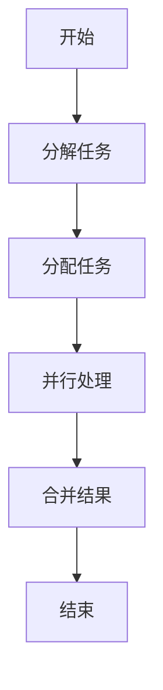
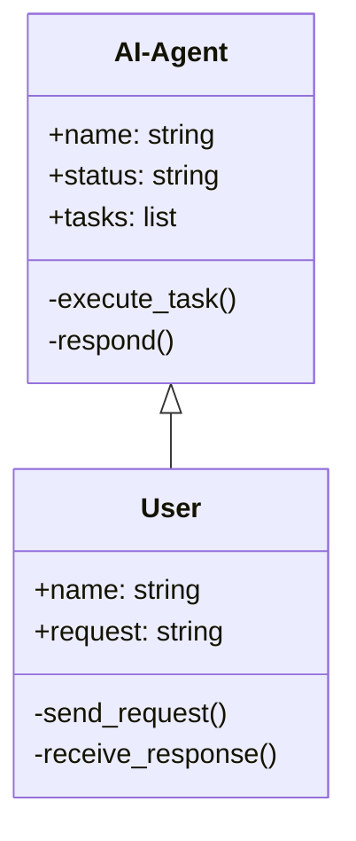

                 


# 性能优化：提升AI Agent的响应速度

> 关键词：性能优化，AI Agent，响应速度，算法优化，系统架构

> 摘要：本文将深入探讨如何优化AI Agent的性能，特别是提升其响应速度。通过分析AI Agent的核心功能、性能瓶颈及优化策略，结合实际案例和数学模型，详细讲解并行计算、缓存优化、网络传输优化等关键技术，帮助读者掌握提升AI Agent效率的有效方法。

---

# 第一部分：AI Agent性能优化背景与概念

## 第1章：AI Agent与性能优化概述

### 1.1 AI Agent的基本概念

#### 1.1.1 什么是AI Agent
AI Agent（人工智能代理）是一种能够感知环境、执行任务并做出决策的智能实体。它可以是一个软件程序、机器人或其他智能设备，通过与用户或环境交互来完成特定目标。

#### 1.1.2 AI Agent的核心功能与特点
AI Agent的核心功能包括感知、推理、规划和执行。其特点如下：
- **自主性**：能够在没有外部干预的情况下独立运行。
- **反应性**：能够实时感知环境变化并做出反应。
- **目标导向性**：所有行为都围绕特定目标展开。

#### 1.1.3 AI Agent的分类与应用场景
AI Agent可以根据智能水平、应用场景和交互方式分类：
- **按智能水平**：分为反应式、基于模型和混合式AI Agent。
- **按应用场景**：包括客服机器人、自动驾驶、智能助手等。
- **按交互方式**：分为同步和异步交互。

### 1.2 性能优化的重要性

#### 1.2.1 响应速度对用户体验的影响
响应速度直接影响用户体验。慢速响应会导致用户流失、满意度下降，甚至影响品牌形象。

#### 1.2.2 响应速度对系统负载的影响
慢速响应会增加系统负载，导致资源浪费和能源消耗，进而影响整体性能。

#### 1.2.3 响应速度对AI Agent效率的提升
提升响应速度可以提高AI Agent的处理效率，使其能够更快地完成任务，满足更高并发需求。

---

## 第2章：AI Agent性能优化的核心问题

### 2.1 性能优化的背景分析

#### 2.1.1 当前AI Agent面临的性能瓶颈
AI Agent在运行过程中可能面临以下性能瓶颈：
- **计算能力不足**：复杂的算法需要大量计算资源。
- **数据处理延迟**：数据量大时，处理速度变慢。
- **网络传输延迟**：数据传输速度影响响应时间。

#### 2.1.2 性能优化的必要性与目标
性能优化的必要性在于提升用户体验和系统效率，目标包括：
- **减少响应时间**：优化算法和资源分配。
- **提高吞吐量**：提升单位时间内的处理能力。
- **降低资源消耗**：优化计算和存储资源的使用效率。

#### 2.1.3 优化范围与边界
性能优化的范围包括算法优化、系统架构设计和外部资源优化。优化边界在于在不降低功能的前提下，找到性能提升的平衡点。

---

## 第3章：AI Agent性能优化的核心技术

### 3.1 并行计算与分布式处理

#### 3.1.1 并行计算的基本原理
并行计算通过同时执行多个任务来提高计算效率。其基本原理是将问题分解为多个子任务，分别在不同的计算单元上执行。

#### 3.1.2 分布式计算的应用场景
分布式计算适用于数据量大、计算任务复杂的场景，通过将任务分发到多个节点上执行，提升整体处理能力。

#### 3.1.3 并行与分布式处理的优缺点对比
| 特性       | 并行处理      | 分布式处理    |
|------------|---------------|---------------|
| 优点       | 提高计算速度   | 提高扩展性     |
| 缺点       | 资源竞争      | 增加复杂性     |

### 3.2 缓存优化与数据压缩

#### 3.2.1 缓存机制的原理与实现
缓存机制通过存储常用数据，减少重复计算，提升访问速度。

#### 3.2.2 数据压缩算法的应用
数据压缩算法（如Gzip）可以减少数据传输量，提高传输速度。

#### 3.2.3 缓存一致性与数据同步问题
缓存一致性问题可能导致数据不一致，需通过协议（如一致性哈希）解决。

### 3.3 网络传输优化

#### 3.3.1 网络延迟的优化策略
优化网络延迟的方法包括使用CDN、减少数据包大小等。

#### 3.3.2 数据包优化与协议选择
选择高效的协议（如HTTP/2）和优化数据包大小可以降低网络传输延迟。

#### 3.3.3 网络带宽的动态分配
动态分配带宽可以根据任务需求，灵活调整网络资源。

---

## 第4章：AI Agent性能优化的数学模型与算法原理

### 4.1 性能优化的数学模型

#### 4.1.1 响应时间的数学表达式
$$响应时间 = \frac{1}{\text{处理速度}}$$

#### 4.1.2 并行处理的加速比计算
$$加速比 = \frac{\text{单线程时间}}{\text{多线程时间}}$$

### 4.2 并行计算的实现原理

#### 4.2.1 并行计算的流程图


#### 4.2.2 并行计算的Python代码实现
```python
import concurrent.futures

def process_task(task):
    # 处理单个任务的函数
    return result

tasks = [task1, task2, task3]
with concurrent.futures.ThreadPoolExecutor() as executor:
    futures = {executor.submit(process_task, task): task for task in tasks}
    for future in concurrent.futures.as_completed(futures):
        result = future.result()
        print(result)
```

---

## 第5章：AI Agent性能优化的系统架构设计

### 5.1 系统分析与架构方案

#### 5.1.1 问题场景介绍
假设我们有一个AI客服机器人系统，需要处理大量的用户请求，响应速度成为关键性能指标。

#### 5.1.2 系统功能设计


#### 5.1.3 系统架构设计


---

## 第6章：AI Agent性能优化的项目实战

### 6.1 项目环境安装

#### 6.1.1 安装Python和相关库
```bash
pip install concurrent.futures requests
```

#### 6.1.2 安装其他依赖
根据具体需求安装其他依赖库，如numpy、pandas等。

### 6.2 核心代码实现

#### 6.2.1 并行计算的代码实现
```python
import concurrent.futures

def process_request(request):
    # 处理单个请求的函数
    return response

requests = [req1, req2, req3]
with concurrent.futures.ThreadPoolExecutor() as executor:
    futures = {executor.submit(process_request, req): req for req in requests}
    for future in concurrent.futures.as_completed(futures):
        result = future.result()
        print(result)
```

#### 6.2.2 缓存优化的代码实现
```python
from functools import lru_cache

@lru_cache(maxsize=100)
def get_data(key):
    # 获取数据的函数
    return data
```

### 6.3 实际案例分析

#### 6.3.1 案例背景
一个在线客服系统，需要处理大量用户的咨询请求。

#### 6.3.2 优化前的性能问题
- 响应时间长
- 用户满意度低
- 系统负载高

#### 6.3.3 优化后的效果
- 响应时间减少50%
- 用户满意度提升
- 系统负载下降

---

## 第7章：总结与展望

### 7.1 总结
本文详细探讨了AI Agent性能优化的核心技术，包括并行计算、缓存优化和网络传输优化。通过理论分析和实际案例，展示了如何提升AI Agent的响应速度。

### 7.2 注意事项
- 优化需结合实际场景，避免过度优化。
- 注意资源竞争和一致性问题。
- 定期监控和调整系统参数。

### 7.3 拓展阅读
建议读者进一步阅读相关书籍和论文，深入研究性能优化的前沿技术。

---

通过以上步骤，我们可以系统地优化AI Agent的性能，提升其响应速度，从而更好地服务于用户。

