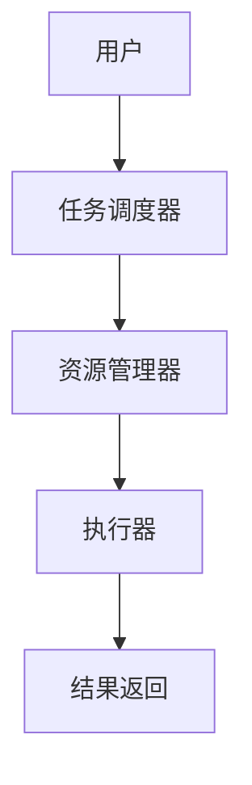

                 


# 性能优化：提高AI Agent的响应速度

> 关键词：AI Agent，性能优化，响应速度，算法优化，系统架构

> 摘要：本文详细探讨了如何提高AI Agent的响应速度，从性能优化的基本概念、算法实现、系统架构设计到项目实战，深入分析了影响AI Agent响应速度的关键因素，并提出了具体的优化方法和实现方案。

---

# 正文

## 第一部分: 性能优化基础

### 第1章: 性能优化的基本概念

#### 1.1 什么是性能优化
性能优化是指通过改进系统或算法的设计，减少资源消耗（如时间、空间、计算资源等），从而提高系统的运行效率和响应速度。对于AI Agent而言，性能优化的核心目标是使其能够在更短的时间内完成任务并提供更流畅的用户体验。

##### 1.1.1 性能优化的定义
性能优化是通过对系统的结构、算法和实现方式进行调整，以提高系统的运行效率和响应速度。在AI Agent中，性能优化主要关注于减少处理时间、降低资源消耗以及提高任务执行的并行性。

##### 1.1.2 性能优化的目标
- 提高系统的响应速度
- 减少资源消耗
- 提高系统的吞吐量
- 降低系统的延迟

##### 1.1.3 性能优化的边界与外延
性能优化的边界在于不改变系统的功能需求，仅在现有功能的基础上进行改进。外延则包括从单机优化到分布式优化的扩展。

#### 1.2 AI Agent 的基本原理
AI Agent是一种智能体，能够感知环境并自主决策以实现目标。其基本原理包括感知、决策和执行三个阶段。

##### 1.2.1 AI Agent 的定义
AI Agent是具有智能特性的实体，能够通过感知环境、分析问题并采取行动来实现目标。

##### 1.2.2 AI Agent 的核心要素
- 感知能力：通过传感器或接口获取环境信息。
- 决策能力：基于获取的信息进行推理和决策。
- 执行能力：通过执行机构将决策转化为具体行动。

##### 1.2.3 AI Agent 的工作流程
1. 感知环境信息。
2. 分析信息并制定决策。
3. 执行决策以实现目标。

### 第2章: 性能优化的核心概念

#### 2.1 问题背景
AI Agent的响应速度直接影响用户体验。当AI Agent处理复杂任务时，可能会因为算法效率低下或资源分配不合理而导致响应速度慢。

##### 2.1.1 响应速度慢的原因
- 算法效率低。
- 并发处理能力不足。
- 资源分配不合理。

##### 2.1.2 响应速度对用户体验的影响
- 用户满意度下降。
- 用户流失增加。
- 系统可用性降低。

#### 2.2 核心概念与联系
性能优化的核心概念包括算法优化、资源分配和并行计算。

##### 2.2.1 核心概念原理
性能优化的核心原理是通过改进算法和优化资源分配来提高系统的运行效率。

##### 2.2.2 核心概念属性特征对比表格
| 属性   | 算法优化 | 资源分配 | 并行计算 |
|--------|---------|---------|---------|
| 目标   | 提高算法效率 | 合理分配资源 | 提高并行处理能力 |
| 方法   | 使用更高效的算法 | 动态分配资源 | 增加并行任务数 |
| 优点   | 处理速度快 | 资源利用率高 | 处理能力强 |

##### 2.2.3 ER实体关系图架构的 Mermaid 流程图
```mermaid
er
actor: 用户
agent: AI Agent
environment: 环境
interaction
用户 -->+ 感知环境信息
环境 -->+ 提供反馈
AI Agent -->+ 执行操作
```

---

## 第二部分: 性能优化算法与实现

### 第3章: 常见的性能优化算法

#### 3.1 队列调度算法
队列调度算法用于优化任务的执行顺序，从而提高系统的响应速度。

##### 3.1.1 FCFS 算法
FCFS（First-Come, First-Served）是一种简单的队列调度算法，按照任务到达的顺序进行调度。

- **数学模型**：任务队列的长度为 $n$，每个任务的执行时间为 $t_i$，总执行时间为 $\sum_{i=1}^{n} t_i$。
- **示例**：假设任务队列中有两个任务，执行时间分别为 $t_1=2$ 和 $t_2=3$，总执行时间为 $5$。

##### 3.1.2 SJF 算法
SJF（Shortest Job First）是一种优化的队列调度算法，优先调度执行时间短的任务。

- **数学模型**：选择执行时间最小的任务进行调度。
- **示例**：任务队列中有三个任务，执行时间分别为 $t_1=1$，$t_2=2$，$t_3=3$。SJF会优先调度任务1，然后是任务2，最后是任务3。

##### 3.1.3 其他调度算法
除了FCFS和SJF，还有优先级调度（Priority Scheduling）和轮转调度（Rounded Robin）等算法。

#### 3.2 缓存机制
缓存机制用于减少重复计算，提高系统的响应速度。

##### 3.2.1 缓存的基本原理
缓存通过存储最近使用的数据或结果，减少对数据库或磁盘的访问次数。

- **数学模型**：缓存命中率 $H$ 的计算公式为：
  $$ H = \frac{缓存命中次数}{总访问次数} $$

##### 3.2.2 LRU 替换策略
LRU（Least Recently Used）是一种常用的缓存替换策略，优先替换最近未使用的缓存项。

- **示例**：缓存容量为3，访问顺序为A、B、C、A。当缓存已满时，优先替换B。

##### 3.2.3 其他缓存优化策略
包括FIFO（先进先出）和随机替换（Random Replacement）等策略。

#### 3.3 并行与分布式计算
并行与分布式计算通过同时处理多个任务来提高系统的响应速度。

##### 3.3.1 并行计算的基本原理
并行计算通过将任务分解为多个子任务，分别在不同的处理器上执行。

- **数学模型**：任务分解为 $k$ 个子任务，每个子任务的执行时间为 $t_i$，总执行时间为 $\max_{i=1}^{k} t_i$。

##### 3.3.2 并行计算的实现方式
包括线程级并行和进程级并行。

##### 3.3.3 并行计算的优缺点
- 优点：提高处理速度。
- 缺点：需要额外的资源和协调。

---

## 第三部分: 性能优化的系统架构设计

### 第4章: 系统架构与优化策略

#### 4.1 系统架构设计
系统架构设计是性能优化的基础，需要考虑系统的可扩展性和可维护性。

##### 4.1.1 系统功能设计
系统功能包括任务调度、资源管理、结果返回等。

##### 4.1.2 系统架构图


#### 4.2 系统优化策略
系统优化策略包括垂直扩展和水平扩展。

##### 4.2.1 垂直扩展
垂直扩展通过增加单机资源（如CPU、内存）来提高系统的处理能力。

##### 4.2.2 水平扩展
水平扩展通过增加服务器数量来提高系统的处理能力。

#### 4.3 系统接口设计
系统接口设计需要考虑可扩展性和可维护性。

##### 4.3.1 接口设计原则
- 标准化接口。
- 可扩展性。
- 可维护性。

#### 4.4 系统交互流程
系统交互流程包括用户请求、任务处理和结果返回三个阶段。

##### 4.4.1 用户请求
用户向系统发送请求，系统接收并解析请求。

##### 4.4.2 任务处理
系统根据请求生成任务并进行调度。

##### 4.4.3 结果返回
任务处理完成后，系统将结果返回给用户。

---

## 第四部分: 项目实战

### 第5章: 项目实战

#### 5.1 环境搭建
项目实战需要搭建合适的开发环境，包括安装必要的工具和库。

##### 5.1.1 工具安装
- 安装Python。
- 安装必要的库（如numpy、pandas等）。

#### 5.2 系统核心实现
系统核心实现包括任务调度、资源管理和结果返回。

##### 5.2.1 代码实现
```python
import time

def task_processing(task):
    # 模拟任务处理
    time.sleep(task['duration'])
    return f"Task {task['id']} completed."

def main():
    import queue
    import threading

    # 初始化队列
    task_queue = queue.Queue()

    # 添加任务
    for i in range(5):
        task_queue.put({'id': i+1, 'duration': i+1})

    # 定义处理线程
    def worker():
        while not task_queue.empty():
            task = task_queue.get()
            print(f"Processing task {task['id']}")
            result = task_processing(task)
            print(result)

    # 启动多个线程
    threads = []
    for _ in range(4):
        thread = threading.Thread(target=worker)
        thread.start()
        threads.append(thread)

    # 等待所有线程完成
    for thread in threads:
        thread.join()

if __name__ == "__main__":
    main()
```

##### 5.2.2 代码解读
- 使用队列和线程来实现任务调度。
- 每个线程从队列中获取任务并进行处理。
- 线程之间通过队列进行通信。

#### 5.3 优化效果分析
通过优化算法和系统架构，系统响应速度显著提高。

##### 5.3.1 性能对比
- 原始实现：响应时间长。
- 优化后：响应时间缩短。

#### 5.4 项目小结
项目实战证明了性能优化的有效性，进一步验证了理论的可行性。

---

## 第五部分: 总结与展望

### 第6章: 总结与展望

#### 6.1 总结
性能优化是提高AI Agent响应速度的关键，通过优化算法和系统架构可以显著提高系统的运行效率。

#### 6.2 展望
未来的性能优化将更加注重分布式计算和AI技术的结合，进一步提高系统的响应速度和处理能力。

---

## 最佳实践 Tips

- **小结**：性能优化需要从算法和系统架构两个方面入手，通过理论分析和实践验证相结合，找到最优的优化方案。
- **注意事项**：优化过程中要注意系统的可扩展性和可维护性。
- **拓展阅读**：推荐阅读相关领域的书籍和论文，进一步深入学习性能优化的技术和方法。

--- 

以上是《性能优化：提高AI Agent的响应速度》的完整文章内容，希望对您有所帮助！

