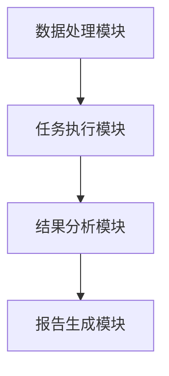

                 


---

# 《性能基准测试：评估和比较AI Agent的能力》

---

## 关键词：性能基准测试，AI Agent，性能评估，指标体系，基准测试任务，系统架构

---

## 摘要

性能基准测试是评估和比较AI Agent能力的重要手段。本文从性能基准测试的背景和基础出发，详细介绍了性能指标体系的设计、基准测试任务的设计、性能评估的数学模型、系统架构与工程实践，以及实际项目中的应用案例。通过本文的讲解，读者可以系统地了解如何设计和实施AI Agent的性能基准测试，掌握核心概念和实际操作方法。

---

## 第一部分：性能基准测试背景与基础

---

### 第1章：性能基准测试概述

#### 1.1 什么是性能基准测试

性能基准测试是一种通过标准化的测试任务和指标体系，对AI Agent的能力进行评估和比较的方法。它是人工智能领域中不可或缺的一部分，能够帮助我们量化AI Agent的表现，从而为改进算法、优化系统提供依据。

**1.1.1 性能基准测试的定义**

性能基准测试是通过设计特定的测试任务，并基于统一的指标体系，对AI Agent在不同场景下的表现进行测量和比较的过程。它能够帮助我们了解AI Agent在特定任务中的能力，从而为AI Agent的开发和优化提供方向。

**1.1.2 性能基准测试的目的**

性能基准测试的主要目的是：

- **量化能力**：通过具体的指标，量化AI Agent在不同任务中的表现。
- **比较能力**：在不同的AI Agent之间进行横向比较，找出优劣。
- **驱动改进**：通过基准测试的结果，指导算法优化和系统改进。

**1.1.3 性能基准测试的分类**

性能基准测试可以根据不同的维度进行分类：

- **任务类型**：分类任务、生成任务、交互任务。
- **评估指标**：准确率、召回率、F1分数、处理时间等。
- **测试环境**：离线测试、在线测试、模拟环境测试。

---

#### 1.2 AI Agent的基本概念

AI Agent是一种能够感知环境并采取行动以实现目标的智能体。它是人工智能的核心实现形式之一，广泛应用于自然语言处理、机器学习、机器人控制等领域。

**1.2.1 AI Agent的定义**

AI Agent是指能够通过感知环境信息，自主决策并采取行动，以实现特定目标的智能系统。它可以是一个软件程序，也可以是一个物理设备。

**1.2.2 AI Agent的核心能力**

AI Agent的核心能力包括：

- **感知能力**：通过传感器或数据输入，获取环境信息。
- **决策能力**：基于感知信息，做出决策。
- **执行能力**：根据决策结果，采取行动。

**1.2.3 AI Agent的应用场景**

AI Agent的应用场景非常广泛，包括：

- **自然语言处理**：如智能对话系统。
- **推荐系统**：如个性化推荐。
- **机器人控制**：如工业机器人。
- **自动驾驶**：如自动驾驶汽车。

---

#### 1.3 性能评估的重要性

性能评估是AI Agent开发和优化过程中不可或缺的一部分，它能够帮助我们了解AI Agent的能力，指导改进方向。

**1.3.1 性能评估在AI Agent中的作用**

- **量化能力**：通过具体的指标，量化AI Agent的表现。
- **比较能力**：在不同的AI Agent之间进行比较，找出优劣。
- **驱动改进**：通过评估结果，指导算法优化和系统改进。

**1.3.2 性能评估的挑战与难点**

- **指标设计**：如何设计合理的指标体系，全面反映AI Agent的能力。
- **任务设计**：如何设计具有代表性的测试任务，避免偏差。
- **数据获取**：如何获取高质量的测试数据，确保评估结果的准确性。

**1.3.3 性能评估的未来发展趋势**

- **多维度评估**：从单一指标向多维度指标体系发展。
- **动态评估**：适应动态变化的环境，实时评估AI Agent的表现。
- **可解释性评估**：评估结果不仅要准确，还要可解释。

---

## 第二部分：性能基准测试的核心概念与理论

---

### 第2章：性能指标体系

#### 2.1 性能指标的设计原则

**2.1.1 指标的全面性**

性能指标的设计需要全面反映AI Agent的能力，包括准确性、效率、可扩展性等多个方面。

**2.1.2 指标的可量化性**

指标需要能够量化，可以通过具体的数值进行比较。

**2.1.3 指标的可比较性**

指标需要能够在不同的AI Agent之间进行比较，具有统一的标准。

---

#### 2.2 常见的性能指标

**2.2.1 准确率**

准确率是分类任务中常用的指标，表示正确预测的样本数占总样本数的比例。

$$ \text{准确率} = \frac{\text{正确预测数}}{\text{总样本数}} $$

**2.2.2 召回率**

召回率是分类任务中另一个常用的指标，表示正确预测的正样本数占所有正样本数的比例。

$$ \text{召回率} = \frac{\text{正确预测的正样本数}}{\text{所有正样本数}} $$

**2.2.3 F1分数**

F1分数是准确率和召回率的调和平均数，能够综合反映分类模型的表现。

$$ F1 = \frac{2 \times \text{准确率} \times \text{召回率}}{\text{准确率} + \text{召回率}} $$

**2.2.4 处理时间**

处理时间是衡量AI Agent效率的重要指标，表示完成一个任务所需的时间。

**2.2.5 资源消耗**

资源消耗是衡量AI Agent效率的另一个指标，表示完成任务所需的计算资源。

---

#### 2.3 指标体系的层次结构

性能指标体系的层次结构包括任务层面的指标、系统层面的指标和用户层面的指标。

- **任务层面的指标**：准确率、召回率、F1分数等。
- **系统层面的指标**：处理时间、资源消耗等。
- **用户层面的指标**：用户满意度、任务完成度等。

---

### 第3章：基准测试任务的设计

#### 3.1 基准测试任务的分类

**3.1.1 分类任务**

分类任务是将数据划分为不同的类别，如文本分类、图像分类等。

**3.1.2 回答生成任务**

回答生成任务是生成与输入相关的文本，如对话生成、文本摘要等。

**3.1.3 交互任务**

交互任务是与AI Agent进行交互，如语音识别、自动驾驶决策等。

---

#### 3.2 基准测试任务的设计原则

**3.2.1 任务的代表性**

设计的任务需要具有代表性，能够反映实际应用场景中的问题。

**3.2.2 任务的可重复性**

设计的任务需要能够在不同的环境下重复执行，确保评估结果的可重复性。

**3.2.3 任务的可扩展性**

设计的任务需要具有可扩展性，能够适应不同的数据规模和复杂度。

---

#### 3.3 基准测试任务的实施步骤

**3.3.1 确定测试目标**

明确基准测试的目标，如评估分类任务的准确率。

**3.3.2 设计测试场景**

设计具体的测试场景，如在ImageNet数据集上进行图像分类任务。

**3.3.3 收集测试数据**

收集高质量的测试数据，确保数据的多样性和代表性。

**3.3.4 执行测试任务**

执行基准测试任务，记录测试结果。

**3.3.5 分析测试结果**

分析测试结果，找出优劣并提出改进建议。

---

## 第三部分：性能基准测试的算法与数学模型

---

### 第4章：性能评估的数学模型

#### 4.1 统计分析方法

**4.1.1 均值与标准差**

均值是数据的平均值，标准差是数据与均值之间差异的度量。

$$ \text{均值} = \frac{\sum x_i}{n} $$

$$ \text{标准差} = \sqrt{\frac{\sum (x_i - \text{均值})^2}{n}} $$

**4.1.2 显著性检验**

显著性检验用于判断两个样本之间的差异是否显著。

$$ t = \frac{\text{均值差}}{\text{标准误差}} $$

---

### 第5章：算法原理与实现

#### 5.1 分类任务的评估指标

**5.1.1 准确率计算**

以一个简单的分类任务为例，计算准确率：

```python
def calculate_accuracy(y_true, y_pred):
    return sum(y_true == y_pred) / len(y_true)
```

**5.1.2 召回率计算**

计算召回率：

```python
def calculate_recall(y_true, y_pred):
    true_positive = sum((y_true == 1) & (y_pred == 1))
    false_negative = sum((y_true == 1) & (y_pred == 0))
    return true_positive / (true_positive + false_negative)
```

---

## 第四部分：系统架构与工程实践

---

### 第6章：系统架构设计

#### 6.1 基准测试系统的功能模块

基准测试系统主要包括以下几个功能模块：

- **数据处理模块**：负责数据的采集、预处理和存储。
- **任务执行模块**：负责执行具体的基准测试任务。
- **结果分析模块**：负责分析测试结果并生成报告。

---

#### 6.2 系统架构图



---

## 第五部分：项目实战

---

### 第7章：项目实战与分析

#### 7.1 项目背景

本项目旨在设计一个AI Agent的性能基准测试系统，用于评估不同模型在分类任务中的表现。

#### 7.2 项目实现

**7.2.1 环境安装**

安装所需的依赖库：

```bash
pip install numpy pandas scikit-learn
```

**7.2.2 核心代码实现**

实现基准测试的核心代码：

```python
import numpy as np
from sklearn.metrics import accuracy_score, recall_score, f1_score

def evaluate_model(y_true, y_pred):
    accuracy = accuracy_score(y_true, y_pred)
    recall = recall_score(y_true, y_pred)
    f1 = f1_score(y_true, y_pred)
    return {
        'accuracy': accuracy,
        'recall': recall,
        'f1': f1
    }
```

---

## 第六部分：总结与展望

---

### 第8章：总结与展望

#### 8.1 总结

通过本文的讲解，我们系统地了解了性能基准测试的核心概念和实施方法，包括性能指标体系的设计、基准测试任务的设计、系统架构与工程实践等。

#### 8.2 未来展望

性能基准测试在AI Agent的发展中将发挥越来越重要的作用，未来的研究方向包括：

- **多维度评估**：设计更加全面的指标体系。
- **动态评估**：适应动态变化的环境，实时评估AI Agent的表现。
- **可解释性评估**：评估结果不仅要准确，还要可解释。

---

## 第七部分：最佳实践与注意事项

---

### 第9章：最佳实践与注意事项

#### 9.1 最佳实践

- **明确测试目标**：在进行基准测试之前，明确测试的目标和范围。
- **选择合适的指标**：根据任务类型选择合适的性能指标。
- **保证数据质量**：确保测试数据的多样性和代表性。
- **记录实验过程**：详细记录实验过程和结果，便于后续分析和改进。

#### 9.2 注意事项

- **避免过拟合**：在设计基准测试任务时，避免过拟合特定数据集。
- **保持客观性**：在分析测试结果时，保持客观，避免主观判断。
- **持续优化**：根据测试结果，持续优化AI Agent的性能。

---

### 第10章：小结

性能基准测试是评估和比较AI Agent能力的重要手段，本文通过详细的讲解，帮助读者掌握了性能基准测试的核心概念和实施方法。未来，随着AI技术的不断发展，性能基准测试将发挥越来越重要的作用，为AI Agent的开发和优化提供有力支持。

---

