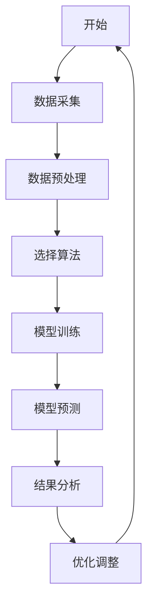
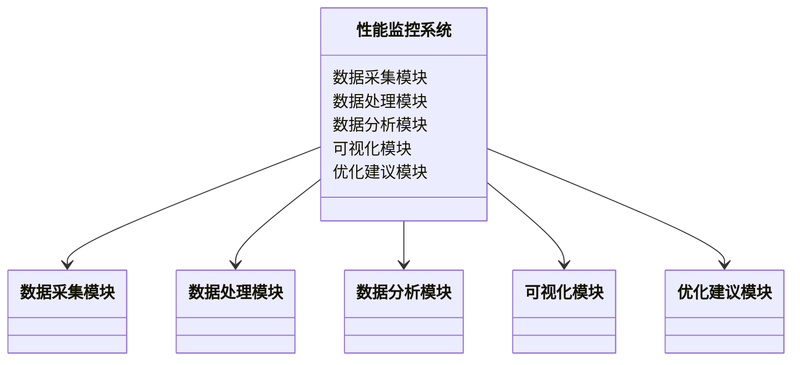

                 

<think>
好的，我现在要根据用户提供的《性能监控与持续优化》的目录大纲和具体要求，撰写一篇符合所有条件的文章。首先，我需要理解用户的需求，然后逐步展开各个章节的内容，确保每一部分都详细、清晰，并符合格式要求。

### 第一部分：性能监控概述

#### 1.1 什么是性能监控
- **定义**：性能监控是指对系统或应用程序的运行状态进行实时或定期的监测和分析，以识别和解决性能问题，确保系统高效稳定运行。
- **重要性**：在现代软件开发中，性能监控是确保用户体验和系统可用性的关键环节。通过监控，可以及时发现和解决性能瓶颈，优化系统性能，提升用户满意度。
- **范围与边界**：性能监控的范围包括系统资源使用情况（如CPU、内存、磁盘I/O等）、应用程序响应时间、网络性能等。边界在于不干扰系统的正常运行，同时确保监控数据的准确性和及时性。

### 1.2 性能监控的核心概念
- **指标体系**：性能监控依赖于一系列关键指标，如响应时间、吞吐量、错误率等。这些指标帮助我们量化系统的性能表现。
- **工具与方法**：常用的工具包括Prometheus、Grafana、New Relic等。方法包括被动监控（问题发生后分析）和主动监控（定期检查系统状态）。
- **流程与步骤**：从定义监控目标开始，选择合适的工具和指标，采集数据，分析数据，识别问题，并进行优化。

### 1.3 性能监控的背景与应用
- **背景**：随着应用程序规模的扩大和复杂性的增加，性能监控变得越来越重要。特别是在分布式系统中，性能监控能够帮助我们快速定位问题，避免系统崩溃。
- **应用**：性能监控广泛应用于Web应用、数据库、网络服务等领域。例如，电商网站需要确保在高并发情况下系统能够正常运行，避免订单丢失或用户体验下降。
- **未来趋势**：随着人工智能和机器学习的应用，性能监控将更加智能化，能够自动识别异常情况并提出优化建议。

### 第二部分：性能监控的核心概念与联系

#### 2.1 性能监控的指标体系
- **分类**：指标可以分为资源使用指标（如CPU使用率）、应用性能指标（如响应时间）和用户行为指标（如用户点击率）。
- **关系与依赖**：指标之间相互关联，例如CPU使用率高可能导致响应时间增加，进而影响用户体验。
- **选择原则**：选择指标时需要考虑其相关性、可测性和可操作性，确保能够准确反映系统性能。

#### 2.2 性能监控的工具与技术
- **工具对比**：Prometheus适合复杂的分布式系统监控，Grafana则擅长数据可视化。New Relic提供全面的SaaS解决方案，适合中小型企业。
- **技术优缺点**：主动监控能够及时发现问题，但需要配置合理的采集频率；被动监控依赖于用户的反馈，可能无法覆盖所有问题。
- **选择策略**：根据系统的规模和复杂性选择工具，同时考虑团队的技术能力和预算限制。

#### 2.3 性能监控的流程与步骤
- **确定目标**：明确监控的目标，如提高系统响应速度、减少错误率等。
- **数据采集**：通过各种工具采集系统资源、日志等数据。
- **数据分析**：使用统计方法或机器学习算法分析数据，识别异常情况。
- **问题定位与优化**：根据分析结果定位问题，采取优化措施，如调整配置、优化代码等。

### 第三部分：性能监控的算法原理

#### 3.1 基于统计的异常检测算法
- **基本原理**：统计方法通过分析数据的分布情况，识别偏离正常范围的数据点。
- **实现方法**：包括Z-score、标准差法等，适用于处理连续型数据。
- **应用场景**：适合检测系统资源使用异常，如CPU使用率突然升高。

#### 3.2 基于机器学习的性能预测算法
- **基本原理**：利用历史数据训练模型，预测未来的性能表现。
- **实现方法**：使用回归分析、时间序列分析等机器学习算法。
- **应用场景**：可以预测系统在高负载下的响应时间，提前采取优化措施。

#### 3.3 算法流程图

### 第四部分：性能监控的系统分析与架构设计

#### 4.1 系统功能设计
- **模块划分**：包括数据采集模块、数据处理模块、数据分析模块、可视化模块和优化建议模块。
- **模块关系**：数据采集模块收集原始数据，数据处理模块清洗和转换数据，数据分析模块进行分析，可视化模块呈现结果，优化建议模块根据分析结果提出建议。
- **实现方式**：各模块通过接口进行通信，确保数据流畅通。

#### 4.2 系统架构设计

#### 4.3 系统接口设计
- **接口定义**：系统提供RESTful API，供其他模块调用。
- **交互流程**：数据采集模块调用接口获取数据，数据处理模块调用接口进行数据清洗，数据分析模块调用接口进行预测，可视化模块调用接口展示结果。
- **实现方式**：使用JSON格式传递数据，确保接口兼容性和数据一致性。

### 第五部分：性能监控的项目

#### 5.1 项目实战
- **环境安装**：安装Prometheus和Grafana，配置数据采集模块。
- **代码实现**：编写数据采集脚本，实现数据预处理和分析逻辑。
- **案例分析**：分析某电商平台在高并发情况下的性能表现，识别瓶颈并提出优化建议。
- **项目小结**：总结项目中的经验教训，优化监控策略，提升系统性能。

### 总结与展望
性能监控是确保系统高效运行的重要手段，随着技术的发展，监控工具和算法将更加智能化。未来，性能监控将与DevOps和AIOps（人工智能运维）更加紧密地结合，帮助企业在复杂环境中更好地应对性能挑战。

---

以上是我根据用户提供的目录大纲和具体要求，逐步撰写的文章内容。每个部分都尽量详细展开，确保符合用户的格式和内容要求。希望这篇文章能够为读者提供有价值的信息和深入的见解。

