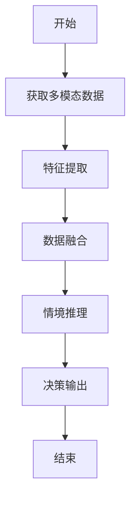

                 


# 情境感知技术的应用

> 关键词：情境感知，多模态数据，深度学习，实时反馈，智能决策，系统架构，用户意图

> 摘要：情境感知技术是一种通过多模态数据融合、环境理解与用户意图预测来实现智能决策的技术。本文将从基本概念、核心算法、系统架构、项目实战等多方面详细解析情境感知技术，并通过实际案例分析其在智能手机、智能家居、自动驾驶等领域的广泛应用。最后，我们将总结情境感知技术的优势与挑战，并展望其未来发展方向。

---

## 第1章：情境感知技术概述

### 1.1 情境感知的基本概念

#### 1.1.1 情境感知的定义与内涵
情境感知（Context-Aware Computing）是指系统能够根据当前的环境、用户状态和任务需求，动态调整自身行为的技术。其核心在于理解“情境”——即用户所处的环境、时间和目标。

- **环境**：包括物理环境（如地理位置、温度、光线）和数字环境（如设备状态、网络条件）。
- **用户状态**：包括用户的身份、情绪、注意力等。
- **任务需求**：用户当前的目标或意图。

#### 1.1.2 情境感知的核心要素
情境感知的核心要素可以总结为“3C”：
- **Context（情境）**：用户所处的环境和状态。
- **Content（内容）**：与当前情境相关的信息。
- **Conduits（通道）**：用于传递情境信息和操作指令的媒介。

#### 1.1.3 情境感知与相关技术的区分
- **区别于单纯的数据采集**：情境感知不仅仅是采集数据，而是对数据进行语义理解和关联分析。
- **区别于传统的人工智能**：情境感知更注重动态环境下的实时推理和自适应决策。

### 1.2 情境感知技术的背景与发展趋势

#### 1.2.1 情境感知技术的起源
情境感知的概念最早可以追溯到20世纪90年代，随着移动计算和物联网技术的发展，情境感知逐渐从理论走向实际应用。

#### 1.2.2 当前技术发展现状
- **多模态数据融合**：整合来自传感器、摄像头、麦克风等多种数据源的信息。
- **深度学习的普及**：通过神经网络模型进行复杂的情境推理。
- **实时性增强**：低延迟、高响应的实时处理能力。

#### 1.2.3 情境感知的未来趋势
- **边缘计算的普及**：将计算能力推向数据源端，减少延迟。
- **人机协作增强**：通过更自然的交互方式提升用户体验。
- **跨领域应用扩展**：从消费电子扩展到医疗、教育、工业等领域。

### 1.3 情境感知技术的应用领域

#### 1.3.1 智能手机与移动应用
- **场景切换**：根据位置和时间自动调整屏幕亮度、通知策略。
- **智能助手**：基于用户的日历和位置提供个性化建议。

#### 1.3.2 智慧城市与物联网
- **智能交通**：实时调整信号灯以优化交通流量。
- **环境监测**：根据空气质量动态调整公共空间的通风系统。

#### 1.3.3 智能家居与可穿戴设备
- **智能家居**：根据用户的习惯自动调节室内温度、灯光。
- **可穿戴设备**：实时监测用户的健康状况并提供个性化建议。

#### 1.3.4 智能交通与自动驾驶
- **自动驾驶**：通过环境感知和用户意图预测实现安全驾驶。
- **共享出行**：根据用户行为优化车辆调度。

---

## 第2章：情境感知的核心概念与技术原理

### 2.1 情境感知的核心概念

#### 2.1.1 情境模型与情境表示
- **情境模型**：描述情境的结构和关系，例如用户、环境、设备之间的关系。
- **情境表示**：将情境信息转化为可计算的形式，例如向量表示或符号表示。

#### 2.1.2 用户意图预测与行为分析
- **意图预测**：通过用户的历史行为和当前环境推测用户的下一步操作。
- **行为分析**：分析用户的动作频率、时间分布等特征，识别异常行为。

#### 2.1.3 环境感知与情境推理
- **环境感知**：通过传感器获取环境信息，例如温度、湿度、光照等。
- **情境推理**：结合环境信息和用户行为，推断出更高级的情境信息，例如用户是否在工作状态。

### 2.2 情境感知的技术原理

#### 2.2.1 多模态数据融合
- **多模态数据**：包括文本、图像、语音、传感器数据等多种类型的数据。
- **融合方法**：使用加权融合、基于模型的融合等方法，将多模态数据整合为统一的表示。

#### 2.2.2 实时感知与反馈机制
- **实时感知**：通过边缘计算和高效算法实现低延迟的实时处理。
- **反馈机制**：系统根据用户的反馈调整自身的行为，例如用户对推荐结果的点击或忽略。

#### 2.2.3 智能决策与自适应调整
- **智能决策**：基于情境推理的结果，选择最优的操作策略。
- **自适应调整**：根据动态变化的环境和用户需求，实时调整系统的行为。

---

## 第3章：情境感知的核心概念对比与ER实体关系图

### 3.1 核心概念对比分析

#### 3.1.1 情境感知与其他感知技术的对比
| 技术 | 描述 | 优缺点 |
|------|------|--------|
| 单一传感器感知 | 仅依赖单一传感器（如温度传感器） | 信息片面，抗干扰能力弱 |
| 多模态感知 | 结合多种传感器数据 | 信息全面，抗干扰能力强 |
| 情境感知 | 基于环境、用户行为和意图的综合分析 | 能够理解上下文，提供个性化服务 |

#### 3.1.2 不同情境模型的优劣势分析
| 模型 | 描述 | 优缺点 |
|------|------|--------|
| 基于规则的模型 | 使用预定义的规则进行情境推理 | 易实现，但灵活性差 |
| 统计模型 | 基于概率和统计方法进行情境推理 | 精度较高，但需要大量数据支持 |
| 深度学习模型 | 使用神经网络进行端到端学习 | 表现优异，但需要大量计算资源 |

#### 3.1.3 数据源与应用场景的关联性分析
- **数据源**：包括传感器数据、用户行为数据、环境数据等。
- **应用场景**：不同场景对数据源的需求不同，例如自动驾驶需要高精度的环境感知数据，而智能家居则更注重用户行为数据。

### 3.2 ER实体关系图

```mermaid
erDiagram
    actor User {
        <属性> 用户ID
        <属性> 用户状态
    }
    actor Environment {
        <属性> 环境ID
        <属性> 环境特征
    }
    actor Device {
        <属性> 设备ID
        <属性> 设备类型
    }
    actor Context {
        <属性> 情境ID
        <属性> 情境描述
    }
    relation "属于" User -- Context
    relation "感知" Environment -- Context
    relation "触发" Device -- Context
```

---

## 第4章：情境感知算法原理与数学模型

### 4.1 情境感知算法概述

#### 4.1.1 基于统计的学习算法
- **支持向量机（SVM）**：用于分类和回归任务。
- **随机森林（Random Forest）**：用于分类和回归任务，具有较强的鲁棒性。

#### 4.1.2 基于深度学习的模型
- **卷积神经网络（CNN）**：适用于图像数据的处理。
- **循环神经网络（RNN）**：适用于序列数据的处理，如语音识别。

#### 4.1.3 基于规则的推理算法
- **专家系统**：基于预定义的规则进行推理。
- **模糊逻辑**：处理模糊信息，如用户情绪的判断。

### 4.2 情境感知的数学模型

#### 4.2.1 概率模型与贝叶斯网络
- **贝叶斯网络**：通过概率分布描述变量之间的关系。
  $$ P(A|B) = \frac{P(B|A)P(A)}{P(B)} $$
- **马尔可夫链**：描述系统在不同状态之间的转移概率。

#### 4.2.2 关联规则挖掘
- **关联规则**：发现数据中的频繁项集，例如用户购买行为中的关联规则。
  $$ 支持度 = \frac{\text{频繁项集的出现次数}}{\text{总交易次数}} $$

#### 4.2.3 时间序列分析
- **ARIMA模型**：用于时间序列的预测。
- **LSTM网络**：适用于长序列数据的预测。

### 4.3 算法流程图



### 4.4 数学公式与实例分析

#### 4.4.1 概率公式
$$ P(A|B) = \frac{P(B|A)P(A)}{P(B)} $$
- **例子**：计算用户在下雨天打伞的概率。

#### 4.4.2 分类算法
$$ y = \text{sign}(w \cdot x + b) $$
- **例子**：使用感知机算法进行用户行为分类。

---

## 第5章：情境感知系统的架构与实现

### 5.1 系统架构设计

#### 5.1.1 系统功能设计
- **数据采集模块**：负责采集多模态数据。
- **情境推理模块**：对数据进行融合和推理。
- **决策输出模块**：根据推理结果输出决策。

#### 5.1.2 系统架构图


#### 5.1.3 接口设计
- **输入接口**：传感器数据接口、用户输入接口。
- **输出接口**：设备控制接口、用户反馈接口。

#### 5.1.4 交互设计
- **用户界面**：图形化界面、语音交互。
- **设备交互**：通过API与第三方设备进行通信。

### 5.2 项目实战：智能办公场景下的设备控制

#### 5.2.1 项目介绍
- **目标**：实现基于情境感知的智能办公环境。
- **需求**：根据用户的行为和环境自动调整室内温度、灯光、空气质量等。

#### 5.2.2 核心代码实现

```python
import numpy as np
from sklearn.svm import SVC

# 示例：基于SVM的情境分类
def main():
    # 数据加载
    data = np.loadtxt('context_data.csv', delimiter=',')
    labels = np.loadtxt('context_labels.csv', delimiter=',')

    # 训练模型
    model = SVC()
    model.fit(data, labels)

    # 预测情境
    new_context = np.array([[25, 500, 1]])
    prediction = model.predict(new_context)
    print(f"预测结果：{prediction}")

if __name__ == "__main__":
    main()
```

#### 5.2.3 实际案例分析
- **案例**：用户在会议期间，系统根据室内温度和用户行为自动调节空调温度。

---

## 第6章：情境感知技术的应用案例与总结

### 6.1 情境感知技术的实际应用

#### 6.1.1 智能手机
- **场景**：根据用户的位置和时间自动调整屏幕亮度和通知策略。
- **案例**：用户在夜间行走时，系统自动开启夜视模式并降低屏幕亮度。

#### 6.1.2 智能家居
- **场景**：根据用户的习惯自动调整室内温度和灯光。
- **案例**：用户早晨起床时，系统自动开启窗帘并调节室温。

#### 6.1.3 智能交通
- **场景**：根据交通流量和天气状况实时调整信号灯。
- **案例**：在高峰时段，系统动态优化交通信号以减少拥堵。

### 6.2 情境感知技术的总结与展望

#### 6.2.1 技术优势
- **个性化体验**：能够根据用户的实时需求提供个性化服务。
- **效率提升**：通过自动化决策提高系统的运行效率。
- **安全性增强**：在自动驾驶等场景中，能够实时感知环境并做出决策。

#### 6.2.2 挑战与局限
- **数据隐私**：需要处理大量的用户数据，存在隐私泄露风险。
- **计算资源**：需要高性能计算能力以支持实时处理。
- **模型泛化能力**：在不同场景下需要模型具有良好的泛化能力。

#### 6.2.3 未来展望
- **边缘计算的普及**：将计算能力推向数据源端，减少延迟。
- **跨领域应用扩展**：从消费电子扩展到医疗、教育、工业等领域。
- **人机协作增强**：通过更自然的交互方式提升用户体验。

---

## 第7章：情境感知技术的最佳实践与小结

### 7.1 最佳实践

#### 7.1.1 数据隐私保护
- **数据加密**：对敏感数据进行加密处理。
- **最小权限原则**：只授予必要的权限。

#### 7.1.2 系统优化
- **模型优化**：通过剪枝、量化等技术降低模型复杂度。
- **算法优化**：使用更高效的算法和数据结构。

#### 7.1.3 交互设计
- **用户友好**：设计直观易用的用户界面。
- **反馈机制**：及时反馈用户操作结果。

### 7.2 小结

通过本文的详细讲解，我们全面探讨了情境感知技术的核心概念、算法原理、系统架构以及实际应用。情境感知技术作为一种能够理解上下文、提供个性化服务的技术，正在改变我们的生活方式和工作方式。未来，随着技术的进步和应用场景的扩展，情境感知技术将发挥更大的作用，为人类创造更智能、更便捷的生活体验。

---

## 第8章：拓展阅读与参考资料

### 8.1 拓展阅读
- **《Context-Aware Computing: Principles and Practice》**：深入讲解情境感知的基本原理和应用场景。
- **《Deep Learning for Context-Aware Systems》**：探讨深度学习在情境感知中的应用。

### 8.2 参考资料
- **GitHub开源项目**：搜索“context-aware computing”获取更多开源项目。
- **学术论文**：查阅顶级会议（如CVPR、ICML）的相关论文。

---

## 附录：情境感知技术的数学公式总结

### 附录A：概率模型公式

$$ P(A|B) = \frac{P(B|A)P(A)}{P(B)} $$

### 附录B：时间序列模型公式

$$ y_t = \beta_1 y_{t-1} + \beta_2 y_{t-2} + \epsilon_t $$

### 附录C：分类算法公式

$$ y = \text{sign}(w \cdot x + b) $$

---

通过以上章节的详细讲解，我们希望能够为读者提供一个全面、系统的情境感知技术的知识框架，帮助读者更好地理解和应用这一技术。

