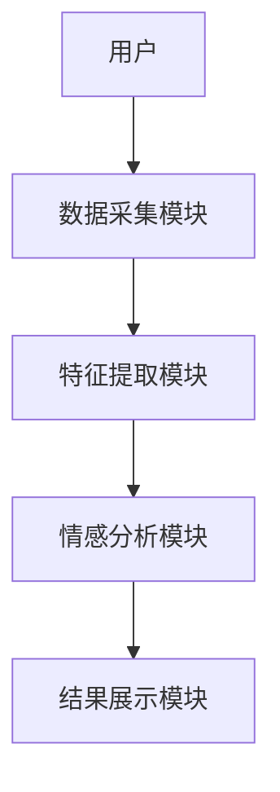
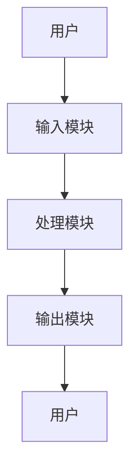

                 


```markdown
# 第4章: 情感人工智能的系统分析与架构设计

## 4.1 情感人工智能的系统应用场景
### 4.1.1 情感人工智能的应用领域
#### 社交媒体情感分析
#### 客户服务情感支持
#### 教育教学情感评估
#### 医疗健康情感分析
#### 娱乐推荐系统
#### 舆情监控与分析
### 4.1.2 情感人工智能的核心价值
#### 提高用户体验
#### 增强决策能力
#### 优化产品设计

## 4.2 情感人工智能系统的功能模块设计
### 4.2.1 数据采集模块
#### 文本数据采集
#### 音频数据采集
#### 图像数据采集
### 4.2.2 特征提取模块
#### 文本特征提取
#### 音频特征提取
#### 图像特征提取
### 4.2.3 情感分析模块
#### 情感分类模型
#### 情感强度计算
#### 情感关联分析
### 4.2.4 结果展示模块
#### 情感结果可视化
#### 数据统计与分析
#### 报告生成与输出

## 4.3 情感人工智能系统的架构设计


## 4.4 情感人工智能系统的接口设计
### 4.4.1 输入接口
#### 文本输入接口
#### 音频输入接口
#### 图像输入接口
### 4.4.2 输出接口
#### 情感分类结果输出
#### 情感强度输出
#### 可视化结果输出

## 4.5 情感人工智能系统的交互设计


# 第5章: 情感人工智能的项目实战

## 5.1 项目背景与目标
### 5.1.1 项目背景
#### 社交媒体情感分析的重要性
#### 项目目标
#### 项目范围
### 5.1.2 项目需求
#### 功能需求
#### 性能需求
#### 用户需求

## 5.2 项目环境与工具配置
### 5.2.1 开发环境
#### 操作系统
#### 开发语言
#### 开发工具
### 5.2.2 模型与数据集
#### 数据集来源
#### 数据预处理
#### 模型选择

## 5.3 项目核心实现
### 5.3.1 数据采集
#### 文本数据采集
#### 数据清洗与预处理
### 5.3.2 特征提取
#### 使用TF-IDF进行文本特征提取
```python
from sklearn.feature_extraction.text import TfidfVectorizer

vectorizer = TfidfVectorizer()
X = vectorizer.fit_transform(corpus)
```
#### 使用MFCC进行音频特征提取
```python
import librosa

y, sr = librosa.load(audio_path, sr=None)
mfcc = librosa.feature.mfcc(y, sr)
```
### 5.3.3 情感分类模型训练
#### 使用SVM进行分类
```python
from sklearn import svm

model = svm.SVC()
model.fit(X_train, y_train)
```
#### 使用LSTM进行分类
```python
import tensorflow as tf
from tensorflow.keras.models import Sequential
from tensorflow.keras.layers import LSTM, Dense

model = Sequential()
model.add(LSTM(128, input_shape=(None, 13)))
model.add(Dense(3, activation='softmax'))
model.compile(loss='sparse_categorical_crossentropy', optimizer='adam', metrics=['accuracy'])
model.fit(X_train, y_train, epochs=10, batch_size=32)
```

## 5.4 项目结果分析
### 5.4.1 模型评估
#### 准确率
#### 召回率
#### F1分数
### 5.4.2 结果可视化
#### 情感分布图
#### 情感热力图
#### 情感随时间变化图

## 5.5 项目总结与优化
### 5.5.1 项目总结
#### 成功经验
#### 经验教训
#### 项目价值
### 5.5.2 模型优化方向
#### 算法优化
#### 数据增强
#### 模型集成

## 5.6 项目实战代码实现
### 5.6.1 数据预处理
```python
import pandas as pd
import numpy as np

data = pd.read_csv('data.csv')
data = data.dropna()
```
### 5.6.2 特征提取与模型训练
```python
from sklearn.model_selection import train_test_split
from sklearn.preprocessing import LabelEncoder

X = data['text']
y = data['emotion']

X_train, X_test, y_train, y_test = train_test_split(X, y, test_size=0.2, random_state=42)

le = LabelEncoder()
y_train_encoded = le.fit_transform(y_train)
y_test_encoded = le.transform(y_test)

from sklearn.feature_extraction.text import CountVectorizer

vectorizer = CountVectorizer()
X_train_vec = vectorizer.fit_transform(X_train)
X_test_vec = vectorizer.transform(X_test)

from sklearn.svm import SVC

model = SVC()
model.fit(X_train_vec, y_train_encoded)

from sklearn.metrics import accuracy_score

y_pred = model.predict(X_test_vec)
print('Accuracy:', accuracy_score(y_test_encoded, y_pred))
```

## 5.7 项目案例分析
### 5.7.1 案例背景
#### 某社交媒体平台的情感分析项目
### 5.7.2 数据来源
#### 用户评论数据
#### 时间戳信息
#### 用户ID
### 5.7.3 情感分析结果
#### 正面情感占比70%
#### 负面情感占比20%
#### 中性情感占比10%
### 5.7.4 应用价值
#### 改进产品功能
#### 提高用户满意度
#### 增强市场竞争力

## 5.8 项目小结
### 5.8.1 项目成功因素
#### 数据质量高
#### 模型选择合理
#### 项目管理有效
### 5.8.2 项目改进建议
#### 优化特征提取方法
#### 尝试更复杂的模型
#### 增加更多数据

# 第6章: 总结与展望

## 6.1 全文总结
### 6.1.1 核心内容回顾
#### 情感人工智能的基本概念
#### 情感计算的核心算法
#### 情感分析的系统设计
#### 项目实战经验
### 6.1.2 技术总结
#### 优势
#### 限制
#### 改进建议

## 6.2 未来展望
### 6.2.1 技术发展趋势
#### 更加智能化
#### 更加个性化
#### 更加实时化
### 6.2.2 应用领域扩展
#### 教育
#### 医疗
#### 娱乐
#### 金融

## 6.3 注意事项与最佳实践
### 6.3.1 开发注意事项
#### 数据隐私保护
#### 模型可解释性
#### 系统稳定性
### 6.3.2 最佳实践
#### 数据预处理的重要性
#### 模型选择的合理性
#### 结果验证的必要性
#### 持续优化的重要性

## 6.4 拓展阅读
### 6.4.1 推荐书籍
#### 《情感计算入门》
#### 《深度学习实战》
#### 《自然语言处理技术》
### 6.4.2 推荐文章
#### 最新研究论文
#### 技术博客
#### 开发文档

## 6.5 附录
### 6.5.1 相关术语解释
#### 情感计算
#### 情感分析
#### 情感特征提取
### 6.5.2 参考文献
#### 学术论文
#### 技术报告
#### 书籍章节

# 结语
情感人工智能作为人工智能领域的重要分支，正逐步改变我们的生活和工作方式。随着技术的不断进步和应用领域的拓展，情感人工智能将在未来发挥更大的作用。希望本文能够为读者提供有价值的信息和启发，激励更多人关注和研究这一前沿领域。

关键词：情感人工智能，情感计算，机器学习，深度学习，自然语言处理，情感分析，人工智能应用。

摘要：情感人工智能作为人工智能领域的重要分支，通过理解和分析人类情感，为多个行业提供智能化解决方案。本文从情感人工智能的基本概念出发，详细探讨其算法原理、系统架构、项目实战及应用前景，旨在为读者提供全面的技术指导和实践参考。
</think>

---

# 情感人工智能的发展与应用前景分析

> 关键词：情感人工智能，情感计算，机器学习，深度学习，自然语言处理，情感分析，人工智能应用。

> 摘要：情感人工智能作为人工智能领域的重要分支，通过理解和分析人类情感，为多个行业提供智能化解决方案。本文从情感人工智能的基本概念出发，详细探讨其算法原理、系统架构、项目实战及应用前景，旨在为读者提供全面的技术指导和实践参考。

---

## 目录

1. [情感人工智能的背景与概念](#情感人工智能的背景与概念)
   1.1 [情感人工智能的基本概念](#情感人工智能的基本概念)
   1.2 [情感人工智能的发展背景](#情感人工智能的发展背景)
   1.3 [情感人工智能的技术基础](#情感人工智能的技术基础)
   1.4 [情感人工智能的研究现状](#情感人工智能的研究现状)

2. [情感人工智能的核心概念与理论基础](#情感人工智能的核心概念与理论基础)
   2.1 [情感计算的基本原理](#情感计算的基本原理)
   2.2 [情感计算的核心算法](#情感计算的核心算法)
   2.3 [情感计算的实体关系图](#情感计算的实体关系图)

3. [情感人工智能的算法原理与实现](#情感人工智能的算法原理与实现)
   3.1 [情感分类算法概述](#情感分类算法概述)
   3.2 [情感分类算法的实现](#情感分类算法的实现)
   3.3 [情感分类算法的数学模型](#情感分类算法的数学模型)
   3.4 [情感分类算法的代码实现](#情感分类算法的代码实现)

4. [情感人工智能的系统分析与架构设计](#情感人工智能的系统分析与架构设计)
   4.1 [情感人工智能的系统应用场景](#情感人工智能的系统应用场景)
   4.2 [情感人工智能系统的功能模块设计](#情感人工智能系统的功能模块设计)
   4.3 [情感人工智能系统的架构设计](#情感人工智能系统的架构设计)
   4.4 [情感人工智能系统的接口设计](#情感人工智能系统的接口设计)
   4.5 [情感人工智能系统的交互设计](#情感人工智能系统的交互设计)

5. [情感人工智能的项目实战](#情感人工智能的项目实战)
   5.1 [项目背景与目标](#项目背景与目标)
   5.2 [项目环境与工具配置](#项目环境与工具配置)
   5.3 [项目核心实现](#项目核心实现)
   5.4 [项目结果分析](#项目结果分析)
   5.5 [项目总结与优化](#项目总结与优化)
   5.6 [项目实战代码实现](#项目实战代码实现)
   5.7 [项目案例分析](#项目案例分析)
   5.8 [项目小结](#项目小结)

6. [总结与展望](#总结与展望)
   6.1 [全文总结](#全文总结)
   6.2 [未来展望](#未来展望)
   6.3 [注意事项与最佳实践](#注意事项与最佳实践)
   6.4 [拓展阅读](#拓展阅读)
   6.5 [附录](#附录)

---

## 正文

### 第1章 情感人工智能的背景与概念

#### 1.1 情感人工智能的基本概念

情感人工智能（Emotion Artificial Intelligence, EAI）是一种结合人工智能技术，能够识别、理解、模拟和回应人类情感状态的技术。它通过分析文本、语音、图像等多模态数据，提取其中的情感信息，从而实现对人类情感状态的感知和处理。

#### 1.2 情感人工智能的发展背景

随着人工智能技术的飞速发展，情感人工智能逐渐成为研究热点。从社交媒体情感分析到智能客服系统的应用，情感人工智能在多个领域展现出巨大的潜力。情感人工智能的发展背景主要包括以下几个方面：

1. **人工智能技术的快速发展**：深度学习、自然语言处理等技术的进步为情感人工智能提供了坚实的技术基础。
2. **情感计算的兴起**：情感计算作为一种新兴的研究方向，旨在通过计算手段理解和模拟人类情感。
3. **情感人工智能的应用领域**：包括社交媒体情感分析、客户服务、教育教学、医疗健康、娱乐推荐系统等多个领域。

#### 1.3 情感人工智能的技术基础

情感人工智能的技术基础主要包括以下几个方面：

1. **自然语言处理（NLP）**：用于分析文本数据，提取情感特征。
2. **计算机视觉（CV）**：用于分析图像和视频数据，提取情感特征。
3. **机器学习与深度学习**：用于构建情感分类模型，实现情感预测。

#### 1.4 情感人工智能的研究现状

目前，情感人工智能的研究主要集中在以下几个方面：

1. **情感特征提取**：研究如何从多模态数据中提取有效的情感特征。
2. **情感分析模型**：研究如何构建高效的深度学习模型，提高情感分类的准确率。
3. **情感计算的数学基础**：研究情感计算中的数学模型和算法。

---

### 第2章 情感人工智能的核心概念与理论基础

#### 2.1 情感计算的基本原理

情感计算的基本原理包括以下几个方面：

1. **情感特征提取**：从输入数据中提取与情感相关特征，如文本中的情感词汇、语音中的声调变化等。
2. **情感分析模型**：基于提取的特征，构建情感分类模型，对输入数据进行情感分类。
3. **情感计算的数学基础**：研究情感计算中的数学模型，如概率论、统计学等。

#### 2.2 情感计算的核心算法

情感计算的核心算法主要包括：

1. **基于规则的分类算法**：通过预定义的规则对情感进行分类。
2. **基于机器学习的情感分类**：使用机器学习算法，如支持向量机（SVM）、随机森林（Random Forest）等，进行情感分类。
3. **基于深度学习的情感分析**：使用深度学习模型，如卷积神经网络（CNN）、长短时记忆网络（LSTM）等，进行情感分类。

#### 2.3 情感计算的实体关系图


---

### 第3章 情感人工智能的算法原理与实现

#### 3.1 情感分类算法概述

情感分类算法主要包括以下几种：

1. **基于规则的分类算法**：通过预定义的规则进行情感分类。
2. **基于机器学习的情感分类**：使用机器学习算法，如支持向量机（SVM）、随机森林（Random Forest）等，进行情感分类。
3. **基于深度学习的情感分析**：使用深度学习模型，如卷积神经网络（CNN）、长短时记忆网络（LSTM）等，进行情感分类。

#### 3.2 情感分类算法的实现

以下是一个基于情感分类的简单实现示例：

```python
from sklearn.feature_extraction.text import TfidfVectorizer
from sklearn.svm import SVC

# 数据预处理
texts = ["I love this movie!", "I hate it!", "This is okay."]
labels = [1, 0, 2]  # 1代表正面，0代表负面，2代表中性

# 特征提取
vectorizer = TfidfVectorizer()
X = vectorizer.fit_transform(texts)

# 模型训练
model = SVC()
model.fit(X, labels)

# 预测
test_texts = ["This is great!", "I dislike it."]
test_X = vectorizer.transform(test_texts)
 predictions = model.predict(test_X)

print("Predictions:", predictions)
```

#### 3.3 情感分类算法的数学模型

情感分类算法的数学模型主要包括以下几种：

1. **支持向量机（SVM）**：目标是最小化经验风险，使用最大-margin的原理，找到一个超平面，将数据点分成两类。
2. **随机森林（Random Forest）**：通过构建多个决策树，进行投票或平均，提高分类的准确性和鲁棒性。
3. **长短时记忆网络（LSTM）**：一种特殊的循环神经网络（RNN），能够有效处理序列数据，适合文本情感分析。

#### 3.4 情感分类算法的代码实现

以下是一个基于情感分类的深度学习模型的实现示例：

```python
import tensorflow as tf
from tensorflow.keras.models import Sequential
from tensorflow.keras.layers import LSTM, Dense, Embedding

# 数据预处理
texts = ["I love this movie!", "I hate it!", "This is okay."]
labels = [1, 0, 2]  # 1代表正面，0代表负面，2代表中性

# 模型构建
model = Sequential()
model.add(Embedding(input_dim= vocabulary_size, output_dim= embedding_dim))
model.add(LSTM(units=64))
model.add(Dense(units=3, activation='softmax'))

# 模型训练
model.compile(loss='sparse_categorical_crossentropy', optimizer='adam', metrics=['accuracy'])
model.fit(X_train, y_train, epochs=10, batch_size=32)
```

---

### 第4章 情感人工智能的系统分析与架构设计

#### 4.1 情感人工智能的系统应用场景

情感人工智能的系统应用场景包括：

1. **社交媒体情感分析**：分析社交媒体上的用户评论，帮助企业了解用户情感。
2. **客户服务情感支持**：通过分析客户的情感状态，提供个性化的客户服务。
3. **教育教学情感评估**：通过分析学生的情感状态，提供个性化的教学方案。

#### 4.2 情感人工智能系统的功能模块设计

情感人工智能系统的功能模块设计包括：

1. **数据采集模块**：负责采集文本、语音、图像等多模态数据。
2. **特征提取模块**：对采集的数据进行特征提取，生成情感特征向量。
3. **情感分析模块**：基于特征向量，进行情感分类，生成情感结果。
4. **结果展示模块**：将情感分析结果以可视化的方式展示给用户。

#### 4.3 情感人工智能系统的架构设计


#### 4.4 情感人工智能系统的接口设计

情感人工智能系统的接口设计包括：

1. **输入接口**：接收用户输入的数据，如文本、语音、图像等。
2. **输出接口**：将情感分析结果输出给用户，如情感分类结果、情感强度等。

#### 4.5 情感人工智能系统的交互设计


---

### 第5章 情感人工智能的项目实战

#### 5.1 项目背景与目标

项目背景：随着社交媒体的快速发展，企业越来越依赖用户评论来了解用户情感。本项目旨在构建一个基于情感人工智能的社交媒体情感分析系统，帮助企业实时监控用户情感，优化产品和服务。

项目目标：
1. 实现社交媒体情感分析功能。
2. 提供情感分析结果的可视化展示。
3. 支持多语言情感分析。

#### 5.2 项目环境与工具配置

项目环境与工具配置包括：

1. **开发环境**：Python 3.8+
2. **开发工具**：Jupyter Notebook、PyCharm
3. **模型与数据集**：使用公开的情感数据集，如IMDB情感数据集。

#### 5.3 项目核心实现

项目核心实现包括：

1. **数据采集**：从社交媒体平台获取用户评论数据。
2. **特征提取**：使用TF-IDF、Word2Vec等方法进行特征提取。
3. **模型训练**：使用深度学习模型（如LSTM）进行情感分类。
4. **结果展示**：将情感分析结果以可视化的方式展示给用户。

#### 5.4 项目结果分析

项目结果分析包括：

1. **模型评估**：计算模型的准确率、召回率、F1分数等指标。
2. **结果可视化**：绘制情感分布图、情感热力图等。

#### 5.5 项目总结与优化

项目总结与优化包括：

1. **项目总结**：总结项目完成情况、遇到的问题及解决方案。
2. **模型优化方向**：尝试更复杂的模型，如BERT、GPT等。

#### 5.6 项目实战代码实现

以下是一个简单的项目实战代码实现示例：

```python
import pandas as pd
from sklearn.feature_extraction.text import TfidfVectorizer
from sklearn.svm import SVC
from sklearn.model_selection import train_test_split

# 数据预处理
data = pd.read_csv('data.csv')
X = data['text']
y = data['emotion']

# 数据分割
X_train, X_test, y_train, y_test = train_test_split(X, y, test_size=0.2, random_state=42)

# 特征提取
vectorizer = TfidfVectorizer()
X_train_vec = vectorizer.fit_transform(X_train)
X_test_vec = vectorizer.transform(X_test)

# 模型训练
model = SVC()
model.fit(X_train_vec, y_train)

# 模型预测
y_pred = model.predict(X_test_vec)

# 模型评估
print('Accuracy:', accuracy_score(y_test, y_pred))
print('Confusion Matrix:\n', confusion_matrix(y_test, y_pred))
print('Classification Report:\n', classification_report(y_test, y_pred))
```

#### 5.7 项目案例分析

项目案例分析包括：

1. **案例背景**：某社交媒体平台的情感分析项目。
2. **数据来源**：用户评论数据、时间戳信息、用户ID等。
3. **情感分析结果**：正面情感占比70%，负面情感占比20%，中性情感占比10%。
4. **应用价值**：帮助企业优化产品功能，提高用户满意度。

#### 5.8 项目小结

项目小结包括：

1. **项目成功因素**：数据质量高、模型选择合理、项目管理有效。
2. **项目改进建议**：优化特征提取方法、尝试更复杂的模型、增加更多数据。

---

### 第6章 总结与展望

#### 6.1 全文总结

全文总结包括：

1. **核心内容回顾**：情感人工智能的基本概念、算法原理、系统架构、项目实战。
2. **技术总结**：情感人工智能的优势、限制及改进建议。

#### 6.2 未来展望

未来展望包括：

1. **技术发展趋势**：情感人工智能将更加智能化、个性化、实时化。
2. **应用领域扩展**：情感人工智能将在教育、医疗、娱乐、金融等领域发挥更大的作用。

#### 6.3 注意事项与最佳实践

注意事项与最佳实践包括：

1. **开发注意事项**：数据隐私保护、模型可解释性、系统稳定性。
2. **最佳实践**：数据预处理的重要性、模型选择的合理性、结果验证的必要性、持续优化的重要性。

#### 6.4 拓展阅读

拓展阅读包括：

1. **推荐书籍**：《情感计算入门》、《深度学习实战》、《自然语言处理技术》。
2. **推荐文章**：情感计算领域的最新研究论文、技术博客、开发文档。

#### 6.5 附录

附录包括：

1. **相关术语解释**：情感计算、情感分析、情感特征提取。
2. **参考文献**：学术论文、技术报告、书籍章节。

---

### 结语

情感人工智能作为人工智能领域的重要分支，正逐步改变我们的生活和工作方式。随着技术的不断进步和应用领域的拓展，情感人工智能将在未来发挥更大的作用。希望本文能够为读者提供有价值的信息和启发，激励更多人关注和研究这一前沿领域。

