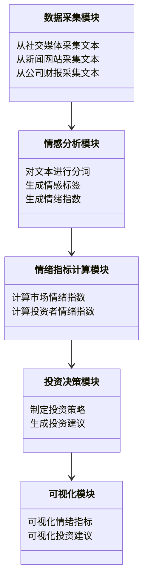

                 


# 情感分析在投资决策中的应用

> 关键词：情感分析，投资决策，自然语言处理，机器学习，金融数据分析

> 摘要：本文探讨了情感分析技术在投资决策中的应用，详细讲解了情感分析的核心概念、算法原理，以及如何将其应用于投资决策的各个环节，包括市场情绪分析、投资者情绪分析、公司财报分析等。通过具体案例和项目实战，展示了如何利用情感分析技术提高投资决策的科学性和准确性。

---

## 第一部分：引言

### 第1章：情感分析与投资决策概述

#### 1.1 情感分析的基本概念

情感分析（Sentiment Analysis）是自然语言处理（NLP）领域的重要分支，旨在识别和分析文本中的情感倾向。其核心目标是将文本内容分为积极、消极或中性三类，或更细粒度的评分（如1到5星）。情感分析不仅关注整体情感，还可以识别特定实体的情感，如公司、产品或人物。

**问题背景**：在金融领域，投资者和分析师需要处理大量文本数据，如新闻报道、社交媒体帖子、公司财报和分析师报告。这些文本中蕴含着市场参与者的情绪和态度，对投资决策具有重要影响。

**问题解决**：情感分析技术能够从这些文本中提取情感信息，帮助投资者预测市场趋势、评估投资风险，并做出更明智的投资决策。

**边界与外延**：情感分析的应用范围包括股票市场、外汇市场、加密货币市场等。其外延涉及情绪指标构建、市场情绪预测、投资组合优化等领域。

**核心要素**：情感分析涉及文本数据、情感分类模型、情感指标计算和情感驱动的投资策略。

#### 1.2 投资决策的基本概念

投资决策是投资者在金融市场中做出的买入、卖出或持有某种资产的决定。它基于市场数据、财务指标、经济指标和投资者情绪等多种因素。有效的投资决策需要综合分析这些因素，以最大化投资回报并最小化风险。

**问题背景**：金融市场数据复杂且动态变化，投资者情绪是影响市场走势的重要因素。然而，传统分析方法难以捕捉和量化投资者情绪，导致决策的不准确性和滞后性。

**问题解决**：通过情感分析技术，投资者可以实时捕捉市场情绪，量化投资者情绪，从而做出更及时和准确的投资决策。

**边界与外延**：投资决策的应用范围包括股票、债券、基金、期货等金融产品。其外延涉及风险管理、投资组合优化和市场预测等领域。

**核心要素**：投资决策涉及市场数据、财务指标、经济指标、投资者情绪和决策模型。

#### 1.3 情感分析在投资决策中的重要性

情感分析能够揭示文本数据中的隐含信息，帮助投资者捕捉市场情绪的变化。市场情绪是影响资产价格的重要因素，尤其是在突发事件或市场波动期间。通过情感分析，投资者可以量化市场情绪，预测市场趋势，并制定相应的投资策略。

**优势**：情感分析能够提供实时情绪指标，帮助投资者及时调整投资策略。此外，结合其他数据源，如财务数据和宏观经济指标，可以提高预测的准确性。

**局限性**：情感分析结果可能存在偏差，尤其是在处理复杂和模糊的语言时。此外，市场情绪并非唯一影响资产价格的因素，因此情感分析结果需要结合其他信息进行综合分析。

#### 1.4 本书的目标与结构

本书旨在介绍情感分析技术在投资决策中的应用，帮助读者理解如何利用情感分析技术提升投资决策的科学性和准确性。本书结构如下：

1. **情感分析基础**：介绍情感分析的核心概念和技术。
2. **情感分析在投资中的应用**：探讨情感分析在投资决策中的具体应用场景。
3. **系统架构与实现**：描述情感分析投资决策系统的架构设计和实现细节。
4. **项目实战**：通过具体项目展示情感分析在投资中的应用。
5. **总结与展望**：总结全书内容，展望未来发展方向。

---

## 第二部分：情感分析基础

### 第2章：情感分析的核心技术

#### 2.1 情感分析的主要方法

**传统方法**：基于规则的情感分析，使用预定义的词汇表和情感规则对文本进行分类。例如，将“优秀”标记为正面词汇，将“糟糕”标记为负面词汇。

**机器学习方法**：使用特征工程和传统机器学习算法（如SVM、Naive Bayes）进行情感分类。特征工程包括将文本转换为词袋模型或词嵌入表示。

**深度学习方法**：使用神经网络模型（如RNN、LSTM、Transformer）进行情感分析。这些模型能够捕捉文本中的长距离依赖关系，提高情感分析的准确性。

**对比分析**：下表展示了传统方法和深度学习方法的对比：

| 特性               | 传统方法               | 深度学习方法            |
|--------------------|------------------------|-------------------------|
| 数据需求           | 较少，依赖特征工程       | 较多，需要大量数据训练  |
| 处理复杂性         | 较低                   | 较高                   |
| 精度               | 中等                   | 较高                   |
| 适用场景           | 小数据集               | 大数据集               |

#### 2.2 常见情感分析算法

**支持向量机（SVM）**

SVM是一种监督学习算法，适用于分类问题。情感分析中，SVM可以将文本特征映射到高维空间，并寻找最优超平面进行分类。

数学模型：
$$ \text{最大化} \quad \text{margin} $$
$$ \text{约束} \quad y_i (w \cdot x_i + b) \geq 1 $$
其中，\( w \) 是权重向量，\( b \) 是偏置项，\( y_i \) 是标签，\( x_i \) 是特征向量。

**Transformer架构**

Transformer由注意力机制和位置编码组成，能够捕捉文本中的全局依赖关系。

数学模型：
$$ \text{注意力机制}：\text{Attention}(Q, K, V) = \text{softmax}(\frac{QK^T}{\sqrt{d}})V $$
其中，\( Q \) 是查询向量，\( K \) 是键向量，\( V \) 是值向量，\( d \) 是维度。

#### 2.3 情感分析的实现流程

**数据预处理**

1. **分词处理**：将文本分割为词语或短语。
2. **去停用词**：去除常见停用词（如“的”、“是”）。
3. **词干提取与词性标注**：提取词语的根形式，并标注词性。

**特征提取**

1. **词袋模型（Bag of Words）**：将文本转换为词频向量。
2. **词嵌入（Word Embedding）**：将词语映射到低维连续向量空间（如Word2Vec、GloVe）。

**模型训练与优化**

1. **模型选择与调参**：选择合适的算法（如SVM、LSTM）并进行参数调优。
2. **模型评估与优化**：使用交叉验证和网格搜索优化模型性能。

---

## 第三部分：情感分析在投资决策中的应用

### 第4章：投资决策中的情感分析需求

#### 4.1 投资者情绪分析

**市场情绪的定义**

市场情绪是指市场参与者（如投资者、交易员）的整体情绪状态，通常反映市场对某种资产或市场的看法。市场情绪可以分为乐观、悲观、中立等类别。

**投资者情绪的影响因素**

- 市场走势
- 宏观经济指标
- 公司新闻
- 社交媒体 sentiment

**案例分析**：2020年新冠疫情爆发期间，社交媒体上的负面情绪激增，导致市场恐慌性抛售，加剧了市场下跌。

---

### 第5章：情感分析在投资中的具体应用

#### 5.1 市场情绪分析

**市场情绪的量化**

市场情绪可以通过多种方式量化，如：

1. **社交媒体情绪指数**：基于Twitter、Reddit等平台的帖子情感进行计算。
2. **新闻情绪指数**：基于新闻标题和正文的情感进行加权计算。
3. **市场参与者情绪指数**：基于投资者行为数据（如交易量、订单簿）进行情绪分析。

**市场情绪与资产价格的关系**

研究表明，市场情绪与资产价格之间存在显著相关性。例如，当市场情绪过于乐观时，资产价格可能被高估，反之亦然。

**案例分析**：2021年GameStop事件中，Reddit上的讨论引发了大量散户买入，导致股价短期大幅波动。情感分析可以捕捉这种情绪变化，并提醒投资者注意市场风险。

#### 5.2 投资者情绪分析

**投资者情绪的分类**

投资者情绪通常分为以下几类：

- 乐观（Buy信号）
- 悲观（Sell信号）
- 中立

**投资者情绪的预测**

通过分析投资者的历史行为数据和社交媒体数据，可以预测未来的情绪变化。例如，分析投资者在社交媒体上的评论和交易行为，可以识别情绪拐点。

**案例分析**：某投资者在社交媒体上频繁发表看空市场的言论，并且交易记录显示大量卖出，可以推断其情绪悲观，可能对市场产生负面影响。

#### 5.3 公司财报分析

**财报文本的情感分析**

公司财报中的文本（如管理层讨论与分析部分）通常包含对未来业绩的展望，这些文本的情感可以影响投资者情绪。

**财报情绪与股价的关系**

研究表明，财报中的积极情绪通常会推高股价，而消极情绪则会压低股价。

**案例分析**：某公司财报中使用了较多积极词汇，如“增长”、“扩展”等，且财务数据表现良好，投资者情绪高涨，导致股价上涨。

---

## 第四部分：系统架构与实现

### 第6章：情感分析投资决策系统

#### 6.1 系统功能设计

系统功能模块包括：

1. **数据采集模块**：从社交媒体、新闻网站、公司财报等数据源采集文本数据。
2. **情感分析模块**：对采集的文本进行情感分析，生成情感标签或情绪指数。
3. **情绪指标计算模块**：根据情感分析结果，计算市场情绪指数和投资者情绪指数。
4. **投资决策模块**：结合情绪指标和其他数据（如财务数据、宏观经济指标）制定投资策略。
5. **可视化模块**：将情绪指标和投资建议可视化，便于用户理解和决策。

**领域模型（Mermaid 类图）**



#### 6.2 系统架构设计

**系统架构图（Mermaid 架构图）**

```mermaid
container 数据源 {
    接口1: 社交媒体 API
    接口2: 新闻网站 API
    接口3: 公司财报 API
}
container 情感分析服务 {
    组件1: 分词组件
    组件2: 情感分析组件
    组件3: 情绪指标计算组件
}
container 投资决策服务 {
    组件1: 数据处理组件
    组件2: 投资策略组件
    组件3: 可视化组件
}
数据源 --> 情感分析服务
情感分析服务 --> 投资决策服务
```

---

## 第五部分：项目实战与案例分析

### 第7章：项目实战

#### 7.1 环境安装

需要安装的工具和库包括：

- Python
- Numpy
- Pandas
- Scikit-learn
- TensorFlow或Keras
- API接口库（如Twitter API、NewsAPI）
- 数据可视化库（Matplotlib、Seaborn）

#### 7.2 系统核心实现

**代码实现**

以下是一个情感分析投资决策系统的简单实现：

```python
import requests
from sklearn.svm import SVC
from sklearn.feature_extraction.text import TfidfVectorizer

# 数据采集模块
def get_data(api_key, endpoint):
    response = requests.get(f"{endpoint}?api_key={api_key}")
    return response.json()

# 情感分析模块
def analyze_sentiment(texts):
    vectorizer = TfidfVectorizer()
    X = vectorizer.fit_transform(texts)
    model = SVC()
    model.fit(X, ['positive', 'negative', 'neutral'])
    return model.predict(X)

# 情绪指标计算模块
def calculate_mood_index(sentiments):
    positive = sentiments.count('positive') / len(sentiments)
    negative = sentiments.count('negative') / len(sentiments)
    return (positive - negative) * 100

# 投资决策模块
def investment_strategy(mood_index, market_data):
    if mood_index > 50 and market_data['trend'] == 'up':
        return 'buy'
    elif mood_index < -50 and market_data['trend'] == 'down':
        return 'sell'
    else:
        return 'hold'

# 可视化模块
import matplotlib.pyplot as plt

def visualize_mood(mood_index):
    plt.figure(figsize=(10, 6))
    plt.title(f"Market Mood Index: {mood_index}")
    plt.bar(['Positive', 'Negative'], [positive, negative])
    plt.show()
```

---

## 第六部分：总结与展望

### 第8章：总结与展望

#### 8.1 小结

情感分析技术在投资决策中的应用前景广阔，能够帮助投资者实时捕捉市场情绪，优化投资策略。然而，情感分析也存在一定的局限性，如模型偏差和数据噪声。

#### 8.2 展望

未来，随着NLP和机器学习技术的不断发展，情感分析在投资中的应用将更加智能化和个性化。例如，结合强化学习和实时数据流，可以构建更动态和精准的情感分析模型。此外，多模态情感分析（结合文本、语音、面部表情等）也将成为研究热点。

#### 8.3 最佳实践 tips

1. **数据质量**：确保数据来源可靠，清洗数据以减少噪声。
2. **模型选择**：根据具体任务选择合适的算法，进行充分的调参和验证。
3. **实时性**：投资决策需要实时数据支持，建议采用流式处理技术。
4. **结合多因素**：将情感分析结果与其他因素（如财务数据、宏观经济指标）结合，提高预测准确性。

---

# 结语

情感分析技术为投资决策提供了新的视角和工具，帮助投资者在复杂多变的市场中做出更明智的决策。随着技术的进步，情感分析将在投资领域发挥越来越重要的作用。

