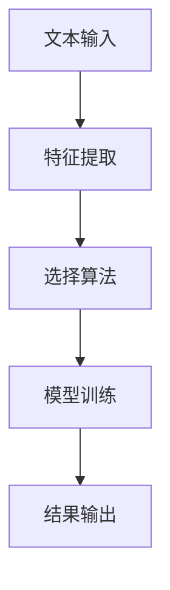
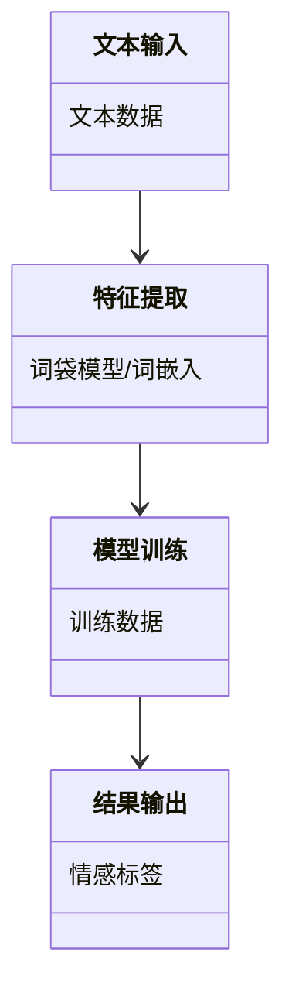

                 

# 情感分析：让AI Agent具备情商

## 关键词
- 情感分析、自然语言处理、AI Agent、深度学习、机器学习、情感计算

## 摘要
情感分析是自然语言处理中的一个重要任务，旨在通过分析文本内容来识别和分类作者的情感倾向。随着AI Agent的兴起，情感分析在人机交互中的作用变得尤为重要。本文将从情感分析的基本概念出发，深入探讨其算法原理、系统架构设计，结合实际项目案例，展示如何通过情感分析技术赋予AI Agent情感理解能力，使其能够更好地与人类进行交互和协作。

---

# 目录大纲：情感分析：让AI Agent具备情商

## 第一部分：情感分析的背景与核心概念

### 第1章：情感分析的定义与应用

#### 1.1 情感分析的定义与范围
- 情感分析的定义
- 情感分析的核心目标
- 情感分析的主要应用场景

#### 1.2 情感分析的背景与意义
- 情感分析的发展历程
- 情感分析在AI Agent中的重要性
- 情感分析的技术挑战与未来趋势

#### 1.3 情感分析的核心要素
- 情感分析的数据来源
- 情感分析的关键特征
- 情感分析的评价指标

---

## 第二部分：情感分析的核心概念与原理

### 第2章：情感分析的原理与方法

#### 2.1 情感分析的基本原理
- 情感分析的特征提取方法
- 情感分析的分类模型
- 情感分析的评价标准

#### 2.2 情感分析的核心算法
- 基于规则的情感分析
- 传统机器学习的情感分析
- 深度学习的情感分析

#### 2.3 情感分析的流程图

---

## 第三部分：情感分析的算法原理与实现

### 第3章：情感分析的算法原理

#### 3.1 基于规则的算法
- 基于规则的算法原理
- 基于规则的算法实现
- 基于规则的算法优缺点

#### 3.2 传统机器学习算法
- 逻辑回归模型
- 支持向量机模型
- 决策树模型

#### 3.3 深度学习算法
- 卷积神经网络（CNN）
- 循环神经网络（RNN）

---

## 第四部分：情感分析的系统分析与架构设计

### 第4章：情感分析的系统分析

#### 4.1 问题场景介绍
- 情感分析的典型场景
- 情感分析的核心问题

#### 4.2 系统功能设计
- 数据预处理模块
- 模型训练模块
- 结果分析模块

#### 4.3 系统架构设计

---

## 第五部分：情感分析的项目实战

### 第5章：情感分析的项目实战

#### 5.1 环境安装与数据收集
- 环境搭建
- 数据来源与预处理

#### 5.2 系统核心实现
- 特征提取代码示例
- 模型训练代码示例
- 结果分析代码示例

#### 5.3 实际案例分析
- 案例介绍
- 案例实现与结果解读

---

## 第六部分：情感分析的最佳实践与总结

### 第6章：情感分析的最佳实践

#### 6.1 小结
- 情感分析的核心内容总结
- 情感分析在AI Agent中的应用价值

#### 6.2 最佳实践
- 情感分析的常见问题与解决方案
- 情感分析的优化建议

#### 6.3 注意事项
- 情感分析的局限性
- 情感分析的未来发展方向

---

## 总结
情感分析作为自然语言处理的重要任务，不仅能够帮助AI Agent理解人类情感，还能够提升人机交互的体验。通过本文的系统介绍和深入分析，读者可以全面掌握情感分析的核心原理和实现方法，并将其应用于实际项目中，为AI Agent赋予更强的情感理解能力。

