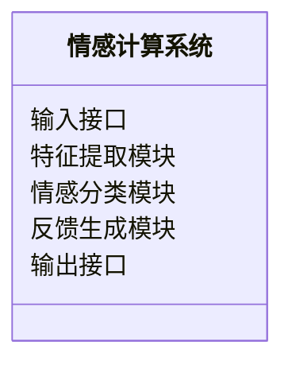
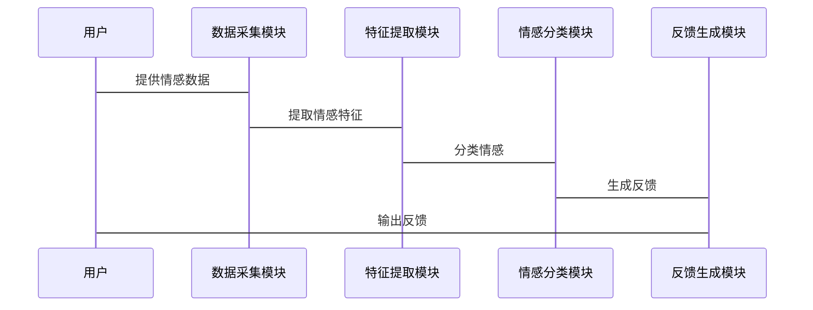

                 


# 情感计算：增强AI Agent的情感智能

## 关键词：情感计算，AI Agent，人工智能，情感智能，机器学习

## 摘要：情感计算是一种通过分析和理解人类情感来增强AI Agent智能的技术。本文详细探讨情感计算的核心概念、算法原理、系统架构及其实战应用，帮助读者全面了解如何通过情感计算提升AI Agent的情感智能。

---

## 目录

# 第一部分：情感计算基础

## 第1章：情感计算概述

### 1.1 情感计算的基本概念

#### 1.1.1 情感计算的定义
情感计算（Affective Computing）是通过计算机技术来识别、理解和模拟人类情感的过程。它旨在赋予机器理解并响应人类情感的能力。

#### 1.1.2 情感计算的发展背景
随着人工智能的快速发展，传统的AI技术主要依赖于逻辑推理和数据处理，而忽视了人类情感的重要性。情感计算的出现填补了这一空白，使AI能够更好地与人类互动。

#### 1.1.3 情感计算的核心目标
情感计算的核心目标是通过分析和理解人类情感，增强AI Agent的智能水平，使其能够更自然地与人类进行交互。

### 1.2 情感计算的技术框架

#### 1.2.1 情感计算的主要技术手段
情感计算主要依赖于文本分析、语音识别和图像处理等技术手段。

#### 1.2.2 情感计算的实现流程
1. 数据采集：获取用户的情感相关数据（如文本、语音、图像）。
2. 特征提取：从数据中提取情感相关特征。
3. 情感分类：利用算法对情感特征进行分类。
4. 情感响应：根据分类结果生成相应的反馈。

#### 1.2.3 情感计算的应用场景
- 智能客服：通过理解用户情感提供更优质的服务。
- 智能助手：增强人机交互的自然性。
- 教育科技：根据学生情感状态提供个性化的学习建议。

### 1.3 情感计算与AI Agent的结合

#### 1.3.1 AI Agent的基本概念
AI Agent是一种智能体，能够感知环境并采取行动以实现目标。

#### 1.3.2 情感计算在AI Agent中的作用
情感计算使AI Agent能够理解用户的情感，从而提供更贴心的服务。

#### 1.3.3 增强AI Agent情感智能的意义
增强情感智能使AI Agent能够更好地理解和响应用户的情感需求，提升用户体验。

### 1.4 本章小结
本章介绍了情感计算的基本概念、技术框架及其在AI Agent中的应用，为后续章节奠定了基础。

---

## 第2章：情感计算的核心概念

### 2.1 情感的分类与表示

#### 2.1.1 情感的分类方法
情感可以分为正面、负面和中性三类。

#### 2.1.2 情感的表示方式
常用的情感表示方式包括情感词典和情感评分。

#### 2.1.3 情感的特征提取
从文本中提取情感特征，如关键词和句法结构。

### 2.2 情感计算模型

#### 2.2.1 基于规则的情感计算模型
通过预定义规则来判断情感，例如情感词典。

#### 2.2.2 基于机器学习的情感计算模型
利用机器学习算法，如SVM和Naive Bayes，进行情感分类。

#### 2.2.3 基于深度学习的情感计算模型
使用深度学习模型，如CNN和RNN，进行情感分析。

### 2.3 情感计算与传统AI的区别

#### 2.3.1 传统AI的局限性
传统AI主要依赖逻辑推理，缺乏对人类情感的理解。

#### 2.3.2 情感计算的优势
情感计算能够理解并响应人类情感，使AI更具人性化。

#### 2.3.3 情感计算与传统AI的结合
将情感计算与传统AI技术结合，提升整体智能水平。

### 2.4 本章小结
本章详细探讨了情感计算的核心概念，包括情感分类、计算模型及其与传统AI的区别。

---

## 第3章：情感计算的特征提取

### 3.1 文本特征提取方法

#### 3.1.1 词袋模型
将文本表示为词的集合，不考虑顺序。

#### 3.1.2 词嵌入模型
通过训练得到词向量，捕捉词语语义信息。

#### 3.1.3 情感词典
使用预定义的情感词汇进行情感分析。

### 3.2 声音特征提取方法

#### 3.2.1 音调分析
分析语音的音调变化，判断情感倾向。

#### 3.2.2 语速分析
通过语速变化判断情感状态。

#### 3.2.3 音量分析
通过音量变化判断情感强度。

### 3.3 图像特征提取方法

#### 3.3.1 面部表情识别
通过面部表情识别情感状态。

#### 3.3.2 身体语言识别
通过身体语言分析情感。

#### 3.3.3 眼神识别
通过眼神变化判断情感状态。

### 3.4 本章小结
本章介绍了情感计算中的特征提取方法，包括文本、声音和图像特征提取。

---

## 第4章：情感分类算法

### 4.1 基于机器学习的情感分类

#### 4.1.1 支持向量机（SVM）
通过构建超平面进行分类。

#### 4.1.2 朴素贝叶斯（Naive Bayes）
基于概率论进行分类。

#### 4.1.3 决策树（Decision Tree）
通过树状结构进行分类。

### 4.2 基于深度学习的情感分类

#### 4.2.1 卷积神经网络（CNN）
用于处理局部特征，常用于文本和图像分类。

#### 4.2.2 循环神经网络（RNN）
用于处理序列数据，如语音和文本。

#### 4.2.3 Transformer架构
基于自注意力机制，广泛应用于自然语言处理。

### 4.3 情感分类算法的优缺点对比

#### 4.3.1 机器学习算法的优缺点

| 算法 | 优点 | 缺点 |
|------|------|------|
| SVM  | 高精度 | 参数敏感 |
| Naive Bayes | 计算简单 | 依赖独立性假设 |
| Decision Tree | 易解释 | 易过拟合 |

#### 4.3.2 深度学习算法的优缺点

| 算法 | 优点 | 缺点 |
|------|------|------|
| CNN  | 高精度 | 需大量数据 |
| RNN  | 处理序列数据 | 训练复杂 |
| Transformer | 并行计算 | 资源消耗大 |

### 4.4 本章小结
本章详细介绍了情感分类的算法，包括机器学习和深度学习方法，并对其优缺点进行了对比。

---

## 第5章：情感计算的系统架构设计

### 5.1 系统功能设计

#### 5.1.1 领域模型
使用Mermaid类图描述系统功能模块。



### 5.2 系统架构设计

#### 5.2.1 系统架构图
使用Mermaid架构图展示系统架构。


### 5.3 系统接口设计

#### 5.3.1 输入接口
- 文本输入接口
- 语音输入接口
- 图像输入接口

#### 5.3.2 输出接口
- 文本输出接口
- 语音输出接口
- 图像输出接口

### 5.4 系统交互流程

#### 5.4.1 交互流程图
使用Mermaid序列图展示系统交互流程。



### 5.5 本章小结
本章详细描述了情感计算系统的架构设计，包括功能模块、接口设计和交互流程。

---

## 第6章：情感计算的项目实战

### 6.1 环境安装

#### 6.1.1 Python环境
安装Python和必要的库，如TensorFlow和Scikit-learn。

### 6.2 系统核心实现源代码

#### 6.2.1 特征提取代码
```python
def extract_features(text):
    # 词袋模型
    from sklearn.feature_extraction.text import CountVectorizer
    vectorizer = CountVectorizer()
    features = vectorizer.fit_transform([text])
    return features.toarray()
```

#### 6.2.2 情感分类代码
```python
from sklearn.svm import SVC
from sklearn.metrics import accuracy_score

def train_classifier(X, y):
    clf = SVC()
    clf.fit(X, y)
    return clf

def evaluate_classifier(clf, X_test, y_test):
    y_pred = clf.predict(X_test)
    print("Accuracy:", accuracy_score(y_test, y_pred))
```

#### 6.2.3 情感响应代码
```python
def generate_response(emotion):
    if emotion == 'positive':
        return "很高兴为您服务！"
    elif emotion == 'negative':
        return "抱歉，有什么可以帮您的吗？"
    else:
        return "请问有什么可以帮助您的？"
```

### 6.3 代码应用解读与分析
通过上述代码实现情感计算系统的功能模块，包括特征提取、情感分类和情感响应。

### 6.4 实际案例分析
以客服系统为例，展示情感计算在实际场景中的应用。

### 6.5 本章小结
本章通过项目实战，详细讲解了情感计算系统的实现过程，包括环境配置、代码实现和案例分析。

---

## 第7章：情感计算的优化与提升

### 7.1 数据质量的提升
- 数据清洗
- 数据增强

### 7.2 模型调优
- 调整超参数
- 模型集成

### 7.3 多模态融合
- 文本、语音和图像的多模态融合

### 7.4 本章小结
本章提出了优化情感计算系统的建议，包括数据质量提升、模型调优和多模态融合。

---

## 第8章：情感计算的未来展望

### 8.1 技术趋势
- 深度学习的进一步发展
- 多模态情感计算的融合

### 8.2 应用前景
- 智能客服的进一步智能化
- 教育科技中的情感支持
- 健康医疗中的情感监测

### 8.3 本章小结
本章展望了情感计算技术的发展趋势及其在各个领域的应用前景。

---

## 附录：情感计算资源

- 推荐的书籍和论文
- 开源工具和库
- 在线课程和培训

---

## 参考文献

- [1] 情感计算领域的经典论文
- [2] 相关书籍和文献

---

## 结语

情感计算作为人工智能的重要组成部分，正在逐步改变我们与AI交互的方式。通过本文的探讨，我们深入了解了情感计算的核心概念、算法原理和系统架构，并通过实战案例展示了其应用潜力。未来，随着技术的进步，情感计算将在更多领域发挥重要作用。

---

希望这篇技术博客文章能够为您提供有价值的信息，并激发您对情感计算的兴趣和研究。

