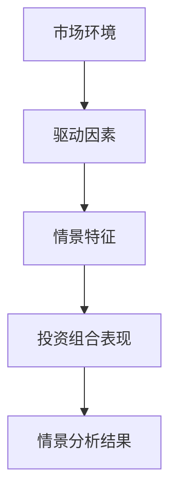
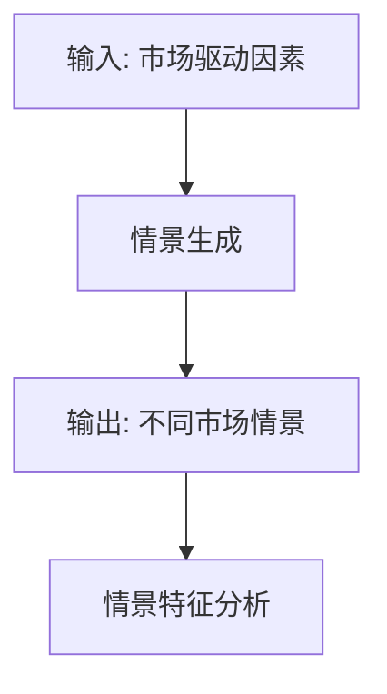
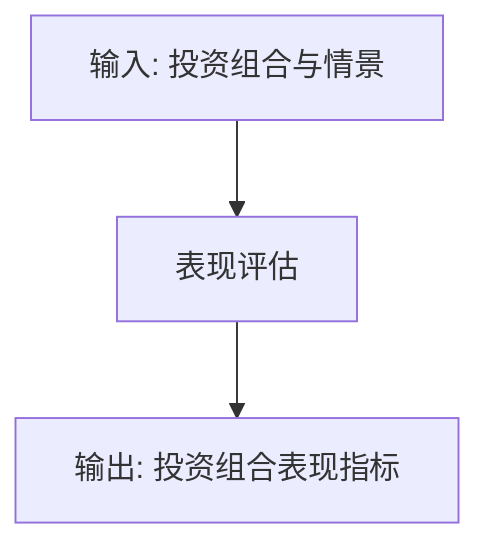
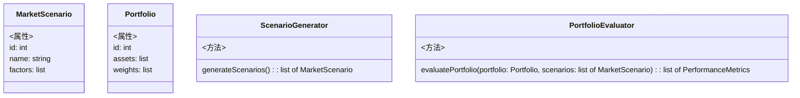
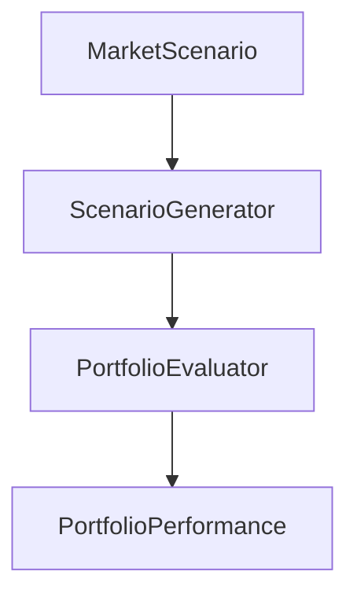
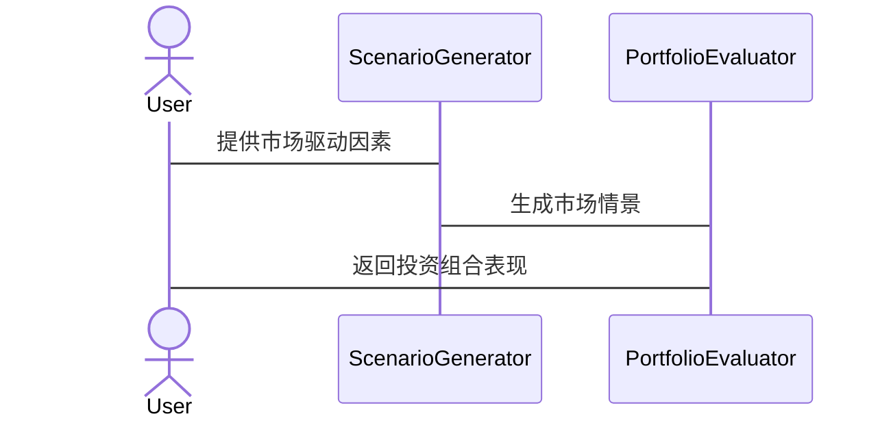

                 


# 情景分析：评估不同市场环境下的组合表现

## 关键词：情景分析、投资组合、市场环境、风险评估、收益预测

## 摘要：  
情景分析是一种评估投资组合在不同市场环境下的表现的系统方法。通过对市场环境的驱动因素进行分析，情景分析能够帮助投资者更好地理解投资组合在各种可能市场条件下的表现，并做出更明智的投资决策。本文将详细介绍情景分析的核心概念、算法原理、系统架构设计以及实际案例分析，为读者提供一个全面的理解框架。

---

# 第一部分: 情景分析的背景与核心概念

## 第1章: 问题背景与核心概念

### 1.1 问题背景

#### 1.1.1 市场环境的复杂性与不确定性  
金融市场是一个高度动态和不确定的环境。经济周期波动、政策变化、地缘政治风险等因素都会对市场产生重大影响。投资者需要在这些不确定的市场环境中做出决策，而情景分析提供了一种系统的方法来应对这种不确定性。

#### 1.1.2 投资组合表现的多样性  
投资组合的表现取决于多种因素，包括资产配置、市场趋势、风险偏好等。在不同的市场环境下，同一投资组合的表现可能会有显著差异。因此，理解投资组合在不同市场情景下的表现是制定有效投资策略的关键。

#### 1.1.3 情景分析的定义与目标  
情景分析是一种通过模拟不同市场环境来评估投资组合表现的方法。其目标是帮助投资者更好地理解投资组合在各种可能市场条件下的表现，并为投资决策提供支持。

---

### 1.2 核心概念与驱动因素

#### 1.2.1 市场环境的驱动因素  
市场环境由多种因素驱动，包括：  
- **经济指标**：GDP增长、通货膨胀率、失业率等。  
- **利率与货币政策**：中央银行的利率政策、货币政策变化。  
- **市场情绪**：投资者情绪、市场信心指数等。  
- **行业与企业因素**：行业趋势、企业盈利状况等。  

#### 1.2.2 投资组合表现的驱动因素  
投资组合的表现受到以下因素的影响：  
- 资产配置：股票、债券、现金等资产的比例。  
- 风险偏好：投资者对风险的容忍程度。  
- 市场趋势：宏观经济趋势对资产价格的影响。  

#### 1.2.3 情景分析的核心要素  
情景分析的核心要素包括：  
- **情景生成**：根据市场驱动因素生成不同的市场情景。  
- **投资组合表现评估**：在不同情景下评估投资组合的表现。  
- **情景间的对比分析**：比较不同情景下的投资组合表现，找出最优策略。  

---

## 第2章: 情景分析的核心概念与联系

### 2.1 核心概念原理

#### 2.1.1 市场环境的驱动因素分析  
通过分析市场环境的驱动因素，可以生成不同的情景。例如，假设我们考虑以下两个驱动因素：  
- **经济增长**：分为“强劲增长”、“稳定增长”、“停滞”、“衰退”四种情况。  
- **利率**：分为“上升”、“稳定”、“下降”三种情况。  

通过组合这些驱动因素，可以生成多种市场情景。

#### 2.1.2 投资组合表现的敏感性分析  
投资组合在不同情景下的表现可能受到不同因素的影响。例如，股票型投资组合在经济增长情景下表现较好，而在衰退情景下表现较差。

#### 2.1.3 情景分析的数学模型  
情景分析可以通过数学模型来模拟市场情景。例如，可以使用蒙特卡洛模拟来生成随机的市场情景，并评估投资组合在这些情景下的表现。

---

### 2.2 核心概念对比分析

#### 2.2.1 不同市场环境下的情景特征对比  
以下是一些典型市场情景的对比：  
| 情景类型 | 经济增长 | 利率 | 通货膨胀 | 市场情绪 |  
|----------|----------|------|----------|----------|  
| 情景1    | 强劲增长 | 下降 | 适度     | 积极     |  
| 情景2    | 稳定增长 | 稳定 | 高       | 中性     |  
| 情景3    | 停滞     | 上升 | 低       | 消极     |  

#### 2.2.2 投资组合表现的关键驱动因素对比  
不同驱动因素对投资组合表现的影响程度可能不同。例如，利率上升可能导致债券价格下跌，而经济增长可能推动股票价格上涨。

#### 2.2.3 情景分析与传统投资分析的对比  
传统投资分析通常基于历史数据和当前市场状况，而情景分析则假设不同的市场情景，并评估投资组合在这些情景下的表现。

---

### 2.3 实体关系图



---

# 第二部分: 情景分析的算法原理与数学模型

## 第3章: 情景分析的算法原理

### 3.1 算法原理概述

#### 3.1.1 情景生成算法  
情景生成算法的主要步骤包括：  
1. 确定市场驱动因素。  
2. 生成不同的情景组合。  
3. 分析情景特征。  

#### 3.1.2 投资组合表现评估算法  
投资组合表现评估算法的主要步骤包括：  
1. 根据生成的情景调整投资组合。  
2. 计算投资组合在不同情景下的收益与风险指标。  
3. 对比分析投资组合在不同情景下的表现。  

---

### 3.2 情景生成算法



---

### 3.3 投资组合表现评估算法



---

### 3.4 Python实现示例

#### 3.4.1 情景生成代码  
```python
import numpy as np

# 定义市场驱动因素
growth = ['强劲增长', '稳定增长', '停滞', '衰退']
interest_rate = ['上升', '稳定', '下降']

# 生成情景组合
scenarios = []
for g in growth:
    for i in interest_rate:
        scenarios.append((g, i))

print("生成的情景数量:", len(scenarios))
```

#### 3.4.2 投资组合表现评估代码  
```python
import numpy as np

# 定义投资组合
portfolio = [0.4, 0.3, 0.2, 0.1]

# 定义情景下的资产回报
returns = np.array([0.1, 0.05, -0.02, 0.08])

# 计算投资组合在不同情景下的回报
portfolio_return = np.dot(portfolio, returns)

print("投资组合回报:", portfolio_return)
```

---

## 第4章: 数学模型与公式

### 4.1 情景生成的数学模型  
情景生成可以通过概率分布来模拟市场驱动因素的变化。例如，可以使用正态分布来模拟资产回报率的变化。

#### 4.1.1 概率分布模型  
$$ r \sim N(\mu, \sigma^2) $$  
其中，$\mu$ 是均值，$\sigma^2$ 是方差。

#### 4.1.2 蒙特卡洛模拟  
通过蒙特卡洛模拟，可以生成大量的市场情景，并评估投资组合在这些情景下的表现。

---

### 4.2 投资组合表现的评估公式

#### 4.2.1 投资组合回报公式  
$$ R_p = \sum_{i=1}^n w_i R_i $$  
其中，$w_i$ 是第 $i$ 个资产的权重，$R_i$ 是第 $i$ 个资产的回报。

#### 4.2.2 风险评估公式  
$$ \text{风险} = \sqrt{\sum_{i=1}^n w_i^2 \sigma_i^2 + 2 \sum_{i<j} w_i w_j \text{Cov}(R_i, R_j)} $$  
其中，$\sigma_i^2$ 是第 $i$ 个资产的方差，$\text{Cov}(R_i, R_j)$ 是第 $i$ 和 $j$ 个资产之间的协方差。

---

# 第三部分: 系统分析与架构设计

## 第5章: 系统分析与架构设计

### 5.1 问题场景介绍

#### 5.1.1 问题描述  
我们需要设计一个系统，能够根据市场驱动因素生成不同的情景，并评估投资组合在这些情景下的表现。

---

### 5.2 系统功能设计

#### 5.2.1 领域模型类图  


---

### 5.3 系统架构设计

#### 5.3.1 系统架构图  


---

### 5.4 接口设计与交互流程图

#### 5.4.1 系统交互流程图  


---

## 第6章: 项目实战与案例分析

### 6.1 项目实战

#### 6.1.1 环境安装  
需要安装以下工具：  
- Python 3.8 或更高版本  
- NumPy、Pandas、Matplotlib 等库  

#### 6.1.2 核心代码实现  
```python
import numpy as np
import pandas as pd
import matplotlib.pyplot as plt

# 定义市场驱动因素
growth = ['强劲增长', '稳定增长', '停滞', '衰退']
interest_rate = ['上升', '稳定', '下降']

# 生成情景组合
scenarios = []
for g in growth:
    for i in interest_rate:
        scenarios.append((g, i))

# 定义投资组合
portfolio = [0.4, 0.3, 0.2, 0.1]

# 计算投资组合在不同情景下的回报
returns = np.array([0.1, 0.05, -0.02, 0.08])
portfolio_return = np.dot(portfolio, returns)

print("投资组合回报:", portfolio_return)
```

---

### 6.2 案例分析

#### 6.2.1 案例描述  
假设我们有一个包含股票、债券、现金和 commodities 的投资组合。我们需要评估这个投资组合在以下情景下的表现：  
- 情景1：强劲经济增长，利率下降  
- 情景2：经济衰退，利率上升  

#### 6.2.2 情景分析结果  
根据生成的情景，我们可以计算出投资组合在不同情景下的回报和风险指标。

---

## 第7章: 总结与拓展阅读

### 7.1 最佳实践 tips

#### 7.1.1 情景分析的应用领域  
情景分析不仅可以用于投资组合管理，还可以用于风险管理、企业战略规划等领域。

#### 7.1.2 选择合适的情景生成方法  
根据具体情况选择合适的情景生成方法，例如蒙特卡洛模拟、历史情景分析等。

#### 7.1.3 结合其他分析方法  
将情景分析与其他分析方法（如资产配置、风险评估）结合使用，以提高分析结果的准确性。

---

### 7.2 小结

通过情景分析，我们可以更好地理解投资组合在不同市场环境下的表现，并为投资决策提供支持。本文详细介绍了情景分析的核心概念、算法原理、系统架构设计以及实际案例分析，为读者提供了一个全面的框架。

---

### 7.3 注意事项

- 情景分析的结果是基于假设和模型的，可能存在一定的局限性。  
- 在实际应用中，需要结合市场实际情况调整模型参数。  
- 情景分析结果仅供参考，不构成投资建议。  

---

### 7.4 拓展阅读

- 《投资学》：了解投资组合管理的基本理论。  
- 《蒙特卡洛模拟》：深入学习蒙特卡洛模拟的方法和应用。  
- 《风险管理》：掌握风险管理的核心概念和方法。

