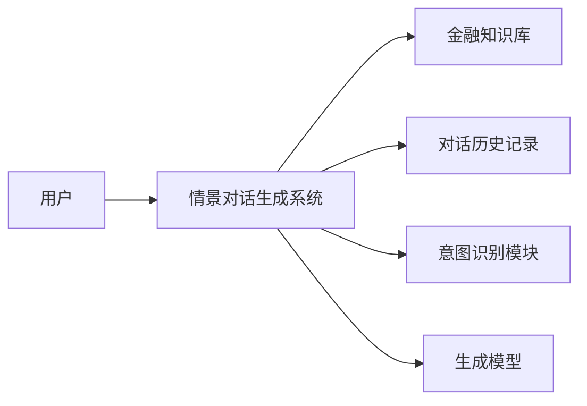
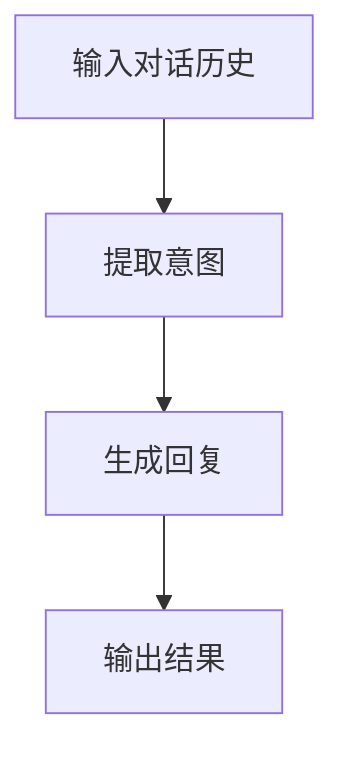
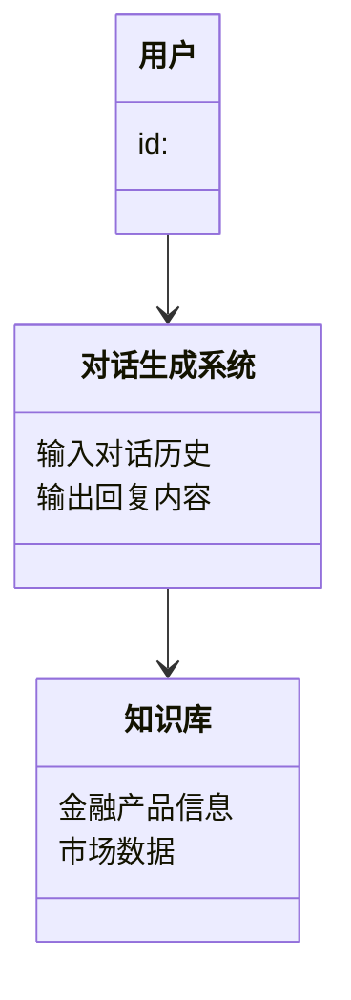

                 


# 情景对话生成技术在金融咨询中的应用实践

## 关键词：情景对话生成、自然语言处理、金融咨询、深度学习、对话系统

## 摘要：情景对话生成技术是一种基于自然语言处理（NLP）和深度学习的技术，旨在通过生成式对话模型与用户进行交互。本文将深入探讨情景对话生成技术在金融咨询中的应用实践，从技术背景、算法原理、系统设计到实际案例，逐步分析其在金融咨询领域的潜力和挑战。通过本文的分析，读者将能够理解如何利用情景对话生成技术提升金融咨询服务的效率和用户体验。

---

# 第一部分: 情景对话生成技术概述

## 第1章: 情景对话生成技术的背景与需求

### 1.1 问题背景

#### 1.1.1 传统金融咨询的局限性
传统金融咨询服务主要依赖人工客服，存在以下问题：
- **效率低下**：人工客服需要逐个处理客户的咨询请求，难以同时服务大量用户。
- **知识依赖性强**：客服人员需要具备丰富的金融知识，否则难以准确回答客户的复杂问题。
- **一致性不足**：不同客服人员的知识储备和应答能力存在差异，导致服务质量不一致。

#### 1.1.2 情景对话生成技术的提出
随着自然语言处理（NLP）技术的发展，情景对话生成技术应运而生。该技术通过深度学习模型生成符合上下文语境的对话内容，能够实现智能化、自动化的金融咨询服务。

#### 1.1.3 技术与业务的结合点
情景对话生成技术的核心在于将金融领域的知识与对话生成技术相结合，通过理解用户意图、上下文信息和业务逻辑，生成符合业务需求的对话内容。

### 1.2 问题描述

#### 1.2.1 金融咨询的核心需求
金融咨询的核心需求包括：
- 提供个性化的投资建议。
- 解答复杂的金融产品问题。
- 提供实时的市场分析和风险提示。

#### 1.2.2 情景对话生成的关键问题
情景对话生成技术在金融咨询中的关键问题包括：
- 如何准确理解用户的金融需求。
- 如何生成符合金融知识的高质量对话内容。
- 如何处理复杂的上下文信息。

#### 1.2.3 技术实现的边界与外延
情景对话生成技术的边界在于生成符合业务逻辑的对话内容，而其外延则包括结合语音识别、情感分析等技术，进一步提升用户体验。

### 1.3 核心概念与联系

#### 1.3.1 情景对话生成技术的核心要素
情景对话生成技术的核心要素包括：
- **输入**：对话历史、用户意图、上下文信息。
- **输出**：生成的对话内容。
- **模型**：基于深度学习的生成模型（如RNN、Transformer等）。
- **知识库**：金融领域的知识库，用于提供准确的业务信息。

#### 1.3.2 关键概念的属性特征对比表

| 概念       | 属性特征                     |
|------------|------------------------------|
| 对话历史   | 时间顺序、关联性、语境信息    |
| 用户意图   | 明确性、隐含性、多样性        |
| 生成模型   | 基于上下文、可训练、可微调    |
| 知识库     | 结构化、领域特定、可扩展      |

#### 1.3.3 实体关系图（ER图）的 Mermaid 流程图



---

## 第2章: 情景对话生成技术的核心算法

### 2.1 算法原理

#### 2.1.1 基于RNN的对话生成模型
传统的循环神经网络（RNN）通过处理序列数据生成对话内容。其核心思想是利用隐藏层捕捉对话的上下文信息。

#### 2.1.2 Transformer架构的改进
Transformer架构通过自注意力机制（Self-Attention）提升了对话生成的准确性和流畅性。其关键公式如下：

$$ \alpha_{i,j} = \frac{\exp(s_{i,j})}{\sum_{k} \exp(s_{i,k})} $$

其中，$\alpha_{i,j}$是第$i$个词对第$j$个词的注意力权重，$s_{i,j}$是点积相似度。

#### 2.1.3 预训练模型的微调策略
基于预训练语言模型（如GPT、BERT）进行微调是当前对话生成技术的主流方法。通过在金融领域数据上进行微调，可以提升模型在特定场景下的生成能力。

### 2.2 数学模型与公式

#### 2.2.1 情景对话生成的损失函数
对话生成模型的损失函数通常采用交叉熵损失函数：

$$ \text{损失函数} = -\sum_{i=1}^{n} \log P(w_i|w_{<i}) $$

其中，$w_i$表示第$i$个生成的词，$w_{<i}$表示之前的词。

#### 2.2.2 基于注意力机制的权重计算
注意力机制的权重计算公式如下：

$$ \alpha_{i,j} = \frac{\exp(s_{i,j})}{\sum_{k} \exp(s_{i,k})} $$

其中，$s_{i,j}$是查询与键的相似度，$\alpha_{i,j}$是注意力权重。

#### 2.2.3 示例：简单对话生成过程
假设用户输入为“我应该如何投资股票？”模型通过解析意图、检索知识库、生成回复，最终输出“建议您分散投资，选择稳定的蓝筹股。”

### 2.3 算法流程图



---

# 第二部分: 金融咨询中的系统设计

## 第3章: 系统分析与架构设计

### 3.1 系统功能设计

#### 3.1.1 对话生成模块
对话生成模块负责根据用户输入生成回复内容，包括意图识别、上下文解析和生成式对话生成。

#### 3.1.2 知识库管理模块
知识库管理模块存储金融领域的知识，包括产品信息、市场数据、投资策略等。

#### 3.1.3 用户反馈模块
用户反馈模块用于收集用户的反馈信息，优化模型性能。

### 3.2 系统架构图



---

## 第4章: 项目实战

### 4.1 环境安装
```bash
pip install transformers
pip install torch
pip install matplotlib
```

### 4.2 系统核心实现源代码

```python
from transformers import AutoTokenizer, AutoModelForCausalLM
import torch

# 初始化模型和tokenizer
model_name = "gpt2"
tokenizer = AutoTokenizer.from_pretrained(model_name)
model = AutoModelForCausalLM.from_pretrained(model_name)

# 定义生成函数
def generate_response(prompt, max_length=50):
    inputs = tokenizer.encode(prompt, return_tensors="pt")
    outputs = model.generate(inputs, max_length=max_length, do_sample=True)
    response = tokenizer.decode(outputs[0], skip_special_tokens=True)
    return response
```

### 4.3 代码应用解读与分析
上述代码通过加载预训练的GPT-2模型，实现了一个简单的对话生成系统。用户输入对话历史后，模型生成回复内容。

### 4.4 案例分析与详细讲解
以用户输入“我应该如何投资股票？”为例，模型生成回复“建议您分散投资，选择稳定的蓝筹股。”

### 4.5 项目小结
通过本节的实战，我们可以看到情景对话生成技术在金融咨询中的潜力和实现方式。

---

## 第5章: 挑战与未来方向

### 5.1 技术挑战
- 模型的可解释性问题。
- 数据隐私和安全问题。
- 多模态对话生成的难度。

### 5.2 未来发展方向
- 研究多模态情景对话生成技术。
- 提升模型的可解释性和透明度。
- 推动对话生成技术在金融咨询中的广泛应用。

---

## 结语
情景对话生成技术在金融咨询中的应用前景广阔，但也面临诸多挑战。未来，随着技术的不断进步和领域知识的深入结合，情景对话生成技术将为金融咨询行业带来更大的变革。

--- 

**Tips：** 本文内容基于当前技术发展水平撰写，实际应用中需结合具体业务需求和数据情况进行调整。

