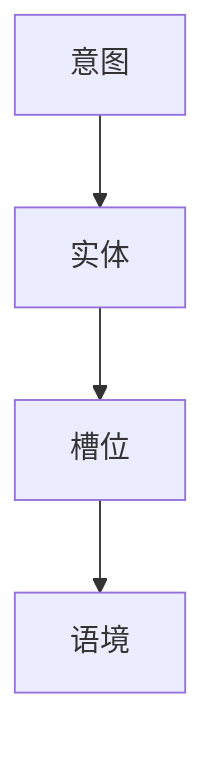
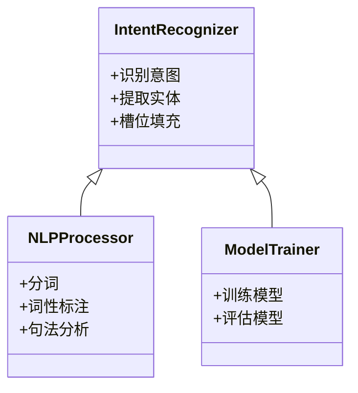
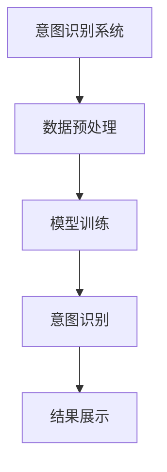
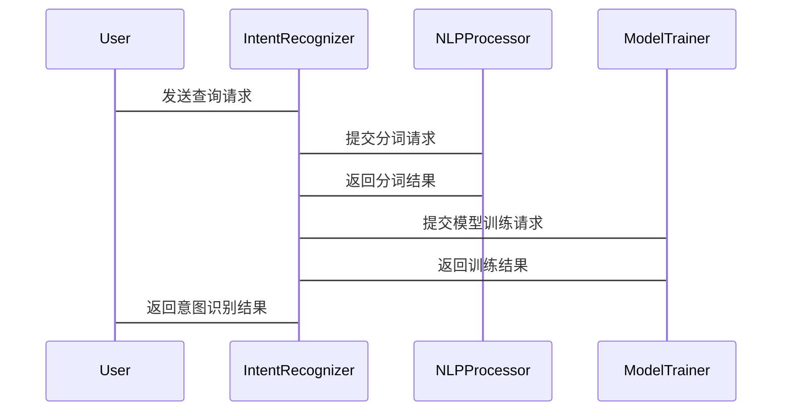

                 


# 意图识别：准确把握用户需求的关键

> 关键词：意图识别，自然语言处理，深度学习，实体识别，槽位填充

> 摘要：意图识别是自然语言处理领域的重要任务，旨在准确理解用户表达的意图。本文从意图识别的背景与核心概念入手，深入分析其算法原理，结合实际案例，详细讲解意图识别的系统设计与实现，最后总结最佳实践与未来发展方向。

---

## 第一部分：意图识别背景与核心概念

### 第1章：意图识别的背景与问题背景

#### 1.1 意图识别的定义与目标
意图识别（Intention Recognition）是自然语言处理（NLP）领域的重要任务，旨在通过分析用户输入的文本或语音，准确识别用户表达的意图。意图识别的核心目标是将用户的表达转化为可执行的计算机指令或任务。

- **意图识别的定义**：意图识别是通过自然语言处理技术，从用户的输入中提取出其背后的目的或需求的过程。
- **意图识别的目标**：准确理解用户的意图，为后续的系统响应提供依据。
- **意图识别的范围**：主要关注用户表达的显式意图和隐含意图，涵盖文本和语音等多种输入形式。

#### 1.2 意图识别的应用场景
意图识别技术广泛应用于多个领域，常见的应用场景包括：

- **智能客服**：通过解析用户的提问，自动匹配对应的解决方案。
- **智能音箱**：识别用户的语音指令，执行相应的操作。
- **智能助手**：帮助用户完成日程管理、信息查询等任务。
- **智能搜索引擎**：根据用户的搜索关键词，推荐更精准的结果。

#### 1.3 意图识别的挑战与问题描述
意图识别是一个复杂的问题，存在以下主要挑战：

- **数据多样性**：用户的表达方式多样，可能存在同义词、近义词等多种变体。
- **语义歧义性**：用户表达的意图可能不明确，需要结合上下文进行推理。
- **技术局限性**：当前的技术手段难以完全准确地理解所有复杂的意图表达。

---

### 第2章：意图识别的核心概念与联系

#### 2.1 意图识别的核心概念
意图识别涉及多个核心概念，包括意图、实体、槽位和语境。

- **意图（Intention）**：用户表达的主要目标或需求，例如“预订机票”。
- **实体（Entity）**：与意图相关的具体信息，例如“时间”、“地点”、“人名”。
- **槽位（Slot）**：实体的细化部分，例如“日期”、“时间”、“地点”。
- **语境（Context）**：上下文信息，帮助理解意图的背景。

#### 2.2 核心概念的属性特征对比
通过对比表格，可以更清晰地理解核心概念的属性特征：

| 概念 | 属性 | 特征 |
|------|------|------|
| 意图 | 类型 | 明确意图、隐含意图 |
| 实体 | 类型 | 姓名实体、地点实体、时间实体 |
| 槽位 | 类型 | 日期槽位、时间槽位、地点槽位 |
| 语境 | 类型 | 上下文语境、对话历史 |

#### 2.3 实体关系图（ER图）
通过ER图可以更直观地展示意图识别的核心概念之间的关系：



---

### 第3章：意图识别的算法原理

#### 3.1 基于规则的方法
基于规则的方法是一种简单的意图识别方法，适用于特定场景。

- **正则表达式匹配**：通过预定义的正则表达式匹配用户的输入。
- **字典匹配**：通过预定义的关键词字典匹配用户的输入。

**示例代码**：
```python
import re

# 正则表达式匹配
pattern = r"\b(reserve|book|schedule)\b"
text = "I want to reserve a flight ticket."
match = re.search(pattern, text)
if match:
    print("Match found:", match.group())
```

#### 3.2 统计模型方法
统计模型方法通过概率模型来识别意图。

- **朴素贝叶斯（Naive Bayes）**：基于特征独立假设的分类方法。
- **支持向量机（SVM）**：通过构建超平面进行分类。

**示例代码**：
```python
from sklearn.svm import SVC
from sklearn.feature_extraction.text import TfidfVectorizer

# 数据预处理
texts = ["reserve flight ticket", "book a room"]
labels = [0, 1]

# 特征提取
vectorizer = TfidfVectorizer()
X = vectorizer.fit_transform(texts)

# 模型训练
model = SVC()
model.fit(X, labels)

# 预测
new_text = "schedule a meeting"
new_X = vectorizer.transform([new_text])
print(model.predict(new_X))
```

#### 3.3 深度学习模型
深度学习模型通过神经网络结构学习意图识别任务。

- **循环神经网络（RNN）**：适用于序列数据的处理。
- **Transformer架构**：基于自注意力机制的模型。

**示例代码**：
```python
import tensorflow as tf
from tensorflow.keras import layers

# 数据预处理
texts = ["reserve flight ticket", "book a room"]
labels = [0, 1]

# 模型定义
model = tf.keras.Sequential([
    layers.Embedding(input_dim=1000, output_dim=16),
    layers.SimpleRNN(units=8),
    layers.Dense(2, activation='softmax')
])

# 模型训练
model.compile(optimizer='adam', loss='sparse_categorical_crossentropy', metrics=['accuracy'])
model.fit(texts, labels, epochs=10, batch_size=32)
```

---

## 第二部分：意图识别的系统分析与架构设计

### 第4章：意图识别系统分析

#### 4.1 项目背景与目标
我们设计一个意图识别系统，旨在通过自然语言处理技术，准确识别用户的意图。

- **项目背景**：随着智能设备的普及，意图识别技术在智能客服、智能音箱等领域发挥重要作用。
- **项目目标**：构建一个高效、准确的意图识别系统。

#### 4.2 系统功能设计
通过Mermaid类图展示系统的主要功能模块：



#### 4.3 系统架构设计
通过Mermaid架构图展示系统的整体架构：



#### 4.4 系统接口设计
系统接口设计包括输入接口和输出接口。

- **输入接口**：接收用户的输入文本或语音。
- **输出接口**：返回识别出的意图、实体和槽位信息。

#### 4.5 系统交互流程图
通过Mermaid序列图展示系统的交互流程：



---

## 第三部分：意图识别的项目实战

### 第5章：意图识别项目实战

#### 5.1 环境安装与配置
项目实战需要以下环境和库：

- **Python**：3.8+
- **库**：NLTK、spaCy、Scikit-learn、TensorFlow

**安装命令**：
```bash
pip install nltk spacy scikit-learn tensorflow
python -m spacy download en_core_web_sm
```

#### 5.2 核心代码实现

##### 5.2.1 数据预处理
```python
import spacy

nlp = spacy.load("en_core_web_sm")
text = "I want to book a flight from New York to London on May 15th."
doc = nlp(text)
```

##### 5.2.2 模型训练
```python
from sklearn.feature_extraction.text import TfidfVectorizer
from sklearn.svm import SVC

texts = ["reserve flight ticket", "book a room"]
labels = [0, 1]

vectorizer = TfidfVectorizer()
X = vectorizer.fit_transform(texts)
model = SVC()
model.fit(X, labels)
```

##### 5.2.3 意图识别
```python
new_text = "schedule a meeting"
new_X = vectorizer.transform([new_text])
print(model.predict(new_X))
```

#### 5.3 实际案例分析
通过实际案例分析，展示意图识别系统的实际应用效果。

---

## 第四部分：意图识别的最佳实践与总结

### 第6章：最佳实践与总结

#### 6.1 项目经验总结
通过项目实战，总结意图识别的关键点。

- **数据质量**：高质量的数据是意图识别系统的核心。
- **模型调优**：选择合适的模型和参数优化是关键。
- **结果验证**：通过验证集和测试集评估模型性能。

#### 6.2 实用建议
- **数据预处理**：对数据进行清洗和标注，确保数据的准确性。
- **模型选择**：根据任务需求选择合适的模型。
- **结果验证**：通过验证集和测试集评估模型性能。

#### 6.3 注意事项
- **数据隐私**：在实际应用中，需要注意数据隐私问题。
- **模型泛化**：模型需要具备良好的泛化能力，以应对不同的输入场景。

#### 6.4 拓展阅读
推荐一些深度学习和自然语言处理领域的经典书籍和论文。

---

通过以上内容，我们可以全面了解意图识别的核心概念、算法原理、系统设计和实际应用。未来，随着技术的不断发展，意图识别将变得更加精准和智能，为人类与计算机的交互带来更多的便利。

