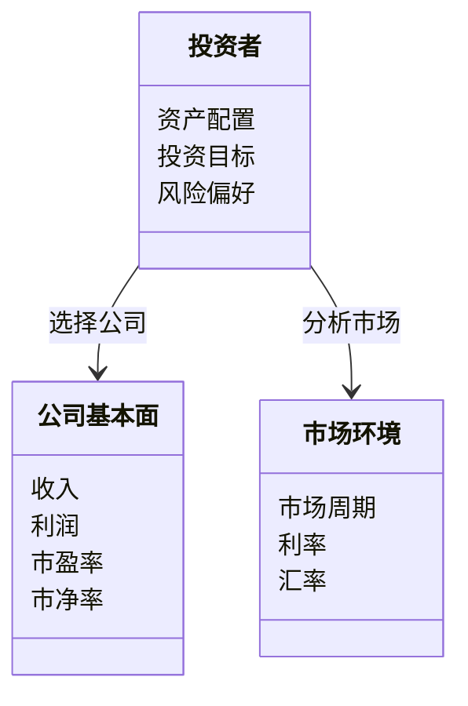
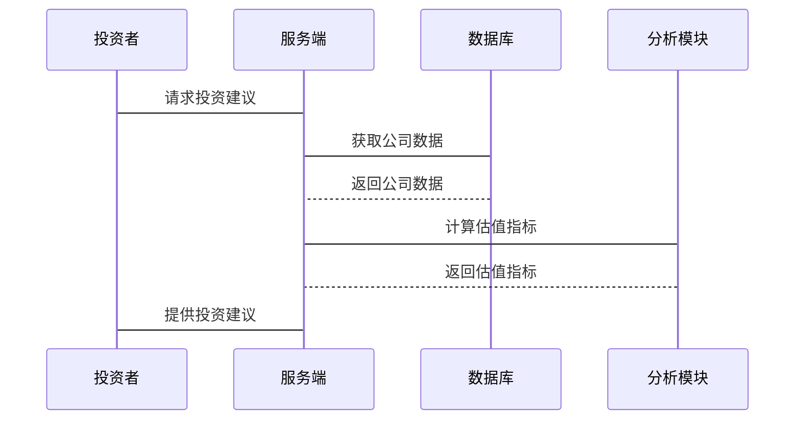

                 


# 成长型投资vs价值型投资：市场周期中的选择

## 关键词：成长型投资、价值型投资、市场周期、投资策略、DCF模型、PEG指标、投资决策

## 摘要：  
在股票投资领域，成长型投资和价值型投资是两种截然不同的策略，分别适用于不同的市场环境和投资目标。本文通过详细分析两种投资策略的核心概念、数学模型、算法原理以及在不同市场周期中的表现，帮助投资者理解如何根据市场情况选择适合的投资策略。通过实际案例分析和系统设计，本文为投资者提供了一套科学的投资决策支持系统，帮助他们在复杂多变的市场环境中做出明智的选择。

---

# 第1章: 投资策略概述

## 1.1 投资的基本概念

### 1.1.1 投资的定义与分类

投资是指将资金投入到某种资产或项目中，以期获得未来收益的行为。根据投资对象的不同，可以将投资分为股票、债券、房地产等多种类型。股票投资是最常见的形式之一，也是本文讨论的重点。

### 1.1.2 股票市场的基本运作机制

股票市场是一个买卖公司股份的场所，投资者通过购买股票成为公司的股东，分享公司收益或承担亏损。股票价格受市场供需、公司业绩、宏观经济环境等多种因素的影响。

### 1.1.3 投资者类型与投资目标

投资者可以根据投资目标分为两类：短期投资者和长期投资者。短期投资者关注市场波动，追求短期收益；长期投资者关注公司基本面，追求长期稳健的收益。

## 1.2 成长型投资与价值型投资的定义

### 1.2.1 成长型投资的核心概念

成长型投资是指投资于那些收入和利润快速增长的公司，这些公司通常处于成长期，市场占有率逐步提高，未来有较大的增长潜力。

### 1.2.2 价值型投资的核心概念

价值型投资是指投资于那些市场价格低于其内在价值的公司，这些公司通常具有较低的市盈率、市净率或其他估值指标，被认为被市场低估。

### 1.2.3 两种投资策略的对比分析

| 对比维度       | 成长型投资                         | 价值型投资                         |
|----------------|------------------------------------|------------------------------------|
| 投资目标       | 寻找高增长潜力的公司               | 寻找被低估的公司                     |
| 关注点         | 未来的增长潜力                     | 当前的估值水平                       |
| 适用场景       | 市场增长期                         | 市场低迷期或成熟期                   |
| 风险           | 高风险（波动大，估值不确定性高）     | 中低风险（注重安全边际）             |
| 收益           | 高收益（长期增长）                 | 中等收益（估值修复）                 |

## 1.3 市场周期与投资策略的选择

### 1.3.1 市场周期的基本概念

市场周期是指股票市场从低点到高点再到低点的波动过程，通常包括以下几个阶段：底部、上升趋势、顶部、下跌趋势和中期调整。

### 1.3.2 不同市场周期中的投资策略选择

- **底部阶段**：价值型投资占优，寻找被低估的股票。
- **上升趋势阶段**：成长型投资占优，关注高增长潜力的公司。
- **顶部阶段**：两种策略的风险都较高，需谨慎选择。
- **下跌趋势阶段**：价值型投资占优，寻找被过度抛售的股票。

### 1.3.3 市场周期对投资策略的影响

市场周期的变化会影响两种投资策略的表现。例如，在市场底部阶段，价值型投资能够提供较高的安全边际，而在市场上升阶段，成长型投资能够带来更高的收益。

## 1.4 本章小结

本章介绍了投资的基本概念、成长型投资和价值型投资的核心定义，并通过对比分析和市场周期的视角，帮助投资者理解在不同市场环境下选择投资策略的重要性。

---

# 第2章: 成长型投资与价值型投资的核心概念

## 2.1 成长型投资的原理与特征

### 2.1.1 成长型投资的定义与特点

成长型投资的核心在于寻找那些收入和利润快速增长的公司，这些公司通常处于新兴行业或具有技术创新能力。成长型投资者关注的是公司的未来潜力，而非当前的盈利能力。

### 2.1.2 成长型投资的核心要素

- **收入增长**：公司收入持续增长，且增速高于行业平均水平。
- **利润增长**：公司利润持续增长，且增速高于行业平均水平。
- **ROE（净资产收益率）**：公司ROE较高，表明公司盈利能力强。

### 2.1.3 成长型投资的风险与收益分析

- **收益**：高增长潜力意味着高收益，尤其是在市场上升阶段。
- **风险**：成长型投资的风险较高，主要来自于公司增长的不确定性和市场波动。

## 2.2 价值型投资的原理与特征

### 2.2.1 价值型投资的定义与特点

价值型投资的核心在于寻找市场价格低于其内在价值的公司，这些公司通常具有较低的市盈率、市净率或其他估值指标。

### 2.2.2 价值型投资的核心要素

- **低市盈率**：市盈率低于行业平均水平或历史平均水平。
- **低市净率**：市净率低于行业平均水平或历史平均水平。
- **高股息率**：股息率较高，表明公司愿意将利润返还给股东。

### 2.2.3 价值型投资的风险与收益分析

- **收益**：价值型投资的收益主要来自于估值修复，通常在市场低迷阶段表现较好。
- **风险**：价值型投资的风险较低，但需注意公司基本面的变化。

## 2.3 成长型与价值型投资的对比分析

### 2.3.1 投资目标的对比

- 成长型投资：追求高增长潜力。
- 价值型投资：追求低估值。

### 2.3.2 投资策略的对比

- 成长型投资：关注未来，注重公司的成长潜力。
- 价值型投资：关注现在，注重公司的估值水平。

### 2.3.3 适用场景的对比

- 成长型投资：适用于市场增长阶段。
- 价值型投资：适用于市场低迷或成熟阶段。

## 2.4 本章小结

本章详细分析了成长型投资和价值型投资的核心概念、核心要素和风险收益特征，为投资者理解这两种投资策略提供了坚实的基础。

---

# 第3章: 成长型投资与价值型投资的数学模型与算法原理

## 3.1 成长型投资的算法模型

### 3.1.1 成长型投资的现金流折现模型（DCF）

现金流折现模型（DCF）是评估成长型投资的核心工具之一。其基本思想是将公司未来现金流折现，以确定其内在价值。

#### DCF模型公式

$$DCF = \sum_{t=1}^{n} \frac{CF_t}{(1+r)^t} + \frac{TV}{(1+r)^n}$$

其中：
- $CF_t$：第t年的自由现金流
- $r$：折现率
- $TV$：终值
- $n$：预测期数

### 3.1.2 成长型投资的PEG指标

PEG（Price/Earnings to Growth）指标是成长型投资中常用的估值指标，其计算公式为：

$$PEG = \frac{P/E}{G}$$

其中：
- $P/E$：市盈率
- $G$：净利润增长率

### 3.1.3 成长型投资的市盈率增长比（PEG）

PEG指标通过将市盈率与净利润增长率进行对比，帮助投资者找到具有合理估值的成长型公司。

---

## 3.2 价值型投资的算法模型

### 3.2.1 价值型投资的市盈率（P/E）模型

市盈率（P/E）是价值型投资中最常用的估值指标之一，其计算公式为：

$$P/E = \frac{P}{E}$$

其中：
- $P$：股票价格
- $E$：每股净利润

### 3.2.2 价值型投资的市净率（P/B）模型

市净率（P/B）是另一个常用的估值指标，其计算公式为：

$$P/B = \frac{P}{B}$$

其中：
- $P$：股票价格
- $B$：每股净资产

### 3.2.3 价值型投资的股息率模型

股息率是衡量股票收益能力的重要指标，其计算公式为：

$$\text{股息率} = \frac{\text{每股股息}}{\text{股票价格}}$$

---

## 3.3 成长型与价值型投资模型的对比分析

| 对比维度       | 成长型投资模型                     | 价值型投资模型                     |
|----------------|------------------------------------|------------------------------------|
| 核心指标       | PEG、DCF                          | P/E、P/B、股息率                   |
| 计算公式       | $$PEG = \frac{P/E}{G}$$           | $$P/E = \frac{P}{E}$$             |
| 适用场景       | 高增长公司                       | 低估值公司                         |
| 优缺点         | 优点：适合高增长公司；缺点：对增长假设敏感 | 优点：适合低估值公司；缺点：对市场情绪敏感 |

## 3.4 本章小结

本章通过数学模型和算法原理，详细分析了成长型投资和价值型投资的核心估值指标和计算方法，为投资者提供了科学的决策依据。

---

# 第4章: 系统分析与架构设计

## 4.1 问题场景介绍

在实际投资过程中，投资者需要根据市场周期和公司基本面选择合适的投资策略。为了实现这一目标，我们需要构建一个投资决策支持系统。

## 4.2 系统功能设计

### 4.2.1 领域模型



### 4.2.2 系统架构设计


### 4.2.3 系统接口设计



## 4.3 本章小结

本章通过系统分析和架构设计，为投资者提供了一个投资决策支持系统的框架，帮助投资者在复杂多变的市场环境中做出科学的投资决策。

---

# 第5章: 项目实战

## 5.1 环境安装

```bash
pip install numpy pandas matplotlib
```

## 5.2 系统核心实现源代码

### 5.2.1 DCF模型实现

```python
def calculate_dcf(cash_flows, discount_rate, terminal_value):
    dcf = 0
    for t in range(len(cash_flows)):
        dcf += cash_flows[t] / (1 + discount_rate) ** t
    dcf += terminal_value / (1 + discount_rate) ** len(cash_flows)
    return dcf

# 示例
cash_flows = [100, 200, 300]
discount_rate = 0.1
terminal_value = 1000
dcf_value = calculate_dcf(cash_flows, discount_rate, terminal_value)
print("DCF Value:", dcf_value)
```

### 5.2.2 PEG指标实现

```python
def calculate_peg(pe, growth_rate):
    return pe / growth_rate

# 示例
pe = 20
growth_rate = 0.2
peg_value = calculate_peg(pe, growth_rate)
print("PEG Value:", peg_value)
```

## 5.3 代码应用解读与分析

通过上述代码，投资者可以计算出公司的DCF值和PEG值，从而判断其是否具有投资价值。

## 5.4 实际案例分析

### 5.4.1 成长型投资案例

假设某科技公司过去三年的净利润增长率为20%，市盈率为30，行业平均市盈率为25。根据PEG指标：

$$PEG = \frac{30}{20} = 1.5$$

由于PEG小于1，表明该公司的股票具有较高的成长性，适合成长型投资。

### 5.4.2 价值型投资案例

假设某制造公司当前市盈率为10，行业平均市盈率为15。由于市盈率低于行业平均水平，表明该公司的股票可能被低估，适合价值型投资。

## 5.5 本章小结

本章通过实际案例分析，帮助投资者理解如何在实际投资中应用成长型和价值型投资的数学模型和算法原理。

---

# 第6章: 总结与展望

## 6.1 本章小结

本文通过详细分析成长型投资和价值型投资的核心概念、数学模型和算法原理，并结合实际案例，帮助投资者理解如何在不同市场周期中选择合适的投资策略。

## 6.2 投资策略选择的注意事项

- **市场周期**：根据市场周期选择合适的投资策略。
- **公司基本面**：注重公司的收入、利润和估值指标。
- **风险控制**：合理控制投资风险，避免过度集中。

## 6.3 拓展阅读

- 《投资学》（书籍）
- 《价值投资策略》（书籍）
- 《成长型投资实战》（书籍）

## 6.4 本章小结

通过本文的分析，投资者可以更好地理解成长型和价值型投资的核心概念，并在实际投资中做出明智的选择。

---

# 结语

成长型投资和价值型投资是两种截然不同的投资策略，分别适用于不同的市场环境和投资目标。通过本文的分析，投资者可以更好地理解这两种投资策略的核心概念，并在实际投资中做出明智的选择。无论是成长型投资还是价值型投资，都需要投资者具备扎实的分析能力和对市场的深刻理解。希望本文能够为投资者提供有价值的参考和启示。

--- 

**Note:** 如果您觉得文章中有任何需要改进的地方，或者希望进一步探讨某个话题，请随时告诉我！我会根据您的反馈进行修改或补充。

