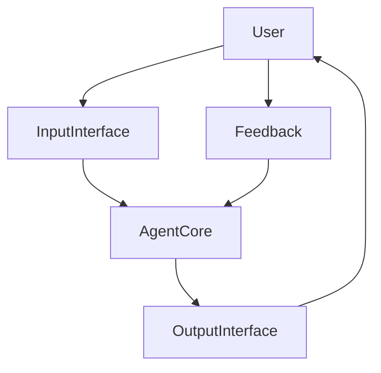
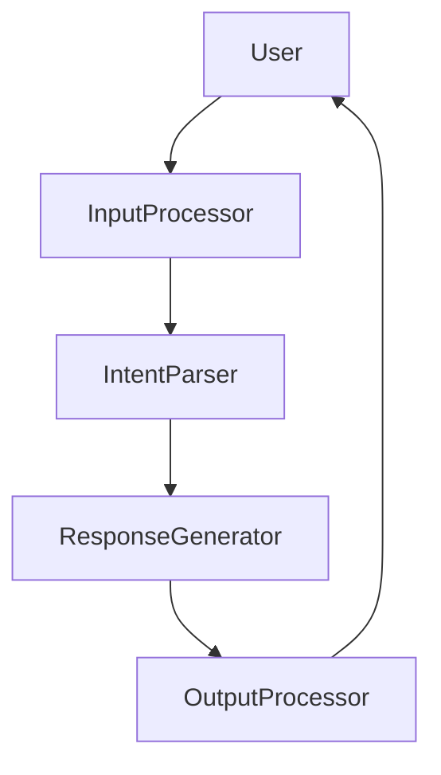

                 


# 打造直观易用的AI Agent交互界面

## 关键词：AI Agent、交互界面、用户体验、易用性、多模态交互

## 摘要：  
本文详细探讨了设计直观易用的AI Agent交互界面的核心方法。通过分析交互界面的背景、核心概念、算法原理、系统架构及项目实战，本文提供了从理论到实践的全面指导。文章还结合实际案例，总结了最佳实践和设计原则，帮助读者打造高效、友好的AI Agent交互体验。

---

## 第一部分: 背景与核心概念

### 第1章: AI Agent交互界面的背景与问题背景

#### 1.1 问题背景
- **AI Agent的定义与作用**：AI Agent是一种能够感知环境、执行任务并提供服务的智能实体，其交互界面是用户与AI Agent之间的桥梁。
- **交互界面的重要性**：直观易用的界面能够提升用户体验，降低用户操作成本，增强用户满意度。
- **当前交互界面设计的痛点**：现有界面普遍存在操作复杂、反馈不直观、多模态交互不足等问题。

#### 1.2 问题描述
- **用户与AI Agent交互中的常见问题**：用户输入歧义、反馈延迟、交互流程不清晰等。
- **交互效率与用户体验的平衡**：如何在功能丰富性与操作简单性之间找到最佳平衡点。
- **界面设计中的易用性挑战**：如何通过直观的视觉设计、简洁的操作流程提升用户体验。

#### 1.3 问题解决
- **直观易用的设计目标**：通过简洁的设计语言、直观的反馈机制和多模态交互方式，提升用户操作体验。
- **交互界面的核心功能**：接收用户输入、解析用户意图、生成系统反馈、提供实时互动。

#### 1.4 边界与外延
- **AI Agent交互界面的边界**：仅关注用户与界面的交互过程，不涉及AI Agent的内部算法实现。
- **相关领域与技术的外延**：包括自然语言处理、计算机视觉、语音识别等技术领域。

#### 1.5 核心概念结构与组成
- **用户、界面、AI Agent的关系**：用户通过界面与AI Agent交互，界面负责接收输入、展示输出，AI Agent负责处理逻辑。
- **交互流程的核心要素**：输入解析、意图识别、反馈生成。
- **易用性设计的组成模块**：输入模块、反馈模块、多模态交互模块。

---

## 第二部分: 核心概念与联系

### 第2章: AI Agent交互模型

#### 2.1 多模态交互
- **文本交互**：通过文本输入实现简单的对话交互。
- **语音交互**：支持语音输入和输出，适合复杂场景下的自然语言交互。
- **手势交互**：通过手势实现直观的操作，适用于特定场景。
- **多模态交互的实现原理**：结合多种交互方式，提供更丰富的用户操作体验。

#### 2.2 用户意图识别
- **基于上下文的意图识别**：通过分析对话历史和当前输入，准确识别用户意图。
- **模糊输入的处理方法**：通过概率模型和意图矫正技术解决输入歧义问题。

#### 2.3 反馈机制
- **实时反馈与延迟反馈**：实时反馈适合需要快速响应的场景，延迟反馈适合需要复杂计算的场景。
- **反馈的可视化与可理解性**：通过颜色、动画等方式直观展示反馈内容。

#### 2.4 核心概念对比表
| 交互方式 | 优点 | 缺点 | 适用场景 |
|----------|------|------|----------|
| 文本输入 | 实现简单，支持快速开发 | 易出歧义，不适合复杂场景 | 简单任务 |
| 语音交互 | 自然流畅，用户体验好 | 网络依赖，隐私问题 | 复杂场景 |
| 手势操作 | 直观高效，操作成本低 | 学习成本高，适用场景有限 | 特定领域 |

#### 2.5 实体关系图


---

## 第三部分: 算法原理讲解

### 第3章: 交互模型算法

#### 3.1 自然语言处理模型
- **Transformer模型的工作原理**：通过自注意力机制实现全局上下文感知。
- **文本分类任务示例**：使用Transformer模型对用户输入进行分类，识别用户意图。

#### 3.2 注意力机制公式
$$\text{Attention}(Q, K, V) = \text{softmax}\left(\frac{QK^T}{\sqrt{d_k}}\right)V$$
其中，$Q$ 是查询向量，$K$ 是键向量，$V$ 是值向量，$d_k$ 是维度。

#### 3.3 Python代码实现
```python
import torch
import torch.nn as nn

class MultiHeadAttention(nn.Module):
    def __init__(self, embed_dim, num_heads):
        super().__init__()
        self.embed_dim = embed_dim
        self.num_heads = num_heads
        self.q_proj = nn.Linear(embed_dim, embed_dim)
        self.k_proj = nn.Linear(embed_dim, embed_dim)
        self.v_proj = nn.Linear(embed_dim, embed_dim)
        self.out_proj = nn.Linear(embed_dim, embed_dim)
    
    def forward(self, x, mask=None):
        batch_size, seq_len, embed_dim = x.size()
        heads = []
        for _ in range(self.num_heads):
            q = self.q_proj(x)
            k = self.k_proj(x)
            v = self.v_proj(x)
            attn_weights = (q @ k.transpose(-2, -1)) / (embed_dim ** 0.5)
            if mask is not None:
                attn_weights = attn_weights.masked_fill(mask == 0, float('-inf'))
            attn_weights = attn_weights.softmax(dim=-1)
            heads.append((attn_weights @ v).unsqueeze(0))
        heads = torch.cat(heads, dim=0)
        heads = heads.view(batch_size, seq_len, embed_dim)
        output = self.out_proj(heads)
        return output
```

---

## 第四部分: 系统分析与架构设计方案

### 第4章: 问题场景与系统功能设计

#### 4.1 问题场景介绍
- **用户场景**：用户通过多模态交互与AI Agent进行对话，获取信息或完成任务。
- **系统功能**：接收输入、解析意图、生成反馈、提供实时互动。

#### 4.2 系统功能设计
- **领域模型设计**：定义用户、输入、输出、反馈等核心实体及其关系。
- **系统架构设计**：采用分层架构，包括输入层、处理层、输出层。
- **系统交互流程**：用户输入→解析→生成反馈→输出。

#### 4.3 系统架构图


---

## 第五部分: 项目实战

### 第5章: 环境安装与核心实现

#### 5.1 环境安装
- **安装Python与相关库**：`pip install torch transformers`

#### 5.2 核心功能实现
```python
def process_input(user_input):
    # 输入解析
    parsed_intent = intent_parser(user_input)
    # 生成反馈
    response = response_generator(parsed_intent)
    # 输出反馈
    output_processor(response)
```

#### 5.3 代码分析
- **输入解析**：将用户输入转化为系统可理解的意图。
- **反馈生成**：基于意图生成合适的系统反馈。
- **输出处理**：将反馈以合适的形式展示给用户。

#### 5.4 案例分析
- **实际案例**：用户输入“今天天气如何？”，系统解析意图后生成天气预报并输出。

---

## 第六部分: 最佳实践

### 第6章: 设计原则与注意事项

#### 6.1 设计原则
- **以用户为中心**：优先考虑用户体验和操作便捷性。
- **模块化设计**：便于功能扩展和维护。

#### 6.2 常见问题与解决方案
- **输入歧义**：通过上下文分析和意图矫正技术解决。
- **反馈延迟**：优化系统响应速度，或提供进度反馈。

#### 6.3 注意事项
- **安全性与隐私**：确保用户数据的安全性和隐私保护。
- **可扩展性**：设计灵活的架构，便于未来功能扩展。

---

## 结语

打造直观易用的AI Agent交互界面是一项复杂的系统工程，需要从用户需求出发，结合先进的技术手段和设计理念。通过本文的详细讲解和实践案例，读者可以全面掌握设计交互界面的核心方法和最佳实践。未来，随着AI技术的不断进步，交互界面的设计将更加智能化和人性化，为用户带来更优质的体验。

--- 

**关于作者**  
[此处可以放置作者的简介，包括作者的技术背景、著作和联系方式等。]

