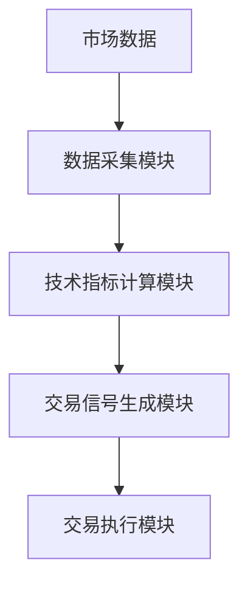
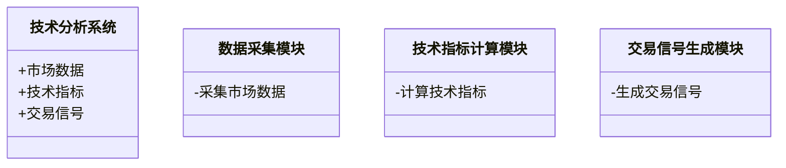
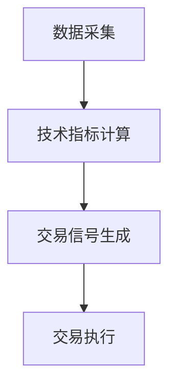

                 


# 技术分析在高波动市场中的应用

> **关键词**：技术分析，高波动市场，交易策略，技术指标，算法交易

> **摘要**：本文深入探讨了技术分析在高波动市场中的应用，从基本概念到数学模型，再到系统设计和实际案例，全面解析了技术分析在高波动环境下的优势与挑战。通过详细的技术分析工具和策略，本文为投资者提供了实用的指导和启示。

---

# 第一部分: 技术分析在高波动市场中的应用概述

## 第1章: 高波动市场的特点与技术分析的必要性

### 1.1 高波动市场的定义与特点

高波动市场是指金融资产价格在短时间内出现剧烈波动的市场环境。其主要特点包括：

1. **价格波动剧烈**：价格在短时间内出现大幅上涨或下跌。
2. **市场情绪不稳定**：投资者情绪易受市场波动影响，导致市场行为的不确定性增加。
3. **交易机会频繁**：高波动市场为投资者提供了更多的交易机会，但也伴随着更高的风险。

### 1.2 技术分析的基本概念

技术分析是一种通过分析历史价格数据来预测未来价格走势的方法。其核心假设包括：

1. **价格反映所有信息**：市场的价格已经反映了所有相关信息（有效市场假说）。
2. **价格趋势可预测**：价格走势具有一定的趋势性和周期性。
3. **历史重复性**：历史价格模式会在未来重复出现。

### 1.3 技术分析在高波动市场中的作用

在高波动市场中，技术分析的作用尤为突出：

1. **捕捉短期交易机会**：技术分析能够快速识别价格波动中的短期趋势，帮助投资者抓住交易机会。
2. **降低交易风险**：通过技术指标和图表分析，投资者可以更早地识别潜在风险，及时调整交易策略。
3. **提高交易效率**：技术分析提供了一套系统化的交易方法，能够帮助投资者快速做出决策。

---

## 第2章: 技术分析的核心概念与工具

### 2.1 技术分析的核心概念

#### 2.1.1 支撑位与阻力位

- **支撑位**：价格在下跌过程中遇到支撑，阻止价格进一步下跌的水平。
- **阻力位**：价格在上涨过程中遇到阻力，阻止价格进一步上涨的水平。

#### 2.1.2 趋势线与趋势通道

- **趋势线**：连接价格波动的主要趋势点，用于判断价格是否偏离主要趋势。
- **趋势通道**：由两条平行线组成，用于判断价格波动的上限和下限。

#### 2.1.3 技术指标与成交量分析

- **技术指标**：如RSI、MACD等，用于衡量市场的买卖力量。
- **成交量分析**：通过分析成交量的变化，判断市场的交易活跃度和趋势的强度。

### 2.2 技术分析的主要工具

#### 2.2.1 移动平均线（MA）

- **简单移动平均线（SMA）**：将过去n天的价格平均值作为当前价格的估计值。
- **指数移动平均线（EMA）**：赋予近期价格更高的权重，使指标更敏感。

#### 2.2.2 相对强弱指数（RSI）

- RSI用于衡量资产的超买或超卖状态，通常在0-100之间波动。
- 当RSI高于70时，资产可能处于超买状态；低于30时，可能处于超卖状态。

#### 2.2.3 布林带（Bollinger Bands）

- 布林带由三条曲线组成：中线（MA）、上限（MA + 标准差）和下限（MA - 标准差）。
- 价格在布林带上下限之间波动，超出范围可能预示着价格的反转。

#### 2.2.4 MACD指标

- MACD由两条线组成：MACD线（EMA12 - EMA26）和信号线（MACD的EMA9）。
- 当MACD线与信号线交叉时，可能预示着趋势的变化。

### 2.3 技术分析的核心假设与理论基础

#### 2.3.1 马科维茨投资组合理论

- 马科维茨提出，投资者可以通过分散投资来降低风险。
- 在高波动市场中，技术分析可以帮助投资者选择具有较低相关性的资产，从而分散风险。

#### 2.3.2 随机游走理论

- 随机游走理论认为价格的变化是随机的，无法通过技术分析预测。
- 在高波动市场中，技术分析的有效性受到挑战，但仍然被广泛应用于实际交易中。

#### 2.3.3 技术分析与市场情绪的关系

- 技术分析通过分析价格走势间接反映市场情绪。
- 在高波动市场中，市场情绪的变化往往会导致价格的剧烈波动，技术分析可以帮助投资者更好地捕捉这些变化。

---

## 第3章: 技术分析的数学模型与算法原理

### 3.1 技术指标的数学模型

#### 3.1.1 移动平均线的数学公式

$$ MA_n = \frac{1}{n} \sum_{i=1}^{n} p_i $$
其中，$p_i$ 表示第 $i$ 天的价格，$n$ 表示计算天数。

#### 3.1.2 相对强弱指数（RSI）的计算公式

$$ RSI = \frac{100}{1 + \frac{A}{B}} $$
其中，$A$ 是上涨幅度的平均值，$B$ 是下跌幅度的平均值。

### 3.2 技术分析算法的实现

#### 3.2.1 基于移动平均线的策略

```python
def moving_average_strategy(prices, n):
    ma = []
    for i in range(len(prices)):
        if i >= n:
            ma_val = sum(prices[i-n:i+1]) / n
            ma.append(ma_val)
    return ma
```

#### 3.2.2 基于RSI的超买超卖策略

```python
def rsi_strategy(prices, n):
    # 计算RSI
    rsi = []
    up_days = []
    down_days = []
    for i in range(len(prices)):
        if i == 0:
            rsi_val = 0
        else:
            diff = prices[i] - prices[i-1]
            if diff > 0:
                up_days.append(diff)
                down_days.append(0)
            else:
                down_days.append(abs(diff))
                up_days.append(0)
        if i >= n-1:
            avg_up = sum(up_days[-n:])/n
            avg_down = sum(down_days[-n:])/n
            rsi_val = 100 / (1 + (avg_up / avg_down))
            rsi.append(rsi_val)
    return rsi
```

#### 3.2.3 基于布林带的波动率捕捉策略

```python
def bollinger_bands_strategy(prices, n):
    # 计算布林带
    ma = moving_average(prices, n)
    std = standard_deviation(prices, n)
    upper_band = ma + std
    lower_band = ma - std
    return upper_band, lower_band
```

---

## 第4章: 技术分析在高波动市场中的系统设计

### 4.1 高波动市场交易系统的总体架构



### 4.2 技术分析系统的功能设计

#### 4.2.1 系统功能模块



#### 4.2.2 系统架构设计



---

## 第5章: 项目实战与最佳实践

### 5.1 项目实战

#### 5.1.1 环境安装

安装必要的Python库：

```bash
pip install pandas numpy matplotlib
```

#### 5.1.2 核心代码实现

```python
def main():
    import pandas as pd
    import numpy as np
    import matplotlib.pyplot as plt

    # 加载数据
    data = pd.read_csv('prices.csv')
    prices = data['price'].values

    # 计算移动平均线
    n = 10
    ma = moving_average(prices, n)
    plt.plot(ma, label='MA10')

    # 计算布林带
    std = np.std(prices[n:])
    upper_band = ma + std
    lower_band = ma - std
    plt.plot(upper_band, label='Upper Band')
    plt.plot(lower_band, label='Lower Band')

    plt.legend()
    plt.show()

if __name__ == '__main__':
    main()
```

#### 5.1.3 案例分析

假设我们有以下价格数据：

| 日期 | 价格 |
|------|------|
| 1    | 100  |
| 2    | 105  |
| 3    | 110  |
| 4    | 108  |
| 5    | 112  |

计算10天的移动平均线：

$$ MA10 = \frac{100 + 105 + 110 + 108 + 112}{5} = 108.4 $$

---

## 第6章: 最佳实践与总结

### 6.1 最佳实践

1. **结合基本面分析**：技术分析在高波动市场中可以提供短期交易信号，但应结合基本面分析以全面评估市场风险。
2. **严格风险管理**：在高波动市场中，设置止损点以避免过大的亏损。
3. **持续学习与优化**：市场环境不断变化，技术分析策略需要不断优化和调整。

### 6.2 总结

技术分析在高波动市场中的应用具有重要意义，它能够帮助投资者快速捕捉交易机会，降低交易风险。然而，技术分析的有效性依赖于市场的流动性和交易活跃度，投资者需要结合市场环境和自身需求选择合适的策略。

---

## 参考文献

1. 布里奇特·奥康奈尔，《技术分析实战指南》
2. 约翰·墨菲，《技术分析实战策略》
3. 马科维茨，《投资组合理论与市场效率》

