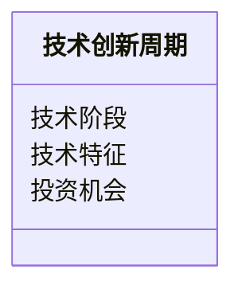
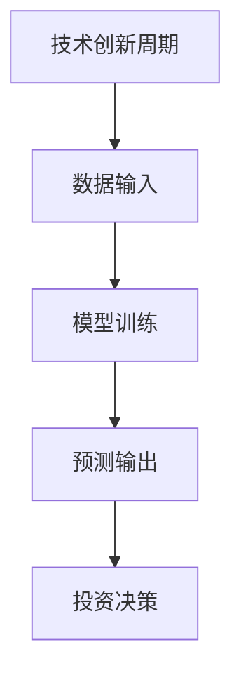

                 


---

# 第四部分：技术创新周期的系统架构与投资机会分析

## 第4章：技术创新周期的系统架构设计

### 4.1 系统功能设计

#### 4.1.1 技术创新周期的领域模型



#### 4.1.2 技术创新周期的系统功能模块



### 4.2 系统架构设计

#### 4.2.1 系统架构图


## 第5章：技术创新周期的投资机会分析

### 5.1 投资机会的识别与评估

#### 5.1.1 技术创新周期与投资机会的关系

#### 5.1.2 技术成熟度评估

#### 5.1.3 市场需求分析

### 5.2 技术创新周期的投资策略

#### 5.2.1 不同阶段的投资策略

#### 5.2.2 风险评估与管理

#### 5.2.3 投资组合优化

---

# 第五部分：技术创新周期的项目实战

## 第6章：技术创新周期的项目实战

### 6.1 环境安装与工具准备

#### 6.1.1 安装Python环境

#### 6.1.2 安装必要的库

#### 6.1.3 数据获取与预处理

### 6.2 核心代码实现

#### 6.2.1 技术创新周期分析代码

```python
import pandas as pd
import numpy as np
from statsmodels.tsa.arima.model import ARIMA

# 加载数据
data = pd.read_csv('technology_cycle.csv')

# 训练ARIMA模型
model = ARIMA(data['value'], order=(5, 1, 0))
model_fit = model.fit()

# 预测未来值
 forecast = model_fit.forecast(steps=10)
print(forecast)
```

#### 6.2.2 投资机会评估代码

```python
import numpy as np
import matplotlib.pyplot as plt

# 生成随机数据
np.random.seed(0)
data = np.random.rand(100, 4)

# 绘制散点图矩阵
import seaborn as sns
sns.pairplot(data)
plt.show()
```

### 6.3 实际案例分析

#### 6.3.1 案例背景

#### 6.3.2 数据分析与模型训练

#### 6.3.3 投资机会评估与建议

---

# 第六部分：技术创新周期的最佳实践与未来展望

## 第7章：技术创新周期的最佳实践

### 7.1 投资策略优化

#### 7.1.1 定期评估技术创新周期

#### 7.1.2 关注新兴技术领域

#### 7.1.3 分散投资组合

### 7.2 风险管理与控制

#### 7.2.1 技术风险评估

#### 7.2.2 市场风险应对

#### 7.2.3 退出策略制定

## 7.3 小结与展望

### 7.3.1 本章小结

### 7.3.2 未来研究方向

### 7.3.3 行业发展趋势

---

# 参考文献

（此处列出相关文献和资源）

---

# 附录

## 附录A：相关工具与库

## 附录B：代码示例与数据集

---

# 索引

（此处列出文章中的关键词索引）

---

通过以上目录结构和内容的详细设计，我们可以清晰地看到技术创新周期与行业投资机会之间的关系，并通过实际案例和代码实现，帮助读者更好地理解和应用这些概念。

