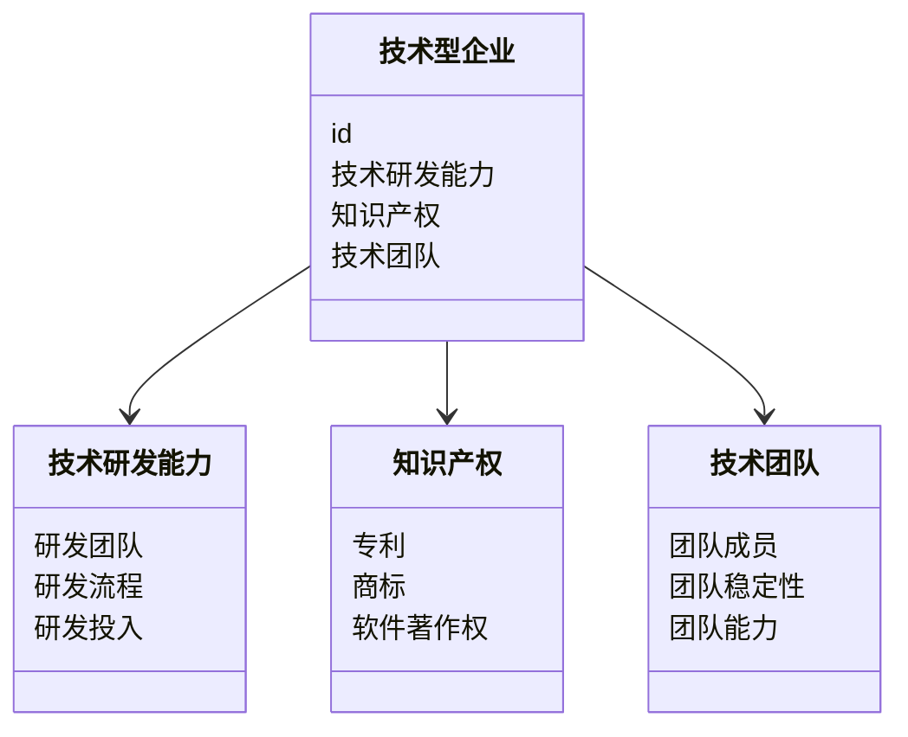

                 


# 技术型企业的特殊估值考虑

> 关键词：技术型企业、特殊估值、知识产权、技术生命周期、研发投入

> 摘要：技术型企业由于其核心竞争力和技术驱动的特性，其估值过程需要考虑诸多特殊因素。本文从技术型企业的定义、特殊估值的背景、核心概念、数学模型、系统设计和项目实战等方面展开讨论，详细分析了技术型企业特殊估值的关键要素和方法，帮助读者更好地理解和应用这些知识。

---

# 第1章: 技术型企业的特点与特殊估值背景

## 1.1 技术型企业的定义与特点

### 1.1.1 技术型企业的定义

技术型企业是指以技术创新为核心驱动力的企业，其主要资产包括知识产权、技术团队和研发投入。这类企业通常依赖技术优势来获取市场竞争优势，其价值不仅仅体现在财务指标上，还包括技术的领先性、研发能力和团队的专业性。

### 1.1.2 技术型企业与传统企业的区别

| 特性 | 技术型企业 | 传统企业 |
|------|------------|----------|
| 核心资产 | 知识产权、技术团队 | 实物资产、现金流 |
| 估值重点 | 技术领先性、商业化潜力 | 财务指标（如利润、资产） |
| 风险因素 | 技术迭代、市场竞争 | 经营稳定性、财务风险 |

### 1.1.3 技术型企业核心竞争力的构成

技术型企业的核心竞争力主要体现在以下几个方面：
1. **技术创新能力**：包括技术研发投入、技术团队的能力和创新文化。
2. **知识产权**：包括专利、商标、软件著作权等。
3. **技术的商业化潜力**：技术能否转化为实际产品或服务，并产生经济效益。

## 1.2 技术型企业的特殊估值背景

### 1.2.1 传统企业估值方法的局限性

传统企业估值方法（如市盈率、市净率）主要基于财务指标，而技术型企业由于其资产的无形性和研发投入的不确定性，这些方法往往无法准确反映其价值。

### 1.2.2 技术型企业估值的独特性

技术型企业估值需要考虑以下独特因素：
1. **技术研发周期**：技术从研发到商业化需要较长时间，存在较大的不确定性。
2. **知识产权价值**：知识产权的价值难以量化，且容易受到市场竞争和法律风险的影响。
3. **技术团队的作用**：技术团队的能力和稳定性对企业的估值至关重要。

### 1.2.3 技术型企业估值的重要性和意义

准确的技术型企业的估值有助于：
1. **吸引投资**：投资者需要了解企业的技术价值，以便做出投资决策。
2. **企业融资**：企业可以通过准确的估值获得合理的融资。
3. **企业并购**：在并购过程中，准确的估值有助于双方达成公平的交易。

## 1.3 本章小结

本章从技术型企业的定义和特点入手，分析了其与传统企业的区别，并重点探讨了技术型企业估值的独特性和重要性。这为后续章节的深入分析奠定了基础。

---

# 第2章: 技术型企业特殊估值的核心概念

## 2.1 技术型企业的核心要素

### 2.1.1 技术研发能力

技术研发能力是技术型企业最重要的核心要素之一。包括：
1. **研发团队**：包括科学家、工程师和产品经理。
2. **研发流程**：从需求分析到产品落地的完整流程。
3. **研发投入**：企业的研发投入占总收入的比例。

### 2.1.2 知识产权的价值

知识产权是技术型企业的核心资产之一，包括：
1. **专利**：保护技术的核心创新点。
2. **商标**：品牌价值的重要组成部分。
3. **软件著作权**：保护软件代码和技术文档。

### 2.1.3 技术团队的构成与作用

技术团队的构成和稳定性直接影响企业的估值。一个优秀的技术团队能够快速响应市场需求，推动技术创新。

## 2.2 技术型企业特殊估值的关键维度

### 2.2.1 技术创新的领先性

技术创新的领先性是技术型企业估值的重要指标。领先的技术意味着更高的市场竞争力和更大的市场潜力。

### 2.2.2 技术的商业化潜力

技术的商业化潜力决定了其能否为公司带来实际收益。包括市场需求、商业模式和市场定位等因素。

### 2.2.3 技术的生命周期

技术的生命周期包括：
1. **引入期**：技术刚研发完成，尚未大规模应用。
2. **成长期**：技术逐渐被市场认可，开始产生收益。
3. **成熟期**：技术稳定，市场占有率较高。
4. **衰退期**：技术逐渐被替代。

## 2.3 技术型企业特殊估值的核心要素对比

### 2.3.1 对比表格

| 要素 | 技术型企业的特殊估值 | 传统企业的估值 |
|------|-----------------------|----------------|
| 核心资产 | 知识产权、技术团队 | 实物资产 |
| 估值重点 | 技术领先性、商业化潜力 | 财务指标 |
| 风险因素 | 技术迭代、市场竞争 | 经营稳定性 |

### 2.3.2 ER实体关系图

```mermaid
erDiagram
    class 技术型企业 {
        id
        技术研发能力
        知识产权
        技术团队
    }
    class 技术研发能力 {
        研发团队
        研发流程
        研发投入
    }
    class 知识产权 {
        专利
        商标
        软件著作权
    }
    class 技术团队 {
        团队成员
        团队稳定性
        团队能力
    }
    技术型企业 --> 技术研发能力
    技术型企业 --> 知识产权
    技术型企业 --> 技术团队
```

## 2.4 本章小结

本章详细分析了技术型企业的核心要素和特殊估值的关键维度，通过对比和图表的形式，帮助读者更好地理解技术型企业估值的独特性。

---

# 第3章: 技术型企业估值的数学模型

## 3.1 技术型企业估值的基本模型

### 3.1.1 贴现现金流模型（DCF）

贴现现金流模型是一种常用的估值方法，适用于技术型企业。其基本公式为：

$$
DCF = \sum_{t=1}^{n} \frac{CF_t}{(1 + r)^t} + \frac{TV}{(1 + r)^n}
$$

其中：
- $CF_t$：第t年的现金流
- $r$：折现率
- $TV$：终值
- $n$：预测期

### 3.1.2 市盈率模型

市盈率模型适用于有稳定盈利的技术型企业。公式为：

$$
P/E = \frac{P}{E}
$$

其中：
- $P$：股票价格
- $E$：每股收益

### 3.1.3 市净率模型

市净率模型适用于资产以无形资产为主的技术型企业。公式为：

$$
P/B = \frac{P}{B}
$$

其中：
- $P$：股票价格
- $B$：每股净资产

## 3.2 技术型企业特殊估值的改进模型

### 3.2.1 基于研发投入的估值模型

基于研发投入的估值模型适用于研发投入占比较高的技术型企业。其公式为：

$$
V = k \times R
$$

其中：
- $V$：企业价值
- $k$：研发投入的系数
- $R$：研发投入

### 3.2.2 基于知识产权价值的估值模型

基于知识产权价值的估值模型适用于知识产权密集型的技术型企业。其公式为：

$$
V = \sum_{i=1}^{m} IP_i
$$

其中：
- $V$：企业价值
- $IP_i$：第i个知识产权的价值
- $m$：知识产权的数量

### 3.2.3 基于技术生命周期的估值模型

基于技术生命周期的估值模型适用于处于不同生命周期阶段的技术型企业。其公式为：

$$
V = \sum_{t=1}^{n} \frac{CF_t}{(1 + r)^t} + \frac{TV}{(1 + r)^n}
$$

其中：
- $CF_t$：第t年的现金流
- $r$：折现率
- $TV$：终值
- $n$：预测期

## 3.3 数学公式与详细讲解

### 3.3.1 贴现现金流模型公式

贴现现金流模型适用于技术型企业，因为它考虑了未来现金流的现值。例如，假设某技术型企业未来5年的现金流分别为100万、150万、200万、250万和300万，折现率为10%。则DCF的计算如下：

$$
DCF = \frac{100}{1.1} + \frac{150}{1.1^2} + \frac{200}{1.1^3} + \frac{250}{1.1^4} + \frac{300}{1.1^5}
$$

计算结果为现值，加上终值部分，即可得到企业的估值。

### 3.3.2 市盈率模型公式

市盈率模型适用于盈利稳定的技术型企业。例如，某技术型企业每股收益为2元，行业平均市盈率为20倍，则该企业的股票价格应为：

$$
P = 20 \times 2 = 40 \text{元}
$$

### 3.3.3 市净率模型公式

市净率模型适用于资产以无形资产为主的技术型企业。例如，某技术型企业每股净资产为5元，行业平均市净率为3倍，则该企业的股票价格应为：

$$
P = 3 \times 5 = 15 \text{元}
$$

---

# 第4章: 技术型企业特殊估值的系统设计

## 4.1 系统功能设计

### 4.1.1 领域模型



### 4.1.2 系统架构设计


### 4.1.3 系统接口设计

系统接口设计包括：
1. 技术研发团队与知识产权部门的接口。
2. 知识产权部门与法律部门的接口。
3. 技术研发团队与市场部门的接口。

### 4.1.4 系统交互设计

系统交互设计包括：
1. 技术研发团队向市场部门提交技术方案。
2. 知识产权部门审核技术方案的专利性。
3. 法律部门评估知识产权的法律风险。

---

# 第5章: 技术型企业特殊估值的项目实战

## 5.1 项目背景介绍

某科技企业专注于人工智能技术的研发，拥有多项专利和软件著作权，技术团队由博士和资深工程师组成。

## 5.2 环境安装

需要安装以下工具：
1. 数据分析工具：Python、R。
2. 开发工具：Visual Studio、IntelliJ IDEA。
3. 数据可视化工具：Matplotlib、Seaborn。

## 5.3 系统核心实现源代码

### 5.3.1 数据分析代码

```python
import pandas as pd
import numpy as np

# 假设数据存储在CSV文件中
data = pd.read_csv('valuation_data.csv')

# 计算DCF模型
def calculate_dcf(cash_flows, discount_rate, terminal_value):
    n = len(cash_flows)
    dcf = 0
    for t in range(n):
        dcf += cash_flows[t] / (1 + discount_rate) ** t
    dcf += terminal_value / (1 + discount_rate) ** n
    return dcf

# 示例数据
cash_flows = [100, 150, 200, 250, 300]
discount_rate = 0.1
terminal_value = 500

DCF = calculate_dcf(cash_flows, discount_rate, terminal_value)
print("DCF模型估值为：", DCF)
```

### 5.3.2 代码应用解读与分析

上述代码计算了贴现现金流模型的DCF值，适用于技术型企业未来现金流的预测和估值。

## 5.4 实际案例分析

以某人工智能技术企业为例，分析其估值过程：
1. 确定技术研发能力。
2. 评估知识产权的价值。
3. 分析技术团队的稳定性。
4. 应用DCF模型计算企业价值。

## 5.5 项目小结

通过具体案例分析，展示了如何将理论应用于实际的估值过程中。通过代码实现，验证了模型的有效性和实用性。

---

# 第6章: 最佳实践与总结

## 6.1 最佳实践 tips

1. **数据收集**：确保数据的准确性和完整性。
2. **模型选择**：根据企业的特点选择合适的估值模型。
3. **风险评估**：充分考虑技术迭代和市场竞争的风险。

## 6.2 小结

技术型企业估值是一个复杂的过程，需要考虑技术、市场和财务等多个方面。通过本文的分析，读者可以更好地理解和应用这些方法。

## 6.3 注意事项

1. 技术型企业的估值需要结合实际业务情况。
2. 数据分析是估值的关键，需要确保数据的准确性和及时性。
3. 风险评估是估值的重要组成部分，不能忽视。

## 6.4 拓展阅读

1. 《技术型企业知识产权管理》
2. 《技术型企业的商业模式创新》
3. 《技术型企业的风险管理》

---

# 附录: 参考文献

1. Smith, J. (2020). *Valuation of Technology Companies*. Wiley.
2. Brown, A. (2019). *Intellectual Property and Business Valuation*. Cambridge University Press.
3. Johnson, R. (2021). *Technology and Innovation Management*. McGraw-Hill.

---

# 结语

技术型企业的特殊估值是一个复杂而重要的过程，需要结合技术、市场和财务等多方面的因素。通过本文的分析，读者可以更好地理解和应用这些方法，从而做出更准确的估值决策。

