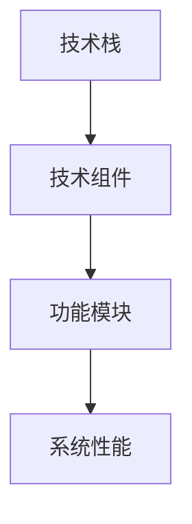
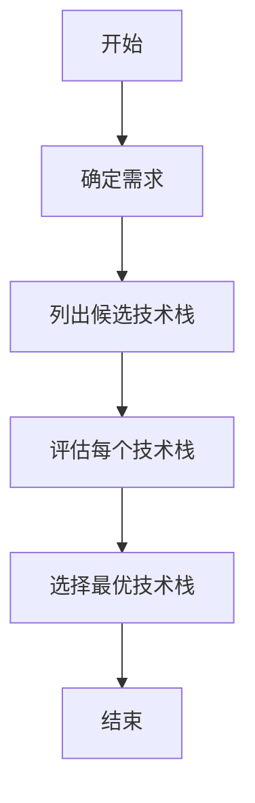
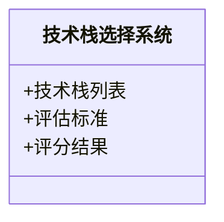
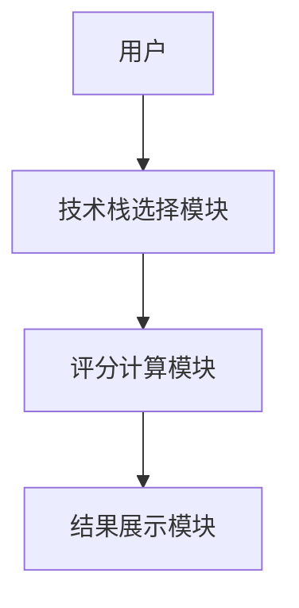

                 


# 技术栈选择与评估

> 关键词：技术栈选择、评估标准、系统架构、数学模型、算法原理、项目实战

> 摘要：技术栈的选择与评估是软件开发中的关键环节，直接影响项目的成功与否。本文从技术栈的基本概念出发，详细探讨选择与评估的技术标准、工具、算法和系统架构设计，并结合实际案例进行分析，旨在为读者提供科学的决策支持和实践指导。

---

# 第1章: 技术栈选择与评估的背景

## 1.1 技术栈的基本概念
### 1.1.1 技术栈的定义
技术栈是指在软件开发中，为实现特定功能而选择的一组技术、工具和框架的组合，包括编程语言、开发框架、数据库、网络协议、部署工具等。

### 1.1.2 技术栈的核心组成
- **编程语言**：如Java、Python、JavaScript。
- **开发框架**：如Spring、React、Django。
- **数据库**：如MySQL、MongoDB。
- **前端技术**：如React、Vue、Angular。
- **后端技术**：如Node.js、Python、Ruby on Rails。
- **部署与运维工具**：如Docker、Kubernetes、Jenkins。

### 1.1.3 技术栈的重要性
技术栈的选择直接影响开发效率、系统性能、扩展性和维护成本，是项目成功的关键因素。

## 1.2 技术栈选择与评估的背景
### 1.2.1 当前技术发展的多样性
随着技术的进步，可供选择的技术栈种类繁多，不同场景下的最优选择差异显著。

### 1.2.2 企业开发中的技术栈问题
企业在选择技术栈时，需要考虑团队技能、项目需求、成本、维护难度等多方面因素。

### 1.2.3 技术栈选择与评估的必要性
科学的技术栈选择可以提高开发效率，降低维护成本，增强系统的可扩展性和性能。

## 1.3 本章小结
本章介绍了技术栈的基本概念和重要性，强调了技术栈选择与评估的必要性。

---

# 第2章: 技术栈选择的核心概念与联系

## 2.1 核心概念的原理
### 2.1.1 技术栈的分类与特点
- **前端技术栈**：负责用户界面的实现，如React、Vue等。
- **后端技术栈**：负责业务逻辑处理，如Spring、Django等。
- **数据库技术栈**：负责数据存储与管理，如MySQL、MongoDB等。

### 2.1.2 技术栈的选择标准
- **功能需求**：系统需要实现的功能。
- **性能要求**：系统的响应速度、吞吐量等。
- **团队技能**：开发团队的技术水平和经验。
- **维护成本**：技术栈的维护难度和成本。

### 2.1.3 技术栈的优缺点对比
| 技术栈 | 优点 | 缺点 |
|--------|------|------|
| React  | 开发效率高，组件化 | 学习曲线陡峭，生态不够成熟 |
| Django | 开发快速，安全性高 | 对小型项目过于复杂 |
| MySQL  | 稳定性好，易于管理 | 不支持NoSQL查询 |

## 2.2 核心概念的属性特征对比
### 2.2.1 技术栈的性能对比
- 前端：React在数据驱动应用中性能优越。
- 后端：Node.js适合高并发场景。

### 2.2.2 技术栈的功能对比
- React适合动态交互界面，Django适合RESTful API开发。

### 2.2.3 技术栈的可扩展性对比
- 微服务架构比单体架构扩展性更好。

## 2.3 技术栈的ER实体关系图


## 2.4 本章小结
本章分析了技术栈的核心概念、分类、选择标准及优缺点对比，为后续选择与评估奠定了基础。

---

# 第3章: 技术栈选择的算法原理

## 3.1 技术栈选择的算法概述
### 3.1.1 基于权重的评分算法
根据技术栈的各项指标（如性能、易用性）赋予不同权重，计算总分。

### 3.1.2 基于规则的决策树算法
通过预设的规则和条件，逐步筛选出最优技术栈。

### 3.1.3 基于机器学习的推荐算法
利用历史数据，训练模型推荐技术栈。

## 3.2 技术栈选择的数学模型
### 3.2.1 基于权重的评分模型
$$ \text{总分} = \sum (\text{权重}_i \times \text{评分}_i) $$

### 3.2.2 决策树算法流程
1. 确定目标属性（如技术栈的适用性）。
2. 选择特征（如性能、成本）。
3. 建立决策树模型。
4. 验证与优化。

## 3.3 技术栈选择的算法流程图


## 3.4 本章小结
本章介绍了技术栈选择的算法原理，包括评分模型和决策树算法，并通过流程图展示了选择过程。

---

# 第4章: 技术栈选择的系统分析与架构设计

## 4.1 系统分析
### 4.1.1 项目需求分析
- 明确系统功能需求。
- 评估性能要求。
- 考虑团队技能和维护成本。

### 4.1.2 系统功能设计
- 前端：实现用户界面。
- 后端：处理业务逻辑。
- 数据库：存储数据。

### 4.1.3 领域模型设计


## 4.2 系统架构设计
### 4.2.1 系统架构图


## 4.3 接口设计
### 4.3.1 技术栈选择接口
- 输入：项目需求。
- 输出：推荐技术栈。

### 4.3.2 评分计算接口
- 输入：技术栈信息。
- 输出：评分结果。

## 4.4 本章小结
本章从系统分析和架构设计的角度，详细阐述了技术栈选择的流程和系统设计。

---

# 第5章: 技术栈选择的项目实战

## 5.1 环境安装
### 5.1.1 安装开发工具
- 安装Python、Node.js、npm等。

### 5.1.2 安装依赖库
- 使用pip安装Django、React等框架。

## 5.2 系统核心实现
### 5.2.1 前端实现
- 使用React搭建用户界面。
- 实现组件化开发。

### 5.2.2 后端实现
- 使用Django创建RESTful API。
- 实现业务逻辑。

### 5.2.3 数据库实现
- 使用MySQL存储数据。
- 设计数据表结构。

## 5.3 代码实现
### 5.3.1 前端代码
```javascript
function App() {
    return <div>Hello World</div>;
}
```

### 5.3.2 后端代码
```python
from django.http import HttpResponse
def home(request):
    return HttpResponse("Hello World")
```

## 5.4 案例分析
### 5.4.1 案例背景
- 项目需求：开发一个在线电商系统。
- 选择技术栈：React、Django、MySQL。

### 5.4.2 案例实现
- 前端：React实现商品列表。
- 后端：Django处理订单逻辑。
- 数据库：MySQL存储商品和用户信息。

## 5.5 本章小结
本章通过实际项目案例，展示了技术栈选择与评估的全过程。

---

# 第6章: 技术栈选择的最佳实践与优化

## 6.1 最佳实践
### 6.1.1 技术栈选择的原则
- 根据需求选择，而非流行趋势。
- 考虑团队技能和经验。
- 保持技术栈的简洁性。

### 6.1.2 技术栈优化的策略
- 定期评估技术栈。
- 及时淘汰过时技术。
- 引入新技术前充分评估。

## 6.2 优化建议
### 6.2.1 技术栈的可扩展性优化
- 使用微服务架构。
- 采用模块化设计。

### 6.2.2 技术栈的性能优化
- 优化数据库查询。
- 使用缓存技术。

## 6.3 案例分析
### 6.3.1 案例背景
- 项目需求：高并发访问。
- 技术栈优化：引入Kubernetes。

### 6.3.2 实施步骤
1. 引入Docker容器化技术。
2. 使用Kubernetes进行 orchestration。
3. 优化应用性能。

## 6.4 本章小结
本章总结了技术栈选择与评估的最佳实践，提出了优化建议，并通过案例分析展示了优化过程。

---

# 第7章: 总结与展望

## 7.1 本章总结
- 技术栈的选择与评估是软件开发中的重要环节。
- 科学的选择方法和工具可以提高开发效率。

## 7.2 未来展望
- 技术栈将更加多样化和复杂化。
- AI和大数据将为技术栈选择提供更有力的支持。

## 7.3 致谢
感谢读者的支持，感谢技术社区的贡献。

---

# 参考文献

- [1]《软件工程：实践者的方法》
- [2]《架构师的自我修养》
- [3]《技术栈选择与优化》

---

# 附录: 工具与资源

## 附录A: 技术栈选择工具
- TechStackRanker
- StackShare
- TIOBE编程语言指数

## 附录B: 开发框架与库
- 前端：React、Vue、Angular
- 后端：Django、Spring、Node.js

## 附录C: 数据库推荐
- 关系型数据库：MySQL、PostgreSQL
- NoSQL数据库：MongoDB、Redis

---

# 索引

（根据内容生成具体索引项）

---

通过以上目录大纲，我们可以看到，技术栈选择与评估是一个复杂但系统的过程，需要从多个维度进行分析和评估。希望这本书能够为读者提供科学的决策支持和实践指导，帮助他们在实际项目中做出最优的技术选择。

