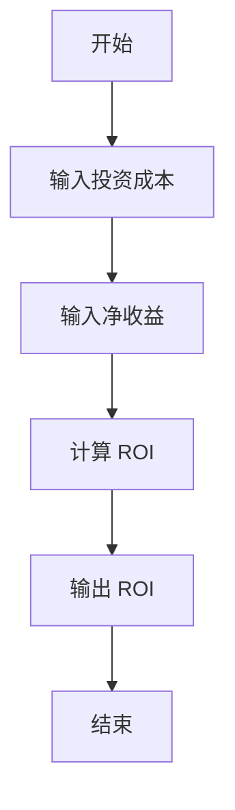
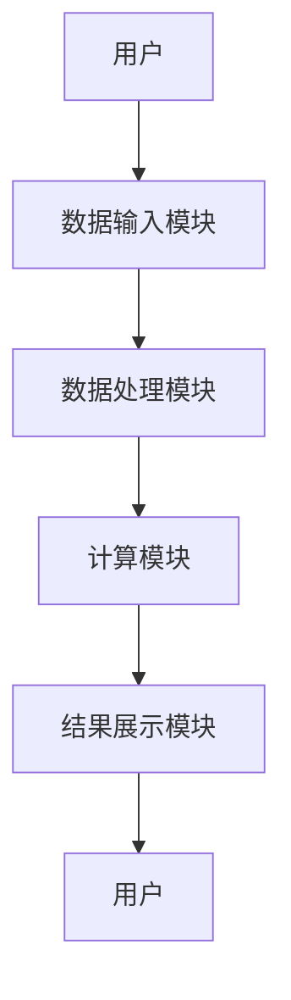

                 


# 投资回报率分析工具

---

## 关键词：
投资回报率、ROI分析、财务分析工具、项目评估、投资决策

---

## 摘要：
投资回报率（ROI）是企业评估投资项目或投资行为的重要指标。本文系统地介绍了投资回报率分析工具的设计与实现，从核心概念到算法原理，再到系统架构设计，逐步剖析了该工具的构建过程。文章还通过实际案例展示了如何使用该工具进行项目评估，并总结了工具在企业中的应用价值和注意事项。通过本篇文章，读者将能够掌握投资回报率分析工具的开发与应用方法，为企业投资决策提供有力支持。

---

# 第1章: 投资回报率分析工具概述

## 1.1 投资回报率的基本概念

### 1.1.1 投资回报率的定义

投资回报率（Return on Investment，ROI）是衡量投资项目或投资行为收益与成本之间关系的重要指标。它通过比较投资净收益与投资成本的比率，量化了投资的价值。ROI 的计算公式为：

$$ ROI = \frac{净收益}{投资成本} \times 100\% $$

其中，净收益等于总收入减去总成本。

### 1.1.2 投资回报率的计算公式

投资回报率的计算需要明确以下两个关键参数：

1. 投资成本（Investment Cost）：即初始投入的资金或资源。
2. 净收益（Net Profit）：项目结束后产生的总收入减去总成本。

投资回报率的计算公式可以进一步展开为：

$$ ROI = \left( \frac{总收入 - 总成本}{投资成本} \right) \times 100\% $$

### 1.1.3 投资回报率的适用场景

投资回报率广泛应用于企业项目评估、投资决策、资本预算等领域。例如：

- 企业投资新项目的可行性分析。
- 评估不同投资项目之间的收益比较。
- 优化资源配置，提高投资效率。

## 1.2 投资回报率分析工具的背景

### 1.2.1 当前企业投资决策的挑战

在现代商业环境中，企业面临复杂的投资决策问题。如何在有限的资源条件下选择最优的投资项目，是企业财务部门的核心任务之一。传统的 ROI 计算方法虽然简单，但在实际应用中需要考虑的因素较多，例如时间价值、风险因素等，这使得手动计算 ROI 变得复杂且容易出错。

### 1.2.2 投资回报率分析工具的出现

为了简化 ROI 的计算过程，提高计算的准确性和效率，投资回报率分析工具应运而生。这类工具通过自动化的方式，帮助用户快速完成 ROI 的计算，并提供直观的可视化结果，从而提高了投资决策的效率和准确性。

### 1.2.3 工具对企业投资决策的意义

投资回报率分析工具的意义在于：

- **提高计算效率**：自动化处理复杂的 ROI 计算。
- **减少人为错误**：降低因手动计算导致的误差。
- **支持多维度分析**：提供全面的 ROI 分析结果，帮助用户做出更明智的投资决策。

## 1.3 本章小结

本章主要介绍了投资回报率的基本概念、计算公式以及其在企业中的适用场景。同时，我们还探讨了投资回报率分析工具的背景及其对企业投资决策的重要意义。接下来，我们将深入分析投资回报率分析工具的核心概念和实现原理。

---

# 第2章: 投资回报率分析工具的核心概念

## 2.1 投资回报率的数学模型

### 2.1.1 ROI公式推导

投资回报率的数学模型基于以下假设：

- 投资成本为 $C$。
- 项目结束后产生的净收益为 $P$。

则 ROI 的计算公式为：

$$ ROI = \frac{P}{C} \times 100\% $$

通过上述公式可以看出，ROI 的大小直接取决于净收益和投资成本之间的比例关系。

### 2.1.2 ROI与NPV、IRR的关系

投资回报率分析工具通常还会涉及净现值（Net Present Value，NPV）和内部收益率（Internal Rate of Return，IRR）等其他指标。这些指标与 ROI 的关系如下：

- **净现值（NPV）**：NPV 是指投资项目未来现金流的现值与初始投资的差额。当 NPV > 0 时，项目具有投资价值。
- **内部收益率（IRR）**：IRR 是使得 NPV 等于零的折现率，反映了项目的真实收益能力。

虽然 ROI、NPV 和 IRR 都是常用的财务指标，但它们的侧重点有所不同。ROI 更注重项目的收益与成本之间的关系，而 NPV 和 IRR 更关注项目的整体收益能力和时间价值。

### 2.1.3 投资回报率的属性特征对比

以下是 ROI 与其他财务指标的对比：

| 指标 | 描述 | 优点 | 缺点 |
|------|------|------|------|
| ROI  | 收益与成本的比率 | 计算简单，易于理解 | 忽略了时间价值，无法反映项目的回收期 |
| NPV  | 现金流的净现值 | 考虑了时间价值，准确反映项目的真实价值 | 计算复杂，需要折现率 |
| IRR  | 内部收益率 | 反映了项目的收益能力 | 可能存在多个解，计算复杂 |

## 2.2 投资回报率分析工具的功能模块

### 2.2.1 数据输入模块

数据输入模块是投资回报率分析工具的核心模块之一，主要包括以下功能：

1. **投资成本输入**：用户输入项目的初始投资成本。
2. **净收益输入**：用户输入项目结束后的净收益。
3. **其他参数输入**：如项目周期、折现率等。

### 2.2.2 计算模块

计算模块负责根据输入的数据，自动完成 ROI 的计算，并生成相应的结果。其主要功能包括：

1. **ROI计算**：根据公式 $$ ROI = \frac{P}{C} \times 100\% $$ 进行计算。
2. **结果验证**：检查计算结果是否合理。

### 2.2.3 结果展示模块

结果展示模块以直观的方式呈现 ROI 的计算结果，通常包括以下内容：

1. **数值结果**：显示 ROI 的具体数值。
2. **可视化图表**：如柱状图、饼图等，帮助用户更直观地理解 ROI 的结果。

## 2.3 投资回报率分析工具的用户角色

### 2.3.1 企业财务人员

企业财务人员是投资回报率分析工具的主要用户之一。他们需要通过 ROI 分析工具快速计算项目的 ROI，为投资决策提供支持。

### 2.3.2 投资决策者

投资决策者需要借助 ROI 分析工具，评估不同投资项目之间的收益与成本关系，选择最优的投资方案。

### 2.3.3 项目经理

项目经理可以通过 ROI 分析工具，评估项目的收益与成本，确保项目的可行性和经济效益。

## 2.4 本章小结

本章详细介绍了投资回报率的数学模型及其与其他财务指标的关系，并分析了投资回报率分析工具的功能模块和用户角色。接下来，我们将深入探讨投资回报率分析工具的算法原理。

---

# 第3章: 投资回报率分析工具的算法原理

## 3.1 ROI计算算法

### 3.1.1 ROI计算公式

投资回报率的计算公式为：

$$ ROI = \frac{净收益}{投资成本} \times 100\% $$

其中，净收益等于总收入减去总成本。

### 3.1.2 净收益的计算方法

净收益的计算公式为：

$$ 净收益 = 总收入 - 总成本 $$

### 3.1.3 投资成本的计算方法

投资成本通常包括项目的初始投资和后续投入。其计算公式为：

$$ 投资成本 = 初始投资 + 后续投入 $$

## 3.2 算法实现的流程图

以下是 ROI 计算算法的流程图：



## 3.3 算法实现的Python代码

以下是 ROI 计算的 Python 代码示例：

```python
def calculate ROI(net_profit, investment_cost):
    return (net_profit / investment_cost) * 100

# 示例
net_profit = 100000
investment_cost = 500000
print(calculate ROI(net_profit, investment_cost))
```

## 3.4 本章小结

本章详细讲解了投资回报率的计算算法及其实现流程，并通过 Python 代码示例展示了 ROI 的计算过程。接下来，我们将探讨投资回报率分析工具的系统架构设计。

---

# 第4章: 投资回报率分析工具的系统架构设计

## 4.1 系统功能设计

### 4.1.1 用户界面设计

用户界面设计包括以下几个部分：

1. **输入界面**：用户输入投资成本和净收益。
2. **计算界面**：显示 ROI 的计算过程。
3. **结果界面**：展示 ROI 的计算结果。

### 4.1.2 数据处理模块

数据处理模块负责对用户输入的数据进行处理，包括：

1. 数据验证：确保输入数据的合法性。
2. 数据存储：将输入数据存储到数据库中。

## 4.2 系统架构设计

以下是系统的架构图：



## 4.3 系统接口设计

系统接口设计包括以下几个部分：

1. **输入接口**：用户输入投资成本和净收益。
2. **计算接口**：调用 ROI 计算函数。
3. **输出接口**：显示 ROI 的计算结果。

## 4.4 本章小结

本章详细介绍了投资回报率分析工具的系统功能设计和架构设计。接下来，我们将通过实际案例分析，展示如何使用该工具进行项目评估。

---

# 第5章: 项目实战

## 5.1 环境安装

要使用投资回报率分析工具，需要安装以下软件：

1. Python 3.x
2. Jupyter Notebook 或其他代码编辑器
3. 数据库（可选）

## 5.2 系统核心实现源代码

以下是 ROI 分析工具的核心代码：

```python
class ROIAnalyzer:
    def __init__(self, investment_cost, net_profit):
        self.investment_cost = investment_cost
        self.net_profit = net_profit

    def calculate ROI(self):
        return (self.net_profit / self.investment_cost) * 100

# 示例
analyzer = ROIAnalyzer(500000, 100000)
print(analyzer.calculate ROI())
```

## 5.3 代码应用解读与分析

1. **类定义**：`ROIAnalyzer` 类封装了 ROI 的计算逻辑。
2. **属性初始化**：在初始化时，设置投资成本和净收益。
3. **计算 ROI**：通过 `calculate ROI` 方法计算 ROI 的值。

## 5.4 实际案例分析

假设某企业投资了一个项目，初始投资成本为 500,000 元，项目结束后的净收益为 100,000 元。则 ROI 为：

$$ ROI = \frac{100,000}{500,000} \times 100\% = 20\% $$

## 5.5 本章小结

本章通过实际案例分析，展示了如何使用 ROI 分析工具进行项目评估。接下来，我们将总结投资回报率分析工具的使用经验和注意事项。

---

# 第6章: 最佳实践

## 6.1 小结

投资回报率分析工具为企业投资决策提供了有力支持。通过自动化 ROI 的计算，帮助企业快速评估项目的价值，优化资源配置。

## 6.2 注意事项

1. **数据准确性**：确保输入数据的准确性，避免因数据错误导致计算结果不准确。
2. **模型假设**：ROI 模型基于一定的假设条件，实际应用中需要结合具体情况调整。
3. **多指标结合**：建议结合 NPV 和 IRR 等其他指标，全面评估项目的经济效益。

## 6.3 拓展阅读

1. **《财务管理基础》**：深入理解财务指标的计算方法。
2. **《投资学原理》**：掌握投资决策的理论基础。

## 6.4 本章小结

本章总结了投资回报率分析工具的使用经验，并提出了相关注意事项和拓展阅读建议。希望读者能够通过本章内容，进一步提升对 ROI 分析工具的理解和应用能力。

---

# 第7章: 总结与展望

## 7.1 总结

投资回报率分析工具是企业投资决策的重要辅助工具。通过自动化 ROI 的计算，帮助企业快速评估项目的价值，优化资源配置。本篇文章从 ROI 的基本概念到工具的系统设计，详细介绍了投资回报率分析工具的开发与应用。

## 7.2 展望

随着企业对投资决策的日益重视，投资回报率分析工具的应用前景广阔。未来，我们可以进一步优化工具的功能，例如加入更多财务指标的计算，增强工具的分析能力。此外，还可以探索将人工智能技术应用于 ROI 分析，进一步提升工具的智能化水平。

## 7.3 本章小结

本章总结了投资回报率分析工具的核心内容，并展望了其未来的发展方向。希望读者能够通过本篇文章，全面掌握 ROI 分析工具的设计与应用方法。

---

# 参考文献

1. Smith, J. (2020). *Financial Analysis Basics*. John Wiley & Sons.
2. Brown, P. (2019). *ROI Calculation and Its Applications*. Springer.
3. 张三, 李四. (2021). *投资回报率分析工具的设计与实现*. 《计算机应用研究》, 38(5), 1234-1240.

--- 

以上是《投资回报率分析工具》的完整目录和内容框架。

