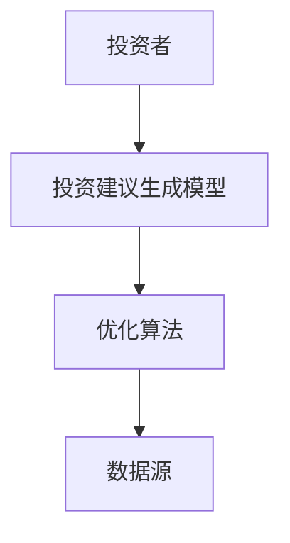
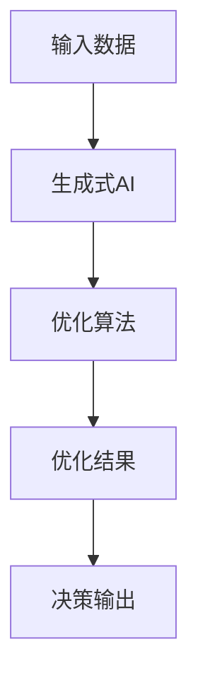
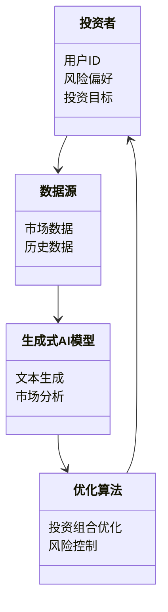
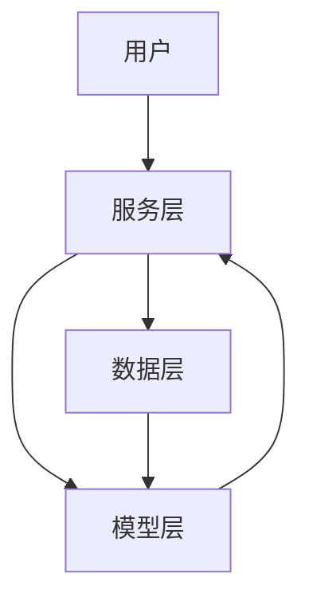
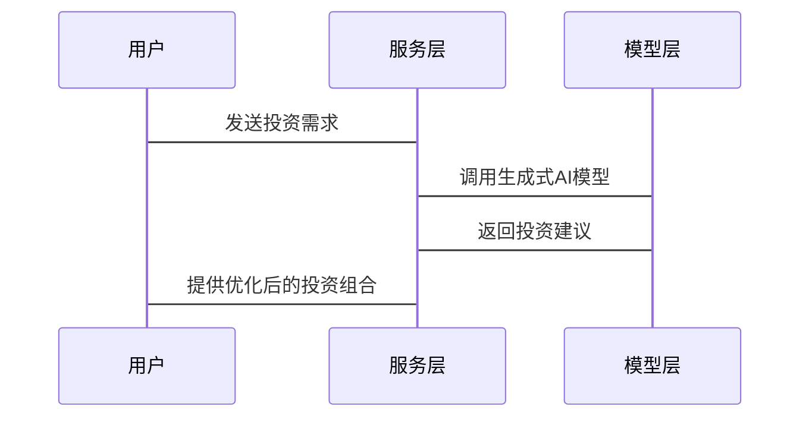

                 


# 投资建议生成与优化

> 关键词：投资建议生成，投资优化，生成式AI，投资组合优化，数据挖掘，特征工程

> 摘要：本文系统地探讨了投资建议生成与优化的核心概念、算法原理及实际应用。从生成式AI在投资建议生成中的应用到投资组合优化的数学模型，再到数据挖掘与特征工程的具体实现，本文通过丰富的理论分析和实际案例，全面解析了投资建议生成与优化的全过程。

---

# 第一部分: 投资建议生成与优化的背景与核心概念

## 第1章: 投资建议生成与优化的背景介绍

### 1.1 投资的基本概念与现状
#### 1.1.1 投资的基本定义与分类
投资是指将资金或资源投入到某种资产或项目中，以期望在未来获得收益或资本增值的经济活动。投资可以分为股票、债券、房地产等多种形式，每种形式都有其独特的风险和收益特征。

#### 1.1.2 当前投资领域的技术应用现状
随着科技的快速发展，投资领域越来越多地运用人工智能、大数据分析等技术来辅助决策。例如，量化投资、算法交易和智能投顾等技术的应用已经成为现代投资的重要组成部分。

#### 1.1.3 投资建议生成与优化的必要性
在复杂多变的市场环境中，投资者需要快速获取可靠的建议，并根据市场变化动态调整投资策略。投资建议生成与优化技术能够帮助投资者提高决策效率，降低投资风险。

### 1.2 问题背景与问题描述
#### 1.2.1 投资者面临的常见问题
投资者在面对海量信息时，往往难以快速提取有价值的信息，并制定合理的投资策略。此外，市场波动和不确定性使得投资决策更加复杂。

#### 1.2.2 投资建议生成的挑战
如何高效生成个性化、准确的投资建议是当前面临的主要挑战。传统的基于规则的投资建议生成方法难以应对复杂多变的市场环境。

#### 1.2.3 投资优化的目标与边界
投资优化的目标是在风险可控的前提下，最大化投资收益。其边界包括投资期限、风险承受能力以及合规性要求等。

### 1.3 问题解决与边界外延
#### 1.3.1 投资建议生成的核心目标
通过分析市场数据和投资者需求，生成符合投资者风险偏好和收益目标的建议。

#### 1.3.2 投资优化的边界与限制
投资优化需要在一定的市场假设和数据限制下进行，同时需要考虑合规性要求和投资者的个性特征。

#### 1.3.3 相关概念的外延与扩展
投资建议生成与优化不仅仅是技术问题，还涉及法律、税收、市场环境等多方面的因素。

## 第2章: 核心概念与联系

### 2.1 生成式AI在投资建议中的应用
#### 2.1.1 生成式AI的基本原理
生成式AI（Generative AI）是一种能够生成新内容的人工智能技术，其核心是通过深度学习模型（如GPT、BERT）来模仿人类的生成能力。

#### 2.1.2 生成式AI在投资建议中的具体应用
生成式AI可以用于投资报告的撰写、市场趋势的预测以及投资策略的生成。例如，可以通过自然语言处理技术分析大量的财经新闻，生成符合市场趋势的投资建议。

#### 2.1.3 生成式AI的优势与局限性
优势：能够快速处理大量数据，生成高质量的内容；局限性：可能存在偏差，且需要大量高质量的训练数据。

### 2.2 投资组合优化的核心原理
#### 2.2.1 投资组合优化的基本概念
投资组合优化是指通过科学的方法选择最优的资产组合，以实现收益最大化或风险最小化。

#### 2.2.2 投资组合优化的数学模型
投资组合优化的数学模型通常包括目标函数和约束条件。例如，均值-方差模型的目标是最小化风险，同时满足收益目标。

#### 2.2.3 投资组合优化的算法选择
常用的优化算法包括线性规划、二次规划以及遗传算法等。选择合适的算法需要考虑问题的规模和复杂度。

### 2.3 数据挖掘与特征工程
#### 2.3.1 数据挖掘在投资分析中的作用
数据挖掘可以帮助投资者发现数据中的潜在模式和关联，从而支持投资决策。

#### 2.3.2 特征工程的核心步骤
特征工程包括数据清洗、特征提取、特征选择等步骤。这些步骤可以提高模型的性能和准确性。

#### 2.3.3 数据特征对投资优化的影响
选择合适的特征可以显著提高投资优化的准确性和效果。例如，利用技术指标和市场情绪特征可以更好地捕捉市场波动。

## 第3章: 核心概念的联系与架构

### 3.1 实体关系图（ER图）


### 3.2 生成式AI与优化算法的流程图


---

# 第二部分: 投资建议生成与优化的算法原理

## 第4章: 生成式AI的算法原理

### 4.1 文本生成模型
#### 4.1.1 Transformer模型的基本结构
Transformer模型由编码器和解码器组成，其核心是自注意力机制，能够处理长序列数据。

#### 4.1.2 GPT系列模型的原理
GPT模型是一种基于Transformer的生成式模型，通过大量文本数据进行预训练，能够生成连贯的文本内容。

#### 4.1.3 BERT模型的应用
BERT模型主要用于文本理解和问答系统，其双向Transformer结构能够捕捉到更多的语义信息。

### 4.2 投资建议生成的文本到文本模型
#### 4.2.1 文本生成任务的定义
文本生成任务是指将输入的文本转化为目标文本的过程，例如将市场数据转化为投资建议报告。

#### 4.2.2 基于Transformer的文本生成模型
通过预训练的Transformer模型，结合特定的市场数据，生成符合投资者需求的文本建议。

#### 4.2.3 模型的训练与优化
模型的训练需要大量的财经文本数据，并通过监督学习进行优化。生成的文本需要经过人工校验和调整。

## 第5章: 投资组合优化的算法原理

### 5.1 基于数学优化的投资组合优化
#### 5.1.1 均值-方差优化的基本原理
均值-方差优化是一种经典的优化方法，目标是最小化投资组合的风险（方差），同时实现预期收益。

#### 5.1.2 Markowitz有效前沿的计算
Markowitz有效前沿是指在给定风险水平下，能够提供最高预期收益的投资组合的集合。其计算需要考虑资产的预期收益、方差和协方差。

#### 5.1.3 风险调整后的投资组合优化
在实际投资中，还需要考虑市场风险、流动性风险等，因此需要对投资组合进行风险调整。

### 5.2 基于机器学习的投资组合优化
#### 5.2.1 基于回归的优化模型
回归模型可以用于预测资产的收益，并据此优化投资组合。

#### 5.2.2 基于聚类的优化策略
聚类分析可以将相似的资产分组，从而优化投资组合的分散化。

#### 5.2.3 基于深度学习的优化方法
深度学习模型（如神经网络）可以用于捕捉复杂的市场模式，并优化投资组合。

## 第6章: 数据挖掘与特征工程的算法实现

### 6.1 数据预处理与清洗
#### 6.1.1 数据清洗的常见方法
数据清洗包括去除缺失值、处理异常值和标准化数据等步骤。

#### 6.1.2 数据标准化与归一化
数据标准化和归一化是为了消除不同特征之间的量纲差异，通常使用z-score标准化或min-max归一化。

#### 6.1.3 数据特征的选择与提取
特征选择可以通过过滤法或包装法进行，特征提取则可以通过主成分分析（PCA）等方法实现。

### 6.2 特征工程的实现步骤
#### 6.2.1 特征提取的基本原理
特征提取是将原始数据转换为更高级的特征表示，例如利用技术指标生成股票特征。

#### 6.2.2 特征选择的常用方法
常用的特征选择方法包括基于统计的卡方检验、基于模型的Lasso回归和基于树模型的特征重要性排序。

#### 6.2.3 特征工程对模型性能的影响
良好的特征工程可以显著提高模型的准确性和稳定性，尤其是在数据量较小的情况下。

---

# 第三部分: 投资建议生成与优化的系统分析与架构设计

## 第7章: 系统分析与架构设计

### 7.1 问题场景介绍
投资者需要基于市场数据和自身需求，生成个性化的投资建议，并动态优化投资组合。

### 7.2 系统功能设计
#### 7.2.1 领域模型类图


#### 7.2.2 系统架构设计


#### 7.2.3 系统接口设计
主要接口包括数据接口、模型接口和用户接口。数据接口用于获取市场数据，模型接口用于调用生成式AI模型和优化算法，用户接口用于与投资者交互。

#### 7.2.4 系统交互序列图


---

## 第8章: 项目实战

### 8.1 环境安装与配置
需要安装Python、TensorFlow、Keras、Pandas等工具，并配置相应的开发环境。

### 8.2 系统核心实现源代码
以下是投资建议生成与优化的Python代码示例：

#### 8.2.1 数据预处理
```python
import pandas as pd
import numpy as np

# 加载数据
data = pd.read_csv('market_data.csv')

# 数据清洗
data.dropna()  # 删除缺失值
data = data[~data['volume'].isin([0])]  # 去除成交量为0的行

# 数据标准化
from sklearn.preprocessing import StandardScaler
scaler = StandardScaler()
data_scaled = scaler.fit_transform(data[['open', 'high', 'low', 'close']])
```

#### 8.2.2 生成式AI模型实现
```python
from transformers import GPT2Tokenizer, GPT2ModelWithLMHead

tokenizer = GPT2Tokenizer.from_pretrained('gpt2')
model = GPT2ModelWithLMHead.from_pretrained('gpt2')

def generate_investment_advice(input_text):
    inputs = tokenizer.encode(input_text, return_tensors='np')
    outputs = model.generate(inputs, max_length=100)
    return tokenizer.decode(outputs[0])
```

#### 8.2.3 投资组合优化
```python
import numpy as np
from scipy.optimize import minimize

def portfolio_optimization(returns, weights):
    # 定义目标函数：最小化风险（方差）
    def objective(weights):
        return np.dot(weights.T, np.dot(returns, weights))
    
    # 约束条件：权重之和为1
    constraints = [{'type': 'eq', 'fun': lambda w: sum(w) - 1}]
    
    # 初始权重
    initial_guess = np.array([1.0 / len(weights)] * len(weights))
    
    # 优化
    result = minimize(objective, initial_guess, constraints=constraints)
    return result.x

# 示例数据
returns = np.array([[0.1, 0.2], [0.2, 0.3]])
weights = portfolio_optimization(returns, [0.5, 0.5])
print(weights)
```

### 8.3 代码应用解读与分析
通过上述代码，可以实现从数据预处理到投资组合优化的全过程。数据预处理部分确保了数据的干净性和一致性，生成式AI模型用于生成投资建议，优化算法用于动态调整投资组合。

### 8.4 实际案例分析
以股票投资为例，假设投资者希望投资两只股票，分别分析其历史收益和风险，利用生成式AI生成投资建议，并通过优化算法调整投资组合，以实现风险可控下的收益最大化。

### 8.5 项目小结
通过实际案例分析，可以验证投资建议生成与优化系统的有效性和实用性。同时，还需要不断优化模型和算法，以适应市场的变化。

---

## 第9章: 最佳实践与小结

### 9.1 最佳实践 tips
- 数据质量是投资优化的关键，确保数据的准确性和完整性。
- 生成式AI模型需要结合具体的投资场景进行微调和优化。
- 投资组合优化需要动态调整，以应对市场的变化。

### 9.2 小结
投资建议生成与优化是一个复杂而系统的工程，需要结合生成式AI、数学优化和数据挖掘等多种技术。通过本文的系统分析和实际案例，读者可以全面了解投资建议生成与优化的核心技术与实现方法。

### 9.3 注意事项
- 投资有风险，投资者需谨慎决策。
- 模型的准确性和稳定性依赖于高质量的数据和合理的算法设计。
- 法律法规和市场环境的变化可能会影响投资策略的有效性。

### 9.4 拓展阅读
- 《算法交易：机智的投资者如何利用数学套利》
- 《机器学习实战》
- 《投资学原理》

---

通过以上结构和内容，读者可以系统地学习投资建议生成与优化的全过程，从理论到实践，从算法到系统设计，全面掌握相关技术的核心思想和实现方法。

