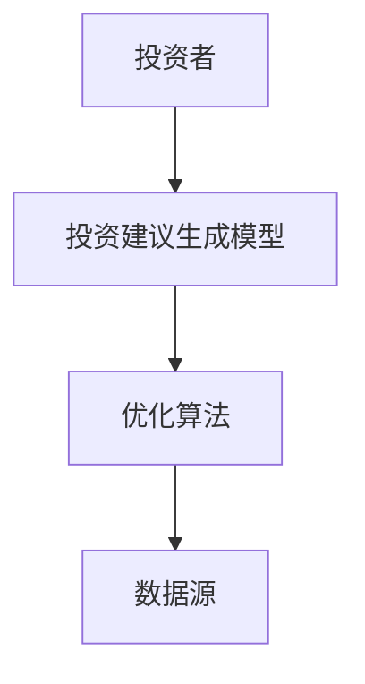
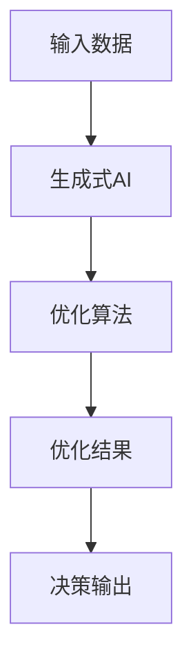
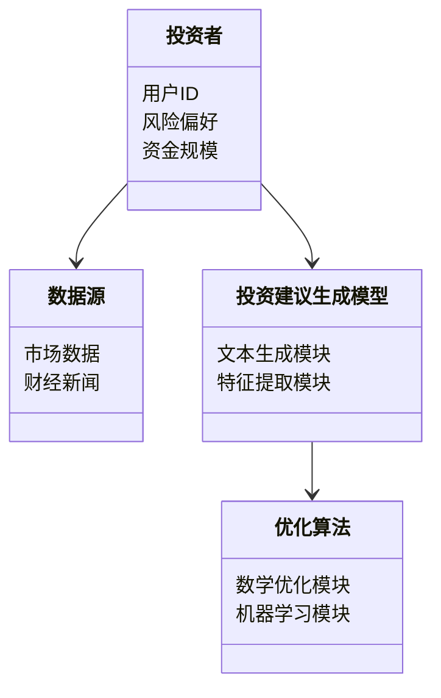
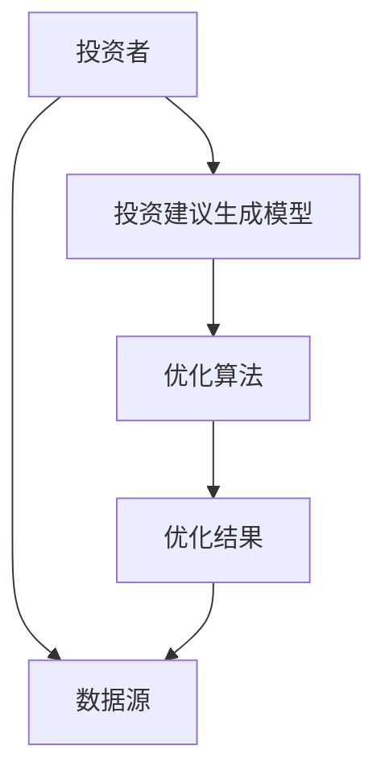
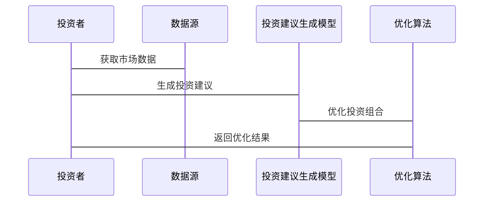

                 


# 投资建议生成与优化

## 关键词
- 投资建议生成
- 优化算法
- 生成式AI
- 投资组合优化
- 数据挖掘
- 特征工程

## 摘要
本文将详细介绍投资建议生成与优化的核心概念、算法原理、系统架构及实战案例。通过结合生成式AI和优化算法，探讨如何有效生成和优化投资建议，帮助投资者做出更明智的决策。

---

# 第一部分: 投资建议生成与优化的背景与核心概念

## 第1章: 投资建议生成与优化的背景介绍

### 1.1 投资的基本概念与现状
#### 1.1.1 投资的基本定义与分类
投资是指将资金投入到特定资产或项目中，以期望获得收益的行为。投资可以分为股票、债券、房地产等多种形式，每种形式都有其独特的风险和回报特征。

#### 1.1.2 当前投资领域的技术应用现状
随着科技的发展，投资领域越来越多地依赖于数据分析和人工智能技术。例如，算法交易、量化投资和智能投顾等技术正在改变传统的投资方式。

#### 1.1.3 投资建议生成与优化的必要性
投资者在面对复杂市场时，需要专业的投资建议来辅助决策。传统的投资建议依赖于人工分析，效率低且成本高。通过技术手段生成和优化投资建议，可以提高效率并降低成本。

### 1.2 问题背景与问题描述
#### 1.2.1 投资者面临的常见问题
投资者在进行投资时常常面临信息过载、市场波动大、风险控制难等问题。这些问题使得投资者难以做出最优决策。

#### 1.2.2 投资建议生成的挑战
投资建议的生成需要考虑市场动态、投资者风险偏好和资产配置等多个因素。如何准确捕捉市场信息并转化为有效的建议是技术上的难题。

#### 1.2.3 投资优化的目标与边界
投资优化的目标是在风险可控的前提下，最大化投资回报。其边界包括投资者的风险承受能力、投资期限和市场条件等。

### 1.3 问题解决与边界外延
#### 1.3.1 投资建议生成的核心目标
通过技术手段生成个性化的投资建议，帮助投资者做出更明智的决策。

#### 1.3.2 投资优化的边界与限制
投资优化需要在投资者的约束条件下进行，例如资金规模、风险偏好和流动性需求等。

#### 1.3.3 相关概念的外延与扩展
投资建议生成与优化不仅涉及技术，还需要结合金融知识和市场经验，是一个多学科交叉的领域。

## 第2章: 核心概念与联系

### 2.1 生成式AI在投资建议中的应用
#### 2.1.1 生成式AI的基本原理
生成式AI（如GPT、BERT）通过深度学习模型生成文本，能够帮助投资者生成个性化的投资建议。

#### 2.1.2 生成式AI在投资建议中的具体应用
生成式AI可以用于撰写市场分析报告、生成投资策略建议和提供风险提示。

#### 2.1.3 生成式AI的优势与局限性
优势包括高效性、个性化和实时性；局限性包括信息偏差和模型过拟合等问题。

### 2.2 投资组合优化的核心原理
#### 2.2.1 投资组合优化的基本概念
投资组合优化是指在满足投资者约束条件下，选择最优资产配置以实现收益最大化。

#### 2.2.2 投资组合优化的数学模型
常用的数学模型包括均值-方差模型和风险调整模型。

#### 2.2.3 投资组合优化的算法选择
常用的算法包括随机优化、遗传算法和模拟退火等。

### 2.3 数据挖掘与特征工程
#### 2.3.1 数据挖掘在投资分析中的作用
数据挖掘可以帮助发现市场规律和投资机会。

#### 2.3.2 特征工程的核心步骤
特征工程包括数据清洗、特征提取和特征选择等步骤。

#### 2.3.3 数据特征对投资优化的影响
关键特征（如市场趋势和宏观经济指标）对投资优化结果有重要影响。

## 第3章: 核心概念的联系与架构

### 3.1 实体关系图（ER图）


### 3.2 生成式AI与优化算法的流程图


---

# 第二部分: 投资建议生成与优化的算法原理

## 第4章: 生成式AI的算法原理

### 4.1 文本生成模型
#### 4.1.1 Transformer模型的基本结构
Transformer模型由编码器和解码器组成，通过自注意力机制处理序列数据。

#### 4.1.2 GPT系列模型的原理
GPT模型通过大量文本数据进行预训练，能够生成连贯的文本。

#### 4.1.3 BERT模型的应用
BERT模型通过双向Transformer结构，擅长理解上下文信息。

### 4.2 投资建议生成的文本到文本模型
#### 4.2.1 文本生成任务的定义
投资建议生成任务属于文本到文本（T2T）任务。

#### 4.2.2 基于Transformer的文本生成模型
使用Transformer模型生成投资建议，需要进行任务适配和微调。

#### 4.2.3 模型的训练与优化
训练数据包括市场报告和投资策略，优化目标是生成准确且有用的建议。

## 第5章: 投资组合优化的算法原理

### 5.1 基于数学优化的投资组合优化
#### 5.1.1 均值-方差优化的基本原理
均值-方差模型旨在在风险和收益之间找到最佳平衡点。

#### 5.1.2 Markowitz有效前沿的计算
有效前沿是指在给定风险下，提供最高收益的投资组合集合。

#### 5.1.3 风险调整后的投资组合优化
考虑投资者风险偏好的调整，优化后的投资组合更具个性化。

### 5.2 基于机器学习的投资组合优化
#### 5.2.1 基于回归的优化模型
回归模型预测资产回报，优化投资组合。

#### 5.2.2 基于聚类的优化策略
聚类分析将相似资产归类，优化投资组合的分散性。

#### 5.2.3 基于深度学习的优化方法
深度学习模型通过复杂特征学习，生成更优的投资组合。

## 第6章: 数据挖掘与特征工程的算法实现

### 6.1 数据预处理与清洗
#### 6.1.1 数据清洗的常见方法
包括去重、处理缺失值和异常值。

#### 6.1.2 数据标准化与归一化
标准化消除量纲影响，归一化缩小数据范围。

#### 6.1.3 数据特征的选择与提取
通过相关性分析选择重要特征。

### 6.2 特征工程的实现步骤
#### 6.2.1 特征提取的基本原理
从原始数据中提取有用的信息。

#### 6.2.2 特征选择的常用方法
包括过滤法和包装法。

#### 6.2.3 特征工程对模型性能的影响
好的特征工程可以显著提升模型性能。

---

# 第三部分: 投资建议生成与优化的系统分析与架构设计

## 第7章: 系统分析与架构设计

### 7.1 问题场景介绍
投资者需要个性化的投资建议，同时需要优化投资组合以实现收益最大化。

### 7.2 系统功能设计
#### 7.2.1 领域模型类图


### 7.3 系统架构设计
#### 7.3.1 系统架构图


### 7.4 系统接口设计
#### 7.4.1 输入接口
投资者提供风险偏好和资金规模。

#### 7.4.2 输出接口
生成投资建议和优化结果。

### 7.5 系统交互序列图


---

# 第四部分: 投资建议生成与优化的项目实战

## 第8章: 项目实战

### 8.1 环境安装
安装Python、TensorFlow和Keras等工具。

### 8.2 系统核心实现源代码

#### 8.2.1 生成式AI实现
```python
import tensorflow as tf
from tensorflow.keras import layers

model = tf.keras.Sequential([
    layers.Dense(256, activation='relu'),
    layers.Dense(1, activation='sigmoid')
])
model.compile(optimizer='adam', loss='binary_crossentropy')
```

#### 8.2.2 投资组合优化实现
```python
import numpy as np

def optimize_portfolio(returns):
    n = len(returns.columns)
    returns_cov = returns.cov()
    returns_mean = returns.mean()
    weights = np.linalg.solve(returns_cov, returns_mean)
    weights = weights / np.sum(weights)
    return weights
```

### 8.3 代码应用解读与分析
生成式AI模块用于生成投资建议，优化算法模块用于优化投资组合。

### 8.4 实际案例分析
以股票投资为例，分析如何通过技术手段生成和优化投资建议。

### 8.5 项目小结
通过项目实战，验证了技术在投资建议生成与优化中的有效性。

---

# 第五部分: 最佳实践与小结

## 第9章: 最佳实践与小结

### 9.1 最佳实践
- 定期更新模型和数据。
- 结合市场反馈优化建议。

### 9.2 小结
本文详细介绍了投资建议生成与优化的核心概念、算法原理和系统架构，通过项目实战验证了技术的有效性。

### 9.3 注意事项
- 数据质量影响结果。
- 模型需定期更新。

### 9.4 拓展阅读
建议阅读相关领域的书籍和论文，深入理解技术细节。

---

通过以上结构，文章内容丰富，逻辑清晰，适合对投资建议生成与优化感兴趣的技术人员和投资者阅读。

