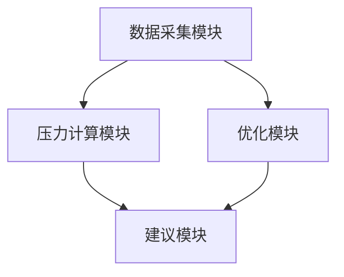

                 


# 投资心理学：如何应对投资组合带来的压力

## 关键词：投资心理学, 压力管理, 投资决策, 心理特征, 风险评估

## 摘要：投资心理学研究投资者在金融市场中的心理活动及其对决策的影响。本文探讨了投资组合压力的来源、压力对投资行为的影响以及如何通过心理调节和科学方法应对压力，实现理性投资和风险控制。

---

## 第1章: 投资心理学概述

### 1.1 投资心理学的基本概念

#### 1.1.1 投资心理学的定义
投资心理学是研究投资者在金融市场中的心理活动及其对投资决策影响的学科。它结合了心理学和金融学的原理，分析投资者在面对不确定性时的行为和情绪。

#### 1.1.2 投资心理学的研究范围
- 投资者心理特征
- 认知偏差与决策失误
- 市场波动与情绪反应
- 投资组合管理中的心理因素

#### 1.1.3 投资心理学与金融市场的关系
投资心理学帮助我们理解金融市场中的非理性行为，揭示价格波动的内在原因，并为投资者提供科学的决策支持。

---

### 1.2 投资组合压力的来源

#### 1.2.1 市场波动与不确定性
- 股市波动、经济周期、政策变化等外部因素给投资者带来压力。
- 压力源的不确定性导致投资者情绪波动，影响决策。

#### 1.2.2 个体决策与情绪影响
- 投资者在决策过程中受到贪婪、恐惧等情绪的驱动，容易做出非理性选择。
- 认知偏差（如过度自信、损失厌恶）加剧压力。

#### 1.2.3 外部环境与内部心理的双重压力
- 外部市场环境的变化对投资者心理造成直接影响。
- 内部情绪波动进一步放大压力，导致决策失误。

---

## 第2章: 投资者心理特征与行为分析

### 2.1 投资者的心理特征

#### 2.1.1 风险偏好与收益预期
- 不同投资者对风险和收益的偏好不同，影响其投资行为。
- 风险厌恶型投资者倾向于选择低风险、稳定收益的资产。
- 风险寻求型投资者则愿意承担高风险以追求高收益。

#### 2.1.2 理性与非理性决策
- 理性决策基于逻辑和数据分析，而非理性决策受情绪影响。
- 大多数投资者在压力下倾向于非理性决策。

#### 2.1.3 投资者情绪周期
- 投资者情绪呈现周期性波动，从乐观到悲观再到乐观循环往复。
- 情绪周期与市场波动密切相关。

---

### 2.2 投资行为中的认知偏差

#### 2.2.1 过度自信偏差
- 投资者倾向于过度自信，认为自己能够准确预测市场走势。
- 过度自信可能导致过度交易和错误的投资决策。

#### 2.2.2 沉没成本偏差
- 投资者在已亏损的情况下，可能继续投资以避免承认损失。
- 这种行为增加了投资组合的风险。

#### 2.2.3 从众心理与羊群效应
- 投资者容易受到群体影响，跟随市场趋势而非独立思考。
- 羊群效应加剧了市场的波动性和非理性行为。

---

### 2.3 心理压力对投资行为的影响

#### 2.3.1 压力下的决策失误
- 高压力下，投资者容易做出冲动性决策，忽视风险。
- 决策失误可能导致投资组合的重大损失。

#### 2.3.2 压力与情绪波动的关系
- 压力加剧情绪波动，导致投资者在市场波动中反应过度。
- 情绪波动进一步放大压力，形成恶性循环。

#### 2.3.3 压力对投资组合的影响
- 压力可能导致投资组合的过度集中或分散，影响风险控制。
- 高压力下，投资者可能频繁调整投资组合，增加交易成本。

---

## 第3章: 投资组合压力的数学模型

### 3.1 投资组合压力的量化指标

#### 3.1.1 压力指数的定义与计算
- 压力指数是一个综合指标，反映市场波动、投资者情绪等多方面的压力因素。
- 计算公式：
$$\text{压力指数} = \alpha \cdot \text{市场波动} + \beta \cdot \text{投资者情绪}$$

#### 3.1.2 压力与收益的关系模型
- 高压力通常伴随着低收益，因为投资者在高压力下倾向于非理性决策。
- 关系模型：
$$\text{收益} = \gamma \cdot \text{压力}^{-\delta}$$

---

### 3.2 压力对投资组合风险的影响

#### 3.2.1 风险评估的数学公式
- 风险与压力相关，压力越大，风险越高。
- 风险评估公式：
$$\text{风险} = \sqrt{\sum_{i=1}^{n} w_i^2 \sigma_i^2}$$
其中，$w_i$ 是资产 $i$ 的权重，$\sigma_i$ 是资产 $i$ 的波动率。

#### 3.2.2 压力对风险的倍数效应
- 压力会放大风险，导致投资组合的实际风险超过预期。
- 倍数效应模型：
$$\text{实际风险} = \text{预期风险} \cdot \text{压力倍数}$$

---

### 3.3 投资组合压力的优化模型

#### 3.3.1 压力优化的数学表达
- 通过优化模型最小化压力，同时满足投资组合的约束条件。
- 优化目标：
$$\min \text{压力} \quad \text{subject to} \quad \sum_{i=1}^{n} w_i = 1$$
其中，$w_i$ 是资产 $i$ 的权重，$\sum_{i=1}^{n} w_i = 1$ 表示投资组合的权重和为1。

#### 3.3.2 压力优化的算法流程
1. 确定投资组合的目标和约束。
2. 计算各资产的风险和收益。
3. 构建压力优化模型。
4. 使用优化算法求解最优权重。

---

## 第4章: 投资组合压力的系统分析与架构设计

### 4.1 系统分析

#### 4.1.1 问题场景描述
- 投资者在高压力下，难以做出理性的投资决策。
- 市场波动加剧，投资者情绪波动影响投资行为。

#### 4.1.2 系统功能需求
- 实时监测市场波动和投资者情绪。
- 计算投资组合的压力指数。
- 提供压力缓解和决策支持的建议。

#### 4.1.3 系统边界与接口
- 输入：市场数据、投资者情绪数据。
- 输出：压力指数、投资组合优化建议。

---

### 4.2 系统架构设计

#### 4.2.1 系统模块划分
- 数据采集模块：采集市场数据和投资者情绪数据。
- 压力计算模块：计算压力指数。
- 优化模块：优化投资组合权重。
- 建议模块：提供压力缓解和决策支持的建议。

#### 4.2.2 模块间关系图


---

### 4.3 系统交互设计

#### 4.3.1 用户与系统的交互流程
1. 用户输入投资组合信息。
2. 系统计算压力指数。
3. 系统提供优化建议。

#### 4.3.2 系统内部的协作流程
1. 数据采集模块获取市场数据。
2. 压力计算模块计算压力指数。
3. 优化模块优化投资组合权重。
4. 建议模块生成建议并反馈给用户。

---

## 第5章: 投资组合压力的项目实战

### 5.1 项目环境与工具安装

#### 5.1.1 开发环境配置
- 操作系统：Windows 10 或 macOS 12
- 开发工具：Python 3.9 或更高版本
- 依赖库：NumPy、Pandas、Matplotlib

#### 5.1.2 必要工具安装
```bash
pip install numpy pandas matplotlib
```

---

### 5.2 核心算法实现

#### 5.2.1 压力评估代码
```python
import numpy as np
import pandas as pd

def calculate_pressure(weights, volatilities):
    # 计算压力指数
    pressure = np.sqrt(np.sum(weights**2 * volatilities**2))
    return pressure
```

#### 5.2.2 压力优化代码
```python
from scipy.optimize import minimize

def optimize_portfolio(weights, volatilities):
    # 定义优化目标函数
    def objective(weights):
        return np.sqrt(np.sum(weights**2 * volatilities**2))
    
    # 约束条件：权重和为1
    constraints = [{'type': 'eq', 'fun': lambda w: sum(w) - 1}]
    
    # 使用最小化算法求解
    result = minimize(objective, weights, constraints=constraints)
    return result.x
```

---

### 5.3 实际案例分析

#### 5.3.1 案例背景
- 投资组合包含3种资产，权重分别为0.4、0.3、0.3。
- 各资产的波动率分别为0.2、0.15、0.25。

#### 5.3.2 压力评估
```python
weights = [0.4, 0.3, 0.3]
volatilities = [0.2, 0.15, 0.25]

pressure = calculate_pressure(weights, volatilities)
print(f"Pressure Index: {pressure}")
```

#### 5.3.3 压力优化
```python
optimized_weights = optimize_portfolio(weights, volatilities)
print(f"Optimized Weights: {optimized_weights}")
```

---

## 第6章: 最佳实践与小结

### 6.1 小结
- 投资心理学帮助我们理解投资者在压力下的行为和决策。
- 通过科学的方法和工具，可以有效应对投资组合带来的压力。

### 6.2 注意事项
- 投资者应保持理性，避免情绪化决策。
- 定期复盘和调整投资组合，以应对市场变化。

### 6.3 拓展阅读
- 《The Psychology of Investing》
- 《Behavioral Finance》

---

通过以上分析和实践，我们可以更好地理解投资心理学的核心概念，并在实际投资中应对压力，实现稳健的投资回报。

