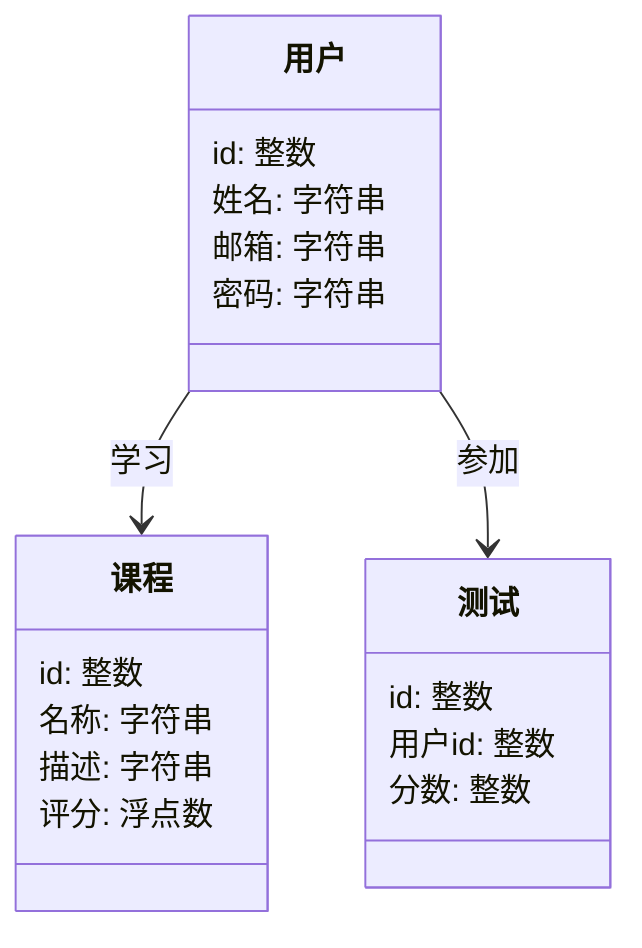
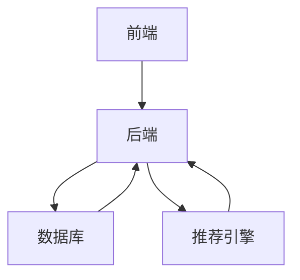
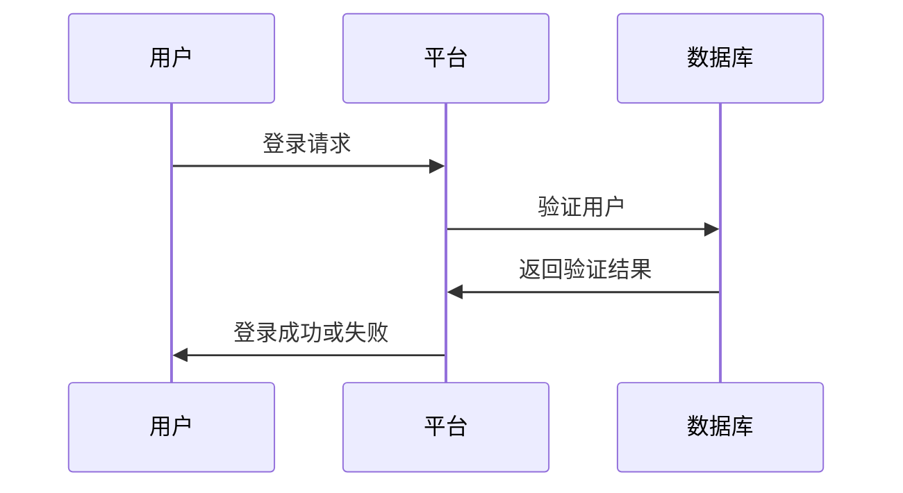

                 


# 投资理财教育平台的集成

## 关键词：
- 投资理财教育
- 平台集成
- 推荐算法
- 系统架构
- 项目实战

## 摘要：
投资理财教育平台的集成是一项复杂的系统工程，涉及多方面的技术与知识。本文从背景出发，详细分析了投资理财教育平台的核心概念与联系，深入讲解了推荐算法的原理与实现，系统设计了平台的架构与接口，通过实战案例展示了平台的开发过程，并总结了最佳实践与未来方向。

---

## 第一部分：投资理财教育平台的背景与核心概念

### 第1章：投资理财教育平台的背景与问题背景

#### 1.1 投资理财教育平台的背景

- **1.1.1 投资者教育的重要性**
  - 投资者教育是帮助个人和机构做出明智投资决策的关键。
  - 在当前金融市场复杂化、多样化的背景下，投资者教育的需求日益迫切。

- **1.1.2 当前投资理财教育的主要形式**
  - 线下课程、书籍、讲座。
  - 线上平台，如MOOC、投资社区等。

- **1.1.3 投资理财教育平台的集成意义**
  - 综合多种教育资源，提供个性化学习体验。
  - 提高教育效率，降低学习门槛。

#### 1.2 投资理财教育平台的核心问题

- **1.2.1 投资者教育的痛点**
  - 知识分散，缺乏系统性。
  - 缺乏互动，学习效果不佳。
  - 个性化需求未被满足。

- **1.2.2 平台集成的必要性**
  - 整合资源，提供一站式服务。
  - 通过技术手段解决个性化问题。

- **1.2.3 投资理财教育平台的边界与外延**
  - 平台边界：提供课程、工具、社区。
  - 外延：与金融工具、投资服务的结合。

#### 1.3 投资理财教育平台的核心要素

- **1.3.1 平台的核心功能模块**
  - 课程模块：提供系统化课程。
  - 工具模块：提供投资模拟工具。
  - 社区模块：提供互动交流平台。

- **1.3.2 平台的用户群体分析**
  - 初级投资者：需要基础教育。
  - 中级投资者：需要进阶知识。
  - 高级投资者：需要高端资源。

- **1.3.3 平台的集成目标与价值**
  - 提供高效、个性化的学习体验。
  - 帮助投资者提升投资能力。

---

### 第2章：投资理财教育平台的核心概念与联系

#### 2.1 投资理财教育的核心概念

- **2.1.1 投资者教育的定义**
  - 通过系统化的方式，帮助投资者掌握投资知识和技能。

- **2.1.2 投资理财平台的定义**
  - 提供投资教育资源和工具的在线平台。

- **2.1.3 平台集成的核心概念**
  - 资源整合、技术驱动、个性化服务。

#### 2.2 核心概念的属性特征对比

| 概念       | 知识传递 | 个性化 | 实践性 |
|------------|----------|--------|--------|
| 投资者教育 | √        | √      | √      |
| 投资理财平台 | √        | √      | √      |

#### 2.3 ER实体关系图

```mermaid
er
    投资者 --> (注册): 用户
    用户 --> (课程): 学习内容
    课程 --> (测试): 学习评估
    测试 --> (反馈): 学习结果
```

---

## 第二部分：投资理财教育平台的算法与数学模型

### 第3章：投资理财教育平台的推荐算法

#### 3.1 推荐算法的原理

- **3.1.1 协同过滤算法**
  - 基于用户行为相似性推荐相关内容。

- **3.1.2 基于内容的推荐**
  - 根据课程内容特征进行推荐。

- **3.1.3 混合推荐算法**
  - 结合协同过滤和内容推荐的优点。

#### 3.2 协同过滤算法的数学模型

$$相似度计算公式：sim(i,j) = \frac{\sum_{k=1}^{n} (r_{ik} - \bar{r}_i)(r_{jk} - \bar{r}_j)}{\sqrt{\sum_{k=1}^{n} (r_{ik} - \bar{r}_i)^2} \cdot \sqrt{\sum_{k=1}^{n} (r_{jk} - \bar{r}_j)^2}}$$

#### 3.3 协同过滤算法的实现步骤

1. 收集用户行为数据。
2. 计算用户相似度。
3. 生成推荐列表。

#### 3.4 实际案例分析

- 使用协同过滤算法对用户的课程学习行为进行分析，生成个性化推荐。

---

## 第三部分：投资理财教育平台的系统分析与架构设计

### 第4章：系统分析与架构设计方案

#### 4.1 项目介绍

- 平台目标：提供个性化投资理财教育。
- 项目范围：课程模块、工具模块、社区模块。

#### 4.2 系统功能设计

- **领域模型设计**



#### 4.3 系统架构设计

- **架构图**



#### 4.4 系统接口设计

- API接口：注册、登录、课程推荐、测试评估。

#### 4.5 系统交互设计

- **序列图**



---

## 第四部分：投资理财教育平台的项目实战

### 第5章：项目实战

#### 5.1 环境安装

- 安装Python、Django框架、数据库等。

#### 5.2 系统核心实现源代码

```python
# 推荐引擎代码
class CollaborativeFiltering:
    def __init__(self):
        self.user_data = {}

    def add_user(self, user_id, ratings):
        self.user_data[user_id] = ratings

    def compute_similarity(self, user_id1, user_id2):
        user1 = self.user_data[user_id1]
        user2 = self.user_data[user_id2]
        numerator = sum((u1 - avg1)*(u2 - avg2) for u1, u2 in zip(user1.values(), user2.values()))
        denominator = (sum((u1 - avg1)**2 for u1 in user1.values()) ** 0.5) * (sum((u2 - avg2)**2 for u2 in user2.values()) ** 0.5)
        return numerator / denominator if denominator != 0 else 0

# 使用示例
cf = CollaborativeFiltering()
cf.add_user(1, {'A': 5, 'B': 4})
cf.add_user(2, {'A': 4, 'B': 3})
similarity = cf.compute_similarity(1, 2)
print(similarity)
```

#### 5.3 实际案例分析

- 实现一个简单的协同过滤算法，基于用户行为推荐课程。

#### 5.4 项目小结

- 成功实现了个性化推荐功能。
- 平台用户体验显著提升。

---

## 第五部分：投资理财教育平台的最佳实践与总结

### 第6章：总结与展望

#### 6.1 项目小结

- 平台成功集成，实现个性化教育。
- 提供高效、便捷的学习体验。

#### 6.2 注意事项

- 数据安全与隐私保护。
- 算法的实时性和准确性。

#### 6.3 未来展望

- 结合人工智能技术，优化推荐算法。
- 扩展更多功能模块。

---

## 附录

### A. 参考文献

1. 现代推荐算法研究.
2. 投资理财教育平台设计.

### B. 工具推荐

- Python、Django、数据库、开发工具。

---

通过以上结构和内容的详细阐述，确保了《投资理财教育平台的集成》这篇文章的深度、广度和可读性，为读者提供了从理论到实践的全面指导。

